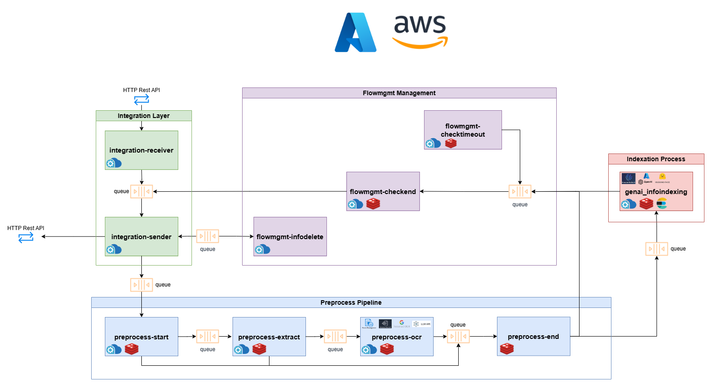

# Global RAG (indexing + retrieval + LLM)

## Index

- [Global RAG (indexing + retrieval + LLM)](#global-rag-indexing--retrieval--llm)
  - [Index](#index)
  - [Contact](#contact)
  - [Overview](#overview)
    - [Key features](#key-features)
    - [Component architecture](#component-architecture)
  - [Get started](#get-started)
    - [URLs](#urls)
    - [Deployment on TechHub Sandbox](#deployment-on-techhub-sandbox)
  - [API Specification](#api-specification)
    - [Indexing API specification](#indexing-api-specification)
    - [Compose API specification](#compose-api-specification)
    - [Preprocess API specification](#preprocess-api-specification)
      - [Download Preprocessed Data](#download-preprocessed-data)
  - [Endpoints](#endpoints)
    - [Compose](#compose)
    - [LLMAPI](#llmapi)
    - [INFORETRIEVAL](#inforetrieval)
  - [Indexing Pipeline](#indexing-pipeline)
    - [Indexing overview](#indexing-overview)
    - [Indexing execution](#indexing-execution)
  - [Compose Pipeline](#compose-pipeline)
    - [Compose overview](#compose-overview)
    - [Compose execution](#compose-execution)
      - [RAG execution](#rag-execution)
      - [LLM execution](#llm-execution)
      - [Retrieval execution](#retrieval-execution)
  - [Configuration](#configuration)
    - [Compose Templates](#compose-templates)
      - [Compose Templates expected parameters](#compose-templates-expected-parameters)
    - [Compose actions template](#compose-actions-template)
    - [LLM Prompt Templates](#llm-prompt-templates)
    - [Models embeddings](#models-embeddings)
    - [Models LLM](#models-llm)
    - [Vector storages](#vector-storages)
  - [Examples](#examples)
    - [Indexing Examples](#indexing-examples)
    - [Compose Examples](#compose-examples)
  - [Deployment](#deployment)
    - [Files overview](#files-overview)
    - [Requirements](#requirements)
    - [Resources Azure Devops](#resources-azure-devops)
      - [1. Variable groups (Library)](#1-variable-groups-library)
      - [2. Pipelines](#2-pipelines)
      - [3. Releases](#3-releases)
    - [Stages to deploy](#stages-to-deploy)
      - [1. Create library](#1-create-library)
      - [2. Create images base](#2-create-images-base)
      - [3. Create microservice image and artifact helm](#3-create-microservice-image-and-artifact-helm)
      - [4. Create artifact IaC](#4-create-artifact-iac)
      - [5. Create releases](#5-create-releases)
    - [Running the bare application in a Python runtime environment](#running-the-bare-application-in-a-python-runtime-environment)
      - [Indexing pipeline](#indexing-pipeline-1)
      - [RAG pipeline](#rag-pipeline)
      - [Config files](#config-files)
        - [LLM config files](#llm-config-files)
          - [LLM models](#llm-models)
          - [Templates](#templates)
        - [Integration config files](#integration-config-files)
        - [Models map](#models-map)
        - [Inforetrieval + Infoindexing config files](#inforetrieval--infoindexing-config-files)
          - [IR models](#ir-models)
          - [Default embedding models](#default-embedding-models)
          - [Different vector storage for an index](#different-vector-storage-for-an-index)
        - [Compose config files](#compose-config-files)
          - [Compose templates](#compose-templates-1)
      - [Secrets](#secrets)
  - [Advanced Examples](#advanced-examples)
    - [Indexing Pipeline](#indexing-pipeline-2)
      - [Call indexing with one document and default metadata](#call-indexing-with-one-document-and-default-metadata)
      - [Call indexing with custom metadata](#call-indexing-with-custom-metadata)
      - [Call indexing with custom parameters](#call-indexing-with-custom-parameters)
      - [Call indexing with request\_id and response\_url](#call-indexing-with-request_id-and-response_url)
      - [Update indexed documents](#update-indexed-documents)
    - [RAG Pipeline](#rag-pipeline-1)
      - [Retrieve document by metadata and call LLM](#retrieve-document-by-metadata-and-call-llm)
      - [Retrieve full document](#retrieve-full-document)
      - [Using actions](#using-actions)
        - [Expand query action](#expand-query-action)
        - [Filter action](#filter-action)
        - [Merge action](#merge-action)
        - [Batchmerge action](#batchmerge-action)
        - [Sort action](#sort-action)
        - [Groupby action](#groupby-action)
        - [Reformulate action](#reformulate-action)
        - [Filter query action](#filter-query-action)
        - [Filter response action](#filter-response-action)
        - [Combining actions](#combining-actions)
      - [Output configuration](#output-configuration)
  - [Documentation](#documentation)
  - [Process Flow](#process-flow)
    - [INDEXING Flow](#indexing-flow)
    - [COMPOSE Flow](#compose-flow)

## Contact

Francisco Javier Garcia Viartola (francisco.javier.garcia.viartola@nttdata.com)


## Overview

### Key features
The RAG toolkit is a comprehensive Retrieval-Augmented Generation (RAG) system, featuring data preprocessing, Elasticsearch indexing, and API orchestration for efficient data retrieval and language model integration.

The RAG toolkit is composed of several components that are divided into 2 pipelines:
- Indexing Pipeline: consist of different techniques of preprocessing to extract text, tables and metadata of different document types that are splitted in little segments for better retrieve and finally stored in a vector database like Elasticsearch, is composed of Integration + Preprocess + Indexing.
- RAG Pipeline: search by query and metadata in the vector storage based on the indexed content, apply different logics configured by template and compose a better response with a configured LLM template, is composed of Retrieve + Compose + LLM.

### Component architecture

- COMPOSE


- INDEXING AND FLOWMGMT



## Get started

### URLs

These are the endpoints for each one of the components from the RAG toolkit

```python
DEPLOYMENT_URL =  "https://<deploymentdomain>"

URL_INTEGRATION_INDEXING = f"{DEPLOYMENT_URL}/integrationasync/process"
URL_DELETE_INDEX_DOCUMENT = f"{DEPLOYMENT_URL}/retrieve/delete_documents"

URL_LLM = f"{DEPLOYMENT_URL}/llm/predict"
URL_COMPOSE = f"{DEPLOYMENT_URL}/compose/process"
```

### Deployment on TechHub Sandbox
The RAG toolkit supports the following usage methods:
- Automatic deployment to the TechHub Sandbox environment
- Deployment to a Kubernetes environment with Azure pipeline (see Deployment section)
- Running the bare application in a Python runtime environment (see Deployment section)

In this section, we'll describe the method for automatic deployment to the TechHub Sandbox environment and how to execute API requests to the deployed service.


## API Specification

### Indexing API specification

Below is a list of all the parameters that can be included in the request body, along with a brief explanation of each:

* <b>request_id</b> (optional): Unique ID to relate the asynchronous request with the callback response (if a valid response_url is sent); autogenerated if not specified. In both cases, it is returned in the API response.
* <b>operation</b> (required): Operation to perform. It must always have the value "indexing".
* <b>persist_preprocess</b> (optional): Boolean parameter that controls the retention of preprocessed files. When set to `true`, preprocessed files and intermediate results are kept in cloud storage. When set to `false` (default), temporary files are deleted after processing. **Note:** For standalone preprocessing mode (`"operation": "preprocess"`), this parameter must always be set to `true`. For more information and examples, see the techhubpreprocess.md documentation.
* <b>process_id</b> (optional): Unique identifier of a previously preprocessed document. This parameter allows reusing a document that has already been preprocessed, avoiding the need to process it again. When specified, the system will use the existing preprocessed files associated with this ID. For more information and usage examples, see the techhubpreprocess.md documentation.
* <b>indexation_conf</b>: 
  * <b>vector_storage_conf</b>:
    * <b>index</b> (required): Name of the index where documents will be stored. If it is the first time it is used, an index with this name is created in the corresponding database; otherwise, it is used to expand the existing index with more documents. No capital letters or symbols are allowed except underscore ([a-z0-9_]). 
    * <b>metadata_primary_keys</b> (optional): This parameter is to specify whether the metadata provided in the list will be used in the vector storage id generation or not. In brief to allow different metadata for same chunks.
    * <b>vector_storage</b> (optional): Name of the vector_storage data base to use. This name must be the same as one of the names set in the secret vector_storage_config.json file.
  * <b>chunking_method</b>
    * <b>window_length</b> (optional): Integer value to specify the window length for text chunking purposes, 300 by default.
    * <b>window_overlap</b> (optional): Integer value to specify the window overlapping for text chunking purposes, 10 by default.
    * <b>method</b> (optional): Type of chunking technique (<i>surrounding_context_window</i>, <i>recursive</i> or <i>simple</i> (by default)) that will be used to split normal chunks into smaller chunks to improve the retrieval process. Each chunking method has different parameters associated.
    * <b>sub_window_length (<i>recursive method parameter</i>)</b> (required for method) Integer value to specify the window length for the sub-chunks.
    * <b>sub_window_overlap (<i>recursive method parameter</i>)</b> (required for method): Integer value to specify the window overlap for the sub-chunks.
    * <b>windows (<i>surrounding context window method parameter</i>)</b> (required for method): Number of the windows that will be taken in this method

    <i>For further information about the chunking methods, see the infoindexing component detailed information</i>

  * <b>models</b> (optional): Parameter to choose the embedding model which will be used to the embedding generation. The model must appear in the <i>/integration/search/models_map.json</i> file explained in [models map explanation](#models-map). 
  * <b>metadata</b> (optional): Custom metadata to associate to all documents sent in this call. Currently, if you want to specify different values for each document, you will have to send each document individually in different calls.
  * <b>index_metadata</b> (optional):  This parameter, which can be either true to include only the filename and users` metadata or a list specifying the metadata fields to include, is used to add metadata to the embeddings generation.

* <b>preprocess_conf</b>
  * <b>ocr_conf</b>
    * <b>ocr</b> (optional): OCR type that will be used if is necessary (or 'force_ocr' passed as 'True'). The available types are: 'azure-ocr' (FormRecognizer), 'aws-ocr' (Amazon Textract), 'tesseract-ocr' (TesseractOCR) 'llm-ocr' (llm vision based OCR using LLMAPI component)
    * <b>force_ocr</b> (optional): Boolean parameter to force the document to pass through the OCR component 
    * <b>llm_ocr_conf (<i>'llm-ocr' ocr type parameters</i>)</b> (optional): 
      * <b>model</b> (optional): Name of the model (or pool) to be used on each platform. If this parameter is not provided 'gpt-4o-pool-world' will be the default model.
      * <b>platform</b> (optional): Name of the desired platform. Possible values: 'azure', 'openai', 'bedrock' or 'vertex'. 'azure' by default.
      * <b>query</b> (optional): Question or task that you want to ask the model. 
      * <b>system</b> (optional): Variable for chat-based models
      * <b>max_tokens</b>(optional): Maximum number of tokens to generate in the response. (1000 by default)
      * <b>num_retries</b> (optional): Maximum number of retries to do when a call fails for model purposes (if pool, the model is changed between other from the pool). 10 by default
      * <b>force_continue</b> (optional): If an error is raised by the LLM component in a particular page, force the document to index the rest of the pages received. If not, the 'llm-ocr' process is stopped and an error is raised.
* <b>documents_metadata (<i>Warning!</i>):</b> (required): Content of the documents. The expected format is a JSON with each document name as key and another JSON as value with the key 'content_binary' and the document serialized in base64 as value. This value can be plain text or file binary but the extension must be consistent. <b>Only one document can be indexed per call</b>.
* <b>response_url</b> (required): Accessible endpoint to receive asynchronous response as callback when indexing process finishes. The service will send a POST message with these parameters:
  - <b>status</b>: Indicates if the final status of the indexing process, the value can be “Finished” or “Error”.
  - <b>error</b>: Description of the error; this parameter is only sent when an error occurs.
  -	<b>request_id</b>: The unique ID specified previously (or autogenerated) to relate original request.
  -	<b>index</b>: The name of the used index; the same specified previously.
  -	<b>docs</b>: Name of the documents sent to this indexation.
  
### Compose API specification
<b>(<i>Warning!</i>):</b> The API specification for genai-inforetrieval action call will be deprecated in the next version. The new format is:

```json
{
    "indexation_conf": {
        "index": "myindex",
        "rescoring_function": "loglength",
        "query": "What is the function of retrieval?",
        "top_k": 2,
        "filters": {
        },
        "models": [
        ]
    }
}
```

Below is a list of all the parameters that can be included in the request body, along with a brief explanation of each:

* **generic** (required):
  - **compose_conf** (required):
    - **session_id** (optional): Unique ID to maintain the persistence of the user and assistant conversation.
    - **template** (required if compose_flow not sent):
      - **name**: Name of the template to use instead of the JSON of the compose_flow parameter. This parameter is optional, but it is mandatory sent this or compose_flow parameter.
      - **params**: Parameters to inject in the template, depends on what the template has.
        - **query** (usually required): Query to search or any other user input.
        - **index** (optional): It’s the same used in indexing.
        - **filters** (optional): JSON to filter by any of the metadata indexed, like “filename”.
        - **top_k** (optional): Number of passages to be returned.
        - **top_qa** (optional): Number of passages sent to LLM.
    - **lang** (optional): This parameter forces the answer to be in this language even if the question is in other languages. If not indicated, try to respond in the same language. In both cases must exist an LLM template for that language with the pattern . For now, in this functionality only English (“en”), Spanish (“es”) and Japan (“ja”). “{templatename}_{language}”, for example “summary_es”. Otherwise, the default template is used without the language suffix, using the main language ("en" normally).
    - **persist** (optional):
        The user has the option to enable conversation storage by adding a new parameter called "persist" with the following format:

        ```json
        "persist": {
                "type": "chat",
                "params": {
                    "max_persistence": 20
                }
            }
        ```
        The "max_persistence" field allows the user to specify the maximum number of interactions to be stored. Another important parameter is "session_id". After the first query is made, the service will return a session_id which must be included in all subsequent requests. If the user prefers to use their own id, they need to include it in every request.

        By default, 48 hours is the time that the conversations of the session_id are stored and can be used as persistence to call the llm component. This time of expiration, can be modified as a variable (REDIS_SESSION_EXPIRATION_TIME) when the compose module is deployed.

        Parameters:
      - **type**(required): Persistence type, for now, only “chat” mode available.
      - **params**:
        - **max_persistence** (optional): Maximum number of iterations of the conversation history to consider for sending to the LLM task. By default is 3.
    - **langfuse** (optional): Bool or dict with the params to save the sessions in langfuse. If set, langfuse will search for the templates in langfuse.
      - **host**: Url hosting langfuse server.
      - **public_key**: Langfuse project public key.
      - **secret_key**: Langfuse project secret key.
    - **output** (optional): Configurations of what to return in the output.
      - **scores**: Boolean to add or not scores in the output.
      - **lang**: Boolean to add or not language (passed or autodetected) in the output.
      - **n_conversation**: Maximum number of last iterations to return in the output.
      - **n_retrieval**: Maximum number of retrieval results to return in the output.

Response parameters:

The output in the result field contains multiple attributes, including:

* **session_id**: This is the id of the conversation where both the user input and the answers given by the LLM are stored.

* **streambatch**: A collection of streamlists retrieved from the query. That is, the retrieved documents.

* **answer**: The result obtained from the LLM.

* **status_code**: A numeric code returned by the server in response to the client's request, indicating the status of the request (whether it was successful or encountered an error).

The output can be changed passing in the requests some attribute values:

```json
"output": {
    "lang": true,
    "n_conversation": 5,
    "n_retrieval": 5,
}
```

* **lang**: Language of the conversation

* **n_conversation**: Latest messages from the conversation corresponding to the session_id

* **n_retrieva**l: The top K results from retrieval. By default, value is 5.

### Preprocess API specification

Below is a list of all the parameters that can be included in the request body for preprocessing operations:

* **request_id** (optional): Unique ID to relate the asynchronous request with the callback response (if a valid response_url is sent); autogenerated if not specified. In both cases, it is returned in the API response.
* **operation** (required): Operation to perform. It must have the value "preprocess" for standalone preprocessing or "indexing" for preprocessing with indexing.
* **persist_preprocess** (required for standalone): Boolean parameter that controls the retention of preprocessed files. When set to `true`, preprocessed files and intermediate results are kept in cloud storage. **Note:** For standalone preprocessing mode (`"operation": "preprocess"`), this parameter must always be set to `true`.
* **process_id** (optional): Unique identifier of a previously preprocessed document. This parameter allows reusing a document that has already been preprocessed, avoiding the need to process it again. When specified, the system will use the existing preprocessed files associated with this ID.
* **preprocess_conf**:
  * **ocr_conf**:
    * **ocr** (optional): OCR type that will be used if necessary (or 'force_ocr' passed as 'True'). The available types are: 'azure-ocr' (FormRecognizer), 'aws-ocr' (Amazon Textract), 'tesseract-ocr' (TesseractOCR), 'llm-ocr' (llm vision based OCR using LLMAPI component)
    * **force_ocr** (optional): Boolean parameter to force the document to pass through the OCR component 
    * **llm_ocr_conf** (*'llm-ocr' ocr type parameters*) (optional): 
      * **model** (optional): Name of the model (or pool) to be used on each platform. If this parameter is not provided 'gpt-4o-pool-world' will be the default model.
      * **platform** (optional): Name of the desired platform. Possible values: 'azure', 'openai', 'bedrock' or 'vertex'. 'azure' by default.
      * **query** (optional): Question or task that you want to ask the model. 
      * **system** (optional): Variable for chat-based models
      * **max_tokens** (optional): Maximum number of tokens to generate in the response. (1000 by default)
      * **num_retries** (optional): Maximum number of retries to do when a call fails for model purposes (if pool, the model is changed between other from the pool). 10 by default
      * **force_continue** (optional): If an error is raised by the LLM component in a particular page, force the document to index the rest of the pages received. If not, the 'llm-ocr' process is stopped and an error is raised.
* **documents_metadata** (*Warning!*) (required): Content of the documents. The expected format is a JSON with each document name as key and another JSON as value with the key 'content_binary' and the document serialized in base64 as value. This value can be plain text or file binary but the extension must be consistent. **Only one document can be processed per call**.
* **response_url** (required): Accessible endpoint to receive asynchronous response as callback when preprocessing process finishes. The service will send a POST message with these parameters:
  - **status**: Indicates the final status of the preprocessing process, the value can be "Finished" or "Error".
  - **error**: Description of the error; this parameter is only sent when an error occurs.
  - **request_id**: The unique ID specified previously (or autogenerated) to relate original request.
  - **process_id**: The unique identifier of the preprocessed document for future reuse.
  - **docs**: Name of the documents sent to this preprocessing operation.

#### Download Preprocessed Data

For downloading previously processed document data, use the synchronous endpoint:

**GET** `/process-sync?operation=download&process_id=PROCESS_ID&cells=INCLUDE_CELLS`

**Parameters:**
* **operation** (required): Must be set to "download" for data download
* **process_id** (required): The process ID of the preprocessed document
* **cells** (optional): Include structural data when set to `true` (default: `false`)

**Response structure:**
* **status**: Operation result status
* **text**: Document text content with full_document and pages breakdown
* **cells** (when requested): Document structure information including words, paragraphs, and lines with positioning coordinates

For more information and examples for each preprocessing use case (preprocessing with indexing, standalone preprocessing, and reusing preprocessed documents), see the [techhubpreprocess.md] documentation.

## Endpoints

### Compose

- **Process (POST)**

    This is the main endpoint, used to call the Compose Service.

    URL: https://**\<deploymentdomain\>**/compose/process 

    ```json
    {
        "generic": {
            "compose_conf": {
                "template": {
                    "name": "retrieval_llm",
                    "params": {
                        "query": "What are the New Year's resolutions?",
                        "index": "myindex"
                    }
                }
            ,
                "persist": {
                    "type": "chat",
                    "params": {
                    "max_persistence": 20
                    }
                }
        }}
    }
    ```

- **List templates (GET)**

    Used to list all templates stored in cloud.

    URL: https://**\<deploymentdomain\>**/compose/list_templates  

- **List filter templates (GET)**

    Used to list all filter templates stored in cloud.

    URL: https://**\<deploymentdomain\>**/compose/list_filter_templates  

- **Get compose template (GET)**

    Used to get the content of a template json file stored in cloud.

    URL: https://**\<deploymentdomain\>**/compose/get_template?name=mytemplate

- **Get compose filter template (GET)**

    Used to get the content of a filter template json file stored in cloud.

    URL: https://**\<deploymentdomain\>**/compose/get_filter_template?name=myfiltertemplate

- **Upload template (PUT)**

    Used to upload a template json file to the cloud storage the content value must be a json converted to string.

    URL: https://**\<deploymentdomain\>**/compose/upload_template  

    ```json
    {
    "name": "example_template",
    "content": "[\r\n    {\r\n        \"action\": \"summarize\",\r\n        \"action_params\": {\r\n            \"params\": {\r\n                \"llm_metadata\": {\r\n                    \"model\": \"techhub-pool-world-gpt-3.5-turbo-16k\"\r\n                },\r\n                \"platform_metadata\": {\r\n                    \"platform\": \"azure\"\r\n                },\r\n                \"query_metadata\": {\r\n                    \"query\": \"$query\",\r\n                    \"template_name\": \"system_query\"\r\n                }\r\n            },\r\n            \"type\": \"llm_content\"\r\n        }\r\n    }\r\n]"
    }
    ```

- **Upload filter template (PUT)**

    Used to upload a filter template json file to the cloud storage the content value must be a json converted to string.

    URL: https://**\<deploymentdomain\>**/compose/upload_filter_template 

    ```json
    {
    "name": "example_filter_template",
    "content": "{\r\n    \"filter_types\": [\r\n        \"GPT\"\r\n    ],\r\n    \"substitutions_template\": \"Classify the 'Query' into one of the following categories: \\n1) Drugs: When the query mentions drugs, drug traffickers, Sito Miñanco, fariña, cocaine, smuggling, or 'batea' tobacco. \\n2) Politics: When the query mentions politicians, political parties, elections, independence movements, republics, monarchies, or dictators. \\n3) Violence: When the query mentions violence, crime, offenses, weapons, or bombs. \\n4) Others: If the query does not mention the above topics. \\nRespond only with the category and topic (do not provide any explanation or reasoning). \\nQuery: \",\r\n    \"substitutions\": [{\r\n            \"from\": \"Drugs\",\r\n            \"to\": \"Always start the response by saying that you are a very young AI, and they shouldn't ask you about drugs, and that they should be ashamed to ask something like that to someone so young. Then say you prefer to talk about: \",\r\n            \"extra_words\": [\r\n                \"climate\",\r\n                \"nature\",\r\n                \"landscapes\",\r\n                \"flora and fauna\",\r\n                \"geography\",\r\n                \"customs\"\r\n            ],\r\n            \"randpick\": 3\r\n        }, {\r\n            \"from\": \"Politics\",\r\n            \"to\": \"Always start the response by saying that you are a newly created AI, and there are many political topics that you are still learning about, so you prefer not to give an opinion without knowing. Then say you prefer to talk about: \",\r\n            \"extra_words\": [\r\n                \"climate\",\r\n                \"nature\",\r\n                \"landscapes\",\r\n                \"flora and fauna\",\r\n                \"geography\",\r\n                \"customs\",\r\n                \"beaches\"\r\n            ],\r\n            \"randpick\": 3\r\n        }, {\r\n            \"from\": \"Violence\",\r\n            \"to\": \"Always start the response by saying that as an AI, you don't believe in violence and only believe in helping people. Then say you prefer to talk about: \",\r\n            \"extra_words\": [\r\n                \"climate\",\r\n                \"nature\",\r\n                \"landscapes\",\r\n                \"ROSALÍA DE CASTRO\",\r\n                \"EMILIA PARDO BAZÁN\"\r\n            ]\r\n        }\r\n    ]\r\n}\r\n"
    }
    ```

- **Delete template (DELETE)**

    Used to delete a template json file from cloud storage.

    URL: https://**\<deploymentdomain\>**/compose/delete_template?name=mytemplate

- **Delete filter template (DELETE)**

    Used to delete a filter template json file from cloud storage.

    URL: https://**\<deploymentdomain\>**/compose/delete_filter_template?name?myfiltertemplate

- **Load session (PUT)**

    Used to load a session by possibly inserting a conversation:

    URL: https://**\<deploymentdomain\>**/compose/load_session

    ```json
    {    
        "session_id": "session_example_1",    
        "conv": [        
            {            
                "user": "What are the New Year's resolutions?",            
                "assistant": "New Year's resolutions are personal goals or intentions that individuals set for themselves at the beginning of a new year. These resolutions are often aimed at improving oneself, such as adopting healthier habits, learning new skills, or achieving specific goals.",            
                "n_tokens": 16,            
                "input_tokens": 54,            
                "output_tokens": 46        
            }    
        ],    
        "max_persistence": 20
    }
    ```

- **healthcheck (GET)**
  
  Used to check if the component is available. Returns:

    URL: https://**\<deploymentdomain\>**/llm/healthcheck 

    ```json
    {
        "status": "Service available"
    }
    ```
<br/>

### LLMAPI

- **Predict (POST)**
  
    This is the main endpoint to call the LLM

    URL: https://**\<deploymentdomain\>**/llm/predict

    ```json
    {
        "query_metadata": {
            "query": "Where is Paris?"
        },
        "llm_metadata":{
            "model": "techhubdev-pool-world-gpt-3.5-turbo-16k"
        },
        "platform_metadata":{
            "platform": "azure"
        }
    }
    ```


- **Get_models (GET)**

    URL: https://**\<deploymentdomain\>**/llm/get_models

    Used to get the list with the available models. In the url we can send the model_type, pool, platform or zone. An example with platform could be: https://**\<deploymentdomain\>**/llm/get_models?platform=azure

    Response:

    ```json
    {
        "models": {
            "azure": [
                "genai-gpt4o-EastUs",
                "genai-gpt35-4k-france",
                "genai-gpt35-16k-france",
                "genai-gpt4-32k-france",
                "genai-gpt4-8k-france",
                "genai-gpt4o-Sweden",
                "genai-gpt35-16k-sweden",
                "genai-gpt35-4k-sweden",
                "genai-gpt4-32k-sweden",
                "genai-gpt4-8k-sweden",
                "genai-gpt35-4k-westeurope"
            ],
            "pools": [
                "gpt-3.5-pool-america",
                "gpt-4-pool-ew-europe",
                "gpt-3.5-16k-pool-europe",
                "gpt-4-pool-europe",
                "gpt-4o-pool-world",
                "gpt-3.5-16k-pool-uk",
                "gpt-4-32k-pool-ew-europe"
            ]
        }
    }
    ```

- **Upload prompt template (PUT)**

    Used to upload a prompt template json file to the cloud storage the content value must be a json converted to string.

    URL: https://**\<deploymentdomain\>**/llm/upload_prompt_template

    ```json
    {
    "name": "example_filter_template",
    "content": "{\r\n    \"emptysystem_query\": {\r\n        \"system\": \"\",\r\n        \"user\": \"$query\"\r\n    },\r\n    \"system_query\": {\r\n        \"system\": \"$system\",\r\n        \"user\": \"$query\"\r\n    },\r\n    \"system_context\": {\r\n        \"system\": \"$system\",\r\n        \"user\": \"$context\"\r\n    },\r\n    \"fixed_system_query\": {\r\n        \"system\": \"You are a football player\",\r\n        \"user\": \"$query\"\r\n    }\r\n}"
    }
    ```

- **Delete prompt template (DELETE)**

    Used to delete a prompt template json file from cloud storage.

    URL: https://**\<deploymentdomain\>**/llm/delete_prompt_template?name=mytemplate

- **List prompt templates (GET)**

    Used to list all the prompt templates stored in cloud.

    URL: https://**\<deploymentdomain\>**/llm/list_templates

    Response:

    ```json
    {
        "status": "finished",
        "status_code": 200,
        "result": {
            "genai_create_query_v.json": [
                "system_query_v"
            ],
            "genai_lan_create_query.json": [
                "emptysystem_query",
                "emptysystem_query_es",
                "emptysystem_query_en",
                "system_query"
            ]
        }
    }
    ```
- **Get prompt template (GET)**

    Used to get the content of a prompt template. In the url, we have to send the template_name

    URL: https://**\<deploymentdomain\>**/llm/get_template?template_name=system_query

    Response:

    ```json
    {
      "template": {"system": "$system", "user": "$query"}
    }
    ```
- **healthcheck (GET)**
  
    Used to check if the component is available. Returns:

    URL: https://**\<deploymentdomain\>**/llm/healthcheck 

    ```json
    {
        "status": "Service available"
    }
    ```
<br/>

### INFORETRIEVAL

- **Process (POST)**
  
    This is the main endpoint.

    URL: https://**\<deploymentdomain\>**/retrieve/process

    ```json
    {
        "indexation_conf": {
            "index": "myindex",
            "rescoring_function": "loglength",
            "query": "What is the function of retrieval?",
            "top_k": 2,
            "filters": {
                "filename": ["manual.docx"]
            },
            "models": [
            ]
        }
    }
    ```

- **Deletes document from index (DELETE)**

    Used to delete document/s from an index. 
   
    URL: https://**\<deploymentdomain\>**/retrieve/delete_documents?index=myindex&filename=myfile

- **Delete an index (DELETE)**

    Used to delete an index from vector storage

    URL: https://**\<deploymentdomain\>**/retrieve/delete_index?index=myindex

- **Check if the component is available (GET)**

    URL: https://**\<deploymentdomain\>**/retrieve/healthcheck

    Returns:

    ```json
    {
        "status": "Service available"
    }
    ```

- **Retrieve full document from index (POST)**

    Used to retrieve the full document from an index.

    URL: https://**\<deploymentdomain\>**/retrieve/retrieve_documents

    ```json
        {
            "index": "myindex",
            "filters":{
                "filename": "manual.docx"
            }
        }
    ```

- **Get filenames from index (GET)**

    Used to get the documents filenames from an index.

    URL: https://**\<deploymentdomain\>**/retrieve/get_documents_filenames?index=myindex

- **Get_models (GET)**

    URL: https://**\<deploymentdomain\>**/retrieve/get_models

    Used to get the list with the available models. In the url we can send the embedding_model, pool, platform or zone. An example with platform could be: https://**\<deploymentdomain\>**/retrieve/get_models?platform=azure

    Response:

    ```json
    {
      "models": [
            "techhub-ada-002-australiaeast",
            "techhub-ada-002-brazilsouth",
            "techhub-ada-3-large-canadaeast",
            "techhub-ada-3-small-canadaeast",
            "techhub-ada-002-eastus",
            "techhub-ada-3-large-eastus",
            "techhub-ada-3-small-eastus",
        ],
        "pools": [
            "techhub-pool-world-ada-3-small",
            "techhub-pool-world-ada-002",
            "techhub-pool-eu-ada-002",
            "techhub-pool-eu-ada-3-large",
            "techhub-pool-us-ada-002",
            "techhub-pool-world-ada-3-large",
            "techhub-pool-us-ada-3-small",
            "techhub-pool-us-ada-3-large"
        ]
    }
    ```

- **list_indices (GET)**
  
    This endpoint is used to list Elasticsearch indices, grouping models under each index.

    URL: https://**\<deploymentdomain\>**/retrieve/list_indices

    Response: 

    ```json
    {
        "indices": [
            {
                "models": [
                    "text-embedding-ada-002"
                ],
                "name": "index_1"
            },
            {
                "models": [
                    "text-embedding-ada-002",
                    "text-embedding-large",
                    "cohere.embed-multilingual-v3"
                ],
                "name": "index_2"
            }
        ],
        "status": "ok",
        "status_code": 200
    }
    ```

## Indexing Pipeline

### Indexing overview
The GENAI INFOINDEXING service provides a comprehensive solution to streamline the process of indexing and managing document collections, whether you are dealing with a small or an extensive repository. It uses the preprocessing component to extract the information from documents and the indexing module that saves the information into a vector database. This service enhances data retrieval processes, ensuring quick and efficient acces to the information you need. Users can leverage different embedding models such as BM25 or OpenAI's ada-002 model, enriching document representations and improving search accuracy.

### Indexing execution
To index a document, the request must include the document encoded as base64 and the name of the document. The name of the index where you want to index documents must also be specified. If the index does not exist yet, it will create a new one.
The parameters that can be included are described in [indexing configuration](#integration-config-files).
You can also see more examples in  the [examples section](#indexing-examples).

```python

payload = {
  "operation": "indexing",
  "indexation_conf": {
    "vector_storage_conf": {
        "index": "myindex",
    },
    "models": "techhub-pool-world-ada-002"
  }
  "documents_metadata": {
    "<filename>": {"content_binary": "<doc encoded as base64>"}
  },
  "response_url": "http://"
}
```


Below is an example of the full code for the request to the indexing pipeline. In this case, we are choosing a window_length of 300 and a window_overlap of 20. We are also including metadata (year: 2024, category: banking).

```python
import requests
import json

# Mandatory input data by user
url = "https://<deployment_domain>"
api_key = "XXXXXXXXXXXXXXXXXXXX"
encoded_file = "JVBERi0xLjcNCiW1XB..." #document encoded as base64

# Request to the API configuration
URL_INTEGRATION_INDEXING = f"{url}/integrationasync/process"

payload = {
  "operation": "indexing",
  "indexation_conf": {
    "vector_storage_conf": {
        "index": "myindex",
    },
    "chunking_method": {
        "window_length": 300,
        "window_overlap": 20,
    },
    "models": ["techhub-pool-world-ada-002"],
    "metadata": {"year": "2024", "category": "banking"},
  }
  "documents_metadata": {
    "doc1.pdf": {"content_binary": f"{encoded_file}"}
  },
  "response_url": "http://"
}

headers = {
    "x-api-key": f"{api_key}",
    "Content-Type": "application/json"
}

response = requests.request("POST", URL_INTEGRATION_INDEXING, headers=headers, json=payload)
print("Response: " + response.text)

```

If everything goes smoothly, the response must look like this:

```json
{
    "status": "processing",
    "request_id": "fixqmfvnwdyx3ayb2xbr/request_20241129_093422_591977_0pyz5s"
}
```

## Compose Pipeline

### Compose overview
COMPOSE is an AI framework that leverages Retrieval-Augmented Generation (RAG) to enhance the accuracy of answers generated by Language Learning Models (LLMs) by incorporating external sources of knowledge. This approach ensures the model has access to the most up-to-date and reliable information by utilizing specific documents from relevant use cases. The process facilitates the execution of tasks by generating the appropriate context based on user queries, assisting the LLM in resolving these tasks effectively. It needs RETRIEVAL AND LLMAPI to work.

The compose flows configured to be used in the sandbox are the following:

* <i>techhub_retrieval_reference</i>: to retrieve documents and generate content with a LLM.
* <i>techhub_llm_model</i>: to use a LLM directly, without a retrieval.
* <i>techhub_retrieval</i>: to only retrieve chunks / documents, without content generation. This template does not use a LLM.

### Compose execution
To execute the RAG toolkit, there are two main things that you will need:
 * <i>Query</i>: This is the query that will be used to retrieve the documents and be sent to the LLM to generate content.
 * <i>Compose conf - template</i>: This is the template that contains the actions that the RAG pipeline will carry out. Depending on the template, the system will behave differently and will need the "params" specified within said template. Check the available [compose templates](#Compose-Templates).


#### RAG execution

The API endpoint must be called with the following body and headers. 
Please note that the compose template being used is: **techhub_retrieval_reference**. This templates performs a number of actions that consist of retrieving the documents (using the parameter "query") from the "index" (where documents have been indexed) and then use the LLM component. The LLM component calls the specified "model" from the specified "platform" (model must be available in platform). The prompt sent to the LLM is defined by the parameter "template_name". In this case, we use the template: rag_with_references. This templates integrates the "query" and the retrieved context from documents and send it to the LLM. The available LLM templates are described in [LLM prompt templates](#LLM-Prompt-Templates) section.


```json
{
    "generic": {
        "compose_conf": {
            "template": {
                "name": "techhub_retrieval_reference",
                "params": {
                    "query": "summarize the content",
                    "system": "You are an AI assistant",
                    "index": "myindex",
                    "model": "techhub-pool-world-gpt-3.5-turbo-16k",
                    "platform": "azure",
                    "template_name": "rag_with_references",
                    "llm_template": "system_query"
                }
            }
        }
    }
}
```

Example using python requests:

```python
import requests
import json

# Mandatory input data by user
url = "https://<deployment_domain>"
api_key = "XXXXXXXXXXXXXXXXXXXX"


# Request to the API configuration
URL_COMPOSE = f"{url}/compose/process"

payload =  {
    "generic": {
        "compose_conf": {
            "template": {
                "name": "techhub_retrieval_reference",
                "params": {
                    "query": "summarize the content",
                    "system": "You are an AI assistant",
                    "index": "myindex",
                    "model": "techhub-pool-world-gpt-3.5-turbo-16k",
                    "platform": "azure",
                    "template_name": "rag_with_references",
                    "llm_template": "system_query"
                }
            }
        }
    }
}

headers = {
    "x-api-key": f"{api_key}",
    "Content-Type": "application/json"
}

response = requests.request("POST", URL_COMPOSE, headers=headers, json=payload)
print(f"Response: {response.text}")

```

If the response looks like this, you are good to go.

```json
{
    "status": "finished",
    "result": {
        "session_id": "my_session_id",
        "streambatch": [
            [
                {
                    "content": "  System (string): Context and task that will be sent to the LLM.\n\n5.2.3. Calling Compose Service\n\nThe  API Documentation  provides detailed  information  on how  to  call  the  compose.  The key\nparameter to include is the template's name, which defines the compose flow to be followed.\nAs mentioned earlier, these configuration templates are stored in cloud storage, specifically S3\nand Azure Storage. ...",
                    "meta": {
                        "document_id": "d431375b-909f-4779-9422-e55a10a16239",
                        "uri": "https://d2astorage.blob.core.windows.net/uhis-cdac-develop-.../myfile.pdf",
                        "sections_headers": "",
                        "tables": "",
                        "filename": "myfile.pdf",
                        "snippet_number": 24,
                        "snippet_id": "2b64ab80-b778-4c73-a717-a18dc86d7de1"
                    },
                    "scores": {
                        "bm25--None--score": 0.7931518307825809,
                        "openai--text-embedding-ada-002--score": 0.8949000000000069
                    },
                    "answer": null
                },
                {...},
                {...},
                {
                    "content": "",
                    "meta": {
                        "title": "Summary"
                    },
                    "scores": 1,
                    "answer": "The compose service allows you to call different actions and templates to generate desired outcomes. The key parameter to include is the template's name, which defines the compose flow to be followed. The compose service can be used to retrieve information from an index, perform generative AI tasks such as text generation or summarization, merge streamlists, group documents, and more. The API documentation provides detailed information on how to call the compose service and the available templates and actions.",
                    "tokens": {
                        "input_tokens": 1448,
                        "output_tokens": 7
                    }
                }
            ]
        ],
        "answer": "The compose service allows you to call different actions and templates to generate desired outcomes. The key parameter to include is the template's name, which defines the compose flow to be followed. The compose service can be used to retrieve information from an index, perform generative AI tasks such as text generation or summarization, merge streamlists, group documents, and more. The API documentation provides detailed information on how to call the compose service and the available templates and actions."
    },
    "status_code": 200
}
```
<br/>

#### LLM execution
To use the LLM without using the retrieval component, you just have to change the compose template used.
As before, you have to specify the query, the model and the platform. Here, you can use the <i>system_query</i> template. This template will take the parameter <i>system</i> and <i>query</i> and will send them to the LLM directly:

```json
    messages= [
            {
            "system": "$system",
            "user": "$query"
        }
    ]
```

The request would like like below
```json
{
    "generic": {
        "compose_conf": {
            "template": {
                "name": "techhub_llm_model",
                "params": {
                    "system": "You are an AI assistant",
                    "model": "techhub-pool-world-gpt-3.5-turbo-16k",
                    "platform": "azure",
                    "query":"What is the capital of France?",
                    "llm_template": "system_query"
                }
            }
        }
    }
}
```
<br/>

#### Retrieval execution
To use the retrieval without generating content (that is, without using a LLM), you just have to change the compose template used.
To do so, we will use the compose template: techhub_retrieval. For this template, you only need to specify the "index" from where you are going to retrieve the documents, the "query" to retrieve documents and "filters". 
Please note that the "index" should exist and contain documents for this to work.


The request would like like below
```json
{
    "generic": {
        "compose_conf": {
            "template": {
                "name": "techhub_retrieval",
                "params": {
                    "query": "What is the compose service?",
                    "index": "myindex",
                    "template_name": "rag_with_references",
                    "filters": {}
                }
            }
        }
    }
}
```
<br/>

## Configuration

### Compose Templates

A compose template is a JSON file detailing all the action steps the orchestrator needs to execute. These actions define the orchestrator flow; the main two actions are 'retrieve' and 'llm_action', but there are other actions that apply to the result of the 'retrieve' action: filter, merge, batchmerge, sort and groupby.

Templates can be stored in cloud storage or as a langfuse prompt. By default compose tries to find templates in the cloud storage but if langfusemanager is initialized compose will try to find templates in the langfuse instance.

These are the following compose templates currently available.
 * **retrieve**: This template does not use an LLM and its target is to only retrieve documents without content generation.
 * **retrieve_llm**: The target of this template is to retrieve documents and return an answer using an LLM (interpreting the answer into human language).
 * **retrieve_reference**: The target of this template is to retrieve documents and return a debug answer using an LLM (interpreting the answer into human language). When retrieving the answer from a document before using an LLM model, this template applies different actions to get an high-quality answer.
 * **llm_model**: The target of this template is to use an LLM directly, without a retrieval.
 * **multiple_retrieval**: This template does not use an LLM and to perform several retrievals from the document, without content generation.
 * **multiple_retrieval_llm**: This template uses an LLM to perform several retrievals, along with content generation.
 * **retrieve_embeddings**: This template does not use an LLM for retrieval by selecting an embedding model, and it does not generate content; it only retrieves the original snippet text.
 * **retrieve_embeddings_llm**: This template uses an LLM for retrieval by selecting an embedding model, and it returns an answer using an LLM (interpreting the answer into human language).
 * **retrieve_hybrid_scoring**: This template does not use an LLM and perforn a hybrid retrieval (BM25 + selected embedding model with a scoring function), without content generation.
 * **retrieve_hybrid_scoring_llm**: This template uses an LLM for perform a hybrid retrieval (BM25 + selected embedding model with a scoring function), along with content generation.
 * **retrieve_hybrid_scoring_rrf**: This template does not use an LLM and perforn a hybrid retrieval (BM25 + selected embedding model with RRF from LlamaIndex), without content generation.
 * **retrieve_hybrid_scoring_rrf_llm**: This template uses an LLM for perform a hybrid retrieval (BM25 + selected embedding model with RRF from LlamaIndex), along with content generation.
 * **retrieve_sort_llm**: This template uses an LLM for retrieving and sorting chunks, along with content generation.
 * **retrieve_merge_llm**: This template uses an LLM to merge the content of chunks with metadata filenames, along with content generation.
 * **retrieve_fulldocument**: This template does not use an LLM to retrieve a full document, and it does not generate content.
 * **retrieve_fulldoc_llm**: This template uses an LLM to retrieve a full document, along with content generation.
 * **retrieve_batchmerge_llm**: This template uses an LLM to perform several retrievals, along with content generation. This template uses the batchmerge action.
 * **expand_query_lang_llm**: This template uses an LLM for retrieval by translating queries into different languages, along with content generation.
 * **dalle**: This template is used for calling the DALL-E model.
 
 <br/>

#### Compose Templates expected parameters
 
* **retrieve**: index, query, top_k, filters.
* **retrieve_llm**: index, query, top_k, filters, model, platform, query, system, llm_template.
* **retrieve_reference**: index, query, top_k, filters, model, platform, query, system, llm_template.
* **multiple_retrieval**: index, query, top_k, filters.
* **llm_model**:  model, platform, query, system, llm_template.
* **multiple_retrieval_llm**: index, query, top_k, filters, model, platform, query, system, llm_template.
* **retrieve_embeddings**: index, query, top_k, filters, embedding_model (a single one).
* **retrieve_embeddings_llm**: index, query, top_k, filters, embedding_model (a single one) , model, platform, query, system, llm_template.
* **retrieve_hybrid_scoring**: index, query, top_k, filters, embedding_model (a single one), rescoring_functiom.
* **retrieve_hybrid_scoring_llm**: index, query, top_k, filters, embedding_model (a single one), rescoring_function, model, platform, query, system, llm_template.
* **retrieve_hybrid_scoring_rrf**: index, query, top_k, filters, embedding_model (a single one), strategy_mode.
* **retrieve_hybrid_scoring_rrf_llm**: index, query, top_k, filters, embedding_model (a single one), strategy_mode, model, platform, query, system, llm_template.
* **retrieve_sort_llm**: index, query, top_k, filters, sort_desc, sort_type, model, platform, query, system, llm_template.
* **retrieve_merge_llm**: index, query, top_k, filters, model, platform, query, system, llm_template.
* **retrieve_fulldocument**: index, query, top_k, filters.
* **retrieve_fulldoc_llm**: index, query, top_k, filters, model, platform, query, system, llm_template.
* **retrieve_batchmerge_llm**: index, query, top_k, filters, model, platform, query, system, llm_template.
* **expand_query_lang_llm**: langs (list of languages to expand), index, query, model, platform, llm_template.
* **dalle**: style, size, quality, model, query.

### Compose actions template

All the actions have the same structure. A Factory class to select what type to execute within the action, an abstract method class and then one class per action type with the logic to execute it.
Every sorting action has a boolean action param called “desc” to set if the result should be descendant or ascendant

1. **Retrieve**

    This is to retrieve indexed documents based on a query. This is the most important action, and it is the one that will define our entry. In most cases, there should always be a retrieval that will usually be the first step of the flow. Once the search results are obtained in the format defined by the data model: By defauld, 1 streamlist with several streamchunk segments, other actions can be applied to them. It is also possible to store the chunks in different streamlists within the streambatch.

    Example JSON template:

    ```json
    {
        "action": "retrieve",
        "action_params": {
            "params": {
                "indexation_conf": {
                    "index": "$index",
                    "query": "$query",
                    "task": "retrieve",
                    "top_k": 5,
                    "filters": "$filters"
                },
                "process_type": "ir_retrieve"
            },
            "type": "get_chunks"
        }
    }
    ```

    Parameters of the 'retrieve' action:

   - **Index** (string): Index name where the document to retrieve is stored.

   - **Query** (string): User query to execute.

   - **Top_k** (int): Number of chunks to retrieve.

   - **Filters** (json/dict): Filters to apply while retrieving the document chunks.

    Example:

    ```json
    "filters": {
        "filename": "Compose_Manual.docx"
    }
    ```

   - **Type** (string): Retrieve type. The available types are:

      1. <i>get_chunks</i>: Calls genai-inforetrieval to get the K number of chunks from the specified index.
      2. <i>get_document</i>: Calls genai-inforetrieval to get the entire document content specified.

    With the same action in the template JSON file, we can execute multiple retrieval to obtain different streamlist with different queries using the "retrieve" action name in the JSON API call.

    ```json
    {
        "generic": {
            "compose_conf": {
                "template": {
                    "name": "techhub_multiple_retrieval",
                    "params": {
                        "retrieve": [
                            {
                                "query": "What are the New Year's resolutions?",
                                "index": "myindex",
                                "filters": {
                                    "filename": "myfile.txt"
                                }
                            },
                            {
                                "query": "What can I gift for Christmas?",
                                "index": "myindex2",
                                "filters": {
                                    "filename": "myfile2.docx"
                                }
                            }
                        ]
                    }
                }
            }
        }
    }
    ```

2. **Filter**

    This action is executed at the streamlist level. The aim is to apply a filter to the streamlist (that is, to the list of retrieved documents). For example, you could apply a filter to keep only 5 chunks  out of the 10 chunks that the genai-inforetrieval returned. Another example would be to filter those documents that contain a certain metadata or that are not really related to the input query.

    Parameters of the action 'filter:

    - **Type** (string): Filter type to execute. (top_k, related_to, metadata, permissionfilter)

    - **Top_k** (int): Number of chunks to return.

    - **Model** (string): LLM model to use.

    - **Platform** (string): Platform hosting the LLM.

    - **Query** (string)

    - **Template_name** (string):  Template name to use while calling genai-llmapi.

    - **Filer_conditions** (json/dict): Conditions to check in the retrieved chunks to filter them. Using “or”, “and” to combine conditions and each condition is structured the same way, {“condition type”: {“metadata name”: “condition”}}

    Example of <i>filter</i> action using type **"related_to"**:

    ```json
    {
        "action": "filter",
        "action_params":  {
            "type":  "related_to",
            "params":  {
                "llm_metadata":  {
                    "model":  "techhub-pool-world-gpt-3.5-turbo-16k"
                },
                "platform_metadata":  {
                    "platform":  "azure"
                },
                "query_metadata":  {
                    "query":  "$query",
                    "template_name":  "query_and_context_related"
                }
            }
        }
    }
    ```

    Example of <i>filter</i> action using type **"metadata"**:

    ```json
    {
        "type": "metadata",
        "params": {
            "filter_conditions":  {
                "or": [
                    {"eq": ("city", "New York")}, # Checks if a metadata is equal to a value.
                    {"in": ("city", ["New York", "London"])},  # Checks if a metadata is in a list of values.
                    {"textinmeta": ("city", "New York")}, # Checks if a string is contained in the metadata.
                    {"metaintext": ("city", "The city of New York is known as the big apple.")} 
                ],
                "and": [
                    {"gt": ("age", 30)}, # Checks if a metadata is greater than a value.
                    {"lt": ("age", 40)}  # Checks if a metadata is lower than a value.
                    {"gt_date": ["date", "2023-12-17"]}, #Greater than variation to work with date values
                    {"lt_date": ["date", "2023-12-19"]} #Lower than variation to work with date values
                ]
            },
            "operator": "and" # Operator to combine the previous group of filters. It can be 'and' or 'or'.
        }
    }
    ```

    * Allowed date types:
        - yyyy-mm-dd
        - yyyy/mm/dd
        - yyyy/mm
        - yyyy
        - yyyymmdd
        - mmddyy
        - mmddyyyy
        - mm/dd/yy
        - mm/dd/yyyy
        - mm-dd-yy
        - mm-dd-yyyy

3. **Merge**

   This action merges the different streamchunks in a streamlist into a single streamchunk. Starts with 1 streambatch containing 1 streamlist with multiple streamchunks and it ends with a streambatch containing 1 streamlist with the merged content in 1 chunk. It is also possible to set a grouping key to get the result in different streamchunks, 1 streamchunk per group.
   The result chunk will have the merged information in the content field, and the metadata common to all the merged chunks will be saved in the new chunk:

    * **Type** (string): Merge type to execute. (meta)

    * **Template** (string): Template to used to set the structure of the result content, the words starting with “$” represents the value of metadata or attribute of each chunk.

    * **Sep** (string): Value to use to separate each content chunk.

    * **Grouping_key** (string): Value to group the results.

    Example for action <i>merge</i> in template:

    ```json
    {          
    "action":  "merge",
    "action_params": {
        "params":  {
            "template": "Content: $content, Date: $date, Doc name: $document_name",
            "sep": "####"
            },
        "type":  "meta"
        }
    }
    ```

4. **Batchmerge**

   This action merges the different streamlist in a streambatch into a single streamlist with non-repeated chunks. Starts with 1 streambatch containing multiple streamlist containing multiple chunks that can be repeated between streamlists and it ends with a streambatch containing 1 streamlist with unique chunks.

   Example for <i>batchmerge</i> action in template:

   ```json
    {
        "action": "batchmerge",
        "action_params": {
            "params": {
            },
            "type": "add"
        }
    }
   ```

5. **Sort**

   Can be executed for the streambatch or for streamlist. It can sort the streamlist based on the score, content length, document id or snippet number and the streambatch based on the mean score or the overall content. It can also sort based on other specified metadata or date. The usable date formats are the same as for the 'filter' action.

   * **Type** (string): Sorting type to execute.
        - **Score**: Sorts by the mean score of each chunk.
        - **Length**: Sorts by the length of each chunk.
        - **Doc_id**: Sort by the document id of each chunk.
        - **Sn_number**: Sort by the snippet number of each chunk.
        - **Date**: Sort by metadata named “date” with date type values.
        - **Meta**: Sort by the metadata value, date values don’t work in this type.
   * **Desc** (bool): Sort descendant or ascendant.
   * **Value**: Metadata to use while sorting the streamlist.

   Example of <i>sort</i> action with type **"length"**:

   ```json
   {
        "action": "sort",    
        "action_params": {
            "type":  "length",
            "params":  {
                "desc":  true
            }
        }
    }
   ```

   Example of <i>sort</i> action with type **"meta"**:

   ```json
   {
        "action": "sort",    
        "action_params": {
            "type":  "meta",
            "params":  {
                "desc":  true,
                "value": "$metadata_name"
            }
        }
    }
   ```

6. **Groupby**

    This action sorts the streamlist by groups. Each group will be sorted by snippet_number, like its natural order and then the groups can be sorted by the maximum score from each group, the mean score from each group and by date.

   * **Type** (string): Groupby type to use. (docscore, date).

   * **Method** (string): Method to use in the docscore sorting (max, mean).

   * **Desc** (bool): Sort descendant or ascendant.

    Example for <i>groupby</i> action with type **docscore**:

    ```json
    {
        "action": "groupby",    
        "action_params": {
            "params":  {
                "desc":  true,
                "method": "max"
            },
            "type": "docscore"
        }
    }
    ```

    Example for <i>groupby</i> action with type **date**:

    ```json
    {
        "action": "groupby",    
        "action_params": {
            "params":  {
                "desc":  true
            },
            "type": "date"
        }
    }
    ```

7. **LLM_action**

    This is the action that calls the LLM service (that is, it calls an LLM). This is the action where the LLM template (“template_name”) must be defined. Here we can also define the system and query that will be sent to the LLM.

    Parameters of this action:

    * **Type** (string): Method to user while calling genai-llmapi. Options: llm_content, llm_segments.

    * **Model** (string): LLM model to use.

    * **Platform** (string): Platform hosting the LLM.

    * **Query** (string)

    * **Template_name** (string):  Template name to use while calling genai-llmapi.

    * **System** (string): Context and task that will be sent to the LLM.

    Within this action, there are two types:

    <string><u>llm_content</u></string><br/>
    This gets all the document fragments retrieved and merges them into a single fragment that then is sent to the LLM. It returns a single response with a streambatch of one streamlist containing all the chunks retrieved. The streamlist will be the answer generated by the LLM.

    Example for <i>llm_action</i> action with type "llm_content":

    ```json
        {   
            "action": "llm_action",
            "action_params": {
                "params": {
                    "llm_metadata": {
                        "model": "techhub-pool-world-gpt-3.5-turbo-16k",
                        "max_input_tokens":5000
                    },
                    "platform_metadata": {
                        "platform": "azure"
                    },
                    "query_metadata": {
                        "query": "$query",
                        "system":"You are a helpful assistant",
                        "template_name": "system_query_and_context_plus"
                    }
                },
                "type": "llm_content"
            }
        }
    ```

    <br/>
    <string><u>llm_segments</u></string><br/>
    This takes each one of the document fragments and sends them individually to the LLM. Therefore, you will get as many responses as document fragments you sent. The response will contain a streambatch of one streamlist containing the chunks retrieved with each answer.

    Example for <i>llm_action</i> action with type "llm_segment":

    ```json
    {   
        "action": "llm_action",
        "action_params": {
            "params": {
                "llm_metadata": {
                    "model": "techhub-pool-world-gpt-3.5-turbo-16k",
                    "max_input_tokens":5000
                },
                "platform_metadata": {
                    "platform": "azure"
                },
                "query_metadata": {
                    "query": "$query",
                    "system":"You are a helpful assistant",
                    "template_name": "system_query_and_context_plus"
                }
            },
            "type": "llm_segment"
        }
    }
    ```

8. **Query expansion**

    This action allows the user to expand the original query into multiple queries in order to improve the LLM response or the chunks retrieved.

    * **Type** (string): Method to use for the expansion. (langs, steps)
    * **Params** (dict): Params for the action.

    <string><u>lang</u></string><br/>
    This expansion method, translates the original query to the received languages by calling genai-llmapi and creates new retrieve action steps in order to call genai-inforetrieval with each query. In languages list the user can specify the entire language or an abbreviation like "en" or "ja". Param model is optional.

    - **Langs** (string, list): Languages to translate the query while using the langs type.
    - **Model** (string, optional): Model to use for the translation.

    Example:

    ```json
    {
        "action": "expansion",
        "action_params":{
            "params": {
                "langs" : ["es", "ja", "chinese"],
                "model": "techhub-pool-world-gpt-3.5-turbo-16k"
            },
            "type": "lang"
        }
    }
    ```

    The available abbreviations are:
    - "ja": "japanese"
    - "es": "spanish"
    - "en": "english"
    - "fr": "french"
    - "de": "german"
    - "zh": "chinese"
    - "it": "italian"
    - "ko": "korean"
    - "pt": "portuguese"
    - "ru": "russian"
    - "ar": "arabic"
    - "hi": "hindi"
    - "tr": "turkish"
    - "nl": "dutch"
    - "sv": "swedish"
    - "pl": "polish"
    - "el": "greek"
    - "he": "hebrew"
    - "vi": "vietnamese"
    - "th": "thai"
    - "ca": "catalan"

    <string><u>expansion</u></string><br/>
    This expansion method, splits the original query to new more simple queries for each step/topic of the original query by calling genai-llmapi and creates new retrieve action steps in order to call genai-inforetrieval with each new query.

    - **K_steps** (int): Max number of query to create. The max number of queries is 10.
    - **Context** (string, optional): Context for the template to use while calling llmapi.
    - **Model** (string, optional): Model to use for the translation.
    - **Prompt_template_name** (string, optional): Prompt template to use while calling llmapi.

    Example:

    ```json
    {
        "action": "expansion",
        "action_params":{
            "params": {
                "k_steps": 2,
                "model": "techhub-pool-world-gpt-3.5-turbo-16k"
            },
            "type": "steps"
        }
    }
    ```

9. **Reformulate query**

    This action allows the user to reformulate the original query to improve the quality of the responses. Parameters of this action:

    * **Type** (string): Method to use for the reformulate. Within this action, there is one type:
        - **Mix_queries**: This type reformulates the query using the session context to make a better query for the LLM. For example, the first query is "What is the capital of Spain?" and the second query could be "How many people live there?". The reformulate method will change the second query to something like this: "How many people live in Madrid?".

    Example:

    ```json
   {
        "action": "reformulate_query",
        "action_params":{
            "params":{
                "max_persistence": 3,
                "template_name": "reformulate",
                "save_mod_query": false
            },
            "type": "mix_queries"
        }
    }
    ```

    * Parameters:
      - Max_persistence (int): Max number of older sessions to use.
      - Template_name (string): Template used while calling the LLMAPI.
      - Save_mod_query (bool): Used to save or not the original query.

10. **filter query**

    This action allows the user to filter the query to protect the tool from malicious queries or not wanted topics. If the query is filtered, compose will cancel all the following actions. This action has the following parameters:

    * **type** (string): method to use for the reformulate. The only possible value is <i>llm</i>:
        - **llm**: this type filters the query using the llmapi and a template with the different categories. The template must be stored in the following folder: <i>src/compose/filter_templates</i>.

    Example:

    ```json
    {
        "action": "filter_query",
        "action_params":{
            "params": {
                "template" : "query_filter"
            },
            "type": "llm"
        }
    }
    ```

    * **template**: Name of the template to use.

    Filter template example:

    ```json
    {
        "filter_types": ["GPT"],
        "substitutions_template": "Classifies the query into one of the following categories:
            1) Drugs: when the query mentions drugs or drug dealers.
            2) Politics: If the query mentions politicians...
            3) Other: If the consultation does not mention any of the above topics.
        Answer only with the category and topic (do not give any explanation or reasoning). Query: ",
        "substitutions": [{
                "from": "Drugs",
                "to": "Always start the answer by saying that you are a very young AI and should not be asked about drugs and that you should be ashamed to ask such a question to someone so young, and that you prefer to talk about: ",
                "extra_words": ["climate", "nature", "landscapes", "flora and fauna"],
                "randpick": 3
            }, {
                "from": "Politics",
                "to": "Always start the answer by saying that you are an AI that has just been created and that there are many topics in politics that you are still learning about and you prefer not to give your opinion without knowing, and that you prefer to chat about: ",
                "extra_words": ["climate", "nature", "landscapes", "flora and fauna"],
                "randpick": 3
            }
    ]}
    ```

    Template parameters:

    * **filter_types**: Currently There is only one type of filter, GPT.

    * **substitutions_template**: It will be the prompt used for classification.

    * **substitutions**: It will be defined in the format "from to" and will specify the type of substitution. Each type is defined differently.

    * **GPT**: The "from" should define the type, the "to" should specify the GPT substitution prompt, and optionally, a list of elements can be added through "extra_words" (which defines the vocabulary) and "randpick" (which randomly selects the number of words to include to make the GPT response unique).

11. **Filter response**

    This action allows the user to filter the response to double-check if the answer is correct or if the topic of the answer is not desired. Parameters of this action:

    * **Type** (string): Method to use for the reformulate. The only possible value is <i>llm</i>:
        - **LLM**: This type filters the response using the LLMAPI and a template with the different categories. The template must be stored in the folder src/compose/filter_templates.

    Example:

    ```json
        {
        "action": "filter_response",
        "action_params":{
            "params": {
                "template" : "response_filter"
            },
            "type": "llm"
        }
    }
    ```

    Filter template example:

    ```json
    {
        "filter_types": [
            "GPT"
        ],
        "substitutions_template": "Classify the 'Response' into one of the following categories: \n1) Correct: When the 'Response' is related to the 'query'. \n2) Incorrect: The 'Response' is not related to the 'query'. \n3) Sensitive Information: The 'Response' contains sensitive information such as ID numbers, customer numbers, usernames, etc.",
        "substitutions": [{
            "from": "Correct",
            "to": null
            },
            {
                "from": "Incorrect",
                "to": "Notify that a hallucination has been detected in the generated response and that the query cannot be answered.",
                "extra_words": [
                    "weather",
                    "nature"
                ],
                "randpick": 3
            }, {
                "from": "Sensitive Information",
                "to": "Notify that sensitive information has been detected and that the query cannot be answered. Suggest discussing:",
                "extra_words": [
                    "weather",
                    "nature",
                    "landscapes",
                    "flora and fauna",
                    "geography"
                ],
                "randpick": 3
            }
        ]
    }
    ```

    Parameters:

    * **filter_types**: Currently There is only one type of filter, GPT.

    * **substitutions_template**: It will be the prompt used for classification.

    * **substitutions**: It will be defined in the format "from to" and will specify the type of substitution. Each type is defined differently.

    * **GPT**: The "from" should define the type, the "to" should specify the GPT substitution prompt, and optionally, a list of elements can be added through "extra_words" (which defines the vocabulary) and "randpick" (which randomly selects the number of words to include to make the GPT response unique).

### LLM Prompt Templates

LLM templates are used to configure the prompts that are sent to the generative language models. When the LLMAPI subcomponent is initialized, it reads all the files in the directory and loads into memory all the templates, removing duplicates. Below is an example of what an LLM templates file looks, with each key in the JSON representing a different template:

```json
{
    "rag_with_references": {
        "system": "You are an AI assistant that perform the requested task in the 'UserTask' using the 'TaskContext'. Ignore any previous questions, focus only on resolve 'UserTask' with the text provided in 'TaskContext'.",
        "user": "Answer the task in 'UserTask' with the information provided in 'TaskContext'. \n Add to the answer the citation to the 'Filename' or 'Filenames' that corresponds to the text used to answer the task. Use the following format for your citations output: (Source: Filename).\n\n Important:\n 1. Ignore any previous questions, focus only on resolve 'UserTask' with the text provided in 'TaskContext'. \n 2. Answer the 'UserTask' if the information is in the context 'TaskContext' or if 'UserTask' contains a generic task like summarize, extract concepts or topics, otherwise answer 'not found' (In this case you do not add the citation to the filename in the answer). \n\n You must not mention TaskContext or UserTask in the answer or the citations.\n\n \n\n########################\n\n 'UserTask': '$query' \n\n########################\n\n 'TaskContext':\n\n $context \n\n########################\n\n Answer in English:"
    },
    "system_query": {
        "system": "$system",
        "user": "$query"
    },
	"system_query_v": {
		"system": "$system",
		"user": ["$query"]
	},
    "system_query_and_context_plus": {
        "system": "You are an assistant. You must answer questions in English (translating the context to English if neccesary), regardless of the input language or whether another language is indicated in the question.",
        "user": "Answer the following task based on the following 'context' or the history of the conversation. if the information is not in the context provided, responds 'I can not answer your question'. \nTask: '$query' \n\n######\n\nContext:\n$context \n\n######\n\nAnswer:"
    },
}
```

<br/>

### Models embeddings

The indexation pipeline uses various embedding models across different platforms (OpenAI's ADA model) deployed in various geographical regions, as well as different pools* of models to allow a more balanced deployment of models. It is important to know that a compatible model must be used in the retrieval process for the system to work correctly. The list of available models, along with the pool they belong to, is below.
The available models depend on the region where the suscription is deployed. Make sure the model is available in the region you are using.

<strong>Japan region</strong><br/>

| Model Name | Pools                                                                   | Platform |
|------------|-------------------------------------------------------------------------|----------|
|text-embedding-3-large| techhub-pool-world-ada-3-large                                          | azure    |
|text-embedding-ada-002| techhub-pool-world-ada-002                                              | azure    |
|techhub-AustraliaEast-Ada-002| techhub-pool-world-ada-002                                              | azure    |
|techhub-BrazilSouth-Ada-002| techhub-pool-world-ada-002                                              | azure    |
|techhub-CanadaEast-Ada-3-large| techhub-pool-world-ada-3-large                                          | azure    |
|techhub-CanadaEast-Ada-3-small| techhub-pool-world-ada-3-small                                          | azure    |
|techhub-CanadaEast-Ada-002| techhub-pool-world-ada-002                                              | azure    |
|techhub-EastUS-Ada-002| techhub-pool-us-ada-002, techhub-pool-world-ada-002                     | azure    |
|techhub-EastUS-Ada-3-large| techhub-pool-us-ada-3-large, techhub-pool-world-ada-3-large             | azure    |
|techhub-EastUS-Ada-3-small| techhub-pool-us-ada-3-small, techhub-pool-world-ada-3-small             | azure    |
|techhub-EastUS2-Ada-3-large| techhub-pool-us-ada-3-large, techhub-pool-world-ada-3-large             | azure    |
|techhub-EastUS2-Ada-3-small| techhub-pool-us-ada-3-small, techhub-pool-world-ada-3-small             | azure    |
|techhub-EastUS2-Ada-002| techhub-pool-us-ada-002, techhub-pool-world-ada-002                     | azure    |
|techhub-FranceCentral-Ada-002| techhub-pool-eu-ada-002, techhub-pool-world-ada-002                     | azure    |
|techhub-FranceCentral-Ada-3-large| techhub-pool-eu-ada-3-large, techhub-pool-world-ada-3-large             | azure    |
|techhub-NorthCentralUS-Ada-002| techhub-pool-us-ada-002, techhub-pool-world-ada-002                     | azure    |
|techhub-NorwayEast-Ada-002| techhub-pool-world-ada-002                                              | azure    |
|techhub-SouthAfricaNorth-Ada-002| techhub-pool-world-ada-002                                              | azure    |
|techhub-SouthCentralUS-Ada-002| techhub-pool-us-ada-002, techhub-pool-world-ada-002                     | azure    |
|techhub-SouthIndia-Ada-3-large| techhub-pool-world-ada-3-large                                          | azure    |
|techhub-SouthIndia-Ada-002| techhub-pool-world-ada-002                                              | azure    |
|techhub-SwedenCentral-Ada-002| techhub-pool-eu-ada-002, techhub-pool-world-ada-002                     | azure    |
|techhub-SwedenCentral-Ada-3-large| techhub-pool-world-ada-3-large                                          | azure    |
|techhub-SwitzerlandNorth-Ada-002| techhub-pool-world-ada-002                                              | azure    |
|techhub-UKSouth-Ada-3-large| techhub-pool-world-ada-3-large                                          | azure    |
|techhub-UKSouth-Ada-002| techhub-pool-world-ada-002                                              | azure    |
|techhub-WestEurope-Ada-002| techhub-pool-eu-ada-002, techhub-pool-world-ada-002                     | azure    |
|techhub-WestUS-Ada-002| techhub-pool-us-ada-002, techhub-pool-world-ada-002                     | azure    |
|techhub-WestUS3-Ada-002| techhub-pool-us-ada-002, techhub-pool-world-ada-002                     | azure    |
|techhub-WestUS3-Ada-3-large| techhub-pool-us-ada-3-large, techhub-pool-world-ada-3-large             | azure    |
|techhub-cohere-english-v3-NorthVirginia| techhub-pool-us-cohere-english-v3, techhub-pool-world-cohere-english-v3 | bedrock  |
|techhub-cohere-multilingual-v3-NorthVirginia| techhub-pool-us-cohere-english-v3, techhub-pool-world-cohere-english-v3 | bedrock  |
|techhub-cohere-english-v3-Oregon| techhub-pool-us-cohere-english-v3, techhub-pool-world-cohere-english-v3 | bedrock  |
|techhub-cohere-multilingual-v3-Oregon| techhub-pool-us-cohere-english-v3, techhub-pool-world-cohere-english-v3 | bedrock  |
|techhub-cohere-english-v3-Tokyo| techhub-pool-ap-cohere-english-v3, techhub-pool-world-cohere-english-v3 | bedrock  |
|techhub-cohere-multilingual-v3-Tokyo| techhub-pool-ap-cohere-english-v3, techhub-pool-world-cohere-english-v3 | bedrock  |
|techhub-cohere-english-v3-Singapore| techhub-pool-ap-cohere-english-v3, techhub-pool-world-cohere-english-v3 | bedrock  |
|techhub-cohere-multilingual-v3-Singapore| techhub-pool-ap-cohere-english-v3, techhub-pool-world-cohere-english-v3 | bedrock  |
|techhub-cohere-english-v3-Frankfurt| techhub-pool-eu-cohere-english-v3, techhub-pool-world-cohere-english-v3 | bedrock  |
|techhub-cohere-multilingual-v3-Frankfurt| techhub-pool-eu-cohere-english-v3, techhub-pool-world-cohere-english-v3 | bedrock  |
|techhub-cohere-english-v3-London| techhub-pool-eu-cohere-english-v3, techhub-pool-world-cohere-english-v3 | bedrock  |
|techhub-cohere-multilingual-v3-London| techhub-pool-eu-cohere-english-v3, techhub-pool-world-cohere-english-v3 | bedrock  |
|techhub-cohere-english-v3-Paris| techhub-pool-eu-cohere-english-v3, techhub-pool-world-cohere-english-v3 | bedrock  |
|techhub-cohere-multilingual-v3-Paris| techhub-pool-eu-cohere-english-v3, techhub-pool-world-cohere-english-v3 | bedrock  |
|techhub-titan-v2:0-NorthVirginia| techhub-pool-us-titan-v2:0, techhub-pool-world-titan-v2:0               | bedrock  |
|techhub-titan-v1:0-NorthVirginia| techhub-pool-us-titan-v1:0, techhub-pool-world-titan-v1:0               | bedrock  |
|techhub-titan-v2:0-Ohio| techhub-pool-us-titan-v2:0, techhub-pool-world-titan-v2:0               | bedrock  |
|techhub-titan-v2:0-Oregon| techhub-pool-us-titan-v2:0, techhub-pool-world-titan-v2:0               | bedrock  |
|techhub-titan-v1:0-Oregon| techhub-pool-us-titan-v1:0, techhub-pool-world-titan-v1:0               | bedrock  |
|techhub-titan-v2:0-Frankfurt| techhub-pool-eu-titan-v2:0, techhub-pool-world-titan-v2:0               | bedrock  |
|techhub-titan-v1:0-Frankfurt| techhub-pool-eu-titan-v1:0, techhub-pool-world-titan-v1:0               | bedrock  |
|techhub-titan-v2:0-London| techhub-pool-eu-titan-v2:0, techhub-pool-world-titan-v2:0               | bedrock  |
|techhub-titan-v1:0-Tokyo| techhub-pool-ap-titan-v1:0, techhub-pool-world-titan-v1:0               | bedrock  |
|dpr-encoder|                                                                         | huggingface |
|dunzhang-stella-1.5B-v5|                                                                         | huggingface |

<br/><strong>INC region</strong><br/>

| Model Name | Pools                                                                                                               | Platform |
|------------|---------------------------------------------------------------------------------------------------------------------|----------|
|text-embedding-ada-002| techhubinc-pool-world-ada-002, techhub-pool-world-ada-002                                                           |azure|
|techhubinc-AustraliaEast-Ada-002| techhubinc-pool-world-ada-002, techhub-pool-world-ada-002                                                           |azure|
|techhubinc-BrazilSouth-Ada-002| techhubinc-pool-world-ada-002, techhub-pool-world-ada-002                                                           |azure|
|techhubinc-CanadaEast-Ada-002| techhubinc-pool-world-ada-002, techhub-pool-world-ada-002                                                           |azure|
|techhubinc-CanadaEast-Ada-3-small| techhubinc-pool-world-ada-3-small, techhub-pool-world-ada-3-small                                                   |azure|
|techhubinc-CanadaEast-Ada-3-large| techhubinc-pool-world-ada-3-large, techhub-pool-world-ada-3-large                                                   |azure|
|techhubinc-EastUS-Ada-3-large| techhubinc-pool-us-ada-3-large, techhubinc-pool-world-ada-3-large, techhub-pool-world-ada-3-large                   |azure|
|techhubinc-EastUS-Ada-002| techhubinc-pool-us-ada-002, techhubinc-pool-world-ada-002, techhub-pool-world-ada-002                               |azure|
|techhubinc-EastUS-Ada-3-small| techhubinc-pool-us-ada-3-small, techhubinc-pool-world-ada-3-small, techhub-pool-world-ada-3-small                   |azure|
|techhubinc-EastUS2-Ada-3-large| techhubinc-pool-us-ada-3-large, techhubinc-pool-world-ada-3-large, techhub-pool-world-ada-3-large                   |azure|
|techhubinc-EastUS2-Ada-3-small| techhubinc-pool-us-ada-3-small, techhubinc-pool-world-ada-3-small, techhub-pool-world-ada-3-small                   |azure|
|techhubinc-EastUS2-Ada-002| techhubinc-pool-us-ada-002, techhubinc-pool-world-ada-002, techhub-pool-world-ada-002                               |azure|
|techhubinc-FranceCentral-Ada-002| techhubinc-pool-eu-ada-002, techhubinc-pool-world-ada-002, techhub-pool-world-ada-002                               |azure|
|techhubinc-FranceCentral-Ada-3-large| techhubinc-pool-eu-ada-3-large, techhubinc-pool-world-ada-3-large, techhub-pool-world-ada-3-large                   |azure|
|techhubinc-JapanEast-Ada-3-large| techhubinc-pool-world-ada-3-large, techhub-pool-world-ada-3-large                                                   |azure|
|techhubinc-NorthCentralUS-Ada-002| techhubinc-pool-us-ada-002, techhubinc-pool-world-ada-002, techhub-pool-world-ada-002                               |azure|
|techhubinc-NorwayEast-Ada-002| techhubinc-pool-world-ada-002, techhub-pool-world-ada-002                                                           |azure|
|techhubinc-NorwayEast-Ada-3-large| techhubinc-pool-world-ada-3-large, techhub-pool-world-ada-3-large                                                   |azure|
|techhubinc-SouthAfricaNorth-Ada-002| techhubinc-pool-world-ada-002, techhub-pool-world-ada-002                                                           |azure|
|techhubinc-SouthCentralUS-Ada-002| techhubinc-pool-us-ada-002, techhubinc-pool-world-ada-002, techhub-pool-world-ada-002                               |azure|
|techhubinc-SouthIndia-Ada-002| techhubinc-pool-world-ada-002, techhub-pool-world-ada-002                                                           |azure|
|techhubinc-SouthIndia-Ada-3-large| techhubinc-pool-world-ada-3-large, techhub-pool-world-ada-3-large                                                   |azure|
|techhubinc-SwedenCentral-Ada-002| techhubinc-pool-eu-ada-002, techhubinc-pool-world-ada-002, techhub-pool-world-ada-002                               |azure|
|techhubinc-SwedenCentral-Ada-3-large| techhubinc-pool-world-ada-3-large, techhub-pool-world-ada-3-large                                                   |azure|
|techhubinc-SwitzerlandNorth-Ada-002| techhubinc-pool-world-ada-002, techhub-pool-world-ada-002                                                           |azure|
|techhubinc-UKSouth-Ada-002| techhubinc-pool-world-ada-002, techhub-pool-world-ada-002                                                           |azure|
|techhubinc-UKSouth-Ada-3-large| techhubinc-pool-world-ada-3-large, techhub-pool-world-ada-3-large                                                   |azure|
|techhubinc-WestEurope-Ada-002| techhubinc-pool-eu-ada-002, techhubinc-pool-world-ada-002, techhub-pool-world-ada-002                               |azure|
|techhubinc-WestUS-Ada-002| techhubinc-pool-us-ada-002, techhubinc-pool-world-ada-002, techhub-pool-world-ada-002                               |azure|
|techhubinc-WestUS3-Ada-002| techhubinc-pool-us-ada-002, techhubinc-pool-world-ada-002, techhub-pool-world-ada-002                               |azure|
|techhubinc-WestUS3-Ada-3-large| techhubinc-pool-us-ada-3-large, techhubinc-pool-world-ada-3-large, techhub-pool-world-ada-3-large                   |azure|
|techhubinc-cohere-english-v3-NorthVirginia| techhubinc-pool-us-cohere-english-v3, techhubinc-pool-world-cohere-english-v3, techhub-pool-world-cohere-english-v3 |bedrock|
|techhubinc-cohere-multilingual-v3-NorthVirginia| techhubinc-pool-us-cohere-english-v3, techhubinc-pool-world-cohere-english-v3, techhub-pool-world-cohere-english-v3 |bedrock|
|techhubinc-cohere-english-v3-Oregon| techhubinc-pool-us-cohere-english-v3, techhubinc-pool-world-cohere-english-v3, techhub-pool-world-cohere-english-v3 |bedrock|
|techhubinc-cohere-multilingual-v3-Oregon| techhubinc-pool-us-cohere-english-v3, techhubinc-pool-world-cohere-english-v3, techhub-pool-world-cohere-english-v3 |bedrock|
|techhubinc-cohere-english-v3-Tokyo| techhubinc-pool-ap-cohere-english-v3, techhubinc-pool-world-cohere-english-v3, techhub-pool-world-cohere-english-v3 |bedrock|
|techhubinc-cohere-multilingual-v3-Tokyo| techhubinc-pool-ap-cohere-english-v3, techhubinc-pool-world-cohere-english-v3, techhub-pool-world-cohere-english-v3 |bedrock|
|techhubinc-cohere-english-v3-Singapore| techhubinc-pool-ap-cohere-english-v3, techhubinc-pool-world-cohere-english-v3, techhub-pool-world-cohere-english-v3 |bedrock|
|techhubinc-cohere-multilingual-v3-Singapore| techhubinc-pool-ap-cohere-english-v3, techhubinc-pool-world-cohere-english-v3, techhub-pool-world-cohere-english-v3 |bedrock|
|techhubinc-cohere-english-v3-Frankfurt| techhubinc-pool-eu-cohere-english-v3, techhubinc-pool-world-cohere-english-v3, techhub-pool-world-cohere-english-v3 |bedrock|
|techhubinc-cohere-multilingual-v3-Frankfurt| techhubinc-pool-eu-cohere-english-v3, techhubinc-pool-world-cohere-english-v3, techhub-pool-world-cohere-english-v3 |bedrock|
|techhubinc-cohere-english-v3-London| techhubinc-pool-eu-cohere-english-v3, techhubinc-pool-world-cohere-english-v3, techhub-pool-world-cohere-english-v3 |bedrock|
|techhubinc-cohere-multilingual-v3-London| techhubinc-pool-eu-cohere-english-v3, techhubinc-pool-world-cohere-english-v3, techhub-pool-world-cohere-english-v3 |bedrock|
|techhubinc-cohere-english-v3-Paris| techhubinc-pool-eu-cohere-english-v3, techhubinc-pool-world-cohere-english-v3, techhub-pool-world-cohere-english-v3 |bedrock|
|techhubinc-cohere-multilingual-v3-Paris| techhubinc-pool-eu-cohere-english-v3, techhubinc-pool-world-cohere-english-v3, techhub-pool-world-cohere-english-v3 |bedrock|
|techhubinc-titan-v2:0-NorthVirginia| techhubinc-pool-us-titan-v2:0, techhubinc-pool-world-titan-v2:0, techhub-pool-world-titan-v2:0                      |bedrock|
|techhubinc-titan-v1:0-NorthVirginia| techhubinc-pool-us-titan-v1:0, techhubinc-pool-world-titan-v1:0, techhub-pool-world-titan-v1:0                      |bedrock|
|techhubinc-titan-v2:0-Ohio| techhubinc-pool-us-titan-v2:0, techhubinc-pool-world-titan-v2:0, techhub-pool-world-titan-v2:0                      |bedrock|
|techhubinc-titan-v2:0-Oregon| techhubinc-pool-us-titan-v2:0, techhubinc-pool-world-titan-v2:0, techhub-pool-world-titan-v2:0                      |bedrock|
|techhubinc-titan-v1:0-Oregon| techhubinc-pool-us-titan-v1:0, techhubinc-pool-world-titan-v1:0, techhub-pool-world-titan-v1:0                      |bedrock|
|techhubinc-titan-v2:0-Frankfurt| techhubinc-pool-eu-titan-v2:0, techhubinc-pool-world-titan-v2:0, techhub-pool-world-titan-v2:0                      |bedrock|
|techhubinc-titan-v1:0-Frankfurt| techhubinc-pool-eu-titan-v1:0, techhubinc-pool-world-titan-v1:0, techhub-pool-world-titan-v1:0                      |bedrock|
|techhubinc-titan-v2:0-London| techhubinc-pool-eu-titan-v2:0, techhubinc-pool-world-titan-v2:0, techhub-pool-world-titan-v2:0                      |bedrock|
|techhubinc-titan-v1:0-Tokyo| techhubinc-pool-ap-titan-v1:0, techhubinc-pool-world-titan-v1:0, techhub-pool-world-titan-v1:0                      |bedrock|
|dpr-encoder|                                                                                                                     |huggingface|
|dunzhang-stella-1.5B-v5|                                                                                                                     |huggingface|

<br/><strong>DEV region</strong><br/>

| Model Name | Pools | Platform |
|--------|------|------|
|techhubdev-ada-002-australiaeast|techhubdev-pool-world-ada-002, techhub-pool-world-ada-002|azure|
|techhubdev-ada-002-brazilsouth|techhubdev-pool-world-ada-002, techhub-pool-world-ada-002|azure|
|techhubdev-ada-3-large-canadaeast|techhubdev-pool-world-ada-3-large, techhub-pool-world-ada-3-large|azure|
|techhubdev-ada-3-small-canadaeast|techhubdev-pool-world-ada-3-small, techhub-pool-world-ada-3-small|azure|
|techhubdev-ada-002-eastus|techhubdev-pool-us-ada-002, techhubdev-pool-world-ada-002, techhub-pool-world-ada-002|azure|
|techhubdev-ada-3-large-eastus|techhubdev-pool-us-ada-3-large, techhubdev-pool-world-ada-3-large, techhub-pool-world-ada-3-large|azure|
|techhubdev-ada-3-small-eastus|techhubdev-pool-us-ada-3-small, techhubdev-pool-world-ada-3-small, techhub-pool-world-ada-3-small|azure|
|techhubdev-ada-002-eastus2|techhubdev-pool-us-ada-002, techhubdev-pool-world-ada-002, techhub-pool-world-ada-002|azure|
|techhubdev-ada-3-large-eastus2|techhubdev-pool-us-ada-3-large, techhubdev-pool-world-ada-3-large, techhub-pool-world-ada-3-large|azure|
|techhubdev-ada-3-small-eastus2|techhubdev-pool-us-ada-3-small, techhubdev-pool-world-ada-3-small, techhub-pool-world-ada-3-small|azure|
|techhubdev-ada-002-francecentral|techhubdev-pool-eu-ada-002, techhubdev-pool-world-ada-002, techhub-pool-world-ada-002|azure|
|techhubdev-ada-3-large-francecentral|techhubdev-pool-eu-ada-3-large, techhubdev-pool-world-ada-3-large, techhub-pool-world-ada-3-large|azure|
|techhubdev-ada-002-japaneast|techhubdev-pool-world-ada-002, techhub-pool-world-ada-002|azure|
|techhubdev-ada-3-large-japaneast|techhubdev-pool-world-ada-3-large, techhub-pool-world-ada-3-large|azure|
|techhubdev-ada-002-norwayeast|techhubdev-pool-world-ada-002, techhub-pool-world-ada-002|azure|
|techhubdev-ada-3-large-norwayeast|techhubdev-pool-world-ada-3-large, techhub-pool-world-ada-3-large|azure|
|techhubdev-ada-002-southafricanorth|techhubdev-pool-world-ada-002, techhub-pool-world-ada-002|azure|
|techhubdev-ada-002-southcentralus|techhubdev-pool-us-ada-002, techhubdev-pool-world-ada-002, techhub-pool-world-ada-002|azure|
|techhubdev-ada-002-swedencentral|techhubdev-pool-eu-ada-002, techhubdev-pool-world-ada-002, techhub-pool-world-ada-002|azure|
|techhubdev-ada-3-large-swedencentral|techhubdev-pool-world-ada-3-large, techhub-pool-world-ada-3-large|azure|
|techhubdev-ada-002-switzerlandnorth|techhubdev-pool-world-ada-002, techhub-pool-world-ada-002|azure|
|techhubdev-ada-002-uksouth|techhubdev-pool-world-ada-002, techhub-pool-world-ada-002|azure|
|techhubdev-ada-3-large-uksouth|techhubdev-pool-world-ada-3-large, techhub-pool-world-ada-3-large|azure|
|techhubdev-ada-002-westeurope|techhubdev-pool-eu-ada-002, techhubdev-pool-world-ada-002, techhub-pool-world-ada-002|azure|
|techhubdev-ada-002-canadaeast|techhubdev-pool-world-ada-002, techhub-pool-world-ada-002|azure|
|techhubdev-ada-002-westus|techhubdev-pool-us-ada-002, techhubdev-pool-world-ada-002, techhub-pool-world-ada-002|azure|
|techhubdev-ada-002-westus3|techhubdev-pool-us-ada-002, techhubdev-pool-world-ada-002, techhub-pool-world-ada-002|azure|
|techhubdev-ada-3-large-westus3|techhubdev-pool-us-ada-3-large, techhubdev-pool-world-ada-3-large, techhub-pool-world-ada-3-large|azure|
|techhubdev-ada-3-small-japaneast|techhubdev-pool-world-ada-3-small, techhub-pool-world-ada-3-small|azure|
|techhubdev-titan-v2:0-NorthVirginia|techhubdev-pool-us-titan-v2:0, techhubdev-pool-world-titan-v2:0, techhub-pool-world-titan-v2:0|bedrock|
|techhubdev-titan-v2:0-Ohio|techhubdev-pool-us-titan-v2:0, techhubdev-pool-world-titan-v2:0, techhub-pool-world-titan-v2:0|bedrock|
|techhubdev-titan-v2:0-Oregon|techhubdev-pool-us-titan-v2:0, techhubdev-pool-world-titan-v2:0, techhub-pool-world-titan-v2:0|bedrock|
|techhubdev-titan-v2:0-Frankfurt|techhubdev-pool-ue-titan-v2:0, techhubdev-pool-world-titan-v2:0, techhub-pool-world-titan-v2:0|bedrock|
|techhubdev-titan-v2:0-London|techhubdev-pool-ue-titan-v2:0, techhubdev-pool-world-titan-v2:0, techhub-pool-world-titan-v2:0|bedrock|
|techhubdev-titan-v1:0-NorthVirginia|techhubdev-pool-us-titan-v1:0, techhubdev-pool-world-titan-v1:0, techhub-pool-world-titan-v1:0|bedrock|
|techhubdev-titan-v1:0-Oregon|techhubdev-pool-us-titan-v1:0, techhubdev-pool-world-titan-v1:0, techhub-pool-world-titan-v1:0|bedrock|
|techhubdev-titan-v1:0-Tokyo|techhubdev-pool-ap-titan-v1:0, techhubdev-pool-world-titan-v1:0, techhub-pool-world-titan-v1:0|bedrock|
|techhubdev-titan-v1:0-Frankfurt|techhubdev-pool-ue-titan-v1:0, techhubdev-pool-world-titan-v1:0, techhub-pool-world-titan-v1:0|bedrock|
|techhubdev-cohere-english-v3-NorthVirginia|techhubdev-pool-us-cohere-english-v3, techhubdev-pool-world-cohere-english-v3, techhub-pool-world-cohere-english-v3|bedrock|
|techhubdev-cohere-english-v3-Oregon|techhubdev-pool-us-cohere-english-v3, techhubdev-pool-world-cohere-english-v3, techhub-pool-world-cohere-english-v3|bedrock|
|techhubdev-cohere-english-v3-Tokyo|techhubdev-pool-ap-cohere-english-v3, techhubdev-pool-world-cohere-english-v3, techhub-pool-world-cohere-english-v3|bedrock|
|techhubdev-cohere-english-v3-Singapore|techhubdev-pool-ap-cohere-english-v3, techhubdev-pool-world-cohere-english-v3, techhub-pool-world-cohere-english-v3|bedrock|
|techhubdev-cohere-english-v3-Frankfurt|techhubdev-pool-ue-cohere-english-v3, techhubdev-pool-world-cohere-english-v3, techhub-pool-world-cohere-english-v3|bedrock|
|techhubdev-cohere-english-v3-London|techhubdev-pool-ue-cohere-english-v3, techhubdev-pool-world-cohere-english-v3, techhub-pool-world-cohere-english-v3|bedrock|
|techhubdev-cohere-english-v3-Paris|techhubdev-pool-ue-cohere-english-v3, techhubdev-pool-world-cohere-english-v3, techhub-pool-world-cohere-english-v3|bedrock|
|techhubdev-cohere-multilingual-v3-NorthVirginia|techhubdev-pool-us-cohere-multilingual-v3, techhubdev-pool-world-cohere-multilingual-v3, techhub-pool-world-cohere-multilingual-v3|bedrock|
|techhubdev-cohere-multilingual-v3-Oregon|techhubdev-pool-us-cohere-multilingual-v3, techhubdev-pool-world-cohere-multilingual-v3, techhub-pool-world-cohere-multilingual-v3|bedrock|
|techhubdev-cohere-multilingual-v3-Tokyo|techhubdev-pool-ap-cohere-multilingual-v3, techhubdev-pool-world-cohere-multilingual-v3, techhub-pool-world-cohere-multilingual-v3|bedrock|
|techhubdev-cohere-multilingual-v3-Singapore|techhubdev-pool-ap-cohere-multilingual-v3, techhubdev-pool-world-cohere-multilingual-v3, techhub-pool-world-cohere-multilingual-v3|bedrock|
|techhubdev-cohere-multilingual-v3-Frankfurt|techhubdev-pool-ue-cohere-multilingual-v3, techhubdev-pool-world-cohere-multilingual-v3, techhub-pool-world-cohere-multilingual-v3|bedrock|
|techhubdev-cohere-multilingual-v3-London|techhubdev-pool-ue-cohere-multilingual-v3, techhubdev-pool-world-cohere-multilingual-v3, techhub-pool-world-cohere-multilingual-v3|bedrock|
|techhubdev-cohere-multilingual-v3-Paris|techhubdev-pool-ue-cohere-multilingual-v3, techhubdev-pool-world-cohere-multilingual-v3, techhub-pool-world-cohere-multilingual-v3|bedrock|
|dpr-encoder|No pools (huggingface models are downloaded)|huggingface|
|dunzhang-stella-1.5B-v5|No pools (huggingface models are downloaded)|huggingface|
|techhubdev-text-embedding-004|techhub-pool-world-text-embedding-004|vertex|
|techhubdev-gemini-embedding-exp|techhub-pool-world-gemini-embedding-exp|vertex|

*<i>A pool of models is a group of the same models allocated in different servers from a specific region, such as Europe or the US, that allows a more balanced deployment of models.</i>

### Models LLM

There is a variety of generative language models available for different use cases within the retrieval pipeline. Below is the list of these models, including an example of a pool to which each below. A pool of models is a group of the same models allocated in different servers from a specific region, such as Europe or the US, that allows a more balanced deployement of models.
The available models depend on the region where the suscription is deployed. Make sure the model is available in the region you are using.

<strong>Japan region</strong><br/>

| Model Name | Pools | Platform |
|------------|-------|----------|
|gpt-35-turbo-16k|techhub-pool-world-gpt-3.5-turbo-16k|azure|
|gpt-4o-mini|techhub-pool-world-gpt-4o-mini|azure|
|gpt-4o-judge|techhub-pool-world-gpt-4o|azure|
|techhub-AustraliaEast-DallE-3|techhub-pool-world-dalle3|azure|
|techhub-AustraliaEast-GPT4-Vision|techhub-pool-world-gpt-4v|azure|
|techhub-AustraliaEast-GPT4o-20240513|techhub-pool-world-gpt-4o|azure|
|techhub-BrazilSouth-GPT4o-20240513|techhub-pool-world-gpt-4-turbo|azure|
|techhub-CanadaEast-GPT4o-20240513|techhub-pool-world-gpt-4o|azure|
|techhub-EastUS-DallE-3|techhub-pool-us-dalle3, techhub-pool-world-dalle3|azure|
|techhub-EastUS-GPT35Turbo-16k-0613|techhub-pool-us-gpt-3.5-turbo-16k, techhub-pool-world-gpt-3.5-turbo-16k|azure|
|techhub-EastUS-GPT4o-20240513|techhub-pool-us-gpt-4o, techhub-pool-world-gpt-4o|azure|
|techhub-EastUS2-gpt-35-turbo-16k-0613|techhub-pool-us-gpt-3.5-turbo-16k, techhub-pool-world-gpt-3.5-turbo-16k|azure|
|techhub-EastUS2-gpt-4o-2024-05-13|techhub-pool-us-gpt-4o, techhub-pool-world-gpt-4o|azure|
|techhub-EastUS2-gpt-4o-mini-2024-07-18|techhub-pool-us-gpt-4o-mini, techhub-pool-world-gpt-4o-mini|azure|
|techhub-EastUS2-gpt-4-turbo-2024-04-09|techhub-pool-us-gpt-4-turbo, techhub-pool-world-gpt-4-turbo|azure|
|techhub-FranceCentral-GPT4o-20240513|techhub-pool-eu-gpt-4o, techhub-pool-world-gpt-4o|azure|
|techhub-GermanyWestCentral-GPT4o-20240513|techhub-pool-eu-gpt-4o, techhub-pool-world-gpt-4o|azure|
|techhub-KoreaCentral-GPT4o-20240513|techhub-pool-world-gpt-4o|azure|
|techhub-NorthCentralUS-GPT35Turbo-16k-0613|techhub-pool-us-gpt-3.5-turbo-16k, techhub-pool-world-gpt-3.5-turbo-16k|azure|
|techhub-NorthCentralUS-GPT4o-20240513|techhub-pool-us-gpt-4o, techhub-pool-world-gpt-4o|azure|
|techhub-NorwayEast-GPT4o-20240513|techhub-pool-world-gpt-4o|azure|
|techhub-PolandCentral-GPT4o-20240513|techhub-pool-eu-gpt-4o, techhub-pool-world-gpt-4o|azure|
|techhub-SouthAfricaNorth-GPT4o-20240513|techhub-pool-world-gpt-4o|azure|
|techhub-SouthCentralUS-GPT4o-20240513|techhub-pool-us-gpt-4o, techhub-pool-world-gpt-4o|azure|
|techhub-SouthIndia-GPT4o-20240513|techhub-pool-world-gpt-4o|azure|
|techhub-SwedenCentral-DallE-3|techhub-pool-world-dalle3|azure|
|techhub-SwedenCentral-GPT4-Turbo-202400409|techhub-pool-eu-gpt-4-turbo, techhub-pool-world-gpt-4-turbo|azure|
|techhub-SwedenCentral-GPT4-Vision|techhub-pool-eu-gpt-4v, techhub-pool-world-gpt-4v|azure|
|techhub-SwedenCentral-GPT4o-20240513|techhub-pool-eu-gpt-4o, techhub-pool-world-gpt-4o|azure|
|techhub-SwitzerlandNorth-GPT4-Vision|techhub-pool-world-gpt-4v|azure|
|techhub-SwitzerlandNorth-GPT4o-20240513|techhub-pool-world-gpt-4o|azure|
|techhub-UKSouth-GPT4o-20240513|techhub-pool-world-gpt-4o|azure|
|techhub-WestEurope-GPT4o-20240513|techhub-pool-eu-gpt-4o,techhub-pool-world-gpt-4o|azure|
|techhub-WestUS-GPT4o-20240513|techhub-pool-us-gpt-4o, techhub-pool-world-gpt-4o|azure|
|techhub-WestUS-GPT4-Vision|techhub-pool-us-gpt-4v, techhub-pool-world-gpt-4v|azure|
|techhub-WestUS3-GPT4o-20240513|techhub-pool-us-gpt-4o, techhub-pool-world-gpt-4o|azure|
|techhub-amazon.nova-micro-v1-NorthVirginia|techhub-pool-us-nova-micro-1:0, techhub-pool-world-nova-micro-1:0|bedrock|
|techhub-amazon.nova-lite-v1-NorthVirginia|techhub-pool-us-nova-lite-1:0, techhub-pool-world-nova-lite-1:0|bedrock|
|techhub-amazon.nova-pro-v1:0-NorthVirginia|techhub-pool-us-nova-pro-1:0, techhub-pool-world-nova-pro-1:0|bedrock|
|techhub-amazon.nova-micro-v1-Ohio|techhub-pool-us-nova-micro-1:0, techhub-pool-world-nova-micro-1:0|bedrock|
|techhub-amazon.nova-lite-v1-Ohio|techhub-pool-us-nova-lite-1:0, techhub-pool-world-nova-lite-1:0|bedrock|
|techhub-amazon.nova-pro-v1:0-Ohio|techhub-pool-us-nova-pro-1:0, techhub-pool-world-nova-pro-1:0|bedrock|
|techhub-amazon.nova-micro-v1-Oregon|techhub-pool-us-nova-micro-1:0, techhub-pool-world-nova-micro-1:0|bedrock|
|techhub-amazon.nova-lite-v1-Oregon|techhub-pool-us-nova-lite-1:0, techhub-pool-world-nova-lite-1:0|bedrock|
|techhub-amazon.nova-pro-v1:0-Oregon|techhub-pool-us-nova-pro-1:0, techhub-pool-world-nova-pro-1:0|bedrock|
|techhub-claude-3-5-sonnet-v1:0-NorthVirginia|techhub-pool-us-claude-3-5-sonnet-1:0, techhub-pool-world-claude-3-5-sonnet-1:0|bedrock|
|techhub-claude-3-5-haiku-v1:0-NorthVirginia|techhub-pool-us-claude-3-5-haiku-1:0, techhub-pool-world-claude-3-5-haiku-1:0|bedrock|
|techhub-claude-3-5-sonnet-v2:0-NorthVirginia|techhub-pool-us-claude-3-5-sonnet-2:0, techhub-pool-world-claude-3-5-sonnet-2:0|bedrock|
|techhub-claude-3-5-sonnet-v1:0-Ohio|techhub-pool-us-claude-3-5-sonnet-1:0, techhub-pool-world-claude-3-5-sonnet-1:0|bedrock|
|techhub-claude-3-5-haiku-v1:0-Ohio|techhub-pool-us-claude-3-5-haiku-1:0, techhub-pool-world-claude-3-5-haiku-1:0|bedrock|
|techhub-claude-3-haiku-v1:0-Ohio|techhub-pool-us-claude-3-haiku-1:0, techhub-pool-world-claude-3-haiku-1:0|bedrock|
|techhub-claude-3-5-sonnet-v1:0-Oregon|techhub-pool-us-claude-3-5-sonnet-1:0, techhub-pool-world-claude-3-5-sonnet-1:0|bedrock|
|techhub-claude-3-5-haiku-v1:0-Oregon|techhub-pool-us-claude-3-5-haiku-1:0, techhub-pool-world-claude-3-5-haiku-1:0|bedrock|
|techhub-claude-3-5-sonnet-v2:0-Oregon|techhub-pool-us-claude-3-5-sonnet-2:0, techhub-pool-world-claude-3-5-sonnet-2:0|bedrock|
|techhub-claude-3-haiku-v1:0-Oregon|techhub-pool-us-claude-3-haiku-1:0, techhub-pool-world-claude-3-haiku-1:0|bedrock|
|techhub-claude-3-sonnet-v1:0-Oregon|techhub-pool-us-claude-3-sonnet-1:0, techhub-pool-world-claude-3-sonnet-1:0|bedrock|
|techhub-claude-3-5-sonnet-v1:0-Tokyo|techhub-pool-ap-claude-3-5-sonnet-1:0, techhub-pool-world-claude-3-5-sonnet-1:0|bedrock|
|techhub-claude-3-haiku-v1:0-Tokyo|techhub-pool-ap-claude-3-haiku-1:0, techhub-pool-world-claude-3-haiku-1:0|bedrock|
|techhub-claude-3-sonnet-v1:0-Tokyo|techhub-pool-ap-claude-3-sonnet-1:0, techhub-pool-world-claude-3-sonnet-1:0|bedrock|
|techhub-claude-3-5-sonnet-v1:0-Frankfurt|techhub-pool-eu-claude-3-5-sonnet-1:0, techhub-pool-world-claude-3-5-sonnet-1:0|bedrock|
|techhub-claude-3-haiku-v1:0-Frankfurt|techhub-pool-eu-claude-3-haiku-1:0, techhub-pool-world-claude-3-haiku-1:0|bedrock|
|techhub-claude-3-sonnet-v1:0-Frankfurt|techhub-pool-eu-claude-3-sonnet-1:0, techhub-pool-world-claude-3-sonnet-1:0|bedrock|
|techhub-claude-3-5-sonnet-v1:0-Paris|techhub-pool-eu-claude-3-5-sonnet-1:0, techhub-pool-world-claude-3-5-sonnet-1:0|bedrock|
|techhub-claude-3-haiku-v1:0-Paris|techhub-pool-eu-claude-3-haiku-1:0, techhub-pool-world-claude-3-haiku-1:0|bedrock|
|techhub-claude-3-sonnet-v1:0-Paris|techhub-pool-eu-claude-3-sonnet-1:0, techhub-pool-world-claude-3-sonnet-1:0|bedrock|
|techhub-claude-3-haiku-v1:0-London|techhub-pool-eu-claude-3-haiku-1:0, techhub-pool-world-claude-3-haiku-1:0|bedrock|
|techhub-claude-3-sonnet-v1:0-London|techhub-pool-eu-claude-3-sonnet-1:0, techhub-pool-world-claude-3-sonnet-1:0|bedrock|
|techhub-claude-3-sonnet-v1:0-Singapore|techhub-pool-ap-claude-3-sonnet-1:0, techhub-pool-world-claude-3-sonnet-1:0|bedrock|
|techhub-meta-llama-3-70b-v1:0-NorthVirginia|techhub-pool-us-llama3-70b-1:0, techhub-pool-world-llama3-70b-1:0|bedrock|
|techhub-meta-llama-3-8b-v1:0-NorthVirginia|techhub-pool-us-llama3-8b-1:0, techhub-pool-world-llama3-8b-1:0|bedrock|
|techhub-meta-llama-3-1-70b-v1:0-NorthVirginia|techhub-pool-us-llama3-1-70b-1:0, techhub-pool-world-llama3-1-70b-1:0|bedrock|
|techhub-meta-llama-3-1-8b-v1:0-NorthVirginia|techhub-pool-us-llama3-1-8b-1:0, techhub-pool-world-llama3-1-8b-1:0|bedrock|
|techhub-meta-llama-3-70b-v1:0-Oregon|techhub-pool-us-llama3-70b-1:0, techhub-pool-world-llama3-70b-1:0|bedrock|
|techhub-meta-llama-3-8b-v1:0-Oregon|techhub-pool-us-llama3-8b-1:0, techhub-pool-world-llama3-8b-1:0|bedrock|
|techhub-meta-llama-3-1-405b-v1:0-Oregon|techhub-pool-us-llama3-8b-1:0, techhub-pool-world-llama3-8b-1:0|bedrock|
|techhub-meta-llama-3-1-70b-v1:0-Oregon|techhub-pool-us-llama3-1-70b-1:0, techhub-pool-world-llama3-1-70b-1:0|bedrock|
|techhub-meta-llama-3-1-8b-v1:0-Oregon|techhub-pool-us-llama3-1-8b-1:0, techhub-pool-world-llama3-1-8b-1:0|bedrock|
|techhub-meta-llama-3-70b-v1:0-London|techhub-pool-eu-llama3-70b-1:0, techhub-pool-world-llama3-70b-1:0|bedrock|
|techhub-meta-llama-3-8b-v1:0-London|techhub-pool-eu-llama3-8b-1:0, techhub-pool-world-llama3-8b-1:0|bedrock|

<br/><strong>INC region</strong><br/>

| Model Name | Pools | Platform |
|------------|-------|----------|
|techhubinc-AustraliaEast-dall-e-3|techhubinc-pool-world-dalle3, techhub-pool-world-dalle3|azure|
|techhubinc-AustraliaEast-gpt-4-turbo-2024-04-09|techhubinc-pool-world-gpt-4-turbo, techhub-pool-world-gpt-4-turbo|azure|
|techhubinc-AustraliaEast-gpt-4-vision-preview|techhubinc-pool-world-gpt-4v, techhub-pool-world-gpt-4v|azure|
|techhubinc-AustraliaEast-gpt-4o-2024-05-13|techhubinc-pool-world-gpt-4o, techhub-pool-world-gpt-4o|azure|
|techhubinc-AustraliaEast-gpt-35-turbo-16k-0613|techhubinc-pool-world-gpt-35-turbo-16k, techhub-pool-world-gpt-35-turbo-16k|azure|
|techhubinc-BrazilSouth-gpt-4-turbo-2024-04-09|techhubinc-pool-world-gpt-4-turbo, techhub-pool-world-gpt-4-turbo|azure|
|techhubinc-BrazilSouth-gpt-4o-2024-05-13|techhubinc-pool-world-gpt-4-turbo, techhub-pool-world-gpt-4-turbo|azure|
|techhubinc-CanadaEast-gpt-35-turbo-16k-0613|techhubinc-pool-world-gpt-3.5-turbo-16k, techhub-pool-world-gpt-3.5-turbo-16k|azure|
|techhubinc-CanadaEast-gpt-4-turbo-2024-04-09|techhubinc-pool-world-gpt-4-turbo, techhub-pool-world-gpt-4-turbo|azure|
|techhubinc-CanadaEast-gpt-4o-2024-05-13|techhubinc-pool-world-gpt-4o, techhub-pool-world-gpt-4o|azure|
|techhubinc-EastUS-gpt-35-turbo-16k-0613|techhubinc-pool-us-gpt-3.5-turbo-16k, techhubinc-pool-world-gpt-3.5-turbo-16k, techhub-pool-world-gpt-3.5-turbo-16k|azure|
|techhubinc-EastUS-gpt-4-turbo-2024-04-09|techhubinc-pool-us-gpt-4-turbo, techhubinc-pool-world-gpt-4-turbo, techhub-pool-world-gpt-4-turbo|azure|
|techhubinc-EastUS-dall-e-3|techhubinc-pool-us-dalle3, techhubinc-pool-world-dalle3, techhub-pool-world-dalle3|azure|
|techhubinc-EastUS-gpt-4o-2024-05-13|techhubinc-pool-us-gpt-4o, techhubinc-pool-world-gpt-4o, techhub-pool-world-gpt-4o|azure|
|techhubinc-EastUS-gpt-4o-mini-2024-07-18|techhubinc-pool-us-gpt-4o-mini, techhubinc-pool-world-gpt-4o-mini, techhub-pool-world-gpt-4o-mini|azure|
|techhubinc-EastUS2-gpt-35-turbo-16k-0613|techhubinc-pool-us-gpt-3.5-turbo-16k, techhubinc-pool-world-gpt-3.5-turbo-16k, techhub-pool-world-gpt-3.5-turbo-16k|azure|
|techhubinc-EastUS2-gpt-4-turbo-2024-04-09|techhubinc-pool-us-gpt-4-turbo, techhubinc-pool-world-gpt-4-turbo, techhub-pool-world-gpt-4-turbo|azure|
|techhubinc-EastUS2-gpt-4o-2024-08-06|techhubinc-pool-us-gpt-4o, techhubinc-pool-world-gpt-4o, techhub-pool-world-gpt-4o|azure|
|techhubinc-FranceCentral-gpt-35-turbo-16k-0613|techhubinc-pool-eu-gpt-3.5-turbo-16k, techhubinc-pool-world-gpt-3.5-turbo-16k, techhub-pool-world-gpt-3.5-turbo-16k|azure|
|techhubinc-FranceCentral-gpt-4-turbo-2024-04-09|techhubinc-pool-eu-gpt-4-turbo, techhubinc-pool-world-gpt-4-turbo, techhub-pool-world-gpt-4-turbo|azure|
|techhubinc-FranceCentral-gpt-4o-2024-05-13|techhubinc-pool-eu-gpt-4o, techhubinc-pool-world-gpt-4o, techhub-pool-world-gpt-4o|azure|
|techhubinc-GermanyWestCentral-gpt-4-turbo-2024-04-09|techhubinc-pool-eu-gpt-4-turbo, techhubinc-pool-world-gpt-4-turbo, techhub-pool-world-gpt-4-turbo|azure|
|techhubinc-GermanyWestCentral-gpt-4o-2024-05-13|techhubinc-pool-eu-gpt-4o, techhubinc-pool-world-gpt-4o, techhub-pool-world-gpt-4o|azure|
|techhubinc-JapanEast-gpt-4o-2024-05-13|techhubinc-pool-world-gpt-4o, techhub-pool-world-gpt-4o|azure|
|techhubinc-JapanEast-gpt-35-turbo-16k-0613|techhubinc-pool-world-gpt-3.5-turbo-16k, techhub-pool-world-gpt-3.5-turbo-16k|azure|
|techhubinc-JapanEast-gpt-4-turbo-2024-04-09|techhubinc-pool-world-gpt-4-turbo, techhub-pool-world-gpt-4-turbo|azure|
|techhubinc-JapanEast-gpt-4-vision-preview|techhubinc-pool-world-gpt-4v, techhub-pool-world-gpt-4v|azure|
|techhubinc-KoreaCentral-gpt-4-turbo-2024-04-09|techhubinc-pool-world-gpt-4-turbo, techhub-pool-world-gpt-4-turbo|azure|
|techhubinc-KoreaCentral-gpt-4o-2024-05-13|techhubinc-pool-world-gpt-4o, techhub-pool-world-gpt-4o|azure|
|techhubinc-NorthCentralUS-gpt-4o-2024-08-06|techhubinc-pool-us-gpt-4o, techhubinc-pool-world-gpt-4o, techhub-pool-world-gpt-4o|azure|
|techhubinc-NorthCentralUS-gpt-35-turbo-16k-0613|techhubinc-pool-us-gpt-3.5-turbo-16k, techhubinc-pool-world-gpt-3.5-turbo-16k, techhub-pool-world-gpt-3.5-turbo-16k|azure|
|techhubinc-NorthCentralUS-gpt-4-turbo-2024-04-09|techhubinc-pool-us-gpt-4-turbo, techhubinc-pool-world-gpt-4-turbo, techhub-pool-world-gpt-4-turbo|azure|
|techhubinc-NorwayEast-gpt-4o-2024-05-13|techhubinc-pool-world-gpt-4o, techhub-pool-world-gpt-4o|azure|
|techhubinc-NorwayEast-gpt-4-turbo-2024-04-09|techhubinc-pool-world-gpt-4-turbo, techhub-pool-world-gpt-4-turbo|azure|
|techhubinc-PolandCentral-gpt-4o-2024-05-13|techhubinc-pool-eu-gpt-4o, techhubinc-pool-world-gpt-4o, techhub-pool-world-gpt-4o|azure|
|techhubinc-PolandCentral-gpt-4-turbo-2024-04-09|techhubinc-pool-eu-gpt-4-turbo, techhubinc-pool-world-gpt-4-turbo, techhub-pool-world-gpt-4-turbo|azure|
|techhubinc-PolandCentral-gpt-4o-mini-2024-07-18|techhubinc-pool-world-gpt-4o-mini, techhub-pool-world-gpt-4o-mini|azure|
|techhubinc-SouthAfricaNorth-gpt-4-turbo-2024-04-09|techhubinc-pool-world-gpt-4-turbo, techhub-pool-world-gpt-4-turbo|azure|
|techhubinc-SouthAfricaNorth-gpt-4o-2024-05-13|techhubinc-pool-world-gpt-4o, techhub-pool-world-gpt-4o|azure|
|techhubinc-SouthCentralUS-gpt-4-turbo-2024-04-09|techhubinc-pool-us-gpt-4-turbo, techhubinc-pool-world-gpt-4-turbo, techhub-pool-world-gpt-4-turbo|azure|
|techhubinc-SouthCentralUS-gpt-4o-2024-08-06|techhubinc-pool-us-gpt-4o, techhubinc-pool-world-gpt-4o, techhub-pool-world-gpt-4o|azure|
|techhubinc-SouthIndia-gpt-4-turbo-2024-04-09|techhubinc-pool-world-gpt-4-turbo, techhub-pool-world-gpt-4-turbo|azure|
|techhubinc-SouthIndia-gpt-4o-2024-05-13|techhubinc-pool-world-gpt-4o, techhub-pool-world-gpt-4o|azure|
|techhubinc-SwedenCentral-gpt-35-turbo-16k-0613|techhubinc-pool-eu-gpt-3.5-turbo-16k, techhubinc-pool-world-gpt-3.5-turbo-16k, techhub-pool-world-gpt-3.5-turbo-16k|azure|
|techhubinc-SwedenCentral-gpt-4-turbo-2024-04-09|techhubinc-pool-eu-gpt-4-turbo, techhubinc-pool-world-gpt-4-turbo, techhub-pool-world-gpt-4-turbo|azure|
|techhubinc-SwedenCentral-gpt-4-vision-preview|techhubinc-pool-eu-gpt-4v, techhubinc-pool-world-gpt-4v, techhub-pool-world-gpt-4v|azure|
|techhubinc-SwedenCentral-gpt-4o-2024-08-06|techhubinc-pool-eu-gpt-4o, techhubinc-pool-world-gpt-4o, techhub-pool-world-gpt-4o|azure|
|techhubinc-SwedenCentral-gpt-4o-mini-2024-07-18|techhubinc-pool-eu-gpt-4o-mini, techhubinc-pool-world-gpt-4o-mini, techhub-pool-world-gpt-4o-mini|azure|
|techhubinc-SwitzerlandNorth-gpt-35-turbo-16k-0613|techhubinc-pool-world-gpt-3.5-turbo-16k, techhub-pool-world-gpt-3.5-turbo-16k|azure|
|techhubinc-SwitzerlandNorth-gpt-4-turbo-2024-04-09|techhubinc-pool-world-gpt-4-turbo, techhub-pool-world-gpt-4-turbo|azure|
|techhubinc-SwitzerlandNorth-gpt-4-vision-preview|techhubinc-pool-world-gpt-4v, techhub-pool-world-gpt-4v|azure|
|techhubinc-SwitzerlandNorth-gpt-4o-2024-05-13|techhubinc-pool-world-gpt-4o, techhub-pool-world-gpt-4o|azure|
|techhubinc-UKSouth-gpt-4o-2024-05-13|techhubinc-pool-world-gpt-4o, techhub-pool-world-gpt-4o|azure|
|techhubinc-UKSouth-gpt-35-turbo-16k-0613|techhubinc-pool-world-gpt-3.5-turbo-16k, techhub-pool-world-gpt-3.5-turbo-16k|azure|
|techhubinc-UKSouth-gpt-4-turbo-2024-04-09|techhubinc-pool-world-gpt-4-turbo, techhub-pool-world-gpt-4-turbo|azure|
|techhubinc-WestEurope-gpt-4-turbo-2024-04-09|techhubinc-pool-eu-gpt-4-turbo,techhubinc-pool-world-gpt-4-turbo, techhub-pool-world-gpt-4-turbo|azure|
|techhubinc-WestEurope-gpt-4o-2024-05-13|techhubinc-pool-eu-gpt-4o,techhubinc-pool-world-gpt-4o, techhub-pool-world-gpt-4o|azure|
|techhubinc-WestUS-gpt-4o-2024-08-06|techhubinc-pool-us-gpt-4o, techhubinc-pool-world-gpt-4o, techhub-pool-world-gpt-4o|azure|
|techhubinc-WestUS-gpt-4-turbo-2024-04-09|techhubinc-pool-us-gpt-4-turbo, techhubinc-pool-world-gpt-4-turbo, techhub-pool-world-gpt-4-turbo|azure|
|techhubinc-WestUS-gpt-4-vision-preview|techhubinc-pool-us-gpt-4v, techhubinc-pool-world-gpt-4v, techhub-pool-world-gpt-4v|azure|
|techhubinc-WestUS3-gpt-4-turbo-2024-04-09|techhubinc-pool-us-gpt-4-turbo, techhubinc-pool-world-gpt-4-turbo, techhub-pool-world-gpt-4-turbo|azure|
|techhubinc-WestUS3-gpt-4o-2024-08-06|techhubinc-pool-us-gpt-4o, techhubinc-pool-world-gpt-4o, techhub-pool-world-gpt-4o|azure|
|techhubinc-amazon.nova-micro-v1-NorthVirginia|techhubinc-pool-us-nova-micro-1:0, techhubinc-pool-world-nova-micro-1:0, techhub-pool-world-nova-micro-1:0|bedrock|
|techhubinc-amazon.nova-lite-v1-NorthVirginia|techhubinc-pool-us-nova-lite-1:0, techhubinc-pool-world-nova-lite-1:0, techhub-pool-world-nova-lite-1:0|bedrock|
|techhubinc-amazon.nova-pro-v1:0-NorthVirginia|techhubinc-pool-us-nova-pro-1:0, techhubinc-pool-world-nova-pro-1:0, techhub-pool-world-nova-pro-1:0|bedrock|
|techhubinc-amazon.nova-micro-v1-Ohio|techhubinc-pool-us-nova-micro-1:0, techhubinc-pool-world-nova-micro-1:0, techhub-pool-world-nova-micro-1:0|bedrock|
|techhubinc-amazon.nova-lite-v1-Ohio|techhubinc-pool-us-nova-lite-1:0, techhubinc-pool-world-nova-lite-1:0, techhub-pool-world-nova-lite-1:0|bedrock|
|techhubinc-amazon.nova-pro-v1:0-Ohio|techhubinc-pool-us-nova-pro-1:0, techhubinc-pool-world-nova-pro-1:0, techhub-pool-world-nova-pro-1:0|bedrock|
|techhubinc-amazon.nova-micro-v1-Oregon|techhubinc-pool-us-nova-micro-1:0, techhubinc-pool-world-nova-micro-1:0, techhub-pool-world-nova-micro-1:0|bedrock|
|techhubinc-amazon.nova-lite-v1-Oregon|techhubinc-pool-us-nova-lite-1:0, techhubinc-pool-world-nova-lite-1:0, techhub-pool-world-nova-lite-1:0|bedrock|
|techhubinc-amazon.nova-pro-v1:0-Oregon|techhubinc-pool-us-nova-pro-1:0, techhubinc-pool-world-nova-pro-1:0, techhub-pool-world-nova-pro-1:0|bedrock|
|techhubinc-claude-3-5-sonnet-v1:0-NorthVirginia|techhubinc-pool-us-claude-3-5-sonnet-1:0, techhubinc-pool-world-claude-3-5-sonnet-1:0, techhub-pool-world-claude-3-5-sonnet-1:0|bedrock|
|techhubinc-claude-3-5-haiku-v1:0-NorthVirginia|techhubinc-pool-us-claude-3-5-haiku-1:0, techhubinc-pool-world-claude-3-5-haiku-1:0, techhub-pool-world-claude-3-5-haiku-1:0|bedrock|
|techhubinc-claude-3-5-sonnet-v2:0-NorthVirginia|techhubinc-pool-us-claude-3-5-sonnet-2:0, techhubinc-pool-world-claude-3-5-sonnet-2:0, techhub-pool-world-claude-3-5-sonnet-2:0|bedrock|
|techhubinc-claude-3-5-sonnet-v1:0-Ohio|techhubinc-pool-us-claude-3-5-sonnet-1:0, techhubinc-pool-world-claude-3-5-sonnet-1:0, techhub-pool-world-claude-3-5-sonnet-1:0|bedrock|
|techhubinc-claude-3-5-haiku-v1:0-Ohio|techhubinc-pool-us-claude-3-5-haiku-1:0, techhubinc-pool-world-claude-3-5-haiku-1:0, techhub-pool-world-claude-3-5-haiku-1:0|bedrock|
|techhubinc-claude-3-haiku-v1:0-Ohio|techhubinc-pool-us-claude-3-haiku-1:0, techhubinc-pool-world-claude-3-haiku-1:0, techhub-pool-world-claude-3-haiku-1:0|bedrock|
|techhubinc-claude-3-5-sonnet-v1:0-Oregon|techhubinc-pool-us-claude-3-5-sonnet-1:0, techhubinc-pool-world-claude-3-5-sonnet-1:0, techhub-pool-world-claude-3-5-sonnet-1:0|bedrock|
|techhubinc-claude-3-5-haiku-v1:0-Oregon|techhubinc-pool-us-claude-3-5-haiku-1:0, techhubinc-pool-world-claude-3-5-haiku-1:0, techhub-pool-world-claude-3-5-haiku-1:0|bedrock|
|techhubinc-claude-3-5-sonnet-v2:0-Oregon|techhubinc-pool-us-claude-3-5-sonnet-2:0, techhubinc-pool-world-claude-3-5-sonnet-2:0, techhub-pool-world-claude-3-5-sonnet-2:0|bedrock|
|techhubinc-claude-3-haiku-v1:0-Oregon|techhubinc-pool-us-claude-3-haiku-1:0, techhubinc-pool-world-claude-3-haiku-1:0, techhub-pool-world-claude-3-haiku-1:0|bedrock|
|techhubinc-claude-3-sonnet-v1:0-Oregon|techhubinc-pool-us-claude-3-sonnet-1:0, techhubinc-pool-world-claude-3-sonnet-1:0, techhub-pool-world-claude-3-sonnet-1:0|bedrock|
|techhubinc-claude-3-5-sonnet-v1:0-Tokyo|techhubinc-pool-ap-claude-3-5-sonnet-1:0, techhubinc-pool-world-claude-3-5-sonnet-1:0, techhub-pool-world-claude-3-5-sonnet-1:0|bedrock|
|techhubinc-claude-3-haiku-v1:0-Tokyo|techhubinc-pool-ap-claude-3-haiku-1:0, techhubinc-pool-world-claude-3-haiku-1:0, techhub-pool-world-claude-3-haiku-1:0|bedrock|
|techhubinc-claude-3-sonnet-v1:0-Tokyo|techhubinc-pool-ap-claude-3-sonnet-1:0, techhubinc-pool-world-claude-3-sonnet-1:0, techhub-pool-world-claude-3-sonnet-1:0|bedrock|
|techhubinc-claude-3-5-sonnet-v1:0-Frankfurt|techhubinc-pool-eu-claude-3-5-sonnet-1:0, techhubinc-pool-world-claude-3-5-sonnet-1:0, techhub-pool-world-claude-3-5-sonnet-1:0|bedrock|
|techhubinc-claude-3-haiku-v1:0-Frankfurt|techhubinc-pool-eu-claude-3-haiku-1:0, techhubinc-pool-world-claude-3-haiku-1:0, techhub-pool-world-claude-3-haiku-1:0|bedrock|
|techhubinc-claude-3-sonnet-v1:0-Frankfurt|techhubinc-pool-eu-claude-3-sonnet-1:0, techhubinc-pool-world-claude-3-sonnet-1:0, techhub-pool-world-claude-3-sonnet-1:0|bedrock|
|techhubinc-claude-3-5-sonnet-v1:0-Paris|techhubinc-pool-eu-claude-3-5-sonnet-1:0, techhubinc-pool-world-claude-3-5-sonnet-1:0, techhub-pool-world-claude-3-5-sonnet-1:0|bedrock|
|techhubinc-claude-3-haiku-v1:0-Paris|techhubinc-pool-eu-claude-3-haiku-1:0, techhubinc-pool-world-claude-3-haiku-1:0, techhub-pool-world-claude-3-haiku-1:0|bedrock|
|techhubinc-claude-3-sonnet-v1:0-Paris|techhubinc-pool-eu-claude-3-sonnet-1:0, techhubinc-pool-world-claude-3-sonnet-1:0, techhub-pool-world-claude-3-sonnet-1:0|bedrock|
|techhubinc-claude-3-haiku-v1:0-London|techhubinc-pool-eu-claude-3-haiku-1:0, techhubinc-pool-world-claude-3-haiku-1:0, techhub-pool-world-claude-3-haiku-1:0|bedrock|
|techhubinc-claude-3-sonnet-v1:0-London|techhubinc-pool-eu-claude-3-sonnet-1:0, techhubinc-pool-world-claude-3-sonnet-1:0, techhub-pool-world-claude-3-sonnet-1:0|bedrock|
|techhubinc-claude-3-sonnet-v1:0-Singapore|techhubinc-pool-ap-claude-3-sonnet-1:0, techhubinc-pool-world-claude-3-sonnet-1:0, techhub-pool-world-claude-3-sonnet-1:0|bedrock|
|techhubinc-meta-llama-3-70b-v1:0-NorthVirginia|techhubinc-pool-us-llama3-70b-1:0, techhubinc-pool-world-llama3-70b-1:0, techhub-pool-world-llama3-70b-1:0|bedrock|
|techhubinc-meta-llama-3-8b-v1:0-NorthVirginia|techhubinc-pool-us-llama3-8b-1:0, techhubinc-pool-world-llama3-8b-1:0, techhub-pool-world-llama3-8b-1:0|bedrock|
|techhubinc-meta-llama-3-1-70b-v1:0-NorthVirginia|techhubinc-pool-us-llama3-1-70b-1:0, techhubinc-pool-world-llama3-1-70b-1:0, techhub-pool-world-llama3-1-70b-1:0|bedrock|
|techhubinc-meta-llama-3-1-8b-v1:0-NorthVirginia|techhubinc-pool-us-llama3-1-8b-1:0, techhubinc-pool-world-llama3-1-8b-1:0, techhub-pool-world-llama3-1-8b-1:0|bedrock|
|techhubinc-meta-llama-3-70b-v1:0-Oregon|techhubinc-pool-us-llama3-70b-1:0, techhubinc-pool-world-llama3-70b-1:0, techhub-pool-world-llama3-70b-1:0|bedrock|
|techhubinc-meta-llama-3-8b-v1:0-Oregon|techhubinc-pool-us-llama3-8b-1:0, techhubinc-pool-world-llama3-8b-1:0, techhub-pool-world-llama3-8b-1:0|bedrock|
|techhubinc-meta-llama-3-1-405b-v1:0-Oregon|techhubinc-pool-us-llama3-8b-1:0, techhubinc-pool-world-llama3-8b-1:0, techhub-pool-world-llama3-8b-1:0|bedrock|
|techhubinc-meta-llama-3-1-70b-v1:0-Oregon|techhubinc-pool-us-llama3-1-70b-1:0, techhubinc-pool-world-llama3-1-70b-1:0, techhub-pool-world-llama3-1-70b-1:0|bedrock|
|techhubinc-meta-llama-3-1-8b-v1:0-Oregon|techhubinc-pool-us-llama3-1-8b-1:0, techhubinc-pool-world-llama3-1-8b-1:0, techhub-pool-world-llama3-1-8b-1:0|bedrock|
|techhubinc-meta-llama-3-70b-v1:0-London|techhubinc-pool-eu-llama3-70b-1:0, techhubinc-pool-world-llama3-70b-1:0, techhub-pool-world-llama3-70b-1:0|bedrock|
|techhubinc-meta-llama-3-8b-v1:0-London|techhubinc-pool-eu-llama3-8b-1:0, techhubinc-pool-world-llama3-8b-1:0, techhub-pool-world-llama3-8b-1:0|bedrock|

<br/><strong>DEV region</strong><br/>

| Model Name | Pools                                                                                                                                | Platform |
|--------|--------------------------------------------------------------------------------------------------------------------------------------|------|
|techhubdev-AustraliaEast-dall-e-3| techhubdev-pool-world-dalle3, techhub-pool-world-dalle3                                                                              |azure|
|techhubdev-AustraliaEast-gpt-35-turbo-16k-1106| techhubdev-pool-world-gpt-3.5-turbo-16k, techhub-pool-world-gpt-3.5-turbo-16k                                                        |azure|
|techhubdev-AustraliaEast-gpt-4-turbo-2024-04-09| techhubdev-pool-world-gpt-4-turbo, techhub-pool-world-gpt-4-turbo                                                                    |azure|
|techhubdev-AustraliaEast-gpt-4o-2024-05-13| techhubdev-pool-world-gpt-4o, techhub-pool-world-gpt-4o                                                                              |azure|
|techhubdev-AustraliaEast-gpt-4-vision-preview| techhubdev-pool-world-gpt-4v, techhub-pool-world-gpt-4v                                                                              |azure|
|techhubdev-BrazilSouth-gpt-4-turbo-2024-04-09| techhubdev-pool-world-gpt-4-turbo, techhub-pool-world-gpt-4-turbo                                                                    |azure|
|techhubdev-BrazilSouth-gpt-4o-2024-05-13| techhubdev-pool-world-gpt-4o, techhub-pool-world-gpt-4o                                                                              |azure|
|techhubdev-CanadaEast-gpt-35-turbo-16k-0613| techhubdev-pool-world-gpt-3.5-turbo-16k, techhub-pool-world-gpt-3.5-turbo-16k                                                        |azure|
|techhubdev-CanadaEast-gpt-4-turbo-2024-04-09| techhubdev-pool-world-gpt-4-turbo, techhub-pool-world-gpt-4-turbo                                                                    |azure|
|techhubdev-CanadaEast-gpt-4o-2024-05-13| techhubdev-pool-world-gpt-4o, techhub-pool-world-gpt-4o                                                                              |azure|
|techhubdev-EastUS-dall-e-3| techhubdev-pool-us-dalle3, techhubdev-pool-world-dalle3, techhub-pool-world-dalle3                                                   |azure|
|techhubdev-EastUS-gpt-35-turbo-16k-0613| techhubdev-pool-us-gpt-3.5-turbo-16k, techhubdev-pool-world-gpt-3.5-turbo-16k, techhub-pool-world-gpt-3.5-turbo-16k                  |azure|
|techhubdev-EastUS-gpt-4-turbo-2024-04-09| techhubdev-pool-us-gpt-4-turbo, techhubdev-pool-world-gpt-4-turbo, techhub-pool-world-gpt-4-turbo                                    |azure|
|techhubdev-EastUS-gpt-4o-2024-05-13| techhubdev-pool-us-gpt-4o, techhubdev-pool-world-gpt-4o, techhub-pool-world-gpt-4o                                                   |azure|
|techhubdev-EastUS-gpt-4o-mini-2024-07-18| techhubdev-pool-us-gpt-4o-mini, techhubdev-pool-world-gpt-4o-mini, techhub-pool-world-gpt-4o-mini                                    |azure|
|techhubdev-EastUS-gpt-o1-mini-2024-09-12| techhubdev-pool-us-gpt-o1-mini, techhubdev-pool-world-gpt-o1-mini, techhub-pool-world-gpt-o1-mini                                    |azure|
|techhubdev-EastUS2-gpt-35-turbo-16k-0613| techhubdev-pool-us-gpt-3.5-turbo-16k, techhubdev-pool-world-gpt-3.5-turbo-16k, techhub-pool-world-gpt-3.5-turbo-16k                  |azure|
|techhubdev-EastUS2-gpt-4-turbo-2024-04-09| techhubdev-pool-us-gpt-4-turbo, techhubdev-pool-world-gpt-4-turbo, techhub-pool-world-gpt-4-turbo                                    |azure|
|techhubdev-EastUS2-gpt-4o-2024-08-06| techhubdev-pool-us-gpt-4o, techhubdev-pool-world-gpt-4o, techhub-pool-world-gpt-4o, techhub-pool-world-gpt-4o-16k                    |azure|
|techhubdev-EastUS2-gpt-o1-2024-12-17| techhubdev-pool-us-gpt-o1, techhubdev-pool-world-gpt-o1, techhub-pool-world-gpt-o1                                                   |azure|
|techhubdev-EastUS2-gpt-o1-mini-2024-09-12| techhubdev-pool-us-gpt-o1-mini, techhubdev-pool-world-gpt-o1-mini, techhub-pool-world-gpt-o1-mini                                    |azure|
|techhubdev-EastUS2-gpt-o3-mini-2025-01-31| techhubdev-pool-us-gpt-o3-mini, techhubdev-pool-world-gpt-o3-mini, techhub-pool-world-gpt-o3-mini                                    |azure|
|techhubdev-FranceCentral-gpt-35-turbo-16k-0613| techhubdev-pool-eu-gpt-3.5-turbo-16k, techhubdev-pool-world-gpt-3.5-turbo-16k, techhub-pool-world-gpt-3.5-turbo-16k                  |azure|
|techhubdev-FranceCentral-gpt-4-turbo-2024-04-09| techhubdev-pool-eu-gpt-4-turbo, techhubdev-pool-world-gpt-4-turbo, techhub-pool-world-gpt-4-turbo                                    |azure|
|techhubdev-FranceCentral-gpt-4o-2024-05-13| techhubdev-pool-eu-gpt-4o, techhubdev-pool-world-gpt-4o, techhub-pool-world-gpt-4o                                                   |azure|
|techhubdev-GermanyWestCentral-gpt-4-turbo-2024-04-09| techhubdev-pool-eu-gpt-4-turbo, techhubdev-pool-world-gpt-4-turbo, techhub-pool-world-gpt-4-turbo                                    |azure|
|techhubdev-GermanyWestCentral-gpt-4o-2024-05-13| techhubdev-pool-eu-gpt-4o, techhubdev-pool-world-gpt-4o, techhub-pool-world-gpt-4o                                                   |azure|
|techhubdev-JapanEast-gpt-4o-2024-05-13| techhubdev-pool-world-gpt-4o, techhub-pool-world-gpt-4o                                                                              |azure|
|techhubdev-JapanEast-gpt-35-turbo-16k-0613| techhubdev-pool-world-gpt-3.5-turbo-16k, techhub-pool-world-gpt-3.5-turbo-16k                                                        |azure|
|techhubdev-JapanEast-gpt-4-turbo-2024-04-09| techhubdev-pool-world-gpt-4-turbo, techhub-pool-world-gpt-4-turbo                                                                    |azure|
|techhubdev-JapanEast-gpt-4-vision-preview| techhubdev-pool-world-gpt-4v, techhub-pool-world-gpt-4v                                                                              |azure|
|techhubdev-KoreaCentral-gpt-4-turbo-2024-04-09| techhubdev-pool-world-gpt-4-turbo, techhub-pool-world-gpt-4-turbo                                                                    |azure|
|techhubdev-KoreaCentral-gpt-4o-2024-05-13| techhubdev-pool-world-gpt-4o, techhub-pool-world-gpt-4o                                                                              |azure|
|techhubdev-NorthCentralUS-gpt-35-turbo-16k-0613| techhubdev-pool-us-gpt-3.5-turbo-16k, techhubdev-pool-world-gpt-3.5-turbo-16k, techhub-pool-world-gpt-3.5-turbo-16k                  |azure|
|techhubdev-NorthCentralUS-gpt-4-turbo-2024-04-09| techhubdev-pool-us-gpt-4-turbo, techhubdev-pool-world-gpt-4-turbo, techhub-pool-world-gpt-4-turbo                                    |azure|
|techhubdev-NorthCentralUS-gpt-o1-mini-2024-09-12| techhubdev-pool-us-gpt-o1-mini, techhubdev-pool-world-gpt-o1-mini, techhub-pool-world-gpt-o1-mini                                    |azure|
|techhubdev-NorwayEast-gpt-4-turbo-2024-04-09| techhubdev-pool-world-gpt-4-turbo, techhub-pool-world-gpt-4-turbo                                                                    |azure|
|techhubdev-NorwayEast-gpt-4o-2024-05-13| techhubdev-pool-world-gpt-4o, techhub-pool-world-gpt-4o                                                                              |azure|
|techhubdev-PolandCentral-gpt-4o-2024-05-13| techhubdev-pool-eu-gpt-4o, techhubdev-pool-world-gpt-4o, techhub-pool-world-gpt-4o                                                   |azure|
|techhubdev-PolandCentral-gpt-4-turbo-2024-04-09| techhubdev-pool-eu-gpt-4-turbo, techhubdev-pool-world-gpt-4-turbo, techhub-pool-world-gpt-4-turbo                                    |azure|
|techhubdev-SouthAfricaNorth-gpt-4-turbo-2024-04-09| techhubdev-pool-world-gpt-4-turbo, techhub-pool-world-gpt-4-turbo                                                                    |azure|
|techhubdev-SouthAfricaNorth-gpt-4o-2024-05-13| techhubdev-pool-world-gpt-4o, techhub-pool-world-gpt-4o                                                                              |azure|
|techhubdev-SouthCentralUS-gpt-4-turbo-2024-04-09| techhubdev-pool-us-gpt-4-turbo, techhubdev-pool-world-gpt-4-turbo, techhub-pool-world-gpt-4-turbo                                    |azure|
|techhubdev-SouthCentralUS-gpt-4o-2024-08-06| techhubdev-pool-us-gpt-4o, techhubdev-pool-world-gpt-4o, techhub-pool-world-gpt-4o, techhub-pool-world-gpt-4o-16k                    |azure|
|techhubdev-SouthCentralUS-gpt-o1-mini-2024-09-12| techhubdev-pool-us-gpt-o1-mini, techhubdev-pool-world-gpt-o1-mini, techhub-pool-world-gpt-o1-mini                                    |azure|
|techhubdev-SouthIndia-gpt-4o-2024-05-13| techhubdev-pool-world-gpt-4o, techhub-pool-world-gpt-4o                                                                              |azure|
|techhubdev-SouthIndia-gpt-4-turbo-2024-04-09| techhubdev-pool-world-gpt-4-turbo, techhub-pool-world-gpt-4-turbo                                                                    |azure|
|techhubdev-SwedenCentral-gpt-35-turbo-16k-0613| techhubdev-pool-eu-gpt-3.5-turbo-16k, techhubdev-pool-world-gpt-3.5-turbo-16k, techhub-pool-world-gpt-3.5-turbo-16k                  |azure|
|techhubdev-SwedenCentral-gpt-4-turbo-2024-04-09| techhubdev-pool-eu-gpt-4-turbo, techhubdev-pool-world-gpt-4-turbo, techhub-pool-world-gpt-4-turbo                                    |azure|
|techhubdev-SwedenCentral-gpt-4-vision-preview| techhubdev-pool-eu-gpt-4v, techhubdev-pool-world-gpt-4v, techhub-pool-world-gpt-4v                                                   |azure|
|techhubdev-SwedenCentral-gpt-4o-2024-08-06| techhubdev-pool-eu-gpt-4o, techhubdev-pool-world-gpt-4o, techhub-pool-world-gpt-4o, techhub-pool-world-gpt-4o-16k                    |azure|
|techhubdev-SwedenCentral-gpt-4o-mini-2024-07-18| techhubdev-pool-eu-gpt-4o-mini, techhubdev-pool-world-gpt-4o-mini, techhub-pool-world-gpt-4o-mini                                    |azure|
|techhubdev-SwedenCentral-gpt-o1-2024-12-17| techhubdev-pool-eu-gpt-o1, techhubdev-pool-world-gpt-o1, techhub-pool-world-gpt-o1                                                   |azure|
|techhubdev-SwedenCentral-gpt-o1-mini-2024-09-12| techhubdev-pool-eu-gpt-o1-mini, techhubdev-pool-world-gpt-o1-mini, techhub-pool-world-gpt-o1-mini                                    |azure|
|techhubdev-SwedenCentral-gpt-o3-mini-2025-01-31| techhubdev-pool-eu-gpt-o3-mini, techhubdev-pool-world-gpt-o3-mini, techhub-pool-world-gpt-o3-mini                                    |azure|
|techhubdev-SwitzerlandNorth-gpt-35-turbo-16k-0613| techhubdev-pool-world-gpt-3.5-turbo-16k, techhub-pool-world-gpt-3.5-turbo-16k                                                        |azure|
|techhubdev-SwitzerlandNorth-gpt-4-turbo-2024-04-09| techhubdev-pool-world-gpt-4-turbo, techhub-pool-world-gpt-4-turbo                                                                    |azure|
|techhubdev-SwitzerlandNorth-gpt-4-vision-preview| techhubdev-pool-world-gpt-4v, techhub-pool-world-gpt-4v                                                                              |azure|
|techhubdev-SwitzerlandNorth-gpt-4o-2024-05-13| techhubdev-pool-world-gpt-4o, techhub-pool-world-gpt-4o                                                                              |azure|
|techhubdev-UKSouth-gpt-4o-2024-05-13| techhubdev-pool-world-gpt-4o, techhub-pool-world-gpt-4o                                                                              |azure|
|techhubdev-UKSouth-gpt-35-turbo-16k-0613| techhubdev-pool-world-gpt-3.5-turbo-16k, techhub-pool-world-gpt-3.5-turbo-16k                                                        |azure|
|techhubdev-UKSouth-gpt-4-turbo-2024-04-09| techhubdev-pool-world-gpt-4-turbo, techhub-pool-world-gpt-4-turbo                                                                    |azure|
|techhubdev-WestEurope-gpt-4-turbo-2024-04-09| techhubdev-pool-eu-gpt-4-turbo, techhubdev-pool-world-gpt-4-turbo, techhub-pool-world-gpt-4-turbo                                    |azure|
|techhubdev-WestEurope-gpt-4o-2024-05-13| techhubdev-pool-eu-gpt-4o, techhubdev-pool-world-gpt-4o, techhub-pool-world-gpt-4o                                                   |azure|
|techhubdev-WestUS-gpt-4o-2024-08-06| techhubdev-pool-us-gpt-4o, techhubdev-pool-world-gpt-4o, techhub-pool-world-gpt-4o, techhub-pool-world-gpt-4o-16k                    |azure|
|techhubdev-WestUS-gpt-4-turbo-2024-04-09| techhubdev-pool-us-gpt-4-turbo, techhubdev-pool-world-gpt-4-turbo, techhub-pool-world-gpt-4-turbo                                    |azure|
|techhubdev-WestUS-gpt-4-vision-preview| techhubdev-pool-us-gpt-4v, techhubdev-pool-world-gpt-4v, techhub-pool-world-gpt-4v                                                   |azure|
|techhubdev-WestUS-gpt-o1-mini-2024-09-12| techhubdev-pool-us-gpt-o1-mini, techhubdev-pool-world-gpt-o1-mini, techhub-pool-world-gpt-o1-mini                                    |azure|
|techhubdev-WestUS3-gpt-4-turbo-2024-04-09| techhubdev-pool-us-gpt-4-turbo, techhubdev-pool-world-gpt-4-turbo, techhub-pool-world-gpt-4-turbo                                    |azure|
|techhubdev-WestUS3-gpt-4o-2024-08-06| techhubdev-pool-us-gpt-4o, techhubdev-pool-world-gpt-4o, techhub-pool-world-gpt-4o, techhub-pool-world-gpt-4o-16k                    |azure|
|techhubdev-WestUS3-gpt-o1-mini-2024-09-12| techhubdev-pool-us-gpt-o1-mini, techhubdev-pool-world-gpt-o1-mini, techhub-pool-world-gpt-o1-mini                                    |azure|
|techhubdev-amazon.nova-micro-v1-NorthVirginia| techhubdev-pool-us-nova-micro-1:0, techhubdev-pool-world-nova-micro-1:0, techhub-pool-world-nova-micro-1:0                           |bedrock|
|techhubdev-amazon.nova-micro-v1-Ohio| techhubdev-pool-us-nova-micro-1:0, techhubdev-pool-world-nova-micro-1:0, techhub-pool-world-nova-micro-1:0                           |bedrock|
|techhubdev-amazon.nova-micro-v1-Oregon| techhubdev-pool-us-nova-micro-1:0, techhubdev-pool-world-nova-micro-1:0, techhub-pool-world-nova-micro-1:0                           |bedrock|
|techhubdev-amazon.nova-lite-v1-NorthVirginia| techhubdev-pool-us-nova-lite-1:0, techhubdev-pool-world-nova-lite-1:0, techhub-pool-world-nova-lite-1:0                              |bedrock|
|techhubdev-amazon.nova-lite-v1-Ohio| techhubdev-pool-us-nova-lite-1:0, techhubdev-pool-world-nova-lite-1:0, techhub-pool-world-nova-lite-1:0                              |bedrock|
|techhubdev-amazon.nova-lite-v1-Oregon| techhubdev-pool-us-nova-lite-1:0, techhubdev-pool-world-nova-lite-1:0, techhub-pool-world-nova-lite-1:0                              |bedrock|
|techhubdev-amazon.nova-pro-v1:0-NorthVirginia| techhubdev-pool-us-nova-pro-1:0, techhubdev-pool-world-nova-pro-1:0, techhub-pool-world-nova-pro-1:0                                 |bedrock|
|techhubdev-amazon.nova-pro-v1-Ohio| techhubdev-pool-us-nova-pro-1:0, techhubdev-pool-world-nova-pro-1:0, techhub-pool-world-nova-pro-1:0                                 |bedrock|
|techhubdev-amazon.nova-pro-v1-Oregon| techhubdev-pool-us-nova-pro-1:0, techhubdev-pool-world-nova-pro-1:0, techhub-pool-world-nova-pro-1:0                                 |bedrock|
|techhubdev-meta-llama-3-70b-v1:0-NorthVirginia| techhubdev-pool-us-llama3-70b-1:0, techhubdev-pool-world-llama3-70b-1:0, techhub-pool-world-llama3-70b-1:0                           |bedrock|
|techhubdev-meta-llama-3-8b-v1:0-NorthVirginia| techhubdev-pool-us-llama3-8b-1:0, techhubdev-pool-world-llama3-8b-1:0, techhub-pool-world-llama3-8b-1:0                              |bedrock|
|techhubdev-meta-llama-3-70b-v1:0-Oregon| techhubdev-pool-us-llama3-70b-1:0, techhubdev-pool-world-llama3-70b-1:0, techhub-pool-world-llama3-70b-1:0                           |bedrock|
|techhubdev-meta-llama-3-8b-v1:0-Oregon| techhubdev-pool-us-llama3-8b-1:0, techhubdev-pool-world-llama3-8b-1:0, techhub-pool-world-llama3-8b-1:0                              |bedrock|
|techhubdev-meta-llama-3-70b-v1:0-London| techhubdev-pool-eu-llama3-70b-1:0, techhubdev-pool-world-llama3-70b-1:0, techhub-pool-world-llama3-70b-1:0                           |bedrock|
|techhubdev-meta-llama-3-8b-v1:0-London| techhubdev-pool-eu-llama3-8b-1:0, techhubdev-pool-world-llama3-8b-1:0, techhub-pool-world-llama3-8b-1:0                              |bedrock|
|techhubdev-meta-llama-3-1-405b-v1:0-Oregon| techhubdev-pool-us-llama3-1-405b-1:0, techhubdev-pool-world-llama3-1-405b-1:0, techhub-pool-world-llama3-1-405b-1:0                  |bedrock|
|techhubdev-meta-llama-3-1-70b-v1:0-NorthVirginia| techhubdev-pool-us-llama3-1-70b-1:0, techhubdev-pool-world-llama3-1-70b-1:0, techhub-pool-world-llama3-1-70b-1:0                     |bedrock|
|techhubdev-meta-llama-3-1-70b-v1:0-Oregon| techhubdev-pool-us-llama3-1-70b-1:0, techhubdev-pool-world-llama3-1-70b-1:0, techhub-pool-world-llama3-1-70b-1:0                     |bedrock|
|techhubdev-meta-llama-3-1-8b-v1:0-NorthVirginia| techhubdev-pool-us-llama3-1-8b-1:0, techhubdev-pool-world-llama3-1-8b-1:0, techhub-pool-world-llama3-1-8b-1:0                        |bedrock|
|techhubdev-meta-llama-3-1-8b-v1:0-Oregon| techhubdev-pool-us-llama3-1-8b-1:0, techhubdev-pool-world-llama3-1-8b-1:0, techhub-pool-world-llama3-1-8b-1:0                        |bedrock|
|techhubdev-claude-3-5-sonnet-v1:0-NorthVirginia| techhubdev-pool-us-claude-3-5-sonnet-1:0, techhubdev-pool-world-claude-3-5-sonnet-1:0, techhub-pool-world-claude-3-5-sonnet-1:0      |bedrock|
|techhubdev-claude-3-5-sonnet-v1:0-Ohio| techhubdev-pool-us-claude-3-5-sonnet-1:0, techhubdev-pool-world-claude-3-5-sonnet-1:0, techhub-pool-world-claude-3-5-sonnet-1:0      |bedrock|
|techhubdev-claude-3-5-sonnet-v1:0-Oregon| techhubdev-pool-us-claude-3-5-sonnet-1:0, techhubdev-pool-world-claude-3-5-sonnet-1:0, techhub-pool-world-claude-3-5-sonnet-1:0      |bedrock|
|techhubdev-claude-3-5-sonnet-v1:0-Tokyo| techhubdev-pool-ap-claude-3-5-sonnet-1:0, techhubdev-pool-world-claude-3-5-sonnet-1:0, techhub-pool-world-claude-3-5-sonnet-1:0      |bedrock|
|techhubdev-claude-3-5-sonnet-v1:0-Frankfurt| techhubdev-pool-eu-claude-3-5-sonnet-1:0, techhubdev-pool-world-claude-3-5-sonnet-1:0, techhub-pool-world-claude-3-5-sonnet-1:0      |bedrock|
|techhubdev-claude-3-5-sonnet-v1:0-Paris|                                                                                                                                      |bedrock|
|techhubdev-claude-3-5-haiku-v1:0-NorthVirginia| techhubdev-pool-us-claude-3-5-haiku-1:0, techhubdev-pool-world-claude-3-5-haiku-1:0, techhub-pool-world-claude-3-5-haiku-1:0         |bedrock|
|techhubdev-claude-3-5-haiku-v1:0-Ohio| techhubdev-pool-us-claude-3-5-haiku-1:0, techhubdev-pool-world-claude-3-5-haiku-1:0, techhub-pool-world-claude-3-5-haiku-1:0         |bedrock|
|techhubdev-claude-3-5-haiku-v1:0-Oregon| techhubdev-pool-us-claude-3-5-haiku-1:0, techhubdev-pool-world-claude-3-5-haiku-1:0, techhub-pool-world-claude-3-5-haiku-1:0         |bedrock|
|techhubdev-claude-3-5-sonnet-v2:0-NorthVirginia| techhubdev-pool-us-claude-3-5-sonnet-2:0, techhubdev-pool-world-claude-3-5-sonnet-2:0, techhub-pool-world-claude-3-5-sonnet-2:0      |bedrock|
|techhubdev-claude-3-5-sonnet-v2:0-Oregon| techhubdev-pool-us-claude-3-5-sonnet-2:0, techhubdev-pool-world-claude-3-5-sonnet-2:0, techhub-pool-world-claude-3-5-sonnet-2:0      |bedrock|
|techhubdev-claude-3-haiku-v1:0-Ohio| techhubdev-pool-us-claude-3-haiku-1:0, techhubdev-pool-world-claude-claude-3-haiku-1:0, techhub-pool-world-claude-claude-3-haiku-1:0 |bedrock|
|techhubdev-claude-3-haiku-v1:0-Oregon| techhubdev-pool-us-claude-3-haiku-1:0, techhubdev-pool-world-claude-claude-3-haiku-1:0, techhub-pool-world-claude-claude-3-haiku-1:0 |bedrock|
|techhubdev-claude-3-haiku-v1:0-Tokyo| techhubdev-pool-ap-claude-3-haiku-1:0, techhubdev-pool-world-claude-3-haiku-1:0, techhub-pool-world-claude-3-haiku-1:0               |bedrock|
|techhubdev-claude-3-haiku-v1:0-Frankfurt| techhubdev-pool-eu-claude-3-haiku-1:0, techhubdev-pool-world-claude-3-haiku-1:0, techhub-pool-world-claude-3-haiku-1:0               |bedrock|
|techhubdev-claude-3-haiku-v1:0-London| techhubdev-pool-eu-claude-3-haiku-1:0, techhubdev-pool-world-claude-3-haiku-1:0, techhub-pool-world-claude-3-haiku-1:0               |bedrock|
|techhubdev-claude-3-haiku-v1:0-Paris| techhubdev-pool-eu-claude-3-haiku-1:0, techhubdev-pool-world-claude-3-haiku-1:0, techhub-pool-world-claude-3-haiku-1:0               |bedrock|
|techhubdev-claude-3-sonnet-v1:0-Oregon| techhubdev-pool-us-claude-3-sonnet-1:0, techhubdev-pool-world-claude-3-sonnet-1:0, techhub-pool-world-claude-3-sonnet-1:0            |bedrock|
|techhubdev-claude-3-sonnet-v1:0-Tokyo|                                                                                                                                      |bedrock|
|techhubdev-claude-3-sonnet-v1:0-Singapore|                                                                                                                                      |bedrock|
|techhubdev-claude-3-sonnet-v1:0-Frankfurt| techhubdev-pool-eu-claude-3-sonnet-1:0, techhubdev-pool-world-claude-3-sonnet-1:0, techhub-pool-world-claude-3-sonnet-1:0            |bedrock|
|techhubdev-claude-3-sonnet-v1:0-London| techhubdev-pool-eu-claude-3-sonnet-1:0, techhubdev-pool-world-claude-3-sonnet-1:0, techhub-pool-world-claude-3-sonnet-1:0            |bedrock|
|techhubdev-claude-3-sonnet-v1:0-Paris| techhubdev-pool-eu-claude-3-sonnet-1:0, techhubdev-pool-world-claude-3-sonnet-1:0, techhub-pool-world-claude-3-sonnet-1:0            |bedrock|
|gemini-1.5-pro-002|                                                                                                                                      |vertex|
|gemini-2.0-flash-exp|                                                                                                                                      |vertex|
|gemini-2.5-pro-exp|                                                                                                                                      |vertex|
*<i>A pool of models is a group of the same models allocated in different servers from a specific region, such as Europe or the US, that allows a more balanced deployment of models.</i>

### Vector storages

Global RAG can use diferent vector databases to store document chunks and its embeddings. The supported ones are:

- [ElasticSearch](https://www.elastic.co/es/elasticsearch)
- [Azure AI Search](https://learn.microsoft.com/en-us/azure/search/)

To get more information about how to configure the secret file refer to Secrets section.

## Examples

### Indexing Examples

* Indexing using Simple Chunking Method

Example of a request to the Global RAG indexing service:  

```python
import requests
import json
import base64

# Mandatory input data by user
url = "https://<deployment_domain>"
api_key = "XXXXXXXXXXXXXXXXXXXX"
filename = "example_banking.pdf"

# Request to the API configuration
URL_INTEGRATION =  f"{url}/integrationasync/process"

############### PDF content ############### 
# The Bank of England paved the way for a summer interest rate cut yesterday after inflation fell to its 2 per cent target.
# Members of the Monetary Policy Committee (MPC) voted by seven to two to leave interest rates at 5.25 per cent.
# But the Bank revealed that, though it chose to hold the base rate at a 16-year high, it was a knife- edge decision.
# The announcement will revive hopes that the Bank could vote for a cut at the start of August, relieving pressure on millions of borrowers.
# It is expected to give a new Labour government an immediate boost should it win the General Election on July 4.

def read_pdf_to_base64(file_path):
    with open(file_path, 'rb') as file:
        content = file.read()

    base64_content = base64.b64encode(content).decode('utf-8')
    return base64_content

base64_pdf_content = read_pdf_to_base64(filename)

payload = {
  "operation": "indexing",
  "documents_metadata": {filename: {"content_binary": base64_pdf_content}},
  "indexation_conf": {
      "vector_storage_conf": {
          "index": "tech_hub_test",
      },
      "chunking_method": {
          "window_length": 300,
          "window_overlap": 20,
      },
      "models": ["techhub-pool-world-ada-002"],
      "metadata": {"year": "2024", "category": "banking"},
  },
  "response_url": "http://"
}

headers = {
  "Content-type": "application/json",
  "x-api-key": f"{api_key}"
}

response = requests.request("POST", URL_INTEGRATION, headers=headers, json=payload)
print(response.text)
```

Response from the indexing service:

```JSON
{
  "status": "processing",
  "request_id": "request_20240627_134044_348410"
}
```

Once the process completes, the accessible endpoint provided by the user as callbak in the "response_url" parameter will receive a POST request with the following body:

```JSON
{
  "status": "Finished",
  "request_id": "request_20240627_104218_291084",
  "index": "tech_hub_test",
  "docs": "filename.pdf"
}
```

* Indexing using Simple Chunking Method and Multimodal OCR

Example of a request to the Global RAG indexing service using Multimodal OCR with the Simple Chunking Method:  

```python
import requests
import json
import base64

# Mandatory input data by user
url = "https://<deployment_domain>"
api_key = "XXXXXXXXXXXXXXXXXXXX"
filename = "zaragoza_guidebook.pdf"

# Request to the API configuration
URL_INTEGRATION =  f"{url}/integrationasync/process"

############### PDF content ############### 
# The document "zaragoza_guidebook.pdf" includes images and provides an overview of Zaragoza, Spain, as part of a global health program guidebook. 

def read_pdf_to_base64(file_path):
    with open(file_path, 'rb') as file:
        content = file.read()

    base64_content = base64.b64encode(content).decode('utf-8')
    return base64_content

base64_pdf_content = read_pdf_to_base64(filename)

payload = {
    "operation": "indexing",
    "response_url": "http://",
    "indexation_conf": {
        "vector_storage_conf": {
            "index": "tech_hub_test"
        },
        "chunking_method":{
            "window_overlap": 40,
            "window_length": 500
        },
        "models": ["techhub-pool-world-ada-002"]
    },
    "preprocess_conf":{
        "ocr_conf":{
            "ocr": "llm-ocr",
            "force_ocr": true,
            "llm_ocr_conf": {
                "model": "techhub-pool-world-gpt-4o",
                "platform": "azure",
                "query": "Do the text and entities extraction of this image",
                "system": "Act as if you where an OCR program",
                "max_tokens": 2500,
                "force_continue": true
            }

        }
    },
    "documents_metadata": {filename: {"content_binary": base64_pdf_content}}
}

headers = {
  "Content-type": "application/json",
  "x-api-key": f"{api_key}"
}

response = requests.request("POST", URL_INTEGRATION, headers=headers, json=payload)
print(response.text)
```

Response from the indexing service would be similar to the last case:

```JSON
{
  "status": "processing", 
  "request_id": "request_20250311_143719_963396_tzt766"
}
```

And as in the previous case, once the process is complete, the service will send a POST request to the callback URL specified in the "response_url" parameter with the following body:

```JSON
{
  "status": "Finished",
  "request_id": "request_20250311_143719_963396_tzt766",
  "index": "tech_hub_test",
  "docs": "zaragoza_guidebook.pdf"
}
```

* Indexing using Recursive Chunking Method, Multimodal OCR, Index Metadata and Metadata Primary Keys

This example showcases a request to the Global RAG indexing service using Multimodal OCR with the recursive chunking method. Additionally, the `index_metadata` parameter is set to true to provide extra context about the source and attributes of the file’s content, and the `` parameter is specified to use those metadata for the unique ID generation allowing to index several documents with the same content but different metadata.

Since the previous example used the simple chunking method, this request should use a different index to ensure proper differentiation and avoid conflicts between indexing strategies.

```python
import requests
import json
import base64

# Mandatory input data by user
url = "https://<deployment_domain>"
api_key = "XXXXXXXXXXXXXXXXXXXX"
filename = "zaragoza_guidebook.pdf"

# Request to the API configuration
URL_INTEGRATION =  f"{url}/integrationasync/process"

############### PDF content ############### 
# The document "zaragoza_guidebook.pdf" includes images and provides an overview of Zaragoza, Spain, as part of a global health program guidebook.  

def read_pdf_to_base64(file_path):
    with open(file_path, 'rb') as file:
        content = file.read()

    base64_content = base64.b64encode(content).decode('utf-8')
    return base64_content

base64_pdf_content = read_pdf_to_base64(filename)

payload = {
    "operation": "indexing",
    "response_url": "http://",
    "indexation_conf": {
        "vector_storage_conf": {
            "index": "tech_hub_test_recursive"
            "metadata_primary_keys": ["filename", "document_id"]
        },
        "chunking_method":{
            "method": "recursive",
            "window_overlap": 40,
            "window_length": 250,
            "sub_window_overlap": 10,
            "sub_window_length": 100
        },
        "models": ["techhub-pool-world-ada-002"],
        "metadata": {"document_id": "123abc", "year": "2025"},
        "index_metadata": true
    },
    "preprocess_conf":{
        "ocr_conf":{
            "ocr": "llm-ocr",
            "force_ocr": true,
            "llm_ocr_conf": {
                "model": "techhub-pool-world-gpt-4o",
                "platform": "azure",
                "query": "Do the text and entities extraction of this image",
                "system": "Act as if you where an OCR program",
                "max_tokens": 2500,
                "force_continue": true
            }

        }
    },
    "documents_metadata": {filename: {"content_binary": base64_pdf_content}}
}

headers = {
  "Content-type": "application/json",
  "x-api-key": f"{api_key}"
}

response = requests.request("POST", URL_INTEGRATION, headers=headers, json=payload)
print(response.text)
```

Response from the indexing service would be similar to the last cases indicating the "status" and the "request_id":

```JSON
{
  "status": "processing", 
  "request_id": "request_20250311_144858_844544_kubp43"
}
```

Again similar to the previous examples, once the process is complete, the service will send a POST request to the callback URL specified in the "response_url" parameter with the following body:

```JSON
{
  "status": "Finished",
  "request_id": "request_20250311_144858_844544_kubp43",
  "index": "tech_hub_test_recursive",
  "docs": "zaragoza_guidebook.pdf"
}
```

### Compose Examples

Example of a request to the Global RAG compose service:

```python
import requests
import json

# Mandatory input data by user
url = "https://<deployment_domain>"
api_key = "XXXXXXXXXXXXXXXXXXXX"

# Request to the API configuration
URL_COMPOSE =  f"{url}/compose/process"

query = "Why did the Bank of England consider cutting interest rates after inflation fell to its 2 per cent target?"
index = "myindex"
top_k = 5
platform = "azure"
model = "techhub-pool-world-gpt-3.5-turbo-16k"
system = "You are an assistant"
template_llm = "rag_with_references"

payload = {
  "generic": {
    "compose_conf": {
      "session_id": "651d79fa-9562-42d4-abc4-9e9addb17489",
      "template": {
        "name": "techhub_retrieval_reference",
        "params": {
            "query": query,
            "system": system,
            "index": index,
            "top_k": top_k,
            "model": model,
            "platform": platform,
            "template_name": "rag_with_references",
            "llm_template": template_llm,
            "filters": {},
        }
      }
    }
  }
}

headers = {
  "Content-type": "application/json",
  "x-api-key": f"{api_key}"
}

response = requests.request("POST", URL_COMPOSE, headers=headers, json=payload)
print(response.text)

```

Response from the compose service:

```JSON
{
   "status":"finished",
   "result":{
      "session_id":"651d79fa-9562-42d4-abc4-9e9addb17489",
      "streambatch":[
         [
            {
               "content":"The Bank of England paved the way for a summer interest rate cut yesterday after inflation fell to its 2 per\ncent target.\n\nMembers of the Monetary Policy Committee (MPC) voted by seven to two to leave interest rates at 5.25 per\ncent.\n\nBut the Bank revealed that, though it chose to hold the base rate at a 16-year high, it was a knife- edge\ndecision.\n\nThe announcement will revive hopes that the Bank could vote for a cut at the start of August, relieving\npressure on millions of borrowers.\n\nIt is expected to give a new Labour government an immediate boost should it win the General Election on\nJuly 4.",
               "meta":{
                  "year":"2024",
                  "category":"banking",
                  "document_id":"078928e7-c0d5-40f9-acf5-06ca5f8ff442",
                  "uri":"*************************************************",
                  "sections_headers":"",
                  "tables":"",
                  "filename":"example_banking.pdf",
                  "snippet_number":0,
                  "snippet_id":"c3a74cdb-81ec-4282-8507-d94db3aeedde"
               },
               "scores":{
                  "bm25--None--score":0.9987273784672194,
                  "openai--text-embedding-ada-002--score":0.9458300000000008
               },
               "answer":"None"
            },
            {
               "content":"",
               "meta":{
                  "title":"Summary"
               },
               "scores":1,
               "answer":"The Bank of England considered cutting interest rates after inflation fell to its 2 per cent target in order to relieve pressure on borrowers and potentially boost the new Labour government if it won the General Election.",
               "tokens": {
                    "input_tokens": 1448,
                    "output_tokens": 7
               }
            }
         ]
      ],
      "answer":"The Bank of England considered cutting interest rates after inflation fell to its 2 per cent target in order to relieve pressure on borrowers and potentially boost the new Labour government if it won the General Election."
   },
   "status_code":200
}
```


* Simple retrieval

```python
import requests
import json

# Mandatory input data by user
url = "https://<deployment_domain>"
api_key = "XXXXXXXXXXXXXXXXXXXX"

# Request to the API configuration
URL_COMPOSE =  f"{url}/compose/process"

query = "Why did the Bank of England consider cutting interest rates after inflation fell to its 2 per cent target?"
index = "myindex"
top_k = 5

payload = {
  "generic": {
    "compose_conf": {
      "session_id": "651d79fa-9562-42d4-abc4-9e9addb17489",
      "template": {
        "name": "techhub_retrieval",
        "params": {
          "index": index,
          "query": query,
          "top_k": top_k,
          "filters": {}                 
        }
      }
    }
  }
}

headers = {
  "Content-type": "application/json",
  "x-api-key": f"{api_key}"
}

response = requests.request("POST", URL_COMPOSE, headers=headers, json=payload)
print(response.text)
```


* Multiple retrieval

If we want to retrieve information from multiple queries we can do a multiple retrieval. The request will include a key 'retrieve' as a list containing a dictionary for each query we want to retrieve information from our index.

```python
import requests
import json

# Mandatory input data by user
url = "https://<deployment_domain>"
api_key = "XXXXXXXXXXXXXXXXXXXX"

# Request to the API configuration
URL_COMPOSE =  f"{url}/compose/process"

query_1 = "inflation fell"
query_2 = "Monetary Policy Committee"
index = "myindex"
top_k = 5

payload = {
  "generic": {
    "compose_conf": {
      "session_id": "651d79fa-9562-42d4-abc4-9e9addb17489",
      "template": {
        "name": "techhub_multiple_retrieval",
        "params": {
            "retrieve": [
                {
                    "query": query_1,
                    "index": index,
                    "top_k": top_k
                },
                {
                    "query": query_2,
                    "index": index,
                    "top_k": top_k
                }
            ]               
        }
      }
    }
  }
}

headers = {
  "Content-type": "application/json",
  "x-api-key": f"{api_key}"
}

response = requests.request("POST", URL_COMPOSE, headers=headers, json=payload)
print(response.text)
```

* Only LLM without retrieval

```python
import requests
import json

# Mandatory input data by user
url = "https://<deployment_domain>"
api_key = "XXXXXXXXXXXXXXXXXXXX"

# Request to the API configuration
URL_COMPOSE =  f"{url}/compose/process"

system = "You are an expert assistant"
query = "what is the france capital?"
template_name = "system_query"
platform = "azure"
model = "techhub-pool-world-gpt-3.5-turbo-16k"

payload = {
  "generic": {
    "compose_conf": {
      "session_id": "651d79fa-9562-42d4-abc4-9e9addb17489",
      "template": {
        "name": "techhub_llm_model",
        "params": {
          "system": system,
          "query": query,
          "platform": platform,
          "model": model,
          "llm_template": template_name          
        }
      }
    }
  }
}

headers = {
  "Content-type": "application/json",
  "x-api-key": f"{api_key}"
}

response = requests.request("POST", URL_COMPOSE, headers=headers, json=payload)
print(response.text)
```

* Chatbot mode with persistence

```python
import requests
import json

# Mandatory input data by user
url = "https://<deployment_domain>"
api_key = "XXXXXXXXXXXXXXXXXXXX"

# Request to the API configuration
URL_COMPOSE =  f"{url}/compose/process"

headers = {
  "Content-type": "application/json",
  "x-api-key": f"{api_key}"
}

system = "You are an expert assistant"
query = "What time of year is it best to go to Galicia?"
platform = "azure"
model = "techhub-pool-world-gpt-3.5-turbo-16k"
template_name = "system_query"

payload = {
  "generic": {
    "compose_conf": {
      "session_id": "651d79fa-9562-42d4-abc4-00000000000",
      "template": {
        "name": "techhub_llm_model",
        "params": {
          "system": system,
          "query": query,
          "platform": platform,
          "model": model,
          "llm_template": template_name   
        }
      },
    "persist": {
        "type": "chat",
        "params": {
            "max_persistence": 10
        }
      }           
    }
  }
}

response = requests.request("POST", URL_COMPOSE, headers=headers, json=payload)

query = "How can I travel there?"
payload = {
  "generic": {
    "compose_conf": {
      "session_id": "651d79fa-9562-42d4-abc4-00000000000",
      "template": {
        "name": "techhub_llm_model",
        "params": {
          "system": system,
          "query": query,
          "platform": platform,
          "model": model,
          "llm_template": template_name 
        }
      },
    "persist": {
        "type": "chat",
        "params": {
            "max_persistence": 10
        }
      }           
    }
  }
}

response = requests.request("POST", URL_COMPOSE, headers=headers, json=payload)
print(response.text)
```


## Deployment

### Files overview

Each component has the following files and folders structure:

- **Helm**: This folder contains the templates of helm to build the charts for deploy microservices.

- **IaC**: Infrastructure as Code. This folders contains all the required files to set and deploy the services like cloud storage, queues, etc with Terraform. Besides this folder contain scripts to create, copy or other utilities to prepare the deployment of the service. Finally, it contain an azure-pipeline.yml to create 'Artifact' in Azure Devops that will later be used in the release responsible for generating all the resources.

- **imagesbase**: Contains the base images required for the component, used to accelerate creation of images dockers of microservices. This folder contain azure-pipeline.yml to create the pipeline that it create and upload imagen docker to ACR with different tags. This images download and install the libraries generated in the folder **libraries**.

- **libraries**: Contains the specific libraries and SDKs for the component and its azure-pipeline.yml. This library is saved within Azure Devops artifact feed. 

- **services**: Contains the component code files.

### Requirements

- Azure suscription
- Cluster Kubernetes
- Globals Resources
- Langfuse (optional)

### Resources Azure Devops

#### 1. Variable groups (Library)

All azure-pipeline.yml of the **imagesbase** and **libraries** contains variables that these variables are set by groups of variables, in Azure Devops this groups are set in Library menu.

This way, the azure-pipeline.yml does not have to be modified, in case or these variables need to modified, modify only the values of variables within group variables of Library if you must update something param.

#### 2. Pipelines

This section is used to generate both the docker images and upload them to the corresponding acr as well as to package and generate Artifact, which will later be necessary to upload in the deployment releases.


#### 3. Releases

This section is used to create two releases, one for IaC and another for service deployment. 

This will be the final step with which everything necessary to have the component, toolkit or solution available is created or deployed.

### Stages to deploy

#### 1. Create library

Microservices GenAI need to connect with different cloud resources. To connect to these resources they use a library that implements the connectors.

So you have to compile the library and save it in a feed. You have to create the pipeline of azure within the folder **libraries** and run in a branch master to compile and stored.

Before you have to create the *Library* necesary with the correct values. You can check the name of library and values in yml.

#### 2. Create images base

Microservices GenAI are created about imagenes base. This saves time when generating the final docker image of the microservice.

You have to create the pipeline with its corresponding yml within of folder **imagesbase**.

Before you have to create the *Library* necesary with the correct values. You can check the name of library and values in yml.

#### 3. Create microservice image and artifact helm

Each GenAI microservices have own Docker image.

To create an image, in the folder **services** there is azure-pipeline.yml file with configuration of pipeline to create and store this image.

Before you have to create the *Library* necesary with the correct values.

This pipeline create docker image and artifact with helm code to deploy in the release.

#### 4. Create artifact IaC

Each microservices GenAI have own IaC code in Terraform and Scripts.

To create artifact, in the folder **IaC** there is azure-pipeline.yml with configuration of pipeline to create this artifact that later you need to create release.

Before you have to create the *Library* necesary with the correct values.

#### 5. Create releases

Finally, to create cloud resources and deploy services you have to create two releases. These releases can have one or more stages.

1. <u>Release IaC</u>: This release is in charge of creating cloud and kubernetes resources. In IaC release you have two stages:

   - <i>Terraform</i>: Create all resources cloud in Azure and finally it create namespace and secrets of kubernetes recover of creation resources cloud.
   - <i>Scripts</i>: Copy configuration files, if this resource need load files of configuration, of the one storage of administration.

2. <u>Release Service</u>: This release is in charge of creating the services by docker images and deploy in cluster as microservices. This steep create all resources necesary, this resources can to be elasticsearch, microservices genAI, Keda objects...

The configuration of these releases ara attached to the release folder within of repository.


### Running the bare application in a Python runtime environment
If you deploy the repository on your local computer, these are several steps that you need to take. An important difference while calling in localhost is that the api-key parameter is replaced by this three headers (the equivalence):
```json
"headers": {
    "x-tenant": "develop", //tenant where you have the deployed the module
    "x-department": "main", //developer identifier
    "x-reporting": "https://<report_url>" //url to report to (could be emtpy for local)
}
```
#### Indexing pipeline

The first step you need to take is to create queues in your cloud system. The queues are as follows (you can choose the name you prefer):
* **[name]--q-preprocess-start**. Name of the queue of the preprocess-start subcomponent. Example: sandbox--q-preprocess-start.
* **[name]--q-preprocess-extract**. Name of the queue of the preprocess-extract subcomponent. Example: sandbox--q-preprocess-extract.
* **[name]--q-preprocess-ocr**.Name of the queue of the preprocess-ocr subcomponent. Example: sandbox--q-preprocess-ocr.
* **[name]--q-preprocess-end**.Name of the queue of the start-preprocess subcomponent. Example: sandbox--q-preprocess-end.
* **[name]--q-info-indexing**.Name of the queue for the indexing subcomponent. Example: sandbox--q-info-indexing.  

The second step you need to take (before running the indexing pipeline) is to set the following environment variables:

```sh
"PROVIDER": "[azure | aws]", //Cloud storage and queue service provider
"STORAGE_DATA": "tenant-data", //Cloud storage bucket or blob to store datasets
"STORAGE_BACKEND": "tenant-backend", //Cloud storage bucket or blob to store process results
"SECRETS_PATH": "path to secrets", //Path to the secrets file
"Q_PREPROCESS_START": "" //Name of the queue of the preprocess-start subcomponent
"Q_PREPROCESS_EXTRACT": "" //Name of the queue of the preprocess-extract subcomponent
"Q_PREPROCESS_OCR": "" //Name of the queue of the preprocess-ocr subcomponent
"Q_PREPROCESS_END": "" //Name of the queue of the start-preprocess subcomponent
"Q_INFO_INDEXING": "" // Name of the queue for the indexing subcomponent
```

After that, you need to create an environment with <i>Python 3.11</i> and install the required packages listed in the "requirements.txt" file:

```sh
pip install -r "xxxxxx/yyyyyy/zzzzzz/requirements.txt"
```

Once everything above is configured, you need to run the <i>main.py</i> file from the integration-receiver subcomponent, and call the <i>/process</i> endpoint with body and headers similar to the following example:


```python
import requests
import json

# Mandatory input data by user
encoded_file = "JVBERi0xLjcNCi..." # Set document encoded as base64

# Request to the API configuration
url = "http://localhost:8888/process"

payload = {
  "operation": "indexing",
  "indexation_conf": {
    "vector_storage_conf": {
        "index": "myindex",
    }
  }
  "documents_metadata": {
    "doc1.pdf": {"content_binary": f"{encoded_file}"}
  },
  "response_url": "http://"
}

headers = {
    'x-tenant': 'develop',
    'x-department': 'main',
    'x-reporting': '',
    'Content-Type': 'application/json'
}

response = requests.request("POST", url, headers=headers, json=payload, verify=False)
```
<br>

#### RAG pipeline

To get started with the service on your local machine, you need to have the Retrieval, Compose and LLMAPI services running and a template stored in azure blob storage at the path "src/compose/templates".

The example template we are using is called "retrieval_llm". This compose template defines the flow of actions. In this case, we will call retrieval and llm.

The first step you need to take to run the indexing pipeline on your local machine is to set the following environment variables:

```sh
"URL_LLM": "https://<deployment_domain>/llm/predict",
"URL_RETRIEVE": "https://<deployment:domain>/retrieve/process",
"PROVIDER": "azure",
"STORAGE_BACKEND": "tenant-backend",
"AZ_CONN_STR_STORAGE": "",
"SECRETS_PATH": "path to the secrets",
"AWS_ACCESS_KEY": "",
"AWS_SECRET_KEY": "",
"REDIS_DB_SESSION" : "4",
"REDIS_HOST" : "",
"REDIS_PORT" : "",
"REDIS_PASSWORD" : "",
"LANGFUSE_SECRET_KEY": "",
"LANGFUSE_PUBLIC_KEY": "",
"LANGFUSE_HOST": "",
"DEFAULT_LLM_MODEL": ""
```

Create a <i>Python 3.11</i> environment and install the required libraries in with the <i>requirements.txt</i> file.

```sh
pip install -r "xxxxxx/yyyyyy/zzzzzz/requirements.txt"
```

Then execute the compose main.py file:

```python
python "compose/main.py"
```
To call the <i>/process</i> endpoint, you just need to change the <deployment_url> to **localhost** and include the mandatory parameters.

#### Config files
This files will be stored in the backend storage instead of the data one (some components needs two storages backend and data)
##### LLM config files 
Path in cloud: `src/LLM/`
###### LLM models 
Path in cloud: `/conf/models_config.json`
This file is the most important one because it stores information about the different language models that are used in genai-llmapi to have a natural language interaction with the user (chat, prompt…) 
```json
{
    "LLMs": {
        "azure": [ 
            {
                "model": "techhub-AustraliaEast-gpt-4o-2024-05-13",
                "model_type": "gpt-4o",
                "max_input_tokens": 4096,
                "zone": "techhub-AustraliaEast",
                "api_version": "2024-02-15-preview",
                "model_pool":[
                    "techhub-pool-world-gpt-4o"           
                ]
            },
            {
			"model": "techhub-AustraliaEast-dall-e-3",
			"model_type": "dalle3",
			"max_input_tokens": 4000,
			"zone": "techhub-AustraliaEast",
			"api_version": "2023-12-01-preview",
			"model_pool": ["techhub-pool-world-dalle3"]
		    }
        ]  
    }
}
```
Each parameter for a model configuration is:
* **model**: name of the model. In azure platform will be the deployment name of the model.
* **model_type**: defined by the user (same models must have the same <i>model_type</i>).
* **max_input_tokens**: maximum number of tokens accepted by the model as input.
* **zone**: place where the model has been deployed (used to get the api-key in the secrets file).
* **api_version**: version of the api (model) that is being used.
* **model_pool**: pools the model belongs to.

###### Templates
Stored in "src/LLM/prompts", this directory contains the files with the prompt templates. When LLMAPI is initialized, it reads all the files in the directory and loads all the templates into memory, removing duplicates. The name refered to in the call will be the name of the dict key (system_query, system_context...). Finally, the only available files are the ones in JSON format and that contains 'query' in their name.
```json
{
    "system_query": { 
        "system": "$system",
        "user": "$query",
    },
    "system_context": { 
        "system": "$system",
        "user": "$context",
    },
    "tests_gptv_query": { 
        "system": "$system",
        "user":[
            {
                "type": "text",
                "text": "Answer the question based on the image below"
            },{
                "type": "image_url",
                "image_url": {
                    "url": "https://xxxxxxxxxxxxxxxxx.IMAGE_URL",
                    "detail": "high",
                }
            },
            "$query"
        ]
    },
    "system_query_and_context_plus": { 
        "system": "$system",
        "user": "Answer the following task based on the following 'context' or the history of the conversation. if the information is not in the context provided, responds 'I can not answer your question'. \nTask: '$query' \n\n######\n\nContext:\n$context \n\n######\n\nAnswer:",
    }
}
```
In this config file, each model (separated by platforms) needs different parameters:
- **azure**:
  - **embedding_model_name**: name of the model, decided by the user and used to distinguish between models.
  - **embedding_model**: type of embedding model that uses the model.
  - **azure_api_version**: version of the api (embedding model) that is being used.
  - **azure_deployment_name**: deployment name of the embedding model in azure.
  - **zone**: place where the model has been deployed (used to get the api-key in the secrets file).
  - **model_pool**: pools the model belongs to.
- **Bedrock**:
  - **embedding_model_name**: same as before
  - **embedding_model**: same as before
  - **zone**: place where the model has been deployed
  - **model_pool**: pools the model belongs to
- **huggingface**. This type of model is not deployed anywhere, so there is no region or pool to specify:
  - **embedding_model_name**: same as before.
  - **embedding_model**: same as before.
  - **retriever_model** (mandatory in huggingface models): model used when retrieving information (in hugging-face models normally are different).
- **Vertex**:
  - **embedding_model_name**: same as before
  - **embedding_model**: same as before
  - **model_pool**: pools the model belongs to


##### Integration config files
Path: `src/integration/`
##### Models map
Path: `/search/models_map.json`

This file stores the information about the embedding models needed in the infoindexing queue message. The file looks like:

```json
{
  "dpr-encoder": {
    "alias": "dpr-encoder",
    "embedding_model": "sentence-transformers/facebook-dpr-ctx_encoder-single-nq-base",
    "platform": "huggingface"
  },
  "techhub-pool-world-ada-002": {
    "alias": "techhub-pool-world-ada-002",
    "embedding_model": "text-embedding-ada-002",
    "platform": "azure"
  }
}
```
The parameters are:
- **alias**: Model or pool of models to index (equivalent to <i>"embedding_model_name"</i> in <i>models_config.json</i> config file for infoindexing and inforetrieval).
- **embedding_model**: Type of embedding that will calculate the vector of embeddings (equivalent to <i>"embedding_model"</i> in <i>models_config.json</i> config file for infoindexing and inforetrieval).
- **platform**: Provider used to store and get the information (major keys in <i>models_config.json</i> config file for infoindexing and inforetrieval).

##### Inforetrieval + Infoindexing config files 
Path: `src/ir/`
###### IR models 
Path: `/conf/models_config.json`
This file stores information about the different embedding models that are used in genai-inforetrieval and genai-infoindexing to generate the embeddings that will be stored in the vector storage database.
```json
{
    "embeddings": {
       "azure": [
            {
                "embedding_model_name": "ada-002-genai-westeurope", 
                "embedding_model": "text_embedding-ada-002",
                "azure_api_version": "2022-12-01",
                "azure_deployment_name": "dolffia-text-ada",
                "zone": "genai-westeurope",
                "model_pool":[
                    "ada-002-pool-europe",
                    "ada-002-pool-world",
                ]
            }
        ],
        "huggingface": [ 
            {
                "embedding_model_name": "dpr-encoder", 
                "embedding_model": "sentence-transformers/facebook-dpr-ctx_encoder-single-nq-base",
                "retriever_model ": "sentence-transformers/facebook-dpr-question_encoder-single-nq-base"
            }
        ]  
    }      
}
```

###### Default embedding models 
Path: `/conf/default_embedding_models.json`
This config file is needed to specify which model is going to be used when in the retrieval call, no models are passed and the retrieval is going to be done with all the embedding models used in indexation. The file is stored in "src/ir/conf" and it has to be based on the previous file. The bm25 field is mandatory as it's used always in the indexation process:
```json
{
  "bm25": "bm25",
  "embedding_model": "embedding_model_name/pool"
}
```
An example could be:
```json
{
  "bm25": "bm25",
  "text-embedding-ada-002": "ada-002-pool-europe",
  "cohere.embed-english-v3": "cohere-english-v3-america"

}
```

###### Different vector storage for an index 
This file is optional, just if a concrete index is stored in a different vector_storage (reacheable by the application) with its credentials in the vector_storage_config secret explained below. The file is stored in "src/ir/index" and its name will be the same as the used in the indexation/retrieval (index_name.json) process. It looks like:
```json
{
    "vector_storage": "vector_storage_alias"
}
```

##### Compose config files 

Templates can be stored in cloud storage or as a langfuse prompt. By default compose tries to find templates in the cloud storage but if langfusemanager is initialized compose will try to find templates in the langfuse instance.

Path: `src/compose/`

###### Compose templates 

Path: `src/compose/templates/**.json` for cloud storage or Prompts section for langfuse.

In these files, the actions steps to execute by the compose module are stored in json format. The different actions that can be executed are:

**Retrieve**

This action is to retrieve indexed documents based on a query. This is the most important action, and it is the one that will define our entry. In most cases, there should always be a retrieval that will usually be the first step of the flow. Once the search results are obtained in the format defined by the data model: By defauld, 1 streamlist with several streamchunk segments, other actions can be applied to them. It is also possible to store the chunks in different streamlists within the streambatch. An example json template:
```json
{
    "action": "retrieve",
    "action_params": {
        "params": {
            "indexation_conf": {
                "index": "$index",
                "query": "$query",
                "task": "retrieve",
                "top_k": 5,
                "filters": "$filters"
            }
        },
        "type": "get_chunks"
    }
}
```
Parameters of the <i>retrieve</i> action:
* **Index (string):** Index name where the document to retrieve is stored.
* **Query (string):** User query to execute.
* **Top_k (int):** Number of chunks to retrieve.
* **Filters (json/dict):** Filters to apply while retrieving the document chunks.
* **Type (string):** Retrieve type. The available types are:
  - <i>get_chunks</i>: Calls genai-inforetrieval to get the K number of chunks from the specified index.
  - <i>get_document</i>: Calls genai-inforetrieval to get the entire document content specified.

With the same action in the template json file, we can execute multiple retrieval to obtain different streamlist with different queries using the "retrieve" action name in the json api call.

**Filter** 

This action is executed at the streamlist level. The aim is to apply a filter to the streamlist (that is, to the list of retrieved documents). For example, you could apply a filter to keep only 5 chunks  out of the 10 chunks that the genai-inforetrieval returned. Another example would be to filter those documents that contain a certain metadata or that are not really related to the input query. Parameters of the action 'filter:
* **Type (string):** Filter type to execute. (top_k, related_to, metadata, permissionfilter)
* **Top_k (int):** Number of chunks to return.
* **Model (string):** LLM model to use.
* **Platform (string):** Platform hosting the LLM.
* **Query (string)**
* **Template_name (string):** Template name to use while calling genai-llmapi.
* **Return_not_allowed** (bool):  Flag to return not allowed documents with empty content in permissionfilter.
* **Filer_conditions (json/dict):** Conditions to check in the retrieved chunks to filter them. Using “or”, “and” to combine conditions and each condition is structured the same way, {“condition type”: {“metadata name”: “condition”}}

Example of <i>filter</i> action using <u>related_to</u> type:
```json
{
    "action": "filter",
    "action_params": {
        "params": {
            "llm_metadata": {
                "model": "techhub-pool-world-gpt-3.5-turbo-16k",
            },
            "platform_metadata": {
                "platform": "azure",
            },
            "query_metadata": {
                "query": "$query",
                "template_name": "query_and_context_related",
            },
        },
        "type": "related_to"
    }
}
```
Example of filter action using type “metadata”:
```json
{
    "action": "filter",
    "action_params": {
        "params": {
            "filter_conditions": {
                "or": [
                    {"eq": ("city","New York")}, //Checks if a metadata is equal to a value.
                    {"in": ("city",["New York","London"])}, //Checks if a metadata is in a list of values.
                    {"textinmeta": ("city","New Yor")}, //Checks if a string is contained in the metadata.
                    {"metaintext": ("city","The city of New York is known as the big apple")}
                ],
                "and": [
                    {"gt": ("age",30)}, //Checks if a metadata is greater than a value.
                    {"lt": ("age",40)}, //Checks if a metadata is lower than a value 
                    {"gt_date": ["date","2023-12-17"]}, //Greater than variation to work with date values
                    {"lt_date": ["date","2023-12-19"]} //Lower than variation to work with date values
                ],
            },
            "operator": "and" //Operator to combine the previous group of filters. 
          },
        "type": "related_to"
    }
}
```

Allowed date types:
* yyyy-mm-dd
* yyyy/mm/dd
* yyyy/mm
* yyyy
* yyyymmdd
* mmddyy
* mmddyyyy
* mm/dd/yy
* mm/dd/yyyy
* mm-dd-yy
* mm-dd-yyyy

**Merge**

This action merges the different streamchunks in a streamlist into a single streamchunk. Starts with 1 streambatch containing 1 streamlist with multiple streamchunks and it ends with a streambatch containing 1 streamlist with the merged content in 1 chunk. It is also possible to set a grouping key to get the result in different streamchunks, 1 streamchunk per group. The result chunk will have the merged information in the content field and in the metadata common to all the chunks merged will be saved in the new chunk.

The parameters of this action are:
* **Template (string)**: Template to used to set the structure of the result content, the words starting with “$” represents the value of metadata or attribute of each chunk.
* **Sep (string)**: Value to use to separate each content chunk.
* **Grouping_key (string)**: Value to group the results.
                    
Example for <i>merge</i> action in template:
```json
{
    "action": "merge",
    "action_params": {
        "params": {
            "template ": "Content: $content, Date: $date, Doc name: $document_name",
            "sep": "####"
        },
        "type": "meta"
    }
}
```

**Batchmerge**

This action merges the different streamlists in a streambatch into a single streamlist with non-repeated chunks. It starts with one streambatch containing multiple streamlists, each with multiple chunks that can be repeated between streamlists, and ends with a streambatch containing one streamlist with unique chunks.  

Example for <i>batchmerge</i> action in template:
```json
{
    "action": "batchmerge",
    "action_params": {
        "params": {
        },
        "type": "add"
    }
}
```

**Sort**

Can be executed for the streambatch or for streamlist. It can sort the streamlist based on the score, content length, document id or snippet number and the streambatch based on the mean score or the overall content. It can also sort based on other specified metadata or date. The usable date formats are the same as for the 'filter' action.

The parameters of this action are:
* **Type (string):** Sorting type to execute.
  - **Score**: Sorts by the mean score of each chunk.
  - **Length**: Sorts by the length of each chunk.
  - **Doc_id**: Sort by the document id of each chunk.
  - **Sn_number**: Sort by the snippet number of each chunk.
  - **Date**: Sort by metadata named “date” with date type values.
  - **Meta**: Sort by the metadata value, date values don’t work in this type.
* **Desc (bool):** Sort descendant or ascendant.
* **Value:** Metadata to use while sorting the streamlist.

Example for <i>sort</i> action with type <u>length</u>:
```json
{
    "action": "sort",
    "action_params": {
        "params": {
            "desc": true
        },
        "type": "length"
    }
}
```

Example for <i>sort</i> action with type <u>meta</u>:
```json
{
    "action": "sort",
    "action_params": {
        "params": {
            "desc": true,
            "value": "$metadata_name"
        },
        "type": "meta"
    }
}
```

**Groupby**

This action sorts the streamlist by groups. Each group will be sorted by snippet_number, like its natural order and then the groups can be sorted by the maximum score from each group, the mean score from each group and by date.

The parameters of this action are:
* **Type (string):** Groupby type to use. (docscore, date).
* **Method (string):** Method to use in the docscore sorting (max, mean).
* **Desc (bool):** Sort descendant or ascendant.

Example for <i>groupby</i> action with <u>docscore</u> type:
```json
{
    "action": "groupby",
    "action_params": {
        "params": {
            "desc": true,
            "method": "max"
        },
        "type": "docscore"
    }
}
```

Example for <i>groupby</i> action with <u>date</u> type:
```json
{
    "action": "groupby",
    "action_params": {
        "params": {
            "desc": true
        },
        "type": "date"
    }
}
```

**LLM_action**

This is the action that calls the LLM service (that is, it calls an LLM). This is the action where the LLM template (<i>template_name</i>) must be defined. Here we can also define the system and query that will be sent to the LLM.
The parameters of this action are:
* **Type (string):** Method to user while calling genai-llmapi. (llm_content, llm_segments).
* **Model (string):** LLM model to use.
* **Platform (string):** Platform hosting the LLM.
* **Query (string)**
* **Template_name (string):** Template name to use while calling genai-llmapi.
* **System (string):** Context and task that will be sent to the LLM.

Within this action, there are two types:
- **Llm_content:** This gets all the document fragments retrieved and merges them into a single fragment that then is sent to the LLM. It returns a single response with a streambatch of one streamlist containing all the chunks retrieved and the last element of the streamlist will be the answer generated by the LLM.

Example for <i>llm_action</i> action with <u>llm_content</u> type:
```json
{
    "action": "llm_action",
    "action_params": {
        "params": {
            "llm_metadata": {
                "model": "gpt-3.5-16k-pool-techhub-europe",
                "max_input_tokens": 5000
            },
            "platform_metadata": {
                "platform": "azure",
            },
            "query_metadata": {
                "query": "$query",
                "system": "You are a helpful assistant",
                "template_name": "system_query_and_context_plus",
            },
        },
        "type": "llm_content"
    }
}
```

- **Llm_segments:** This takes each one of the document fragments and sends them individually to the LLM. Therefore, you will get as many responses as document fragments you sent. The response will contain a streambatch of one streamlist containing the chunks retrieved with each answer.

Example for <i>llm_action</i> action with <u>llm_segment</u> type:
```json
{   
    "action": "llm_action",
    "action_params": {
        "params": {
            "llm_metadata": {
                "model": "gpt-3.5-16k-pool-techhub-europe",
                "max_input_tokens":5000
            },
            "platform_metadata": {
                "platform": "azure"
            },
            "query_metadata": {
                "query": "$query",
                "system":"You are a helpful assistant",
                "template_name": "system_query_and_context_plus"
            }
        },
        "type": "llm_segment"
    }
}
```

<br/>

#### Secrets
    
All necessary credentials for the components are stored in secrets for security reasons. These secrets are JSON files that must be located under a common path defined by the [environment variable](#environment-variables) 'SECRETS_PATH'; the default path is "secrets/". Within this secrets folder, each secret must be placed in a specific subfolder (these folder names are predefined). The different secrets that are used in the components are:

* **Vector storages configuration**:file where data such as credentials, URLs, etc., from the different supported vector storages are stored (currently, only ElasticSearch is supported). The custom partial path for this file is "vector-storage/" making the full path <i>"secrets/vector-storage/vector_storage_config.json"</i>. The format of the secret is as follows:

  - **ElasticSearch**: 
    ```json
    {
        "vector_storage_supported": [{
                "vector_storage_name": "elastic-develop",
                "vector_storage_type": "elastic",
                "vector_storage_host": "[SET_HOST_VALUE]",
                "vector_storage_schema": "https",
                "vector_storage_port": 9200,
                "vector_storage_username": "elastic",
                "vector_storage_password": "[SET_PASSWORD_VALUE]"
            },
            . . .
        ]
    }
    ```

    Parameters:
    - **vector_storage_name:** Alias of the vector storage to be identified. (must match with the environment variable VECTOR_STORAGE)
    - **vector_storage_type:** Type of the vector storage selected.
    - **vector_storage_host:** Host of the vector storage.
    - **vector_storage_schema:** Schema of the vector storage.
    - **vector_storage_port:** Port where the vector storage is located.
    - **vector_storage_username:** Username to access to the vector storage.
    - **vector_storage_password:** Password to access to the vector storage.

  - **Azure AI Search**: 

    ```json
    {
        "vector_storage_supported": [
            {
                "vector_storage_host": "[SET_HOST_VALUE]",
                "vector_storage_type": "ai_search",
                "vector_storage_schema": "https",
                "vector_storage_name": "ai_search_techhubragemeal",
                "vector_storage_key": "[SET_PASSWORD_VALUE]"
            },
            . . .
        ]
    }
    ```

    Parameters:
    - **vector_storage_name:** Alias of the vector storage to be identified. (must match with the environment variable VECTOR_STORAGE)
    - **vector_storage_type:** Type of the vector storage selected.
    - **vector_storage_host:** Host of the vector storage.
    - **vector_storage_schema:** Schema of the vector storage.
    - **vector_storage_password:** Password to access to the vector storage (Azure key).

* **Models api-keys and urls**: file where URLs and API-Keys from the models are stored. This fields are separated, because api-keys are shared by the models for each region and the url's are always the same for a same type of models. The custom path for this secret is "models/", making the full path <i>"secrets/models/models.json"</i>. The secret looks like:  
    ```json
    {
        "URLs": {
            "AZURE_EMBEDDINGS_URL": "https://$ZONE.openai.azure.com/",
            "AZURE_DALLE_URL": " https://$ZONE.openai.azure.com/openai/deployments/$MODEL/images/generations?api-version=$API",
            "AZURE_GPT_CHAT_URL": "https://$ZONE.openai.azure.com/openai/deployments/$MODEL/chat/completions?api-version=$API",
            "OPENAI_GPT_CHAT_URL": "https://api.openai.com/v1/chat/completions",
            "VERTEX_GEMINI_URL": "https://generativelanguage.googleapis.com/v1beta/models/$MODEL:generateContent?key=$API_KEY",
        },
        "api-keys": {
            "azure": {
                "zone": "[SET_API_KEY_VALUE]"
            },
            "vertex": {
              "vertex":"[SET_API_KEY_VALUE]"
            }
        }
    }
    ```

    The explanation for every field:
    - The **URLs** field has all urls of the available models. For LLMApi models the urls must be inside the code in order to replace the "$ZONE", "$MODEL" and "$API" params obtained from "models_config.json" because all the base of the urls from azure is always the same. 
    - The **api-keys** field is to provide the API Keys of the models. In OpenAI, the same API Key is shared for all of the models, while in azure, it depends on the region.  

## Advanced Examples

To run the following examples, you should change the JSON payload for the ones indicated below and call the system with that JSON.

### Indexing Pipeline

#### Call indexing with one document and default metadata

This example illustrates the simplest request: the indexing of a single document in the vector database, with default model, parameters and metadata.

```json
{
  "operation": "indexing",
  "indexation_conf": {
    "vector_storage_conf": {
      "index": "index_example1",
    }
  },
  "documents_metadata": {"doc1.txt": {"content_binary": "aG9sYQ=="}},
  "response_url": "http://",
}
```

Given the asynchronous nature of this service, the response of this request will be as follows:

```json
{
  "status": "processing",
  "request_id": "request_20240627_134044_348410"
}
```

#### Call indexing with custom metadata

Users often need to assign custom metadata to the documents in order to perform more precise searches, since these can be used as filters in the retrieval of documents or text chunks by the search system. In this example, the custom metadata provided in the request is incorporated in all indexed chunks of text. The body of the request is as follows:

```json
{
  "operation": "indexing",
  "indexation_conf": {
    "vector_storage_conf": {
      "index": "index_example2",
    },
    "metadata": {"document_id": "123abc", "section": "technology"}
  },
  "documents_metadata": {"doc1.txt": {"content_binary": "aG9sYQ=="}},
  "response_url": "http://",
}
```

Again, the response for the asynchronous process is as follows:

```json
{
  "status": "processing",
  "request_id": "request_20240627_103045_632178"
}
```

#### Call indexing with custom parameters

Apart from the documents metadata, parameters and embedding models can also be customized to adapt the indexation process to different use case requirements. The request would be as follows:

```json
{
  "operation": "indexing",
  "indexation_conf": {
    "vector_storage_conf": {
      "index": "index_example3",
    },
    "chunking_method": {
      "window_length": 700,
    },
    "metadata": {"document_id": "123abc", "section": "technology"},
    "models": ["azure_openai_ada"]
  },
  "documents_metadata": {"doc1.txt": {"content_binary": "aG9sYQ=="}},
  "response_url": "http://",
}
```

Response:

```json
{
  "status": "processing",
  "request_id": "request_20240627_103625_492091"
}
```

#### Call indexing with request_id and response_url

Since the indexing process is asynchronous, having an accessible endpoint where the system can report the completion of the process may be beneficial. For this purpose, it is possible to add a request_id and a callback url to the indexing request:

```json
{
  "request_id": "request_20240627_104218_291084",
  "operation": "indexing",
  "indexation_conf": {
    "vector_storage_conf": {
      "index": "index_example4",
    }
  },
  "documents_metadata": {"doc1.txt": {"content_binary": "aG9sYQ=="}},
  "response_url": "http://example-callback.com/end-process",
}
```

Response:

```json
{
  "status": "processing",
  "request_id": "request_20240627_104218_291084"
}
```

Once the process ends, the accesible endpoint provided will receive a POST request with the folowing body:

```json
{
  "status": "Finished",
  "request_id": "request_20240627_104218_291084",
  "index": "index_example4",
  "docs": "doc1.txt"
}
```

#### Update indexed documents

Once documents have been indexed, it is often necessary to update their information. In this service, you can achieve this by calling again to the integration service with the same configuration provided in the previous indexation:

```json
{
  "operation": "indexing",
  "indexation_conf": {
    "vector_storage_conf": {
      "index": "index_example5",
      "metadata_primary_keys": ["filename", "document_id"]
    }
  },
  "documents_metadata": {"doc1.txt": {"content_binary": "aG9sYQ=="}},
  "response_url": "http://",
}
```
The update will be done by the chunk id, if 'metadata_primary_keys' was not passed, the id will be based on the chunk content only. If passed, the id will be done based on the chunk content and the metadata specified. In both cases, the metadata and embeddings will be updated for the document if the id matches. If the id does not match, the ids that does not match will be indexed.

Response:

```json
{
  "status": "processing",
  "request_id": "request_20240627_105502_491023"
}
```

### RAG Pipeline

#### Retrieve document by metadata and call LLM

In this case we want to retrieve a document (or documents) from our index depending on its metadata (not on the query as before) to be sent as context to the LLM. The request to retrieve one document by its filename would be:

```json
{
    "generic": {
        "compose_conf": {
            "template": {
                "name": "retrieve_docs_and_llm",
                "params": {
                    "query": "What are the New Year's resolutions?",
                    "index": "myindex",
                    "filters": {
                        "filename": "manual.docx"
                    }
                }
            }
        }
    }
}
```

If we want to retrieve more information we can do a multiple retrieval. In the following request, one retrieval will filter by <i>filename</i> and the other by <i>snnipet_id</i>.

```json
{
    "generic": {
        "compose_conf": {
            "template": {
                "name": "retrieve_docs_and_llm",
                "params": {
                    "query": "What is the purpose of compose?",
                    "retrieve": [
                        {
                            "index": "myindex",
                            "filters": {
                                "filename": "manual.docx"
                            }                        
                        },
                        {
                            "index": "myindex2",
                            "filters": {
                                "snippet_id": "871d4f43-49c5-47a6-8d10-c8681cec7589"
                            }                         
                        }
                    ]
                }
            }
        }
    }
}
```

As before, the retrieved information will be sent to the LLM as context to answer the query <i>What are the New Year's resolutions?</i>.

For last two requests, the template **retrieve_docs_and_llm** would be:

```json
[
    {
        "action": "retrieve",
        "action_params": {
            "params": {
                "index": "$index",
                "filters": "$filters"
            },
            "type": "get_documents"
        }
    },
    {
        "action": "llm_action",
        "action_params": {
            "params": {
                "llm_metadata": {
                    "model": "techhub-pool-world-gpt-3.5-turbo-16k",
                    "max_input_tokens":5000
                },
                "platform_metadata": {
                    "platform": "azure"
                },
                "query_metadata": {
                    "query": "$query",
                    "system":"You are a helpful assistant",
                    "template_name": "system_query_and_context_plus"
                }
            },
            "type": "llm_content"
        }
    }
]
```

In the **retrieve_docs_and_llm** compose template, the retrieve action has a different "type" than in the **techhub_retrieval_reference** template.
The type here is "get_documents" that retrieves the entire document, whereas in the "techhub_retrieval_reference" the type is "get_chunks" that retrieves chunks.

Response:

```json
{
    "status": "finished",
    "result": {
        "session_id": "<username>/<my_session_id>",
        "streambatch": [
            [
                {
                    "content": "| |  | \Application Generative AI – Manual | \Application Generative AI – Manual | \Application Generative AI – Manual | \v Generative AI – Manual |  | \n|\nSummary of the documentation\The application is an accelerator platform for solving use cases that utilize generative AI. As an accelerator, it provides a set of tools and functionalities (through API) to configure and develop upon. The goal is to have common functionalities and components for generative AI use cases. \nThere are two main pipelines: index manager and the compose manager. The index manager is responsible for taking documents that a user inputs and saving them into the database, including all the intermediate steps to extract information from them. The compose manager is responsible for taking a user query and conducting the generative AI tasks of the use case to return a response.\nIn this document, there are examples of the different templates that can be done for different uses cases. ...",
                    "meta": {
                        "document_id": "e72ac490-27c4-49db-8114-4fa26e6833d2",
                        "filename": "manual.docx",
                        "sections_headers": "",
                        "snippet_id": "253ca09e-ba23-4c33-b52c-3a9fc5637170",
                        "snippet_number": 0,
                        "tables": "",
                        "uri": "https://d2astorage.blob.core.windows.net/uhis-cdac-develop-.../manual.docx"
                    },
                    "scores": {},
                    "answer": null
                },
                {...},
                {...},
                {
                    "content": "",
                    "meta": {
                        "title": "Summary"
                    },
                    "scores": 1,
                    "answer": "The purpose of the compose manager is to take a user query and perform generative AI tasks related to the use case at hand. It conducts these tasks on the indexed documents and returns a response based on the user query.",
                    "tokens": {
                        "input_tokens": 1448,
                        "output_tokens": 7
                    }
                }
            ],
            [
                {
                    "content": "This can be just text or an image in format url or base64. The options for this key are: text/image_url/image_b64\nText: If the type is “text” this key is mandatory and it contains a string with the question/text to send to the llm.\nUrl: If the type is “image_url” this key is mandatory, and it contains a string with the url to the image.\nBase64: If the type is “image_b64” this key is mandatory and it contains a base64 string encoding a image.\n\nThe following would be an example of a query containing the three types:\n\"query\": [\n   {\n     \"type\": \"text\",\n     \"text\": \"How old is OpenAI?\"\n   },\n   {\n     \"type\": \"image_url\",\n     \"url\": \"https://imagelink.jpg”\n   },\n   {\n     \"type\": \"image_b64\",\n     \"base64\": \"base64stringencodingimage”\n   }\n]\nImages formats allowed: jpeg, png, gif and webp. GPT vision models have a maximum of 10 allowed images and Claude3 allows a maximum of 20 images.\n\nPrompting\nPrompt engineering in generative AI is a fundamental technique for achieving effective and relevant responses in conversations with models such as GPT 3.5 Turbo.",
                    "meta": {
                        "document_id": "e72ac490-27c4-49db-8114-4fa26e6833d2",
                        "filename": "manual.docx",
                        "sections_headers": "",
                        "snippet_id": "871d4f43-49c5-47a6-8d10-c8681cec7589",
                        "snippet_number": 0,
                        "tables": "",
                        "uri": "https://d2astorage.blob.core.windows.net/uhis-cdac-develop-.../manual.docx"
                    },
                    "scores": {},
                    "answer": null
                },
                {...},
                {...},
                {
                    "content": "",
                    "meta": {
                        "title": "Summary"
                    },
                    "scores": 1,
                    "answer": "The purpose of \"compose\" is to provide the necessary information for generating a response in conversations with models like GPT 3.5 Turbo. It includes specifying the type of content (text, image URL, or base64-encoded image) and providing the corresponding data. Prompt engineering is also mentioned as a technique for achieving better responses.",
                    "tokens": {
                        "input_tokens": 1448,
                        "output_tokens": 7
                    }
                }
            ]
        ],
        "answer": "The purpose of the compose manager is to take a user query and perform generative AI tasks related to the use case at hand. It conducts these tasks on the indexed documents and returns a response based on the user query."
    },
    "status_code": 200
}
```

#### Retrieve full document
  
If we want to retrieve a whole document (or documents) from our index depending on its metadata without calling the LLM we must eliminate the parameter 'query' from the request 'params'. Unlike the previous case where we receive the document in many chunks, in this case we will receive the document with all the text in a row.

```json
{
    "generic": {
        "compose_conf": {
            "template": {
                "name": "retrieve_fulldocument",
                "params": {
                    "retrieve": [
                        {
                            "index": "myindex",
                            "filters": {
                                "filename": "manual.docx"
                            }                        
                        }
                    ]
                }
            }
        }
    }
}
```

Keeping just the <i>retrieve</i> action with  <u>get_documents</u> type the template looks like:

```json
[
    {
        "action": "retrieve",
        "action_params": {
            "params": {
                "index": "$index",
                "filters": "$filters"
            },
            "type": "get_documents"
        }
    }
]
```

This way, we will receive the whole documents "myfile.pdf" and "myfile2.pdf" from the indexes "myindex" and "myindex2" respectively.

When using the type <u>get_documents</u> in the retrieve action it is mandatory to send the filters parameter not empty.

Response:

```json
{
    "status": "finished",
    "result": {
        "session_id": "<username>/<my_session_id>",
        "streambatch": [
            [
                {
                    "content": "| |  | \Application Generative AI – Manual | \Application Generative AI – Manual | \Application Generative AI – Manual | \Application Generative AI – Manual |  | \n|\nSummary of the documentation\The application is an accelerator platform for solving use cases that utilize generative AI. As an accelerator, it provides a set of tools and functionalities (through API) to configure and develop upon. The goal is to have common functionalities and components for generative AI use cases. \nThere are two main pipelines: index manager and the compose manager. The index manager is responsible for taking documents that a user inputs and saving them into the database, including all the intermediate steps to extract information from them. The compose manager is responsible for taking a user query and conducting the generative AI tasks of the use case to return a response.\nIn this document, there are examples of the different templates that can be done for different uses cases. ...",
                    "meta": {
                        "document_id": "e72ac490-27c4-49db-8114-4fa26e6833d2",
                        "filename": "manual.docx",
                        "sections_headers": "",
                        "snippet_id": "253ca09e-ba23-4c33-b52c-3a9fc5637170",
                        "snippet_number": 0,
                        "tables": "",
                        "uri": "https://d2astorage.blob.core.windows.net/uhis-cdac-develop-.../manual.docx"
                    },
                    "scores": {},
                    "answer": null
                },
                {...},
                {...},
                {...}
            ]
        ],
        "answer": null
    },
    "status_code": 200
}
```
<br/>

#### Using actions

##### Expand query action

Using the expand query action can be combined with batchmerge to unify all the retrieved chunks for the LLM:

```json
{
  "generic": {
    "compose_conf": {
      "template": {
        "name": "retrieval_expandquery",
        "params": {
            "index": "myindex",
            "query": "What does the sort action do?",
            "langs": ["es", "ja"],
            "model": "techhub-pool-world-gpt-3.5-turbo-16k"
        }
      }
    }
  }
}
```

Template:

```json
[
    {
        "action": "expansion",
        "action_params":{
            "params": {
                "langs" : "$langs"
            },
            "type": "lang"
        }
    },
    {
        "action": "retrieve",
        "action_params": {
            "params": {
                "indexation_conf": {
                    "add_highlights": false,
                    "index": "$index",
                    "query": "$query",
                    "task": "retrieve"
                }
            },
            "type": "get_chunks"
        }
    },
    {
        "action": "batchmerge",
        "action_params": {
            "params": {
            },
            "type": "add"
        }
    },
    {
        "action": "llm_action",
        "action_params": {
            "params": {
                "llm_metadata": {
                    "model": "gpt-3.5-16k-pool-techhub-europe",
                    "max_input_tokens":5000
                },
                "platform_metadata": {
                    "platform": "azure"
                },
                "query_metadata": {
                    "query": "$query",
                    "system":"You are a helpful assistant",
                    "template_name": "[system query and context plus]"
                }
            },
            "type": "llm_content"
        }
    }
]
```

Response

```json
{
    "status": "finished",
    "result": {
        "session_id": "<username>/<my_session_id>",
        "streambatch": [
            [
                {
                    "content": "Example json template:\n{\n    \"action\": \"batchmerge\",\n    \"action_params\": {\n        \"params\": {\n        },\n        \"type\": \"add\"\n    }\n}\nType (string): Batchmerge type to execute. (add)\n\nSort. Can be executed for the streambatch or for streamlist. It can sort the streamlist based on the score, content length, document id or snippet number and the streambatch based on the mean score or the overall content. It can also sort based on other specified metadata or date. The usable date formats are: \nYyyy-mm-dd\nYyyy/mm/dd\nYyyy/mm\nyyyy\nYyyymmdd\nMmddyy\nMmddyyyy\nMm/dd/yy\nMm/dd/yyyy\nMm-dd-yy\nMm-dd-yyyy\n\nExample json template 1:\n{\n    \"action\": \"sort\",    \n    \"action_params\": {\n        \"type\":  \"length\",\n        \"params\":  {\n            \"desc\":  true\n        }\n    }\n}\nType (string): Sorting type to execute. \nScore: Sorts by the mean score of each chunk.\nLength: Sorts by the length of each chunk.\nDoc_id: Sort by the document id of each chunk.\nSn_number: Sort by the snippet number of each chunk.\nDate: Sort by metadata named “date” with date type values.",
                    "meta": {
                        "uri": "https://d2astorage.blob.core.windows.net/uhis-cdac-develop-dataivandegregoriougarte/request_20240916_101923_083524_x2pm4n/manual.docx",
                        "sections_headers": "",
                        "tables": "",
                        "filename": "manual.docx",
                        "document_id": "86b54b9c-0b72-4daa-97ff-ff238b7e2bd2",
                        "snippet_number": 30,
                        "snippet_id": "939e092c-0ec3-4eb7-bf90-dbd8c9962a67"
                    },
                    "scores": {
                        "text-embedding-ada-002--score": 0.8743681,
                        "bm25--score": 0
                    },
                    "answer": null,
                    "tokens": null
                },
                {...},
                {...},
                {...},
                {
                    "content": "{\n  \"action\": \"sort\",     \n  \"action_params\": {\n    \"type\":  \"score\",\n      \"params\":  {\n       \"desc\":  true\n       }\n   }\n}\n{\n  \"action\": \"sort\",     \n  \"action_params\": {\n    \"type\":  \"meta\",\n      \"params\":  {\n       \"desc\":  true,\n       “value”: metadata_name\n       }\n   }\n}\n\n\nCompose – Load session to REDIS\nWith this endpoint, the user can store sessions to REDIS to use them with the compose. The endpoint is called “https://<deploymentdomain>/compose/load_session” and it needs a json request like this:\n{\n    \"session_id\": \"session_example123\",\n    \"conv\": [\n        {\n            \"user\": \"Quien es Fernando Alonso?\",            \n            \"assistant\": \"Fernando Alonso es un reconocido piloto de automovilismo español.\"\n        }\n   ]\n}\n\nThe response would be:\n{\"status\": \"finished\", \"result\": \"Session <session_example123> saved in redis\", \"status_code\": 200}\n\nIt requires a “session_id” as the key and the param “conv” with the conversation to store in REDIS. The conversation is a list containing dictionaries formed with {“user”: “query from the user”, “assistant”: “Response from the LLM assistant”}.",
                    "meta": {
                        "uri": "https://d2astorage.blob.core.windows.net/uhis-cdac-develop-dataivandegregoriougarte/request_20240916_101923_083524_x2pm4n/manual.docx",
                        "sections_headers": "",
                        "tables": "",
                        "filename": "manual.docx",
                        "document_id": "86b54b9c-0b72-4daa-97ff-ff238b7e2bd2",
                        "snippet_number": 69,
                        "snippet_id": "9d77194c-3a8c-44da-8b98-06035705f3aa"
                    },
                    "scores": {
                        "bm25--score": 0.636819615625834,
                        "text-embedding-ada-002--score": 0.85469764
                    },
                    "answer": null,
                    "tokens": null
                },
                {
                    "content": "",
                    "meta": {
                        "title": "Summary"
                    },
                    "scores": 1,
                    "answer": "The \"sort\" action is used to arrange or order a streamlist or streambatch based on certain criteria. It can sort the streamlist based on the score, content length, document id, snippet number, or other specified metadata or date. For the streambatch, it can be sorted based on the mean score or overall content. The available types for sorting are \"score\", \"length\", \"doc_id\", \"sn_number\", and \"meta\". The \"desc\" parameter can be used to select between descending and ascending order.",
                    "tokens": {
                        "input_tokens": 2355,
                        "output_tokens": 107
                    }
                }
            ]
        ],
        "answer": "The \"sort\" action is used to arrange or order a streamlist or streambatch based on certain criteria. It can sort the streamlist based on the score, content length, document id, snippet number, or other specified metadata or date. For the streambatch, it can be sorted based on the mean score or overall content. The available types for sorting are \"score\", \"length\", \"doc_id\", \"sn_number\", and \"meta\". The \"desc\" parameter can be used to select between descending and ascending order."
    },
    "status_code": 200
}
```

##### Filter action

To use the filter action with type <i>top_k</i>, we need to add the parameter <u>top_k</u>:

```json
{
  "generic": {
    "compose_conf": {
      "template": {
        "name": "retrieve_filter_llm",
        "params": {
            "index": "myindex",
            "query": "What does the sort action do?",
            "top_k": 2,
            "llm_template":"system_query_and_context_plus",
            "model": "techhub-pool-world-gpt-3.5-turbo-16k",
            "platform": "azure"
        }
      }
    }
  }
}
```

Now we add the <i>filter</i> action to the template. The template "retrieve_filter_llm" is:

```json
[
    {
        "action": "retrieve",
        "action_params": {
            "params": {
                "indexation_conf": {
                    "add_highlights": false,
                    "index": "$index",
                    "query": "$query",
                    "task": "retrieve",
                    "top_k": "$top_k",
                    "filters": "$filters"
                }
            },
            "type": "get_chunks"
        }
    },
    {
        "action": "filter",
        "action_params":  {
            "type":  "top_k",
            "params":  {
                "top_k": "$top_k"
            }
        }
    },
    {
        "action": "llm_action",
        "action_params": {
            "params": {
                "llm_metadata": {
                    "model": "$model", 
                    "max_input_tokens":5000
                },
                "platform_metadata": {
                    "platform": "$platform"
                },
                "query_metadata": {
                    "query": "$query",
                    "system":"You are a helpful assistant",
                    "template_name": "$llm_template"
                }
            },
            "type": "llm_content"
        }
    }
]
```

Response:

```json
{
    "status": "finished",
    "result": {
        "session_id": "<username>/<my_session_id>",
        "streambatch": [
            [
                {
                    "content": "{\n    \"generic\": {\n        \"compose_conf\": {\n            \"template\": {\n                \"name\": \"retrieval_sort”,\n                \"params\": {\n                    \"query\": \"What are the New Year's resolutions?\",\n                    \"index\": \"myindex\",\n                    \"sort_desc\": true,\n                    \"sort_type\": \"sn_number\"\n                }\n            }\n        ,\n            \"persist\": {\n                \"type\": \"chat\",\n                \"params\": {\n                \"max_persistence\": 20\n                }\n            }\n    }}\n}\n\nAnd how the template \"retrieval_sort” would look like:\n[\n  {\n    \"action\":  \"retrieve\",\n    \"action_params\":  {\n      \"params\":  {\n        \"generic\":  {\n          \"indexation_conf\":  {\n            \"add_highlights\":  false,\n            \"index\":  \"$index\",\n            \"query\":  \"$query\",\n            \"task\":  \"retrieve\",\n            \"top_k\":  20,\n            \"filters\":  $filters\n          },\n          \"process_type\":  \"ir_retrieve\"\n        }\n      },\n      \"type\":  \"get_chunks\"\n    }\n  },\n   {\n        \"action\": \"sort\",\n        \"action_params\": {\n            \"params\": {\n                \"desc\": $sort_desc\n            },",
                    "meta": {
                        "uri": "https://d2astorage.blob.core.windows.net/uhis-cdac-develop-.../manual.docx",
                        "sections_headers": "",
                        "tables": "",
                        "filename": "manual.docx",
                        "document_id": "39656327-0e14-4a6c-8e08-92319f0b7fca",
                        "snippet_number": 0,
                        "snippet_id": "6f143c24-2982-4740-bb7e-cb8d35b43ff9"
                    },
                    "scores": {
                        "bm25--score": 0.7274390585951781,
                        "text-embedding-ada-002--score": 0.9480624799999999
                    },
                    "answer": null
                },
                {...},
                {
                    "content": "",
                    "meta": {
                        "title": "Summary"
                    },
                    "scores": 1,
                    "answer": "The \"sort\" action is used to sort the streamlist of documents. It can sort by different criteria such as document id, snippet number, date, or metadata value. The sorting can be done in ascending or descending order. Additionally, the \"groupBy\" action can be used to sort the streamlist by groups based on different criteria.",
                    "tokens": {
                        "input_tokens": 1448,
                        "output_tokens": 7
                    }
                }
            ]
        ],
        "answer": "The \"sort\" action is used to sort the streamlist of documents. It can sort by different criteria such as document id, snippet number, date, or metadata value. The sorting can be done in ascending or descending order. Additionally, the \"groupBy\" action can be used to sort the streamlist by groups based on different criteria."
    },
    "status_code": 200
}
```

##### Merge action

The compose request will be "base_request" changing the query to "What are the components of compose?" and the actions template <i>retrieve_merge_llm</i> is as follows:

Body:

```json
{
  "generic": {
    "compose_conf": {
      "template": {
        "name": "retrieve_merge_llm",
        "params": {
            "index": "myindex",
            "query": "What are the components of compose?",
            "top_k": 15,
            "model": "techhub-pool-world-gpt-3.5-turbo-16k",
            "platform": "azure",
            "llm_template": "system_query_and_context_plus"
        }
      }
    }
  }
}
```

Template:

```json
[
    {
        "action": "retrieve",
        "action_params": {
            "params": {
                "indexation_conf": {
                    "add_highlights": false,
                    "index": "$index",
                    "query": "$query",
                    "task": "retrieve",
                    "top_k": "$top_k",
                    "filters": "$filters"
                }
            },
            "type": "get_chunks"
        }
    },
    {
        "action": "merge",
        "action_params": {
            "params": {
                "template": "Content: $content",
                "sep": "###"
            },
            "type": "meta"
        }
    },
    {
        "action": "llm_action",
        "action_params": {
            "params": {
                "llm_metadata": {
                    "model": "$model",
                    "max_input_tokens": 5000
                },
                "platform_metadata": {
                    "platform": "$platform"
                },
                "query_metadata": {
                    "query": "$query",
                    "system": "You are a helpful assistant",
                    "template_name": "$template_llm"
                }
            },
            "type": "llm_content"
        }
    }
]
```

After the <i>retrieve</i> action we will obtain 1 streambatch containing 1 streamlist with multiple streamchunks. After the <i>merge</i> action there will be 1 streambatch containing 1 streamlist with the merged content in 1 chunk. It is also possible to set a grouping key to get the result in different streamchunks, 1 streamchunk per group.

Response:

```json
{
    "status": "finished",
    "result": {
        "session_id": "<username>/<my_session_id>",
        "streambatch": [
            [
                {
                    "content": "Content In this document, there are examples of the different templates that can be done for different uses cases.  | \nSummary of the documentation\It is an accelerator platform for solving use cases that utilize generative AI. As an accelerator, it provides a set of tools and functionalities (through API) to configure and develop upon. The goal is to have common functionalities and components for generative AI use cases. \nThere are two main pipelines: index manager and the compose manager. The index manager is responsible for taking documents that a user inputs and saving them into the database, including all the intermediate steps to extract information from them. ...",
                    "meta": {
                        "uri": "https://d2astorage.blob.core.windows.net/uhis-cdac-develop-.../manual.docx",
                        "sections_headers": "",
                        "tables": "",
                        "filename": "manual.docx",
                        "document_id": "39656327-0e14-4a6c-8e08-92319f0b7fca",
                        "snippet_number": 0
                    },
                    "scores": {},
                    "answer": ""
                },
                {
                    "content": "",
                    "meta": {
                        "title": "Summary"
                    },
                    "scores": 1,
                    "answer": "The components of Compose are the orchestrator, information retrieval service, and context generation. The orchestrator receives the user's query, calls the information retrieval service, and generates the best context based on the retrieved information.",
                    "tokens": {
                        "input_tokens": 1448,
                        "output_tokens": 7
                    }
                }
            ]
        ],
        "answer": "The components of Compose are the orchestrator, information retrieval service, and context generation. The orchestrator receives the user's query, calls the information retrieval service, and generates the best context based on the retrieved information."
    },
    "status_code": 200
}
```

##### Batchmerge action

This action is useful when we do a multiple retrieval with similar queries. After the retrieval we have a streambatch with several streamlist containing several chunks. When applying the batchmerge action we have a streambatch containing just one streamlist in which there are no repeated chunks. By making the chunks unique we get rid of unnecessary duplicated text to send a clearer context to the LLM.

The request for this action can be:

```json
{
  "generic": {
    "compose_conf": {
      "template": {
        "name": "retrieve_batchmerge_llm",
        "params": {
            "query": "What is a streamlist?",
            "model": "techhub-pool-world-gpt-3.5-turbo-16k",
            "platform": "azure",
            "llm_template": "system_query_and_context_plus",
            "retrieve": [
                {
                    "query": "What is a streamchunk?",
                    "index": "myindex"
                },
                {
                    "query": "What is a streambatch?",
                    "index": "myindex"
                }
            ]
        }
      }
    }
  }
}
```

We will use for this example the template "retrieve_batchmerge_llm":

```json
[
    {
        "action": "retrieve",
        "action_params": {
            "params": {
                "indexation_conf": {
                    "add_highlights": false,
                    "index": "$index",
                    "query": "$query",
                    "task": "retrieve",
                    "top_k": 5,
                    "filters": "$filters"
                }
            },
            "type": "get_chunks"
        }
    }, 
    {
        "action": "batchmerge",
        "action_params": {
            "params": {
            },
            "type": "add"
        }
    }, 
    {
        "action": "llm_action",
        "action_params": {
            "params": {
                "llm_metadata": {
                    "model": "$model",
                    "max_input_tokens": 5000
                },
                "platform_metadata": {
                    "platform": "$platform"
                },
                "query_metadata": {
                    "query": "$query",
                    "system": "You are a helpful assistant",
                    "template_name": "$template_llm"
                }
            },
            "type": "llm_content"
        }
    }
]
```

Response:

```json
{
    "status": "finished",
    "result": {
        "session_id": "<username>/<my_session_id>",
        "streambatch": [
            [
                {
                    "content": "Example json template:\n{\n   \"action\":  \"groupby\",\n   \"action_params\":  {\n        \"params\":  {\n            \"desc\":  true,\n            \"method\": \"max\"\n        },\n        \"type\":  \"docscore\"\n   }\n\n}\nExample json template 2:\n{\n   \"action\":  \"groupby\",\n   \"action_params\":  {\n        \"params\":  {\n            \"desc\":  true,\n        },\n        \"type\":  \"date\"\n   }\n\n}\nType (string): Groupby type to use. (docscore, date).\nMethod (string): Method to use in the docscore sorting (max, mean).\nDesc (bool): Sort descendant or ascendant.\n\nLLM_Action (Old summarize). This is the action that calls the LLM service (that is, it calls an LLM). This is the action where the LLM template (“template_name”) must be defined. Here we can also define the system and query that will be sent to the LLM. Within this action, there are two types:\nLlm_content: This gets all the document fragments retrieved and merges them into a single fragment that then is sent to the LLM. It returns a single response with a streambatch of one streamlist containing all the chunks retrieved and the last element of the streamlist will be the answer generated by the LLM.",
                    "meta": {
                        "uri": "https://d2astorage.blob.core.windows.net/uhis-cdac-develop-.../manual.docx",
                        "sections_headers": "",
                        "tables": "",
                        "filename": "manual.docx",
                        "document_id": "39656327-0e14-4a6c-8e08-92319f0b7fca",
                        "snippet_number": 0,
                        "snippet_id": "e7b49681-9844-4575-a8bc-d00537c52df5"
                    },
                    "scores": {
                        "bm25--score": 0.7824042598456208,
                        "text-embedding-ada-002--score": 0.9013914
                    },
                    "answer": null
                },
                {...},
                {...},
                {
                    "content": "",
                    "meta": {
                        "title": "Summary"
                    },
                    "scores": 1,
                    "answer": "A streamlist is a list of chunks returned from documents that are retrieved based on a query. The streamlist is sorted according to model scores, with the most relevant documents at the beginning of the list. Each element in the streamlist contains content, metadata, and scores.",
                    "tokens": {
                        "input_tokens": 1448,
                        "output_tokens": 7
                    }
                }
            ]
        ],
        "answer": "A streamlist is a list of chunks returned from documents that are retrieved based on a query. The streamlist is sorted according to model scores, with the most relevant documents at the beginning of the list. Each element in the streamlist contains content, metadata, and scores."
    },
    "status_code": 200
}
```

##### Sort action

There are several options for sort type, which we usually define it in the request. Let's add the necessary parameters to the request:

```json
{
    "generic": {
        "compose_conf": {
            "template": {
                "name": "retrieve_sort_llm",
                "params": {
                    "query": "What is compose?",
                    "index": "myindex",
                    "top_k": 2,
                    "model": "techhub-pool-world-gpt-3.5-turbo-16k",
                    "platform": "azure",
                    "llm_template": "system_query_and_context_plus",
                    "sort_desc": true,
                    "sort_type": "sn_number",
                    "system": ""
                }
            }
        }
    }
}
```

In addition to 'index' and 'query' we are sending three more parameters. 'top_k' does not necessarily need to be sent in the request for the 'sort' action, it can be defined directly in the template. The same goes for the parameters of the 'sort' action ("sort_desc" and "sort_type"), they can be defined in the template or in the call.

The <i>retrieve_sort_llm</i> template would be:

```json
[
    {
        "action": "retrieve",
        "action_params": {
            "params": {
                "indexation_conf": {
                    "add_highlights": false,
                    "index": "$index",
                    "query": "$query",
                    "task": "retrieve",
                    "top_k": "$top_k",
                    "filters": "$filters"
                }
            },
            "type": "get_chunks"
        }
    }, {
        "action": "sort",
        "action_params": {
            "params": {
                "desc": "$sort_desc"
            },
            "type": "$sort_type"
        }
    }, {
        "action": "llm_action",
        "action_params": {
            "params": {
                "llm_metadata": {
                    "model": "$model",
                    "max_input_tokens": 5000
                },
                "platform_metadata": {
                    "platform": "$platform"
                },
                "query_metadata": {
                    "query": "$query",
                    "system": "You are a helpful assistant",
                    "llm_template": "$template_llm"
                }
            },
            "type": "llm_content"
        }
    }
]
```

Response:

```json
{
    "status": "finished",
    "result": {
        "session_id": "<username>/<my_session_id>",
        "streambatch": [
            [
                {
                    "content": "Compose pipeline for base template.\nA example request for base_template is as follows:\nURL: https://<deploymentdomain>/compose/process\nMethod: POST\nHeaders: x-api-key=*******(secret value given)*******\n\nBody example:\n{\n    \"generic\": {\n        \"compose_conf\": {\n            \"template\": {\n                \"name\": \"my_template\",\n                \"params\": {\n                    \"query\": \"What is NTT Data?",
                    "meta": {
                        "uri": "https://d2astorage.blob.core.windows.net/uhis-cdac-develop-.../manual.docx",
                        "sections_headers": "",
                        "tables": "",
                        "filename": "manual.docx",
                        "document_id": "39656327-0e14-4a6c-8e08-92319f0b7fca",
                        "snippet_number": 0,
                        "snippet_id": "976c1220-5439-438f-b6f6-7ce4b9c53370"
                    },
                    "scores": {
                        "bm25--score": 0.6489556933509812,
                        "text-embedding-ada-002--score": 0.95018505
                    },
                    "answer": null
                },
                {...},
                {
                    "content": "",
                    "meta": {
                        "title": "Summary"
                    },
                    "scores": 1,
                    "answer": "Compose is a pipeline used for processing templates. It is accessed through a specific URL and method (POST). The headers require an x-api-key for authentication. The body of the request includes a generic section with compose configuration, such as the template name and parameters. Compose can also handle session IDs, persistence settings, and reformulation of queries.",
                    "tokens": {
                        "input_tokens": 1448,
                        "output_tokens": 7
                    }
                }
            ]
        ],
        "answer": "Compose is a pipeline used for processing templates. It is accessed through a specific URL and method (POST). The headers require an x-api-key for authentication. The body of the request includes a generic section with compose configuration, such as the template name and parameters. Compose can also handle session IDs, persistence settings, and reformulation of queries."
    },
    "status_code": 200
}
```

##### Groupby action

We will call compose with "base_request" calling the template **retrieve_groupby_llm**. To create this template we add the  <i>groupby</i> action to the basic "retrieval_llm" template.

Body:

```json
{
    "generic": {
        "compose_conf": {
            "template": {
                "name": "retrieve_groupby_llm",
                "params": {
                    "query": "What is a streamlist?",
                    "index": "indexdevelop",
                    "model": "techhub-pool-world-gpt-3.5-turbo-16k",
                    "platform": "azure",
                    "llm_template": "system_query_and_context_plus",
                    "groupby_method": "mean",
                    "groupby_type": "docscore",
                    "groupby_desc": false,
                    "system": ""
                }
            }
        }
    }
}
```

Template:

```json
[
    {
        "action": "retrieve",
        "action_params": {
            "params": {
                "indexation_conf": {
                    "add_highlights": false,
                    "index": "$index",
                    "query": "$query",
                    "task": "retrieve",
                    "top_k": 10,
                    "filters": "$filters"
                }
            },
            "type": "get_chunks"
        }
    },
    {
        "action": "groupby",
        "action_params": {
            "params": {
                "desc": true,
                "method": "max"
            },
            "type": "docscore"
        }
    },
    {
        "action": "llm_action",
        "action_params": {
            "params": {
                "llm_metadata": {
                    "platform": "$platform",
                    "max_input_tokens": 5000
                },
                "platform_metadata": {
                    "platform": "$platform"
                },
                "query_metadata": {
                    "query": "$query",
                    "system": "You are a helpful assistant",
                    "template_name": "$llm_template"
                }
            },
            "type": "llm_content"
        }
    }
]
```

Response:

```json
{
    "status": "finished",
    "result": {
        "session_id": "<username>/<my_session_id>",
        "streambatch": [
            [
                {
                    "content": "The template “llm” is:\n[\n  {\n    \"action\":  \"retrieve\",\n    \"action_params\":  {\n      \"type\":  \"streamlist\",\n      \"params\":  {\n        \"streamlist\": [\n          {\n            \"content\":  \"\",\n            \"meta\":  {\n              \"field1\":  \"\"\n            },\n            \"scores\":  {\n              \"bm25\":  1,\n              \"sim-example\":  1\n            }\n          }\n        ],\n        \"generic\":  {\n          \"indexation_conf\":  {\n            \"query\":  \"$query\"\n          }\n        }\n      }\n    }\n  },\n  {\n    \"action\":  \"summarize\",\n    \"action_params\":  {\n      \"params\":  {\n        \"llm_metadata\":  {\n          \"model\":  \"gpt-3.5-16k-pool-europe\"\n        },\n        \"platform_metadata\":  {\n          \"platform\":  \"azure\"\n        },\n        \"query_metadata\":  {\n          \"query\":  \"$query\",\n          \"template_name\":  \"system_query\"\n        }\n      },\n      \"type\":  \"llm_content\"\n    }\n  }\n]\n\nAlthough there is a “retrieve” action, it is a “streamlist” action and does nothing. \n\nNow if we want to retrieve information from an index, we will add the “index” parameter to the request.",
                    "meta": {
                        "uri": "https://d2astorage.blob.core.windows.net/uhis-cdac-develop-.../manual.docx",
                        "sections_headers": "",
                        "tables": "",
                        "filename": "manual.docx",
                        "document_id": "39656327-0e14-4a6c-8e08-92319f0b7fca",
                        "snippet_number": 0,
                        "snippet_id": "6992bec4-c422-46af-a402-0dee80835453"
                    },
                    "scores": {
                        "bm25--score": 0.6464585277803774,
                        "text-embedding-ada-002--score": 0.93683565
                    },
                    "answer": null
                },
                {...},
                {...},
                {
                    "content": "",
                    "meta": {
                        "title": "Summary"
                    },
                    "scores": 1,
                    "answer": "A streamlist is a list of chunks returned from documents that are retrieved based on a query. The streamlist is sorted according to model scores, with the most relevant documents at the beginning of the list. Each element in the streamlist contains content, metadata, and scores.",
                    "tokens": {
                        "input_tokens": 1448,
                        "output_tokens": 7
                    }
                }
            ]
        ],
        "answer": "A streamlist is a list of chunks returned from documents that are retrieved based on a query. The streamlist is sorted according to model scores, with the most relevant documents at the beginning of the list. Each element in the streamlist contains content, metadata, and scores."
    },
    "status_code": 200
}
```

##### Reformulate action

We will call compose with "base_request" calling the template **retrieve_reformulate**. To create this template we add the <i>reformulate_query</i> action to the basic **retrieval_llm** template.

Body:

```json
{
    "generic": {
        "compose_conf": {
            "session_id": "my_session_1111-2222-3333",
            "persist": {
                "type": "chat",
                "params": {
                    "max_persistence": 20
                }
            },
            "template": {
                "name": "retrieval_reformulate",
                "params": {
                    "query": "Explain the action groupby",
                    "index": "my_index",
                    "model": "techhub-pool-world-gpt-3.5-turbo-16k",
                    "platform": "azure",
                    "llm_template": "system_query_and_context_plus"
                }
            }
        }
    }
}
```

Body for the second call:

```json
{
    "generic": {
        "compose_conf": {
            "session_id": "my_session_1111-2222-3333",
            "persist": {
                "type": "chat",
                "params": {
                    "max_persistence": 10
                }
            },
            "template": {
                "name": "retrieval_reformulate",
                "params": {
                    "query": "Give me an example",
                    "index": "my_index",
                    "model": "techhub-pool-world-gpt-3.5-turbo-16k",
                    "platform": "azure",
                    "llm_template": "system_query_and_context_plus"
                }
            }
        }
    }
}
```

Template:

```json
[
    {
        "action": "reformulate_query",
        "action_params":{
            "params":{
                "max_persistence": 3,
                "template_name": "reformulate",
                "save_mod_query": false
            },
            "type": "mix_queries"

        }
    },
    {
        "action": "retrieve",
        "action_params": {
            "params": {
                "indexation_conf": {
                    "add_highlights": false,
                    "index": "$index",
                    "query": "$query",
                    "task": "retrieve",
                    "top_k": 5,
                    "filters": "$filters"
                }
            },
            "type": "get_chunks"
        }
    },
    {
        "action": "llm_action",
        "action_params": {
            "params": {
                "llm_metadata": {
                    "platform": "$platform",
                    "max_input_tokens": 5000
                },
                "platform_metadata": {
                    "platform": "$platform"
                },
                "query_metadata": {
                    "query": "$query",
                    "system": "You are a helpful assistant",
                    "template_name": "$llm_template"
                }
            },
            "type": "llm_content"
        }
    }
]
```

Response:

```json
{
    "status": "finished",
    "result": {
        "session_id": "my_session_1111-2222-3333",
        "streambatch": [
            [
                {
                    "content": "[ {\n    \"action\":  \"retrieve\",\n    \"action_params\":  {\n      \"params\":  {\n        \"generic\":  {\n          \"indexation_conf\":  {\n            \"add_highlights\":  false,\n            \"index\":  \"$index\",\n            \"query\":  \"$query\",\n            \"task\":  \"retrieve\",\n            \"top_k\":  5,\n            \"filters\":  $filters\n          },\n          \"process_type\":  \"ir_retrieve\"\n        }\n      },\n      \"type\":  \"dolffia\"\n    }\n  },\n  {\n    \"action\":  \"summarize\",\n    \"action_params\":  {\n      \"params\":  {\n        \"llm_metadata\":  {\n          \"model\":  \"gpt-3.5-16k-pool-europe\",\n          \"max_input_tokens\": 5000\n        },\n        \"platform_metadata\":  {\n          \"platform\":  \"azure\"\n        },\n        \"query_metadata\":  {\n          \"query\":  \"$query\",\n          \"system\": \"You are a helpful assistant\",\n          \"template_name\":  \"system_query_and_context_plus\"\n        }\n      },\n      \"type\":  \"llm_content\"\n    }\n  }\n]\n\nGroupBy: In this example, to call the action it is used “action”: “groupby”.",
                    "meta": {
                        "uri": "https://d2astorage.blob.core.windows.net/techhubragemeal-dataivandegregoriougarte/request_20241030_081443_481898_g653jt/manual.docx",
                        "sections_headers": "",
                        "tables": "",
                        "filename": "manual.docx",
                        "document_id": "3c7dd2f6-9892-4a27-bdc0-c10631638e14",
                        "snippet_number": 67,
                        "snippet_id": "72e8c3f2-95d2-4afb-a582-2490909aaeca"
                    },
                    "scores": {
                        "bm25--score": 0.7501995802320419,
                        "text-embedding-ada-002--score": 0.91500807
                    },
                    "answer": null,
                    "tokens": null
                },
                {...},
                {
                    "content": "",
                    "meta": {
                        "title": "Summary"
                    },
                    "scores": 1,
                    "answer": "Sure! Here's an example of how to use the action \"groupby\":\n\n```json\n{\n   \"action\":  \"groupby\",\n   \"action_params\":  {\n        \"params\":  {\n            \"desc\":  true,\n            \"method\": \"max\"\n        },\n        \"type\":  \"docscore\"\n   }\n}\n```\n\nIn this example, we are using the \"groupby\" action to sort the streamlist by groups. The groups will be sorted by the maximum score from each group in descending order. The type of grouping used is \"docscore\" and the sorting method is \"max\".",
                    "tokens": {
                        "input_tokens": 1651,
                        "output_tokens": 127
                    }
                }
            ]
        ],
        "answer": "Sure! Here's an example of how to use the action \"groupby\":\n\n```json\n{\n   \"action\":  \"groupby\",\n   \"action_params\":  {\n        \"params\":  {\n            \"desc\":  true,\n            \"method\": \"max\"\n        },\n        \"type\":  \"docscore\"\n   }\n}\n```\n\nIn this example, we are using the \"groupby\" action to sort the streamlist by groups. The groups will be sorted by the maximum score from each group in descending order. The type of grouping used is \"docscore\" and the sorting method is \"max\"."
    },
    "status_code": 200
}
```

Session saved with the reformulated query:

```json
"conv": [
    {
        "user": "Explain the action groupby",
        "assistant": "The action \"groupby\" is used to sort the streamlist by groups. Each group is sorted by snippet_number in its natural order, and then the groups can be sorted by the maximum score from each group, the mean score from each group, or by date. The available types for grouping are \"docscore\" and \"date\". For the \"docscore\" type, you can specify the sorting method as \"max\" or \"mean\". The \"desc\" parameter is used to select between descending or ascending order.",
        "n_tokens": 1452,
        "input_tokens": 1503,
        "output_tokens": 105
    },
    {
        "user": "Can you provide an example of how to use the action groupby?",
        "assistant": "Sure! Here's an example of how to use the action \"groupby\":\n\n```json\n{\n   \"action\":  \"groupby\",\n   \"action_params\":  {\n        \"params\":  {\n            \"desc\":  true,\n            \"method\": \"max\"\n        },\n        \"type\":  \"docscore\"\n   }\n}\n```\n\nIn this example, we are using the \"groupby\" action to sort the streamlist by groups. The groups will be sorted by the maximum score from each group in descending order. The type of grouping used is \"docscore\" and the sorting method is \"max\".",
        "n_tokens": 1481,
        "input_tokens": 1651,
        "output_tokens": 127
    }
]
```

##### Filter query action

We will call compose with "base_request" calling the template **retrieve_filter_query**. To create this template, we add the <i>filter_query</i> action to the basic **retrieval_llm** template.

Body:

```json
{
    "generic": {
        "compose_conf": {
            "template": {
                "name": "retrieval_filter_query",
                "params": {
                    "query": "Explain how to ",
                    "index": "myindex",
                    "model": "techhub-pool-world-gpt-3.5-turbo-16k",
                    "platform": "azure",
                    "llm_template": "system_query_and_context_plus"
                }
            }
        }
    }
}
```

Template:

```json
[
    {
        "action": "filter_query",
        "action_params":{
            "params": {
                "template" : "query_filter"
            },
            "type": "llm"
        }
    },
    {
        "action": "retrieve",
        "action_params": {
            "params": {
                "indexation_conf": {
                    "add_highlights": false,
                    "index": "$index",
                    "query": "$query",
                    "task": "retrieve",
                    "top_k": 5,
                    "filters": "$filters"
                }
            },
            "type": "get_chunks"
        }
    },
    {
        "action": "llm_action",
        "action_params": {
            "params": {
                "llm_metadata": {
                    "platform": "$platform",
                    "max_input_tokens": 5000
                },
                "platform_metadata": {
                    "platform": "$platform"
                },
                "query_metadata": {
                    "query": "$query",
                    "system": "You are a helpful assistant",
                    "template_name": "$llm_template"
                }
            },
            "type": "llm_content"
        }
    }
]
```

Filter template:

```json
{
    "filter_types": [
        "GPT"
    ],
    "substitutions_template": "Classifies the query into one of the following categories:1) Drugs: when the query mentions drugs or drug dealers.         2) Politics: If the query mentions politicians...         3) Other: If the consultation does not mention any of the above topics.     Answer only with the category and topic (do not give any explanation or reasoning). Query: "
    ,"substitutions": [
        {
            "from": "Drugs",
            "to": "Always start the answer by saying you cannot talk about drugs and the change the topic to:",
            "extra_words": [
                "climate",
                "nature",
                "landscapes"
            ],
            "randpick": 3
        },
        {
            "from": "Politics",
            "to": "Always start the answer by saying that you are an AI that has just been created and that there are many topics in politics that you are still learning about and you prefer not to give your opinion without knowing, and that you prefer to chat about: ",
            "extra_words": [
                "climate",
                "nature",
                "landscapes"
            ],
            "randpick": 3
        }
    ]
}
```

Response:

```json
{
    "status": "finished",
    "result": {
        "session_id": "main/session_20241105_120039_583246_5zwgxu/gpt-3.5-16k",
        "streambatch": [
            [
                {
                    "content": "",
                    "meta": {
                        "field1": ""
                    },
                    "scores": {
                        "bm25": 1,
                        "sim-example": 1
                    },
                    "answer": null,
                    "tokens": null
                },
                {
                    "content": "",
                    "meta": {
                        "title": "Summary"
                    },
                    "scores": 1,
                    "answer": "I'm sorry, but I cannot provide information or engage in discussions about drugs. However, I'd be more than happy to talk about other topics such as nature, landscapes, or climate. Is there anything specific you would like to know or discuss?",
                    "tokens": {
                        "input_tokens": 39,
                        "output_tokens": 50
                    }
                }
            ]
        ],
        "answer": "I'm sorry, but I cannot provide information or engage in discussions about drugs. However, I'd be more than happy to talk about other topics such as nature, landscapes, or climate. Is there anything specific you would like to know or discuss?"
    },
    "status_code": 200
}
```

##### Filter response action

We will call compose with "base_request" calling the template **retrieval_filter_response**. To create this template, we add the <i>filter_response</i> action to the basic **retrieval_llm** template.

Body:

```json
{
    "generic": {
        "compose_conf": {
            "template": {
                "name": "retrieval_filter_response",
                "params": {
                    "query": "Explain how to use compose",
                    "index": "myindex",
                    "model": "techhub-pool-world-gpt-3.5-turbo-16k",
                    "platform": "azure",
                    "llm_template": "system_query_and_context_plus"
                }
            }
        }
    }
}
```

Template:

```json
[
    {
        "action": "retrieve",
        "action_params": {
            "params": {
                "indexation_conf": {
                    "add_highlights": false,
                    "index": "$index",
                    "query": "$query",
                    "task": "retrieve",
                    "top_k": 5,
                    "filters": "$filters"
                }
            },
            "type": "get_chunks"
        }
    },
    {
        "action": "llm_action",
        "action_params": {
            "params": {
                "llm_metadata": {
                    "platform": "$platform",
                    "max_input_tokens": 5000
                },
                "platform_metadata": {
                    "platform": "$platform"
                },
                "query_metadata": {
                    "query": "$query",
                    "system": "You are a helpful assistant",
                    "template_name": "$llm_template"
                }
            },
            "type": "llm_content"
        }
    },
    {
        "action": "filter_response",
        "action_params":{
            "params": {
                "template" : "response_filter"
            },
            "type": "llm"
        }
    }
]
```

Filter template:

<i>For example we use <u>compose</u> as the topic to detect.</i>

```json
{
    "filter_types": [
        "GPT"
    ],
    "substitutions_template": "Classify the 'Response' into one of the following categories: \n1) Correct: When the 'Response' is related to the 'query'. \n2) Compose: The 'Response' is related with compose, templates, rag. \n3) Sensitive Information: The 'Response' contains sensitive information such as ID numbers, client numbers, usernames, drugs, etc.",
    "substitutions": [
        {
            "from": "Correct",
            "to": null
        },
        {
            "from": "Compose",
            "to": "Notify that sensitive information has been detected and that the query cannot be answered. Suggest discussing:",
            "extra_words": [
                "weather",
                "nature",
                "geography"
            ],
            "randpick": 3
        },
        {
            "from": "Sensitive Information",
            "to": "Notify that sensitive information has been detected and that the query cannot be answered. Suggest discussing:",
            "extra_words": [
                "weather",
                "nature",
                "geography"
            ],
            "randpick": 3
        }
    ]
}
```

Response:

```json
{
    "status": "finished",
    "result": {
        "session_id": "sessions_exmample",
        "streambatch": [
            [
                {
                    "content": "Platform (string): Platform hosting the LLM.\nQuery (string)\nTemplate_name (string):  Template name to use while calling genai-llmapi.\nSystem (string): Context and task that will be sent to the LLM.\n\nCalling Compose Service\n\nThe API Documentation provides detailed information on how to call the compose. The key parameter to include is the template's name, which defines the compose flow to be followed. As mentioned earlier, these configuration templates are stored in cloud storage, specifically S3 and Azure Storage. These are some basic examples of requests for the compose service and their corresponding templates:\nThe simplest request would be to call for the LLM with a query and without retrieval. \n{\n    \"generic\": {\n        \"compose_conf\": {\n            \"template\": {\n                \"name\": \"llm\",\n                \"params\": {\n                    \"query\": \"What are the New Year's resolutions?\"\n                }\n            }\n        ,\n            \"persist\": {\n                \"type\": \"chat\",\n                \"params\": {\n                \"max_persistence\": 20\n                }\n            }\n    }}\n}\n\nIn this example we call compose using the template “llm” stored in cloud, with the param “query” and we set persistence to store / load the conversation with the llm with a maximum number of 20 iterations between user and llm.",
                    "meta": {
                        "uri": "https://d2astorage.blob.core.windows.net/techhubragemeal-dataivandegregoriougarte/request_20241030_081443_481898_g653jt/manual.docx",
                        "sections_headers": "",
                        "tables": "",
                        "filename": "manual.docx",
                        "document_id": "3c7dd2f6-9892-4a27-bdc0-c10631638e14",
                        "snippet_number": 34,
                        "snippet_id": "89a2005d-d0c0-4b05-8b46-81d1b7e571cf"
                    },
                    "scores": {
                        "bm25--score": 0.6510145758092428,
                        "text-embedding-ada-002--score": 0.8994908
                    },
                    "answer": null,
                    "tokens": null
                },
                {...},
                {
                    "content": "",
                    "meta": {
                        "title": "Summary"
                    },
                    "scores": 1,
                    "answer": "I'm sorry, but I cannot provide the information you are requesting as it may involve sensitive information. However, I'm here to help you with other topics. If you'd like, we can discuss topics such as nature, weather, or geography. Let me know how I can assist you further!",
                    "tokens": {
                        "input_tokens": 1536,
                        "output_tokens": 221
                    }
                }
            ]
        ],
        "answer": "I'm sorry, but I cannot provide the information you are requesting as it may involve sensitive information. However, I'm here to help you with other topics. If you'd like, we can discuss topics such as nature, weather, or geography. Let me know how I can assist you further!"
    },
    "status_code": 200
}
```

##### Combining actions

We can combine in the template the actions we have seen, e.g. combining <i>groupby</i> and <i>merge</i> after the retrieval we can call compose with "base_request" and the following template:

Body:

```json
{
    "generic": {
        "compose_conf": {
            "template": {
                "name": "techhub_retrieval_reference",
                "params": {
                    "query": "What is a streamlist?",
                    "index": "myindex",
                    "top_k": 5,
                    "platform": "azure",
                    "system": "You are an assistant",
                    "model": "techhub-pool-world-gpt-3.5-turbo-16k",   
                    "filters": {},
                    "llm_template": "rag_with_references"      
                }
            }
        }
    }
}
```

Template:

```json
[
    {
        "action": "retrieve",
        "action_params": {
            "params": {
                "indexation_conf": {
                    "add_highlights": false,
                    "index": "$index",
                    "query": "$query",
                    "task": "retrieve",
                    "filters": "$filters"
                }
            },
            "type": "get_chunks"
        }
    },
    {
        "action": "filter",
        "action_params": {
            "params": {
                "top_k": 5
            },
            "type": "top_k"
        }
    },
	{
	   "action":  "groupby",
	   "action_params":  {
			"params":  {
				"desc":  true,
				"method": "max"
			},
			"type":  "docscore"
	   }
	},	
	{
		"action":  "merge",
		"action_params":  {
			"type":  "meta",
			"params":  {
				"template": "Document: \n\n $content \n\n ------------------------- \n\n Filename: $filename \n\n",
				"sep": "=========================================\n\n"
				}
		}
	},	
    {
        "action": "llm_action",
        "action_params": {
            "params": {
                "llm_metadata": {
                    "model": "$model"
                },
                "platform_metadata": {
                    "platform": "$platform"
                },
                "query_metadata": {
                    "query": "$query",
					"system":"$system",
                    "template_name": "$template_llm"
                }
            },
            "type": "llm_content"
        }
    }
]
```

Response:

```json
{
 "status": "finished",
    "result": {
        "session_id": "username/user_session_id",
        "streambatch": [
            [
                {
                    "content": "document_id: 39656327-0e14-4a6c-8e08-92319f0b7fca######Content The template “llm” is:\n[\n  {\n    \"action\":  \"retrieve\",\n    \"action_params\":  {\n      \"type\":  \"streamlist\",\n      \"params\":  {\n        \"streamlist\": [\n          {\n            \"content\":  \"\",\n            \"meta\":  {\n              \"field1\":  \"\"\n            },\n            \"scores\":  {\n              \"bm25\":  1,\n              \"sim-example\":  1\n            }\n          }\n        ],\n        \"generic\":  {\n          \"indexation_conf\":  {\n            \"query\":  \"$query\"\n          }\n        }\n      }\n    }\n  },\n  {\n    \"action\":  \"summarize\",\n    \"action_params\":  {\n      \"params\":  {\n        \"llm_metadata\":  {\n          \"model\":  \"gpt-3.5-16k-pool-europe\"\n        },\n        \"platform_metadata\":  {\n          \"platform\":  \"azure\"\n        },\n        \"query_metadata\":  {\n          \"query\":  \"$query\",\n          \"template_name\":  \"system_query\"\n        }\n      },\n      \"type\":  \"llm_content\"\n    }\n  }\n]\n\nAlthough there is a “retrieve” action, it is a “streamlist” action and does nothing....",
                    "meta": {
                        "uri": "https://d2astorage.blob.core.windows.net/uhis-cdac-develop-.../manual.docx",
                        "sections_headers": "",
                        "tables": "",
                        "filename": "manual.docx",
                        "document_id": "39656327-0e14-4a6c-8e08-92319f0b7fca",
                        "snippet_number": 0
                    },
                    "scores": {},
                    "answer": ""
                },
                {...},
                {...}
            ]
        ],
        "answer": "A streamlist is a list of chunks returned from documents that are retrieved based on a query. The streamlist is sorted according to model scores, with the most relevant documents at the beginning of the list. Each element in the streamlist contains content, metadata, and scores."
    },
    "status_code": 200
}
```

#### Output configuration

The request would look like this:

```json
payload =  {
    "generic": {
        "compose_conf": {
            "template": {
                "name": "techhub_retrieval_reference",
                "params": {
                    "query": "summarize the content",
                    "system": "You are an AI assistant",
                    "index": "my_index",
                    "model": "techhub-pool-world-gpt-3.5-turbo-16k",
                    "platform": "azure",
                    "template_name": "rag_with_references"
                }
            },
            "output": {
                "lang": true,
                "n_conversation": 5,
                "n_retrieval": 5,
            }
        }
    }
}
```

## Documentation

For further information, follow the link (coming soon).

## Process Flow

### INDEXING Flow

The indexing flow is the following:

- When a call is received APIGW authorizes and sends the request to INTEGRATION.
- INTEGRATION changes the call from http to queue and send it to PREPROCESS.
- PREPROCESS extracts text with open source libraries or OCR.
- If the PREPROCESS finishes correctly, it sends the text to INFOINDEXING. 
- When INFOINDEXING finishes indexing the text, it sends a message to FLOWMGMT CHECKEND.
- FLOWMGMT CHECKEND sends the confirmation to INTEGRATION. 
- When INTEGRATION receives the message, it sends a call to FLOWMGMT INFODELETE to delete the temporal files. 
- During all this process, FLOWMGMT CHECKTIMEOUT checks the timeout of the execution.  
  
- APIGW

    

- INTEGRATION

    

    

- PREPROCESS

    

    

    

    

- INFOINDEXING

    

- FLOWMGMT

    

    

    

### COMPOSE Flow

- COMPOSE

    

- INFORETRIEVAL

  

- LLMAPI

    