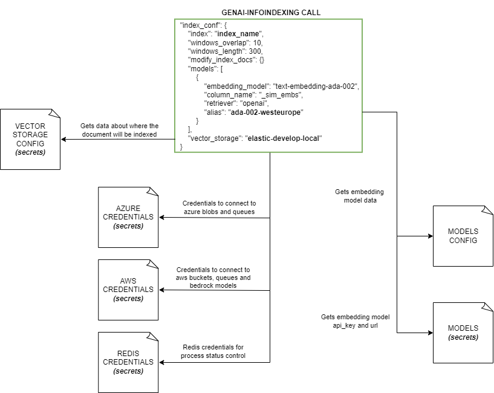
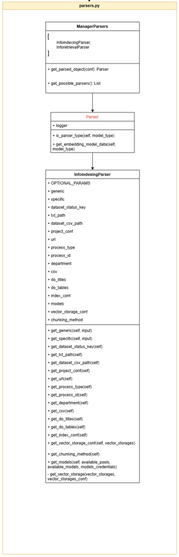
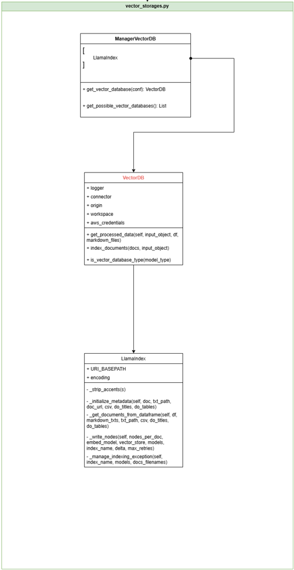
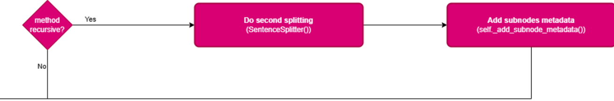
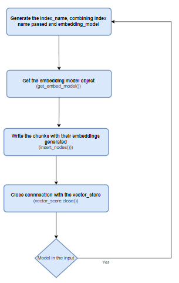

# InfoIndexing Service Documentation

## Index

- [InfoIndexing Service Documentation](#infoindexing-service-documentation)
  - [Index](#index)
  - [Overview](#overview)
    - [Key Features](#key-features)
  - [Getting started](#getting-started)
  - [Concepts and Definitions](#concepts-and-definitions)
  - [Vector storages](#vector-storages)
  - [Chunking Methods](#chunking-methods)
  - [Embeddings Generation](#embeddings-generation)
  - [Vector Storage. Chunk id generation](#vector-storage-chunk-id-generation)
  - [Component Reference](#component-reference)
    - [Using with integration](#using-with-integration)
    - [Writing message in queue (Developer functionality)](#writing-message-in-queue-developer-functionality)
    - [Redis status](#redis-status)
    - [Error Handling](#error-handling)
  - [Configuration](#configuration)
    - [Cloud setup](#cloud-setup)
    - [Blobs/Buckets storage distribution](#blobsbuckets-storage-distribution)
    - [Secrets](#secrets)
    - [Configuration files](#configuration-files)
    - [Environment variables](#environment-variables)
  - [Code Overview](#code-overview)
    - [Files and Classes](#files-and-classes)
    - [Flow](#flow)
  - [Troubleshooting](#troubleshooting)
    - [Common Issues](#common-issues)
    - [FAQ](#faq)
  - [Version History](#version-history)

## Overview

The GENAI INFOINDEXING service provides a comprehensive solution to streamline the process of indexing and managing document collections, whether you are dealing with a small or an extensive repository. This service enhances data indexing processes, ensuring quick and efficient managing of the data. Users can index with different embedding models such as BM25, OpenAI's ada-002 model or Amazon Bedrock's Cohere model, enriching document representations and improving search accuracy.

### Key Features

- **Multi-platform Support**: Seamlessly integrate with major cloud providers like Azure and AWS, ensuring scalability, reliability, and high availability for mission-critical applications.
- **Customizable Parameters**: Control snippet generation for documents adjusting parameters such as window length to meet specific use case requirements.
- **Versatile Model Selection**: Access a wide range of embedding models across different geographical regions to support global operations.
- **Multi-Language Support**: Index documents in multiple languages, offering multilingual support for global operations and diverse user bases.
- **Custom Metadata Fields**: Allow users to define custom metadata fields for their documents, facilitating better organization, categorization, and retrieval.
- **Editable Indexed Documents**: Allow users to modify metadata or update the content of already indexed documents, ensuring that information remains accurate and up-to-date.

## Getting started

To use the infoindexing component, you need to have the integration component, designed to receive the API call, adapt the input message and inject it into the corresponding queue, among other functions. In addition to that, a queue messaging service  and a cloud storage service will be needed, either Azure or AWS ones. It is also necessary to have an embedding model deployed or use the Hugginface public ones.

The first step you need to take to use the infoindexing component on your local machine is to set the [environment variables](#environment-variables).

After that, you need to create an environment with Python 3.11 and install the required packages listed in the "requirements.txt" file:

```sh
pip install -r "xxxxxx/yyyyyy/zzzzzz/requirements.txt"
```
Once everything above is configured, you need to run the main.py file from the integration-receiver subcomponent, and call the /process API endpoint with body and headers similar to the following example:

```python
import requests
import json

# Mandatory input data by user
api_key = "xxxxxxxxxxxx"
file_encoded = "" #doc encoded as base64
index_value = "index_name"

# Request to the API configuration
url = "http://localhost:8888/process"

payload = {
  "index": f"{index_value}",
  "operation": "indexing",
  "documents_metadata": {
    "doc1.pdf": {"content_binary": f"{file_encoded}"}
  },
  "response_url": "http://"
}

headers = {
  "x-api-key": f"{api_key}"
  "Content-Type": "application/json"
}

response = requests.request("POST", url, headers=headers, json=payload, verify=False)
print(response.text)
```

For a successful configuration, the response must look like this:
```json
{
  "status": "processing",
  "request_id": "request_20240627_134044_348410"
}
```

## Concepts and Definitions

To understand the indexing module, there are a few concepts that we need to define beforehand:

* **Indexer**: Service that divides the documents into units of information according to the defined/implemented strategy (mobile window, page, slide, section, paragraph) and generates embeddings for each unit of information generated.
* **Embedding Generation Model**: Language model used to generate the embeddings from a natural language text.
* **Vector database**: A service that stores text embeddings and other metadata, such as document filename, enabling search across snippets based on a specified query.

## Vector storages

Global RAG can use diferent vector databases to store document chunks and its embeddings. The supported ones are:

- [ElasticSearch](https://www.elastic.co/es/elasticsearch)
- [Azure AI Search](https://learn.microsoft.com/en-us/azure/search/)

To get more information about how to configure the secret file refer to Secrets section.

## Chunking Methods

To do the chunking an important concept that will be done indistinctly in all chunking methods is the chunking overlap, which consists in unifying the top and the bottom of consecutive chunks by being the same. The size is specified by the user. A visual representation of the chunking overlap is as follows:


Once explained the overlapping, there are 3 chunking methods to split the text in smaller parts:

* **Simple:** The method simply splits the chunks one at a time, in a sequential way using the 'window_length' and 'window_overlap' parameters.

  /2.0/techhubgenaiinfoindexing/genai-infoindexing-v2.2.0-chunking-method-simple.png)

* **Surrounding Context Window:** This method divides the chunks as the previous one but in the metadata field 'window' will insert the content of the front and back chunks depending on the window param (if is two, the two front and two back chunks content will be inserted). The structure of the text is as follows:

  ```sh
  window * front_chunks_content + actual_chunk_content + window * back_chunks_content
  ```

  A visual example of surrounding context window with the window field equal to 1 is:

  

  Finally a short and simple example with text would be:

| Chunk number | Chunk content | Window field (metadata) |
|--------------|---------------|-------------------------|
| 1            | Is Zaragoza   | Is Zaragoza a good city |
| 2            | a good city   | Is Zaragoza a good city to live in? |
| 3            | to live in?   | a good city to live in? |


* **Recursive:** The recursive chunking method will do a first simple split and then a second split of the obtained chunks using the 'sub_window_length' and 'sub_window_overlap' parameters. In the following image there are divided in two sub-chunks as the sub window overlap and length are the half of the window overlap and length parameters.

  

## Embeddings Generation
Embeddings are vector representations of the input text, created from the content of individual chunks. They can optionally be enriched with metadata, ensuring that the embeddings capture both the textual content and relevant contextual information.

The process of creating embeddings involves several steps:

* **Text chunking:** When dealing with large text, the first step is to divide it into smaller manegeable chunks using the methods mentioned above: `Simple`, `Surrounding Context Window` or `Recursive`. These methods ensure that each chunk preserves contextual information through the use of chunk overlap, which unifies portions of consecutive chunks.
* **Metadata Integration:** After the text is chunked, metadata can be attached to each chunk if desired in order to provide additional context about the source or attributes of the text. The metadata added can either be the one defined by the user (using the `metadata` parameter) or the metadata of the chunk ( such as `uri`, `document_id`, `snippet_number`...).  This step is controlled by the `index_metadata` parameter:
  * If set to `true`, only basic metadata, such as the filename and the metadata provided by the user, will be included.
  * If provided as a list of specific fields (e.g., `["filename", "uri"]`), only the specified metadata fields will be included.
  * And if omitted or set to `false`, no additional metadata will be included.
* **Embedding Generation:** Each chunk, potentially enriched with metadtaa, is then passed through an embedding model that will be responsible for converting each chunk into a numerical vector that will represent its semantic meaning


In this example the user provides some metadata such as `year` `category` and `day`, but index_metadata is set as false:
````json
"indexation_conf": {
      "vector_storage_conf": {
        "index": "example",
        "vector_storage": "elastic-develop-local",
        "metadata_primary_keys": ["filename"]
      },
      "chunking_method": {
        "method": "simple",
        "window_overlap": 10,
        "window_length": 300
      },
      "models": [
        {
          "alias": "techhub-pool-world-ada-002",
          "embedding_model": "text-embedding-ada-002",
          "platform": "azure"
        }
      ],
      "metadata": {
        "year": "2024",
        "category": "turism",
        "day": "monday"
      }
    }
    "index_metadata": false
},

````
So in this case only the text content of the chunk will be processed by the embedding model:

```
['{chunk_content}]
```
For the upper case would be:
```
['Living in Zaragoza today is a blend of rich history and modern vibrancy. As one of Spain\'s largest cities, it offers a high quality of life with a relatively low cost compared to bigger cities like Madrid or Barcelona. The city boasts a mix of historic landmarks, such as the Basilica del Pilar and the Aljaferia Palace, alongside contemporary architecture and urban development. Zaragoza\'s streets are alive with cultural events, festivals, and a thriving culinary scene, where tapas and local specialties like "ternasco" are celebrated. Its strategic location between Madrid, Barcelona, Valencia, and Bilbao makes it an important transport hub, yet it retains the charm of a city that\'s easy to navigate and welcoming to both locals and visitors.\nIn recent years, Zaragoza has embraced sustainability and innovation, becoming a smart city focused on renewable energy and efficient urban planning. The riverbanks of the Ebro have been revitalized into green spaces, perfect for walking, cycling, or enjoying outdoor activities. The city\'s public transport, including trams and buses, is modern and reliable, making it easy to commute. Zaragoza is also home to a vibrant student population, thanks to its renowned university, adding youthful energy to its streets. Despite its modernization, the city retains a strong sense of community and tradition, with warm and friendly people who value their heritage while looking forward to the future.']
```

In this other example the `index_metadata` parameter includes `filename`,  `year` and  `snippet_number`:

````json
"indexation_conf": {
      "vector_storage_conf": {
        "index": "example",
        "vector_storage": "elastic-develop-local",
        "metadata_primary_keys": ["filename"]
      },
      "chunking_method": {
        "method": "simple",
        "window_overlap": 10,
        "window_length": 300
      },
      "models": [
        {
          "alias": "techhub-pool-world-ada-002",
          "embedding_model": "text-embedding-ada-002",
          "platform": "azure"
        }
      ],
      "metadata": {
        "year": "2024",
        "category": "turism",
        "day": "monday"
      }
    }
    "index_metadata": ["filename", "year", "snnipet_number"]
},

````
So in this case the content that will be processed by the embedding model will include the metadata fields specified in the `index_metadata` parameter:
```
['{metadata_key_0}: {metadata_value_0}\n{metadata_key_n}: {metadata_value_n}\n\n{chunk_content}']
```
For the upper case would be:
````
['year: 2024\nfilename: nowadays_zaragoza_simple.txt\nsnippet_number: 0\n\nLiving in Zaragoza today is a blend of rich history and modern vibrancy. As one of Spain\'s largest cities, it offers a high quality of life with a relatively low cost compared to bigger cities like Madrid or Barcelona. The city boasts a mix of historic landmarks, such as the Basilica del Pilar and the Aljaferia Palace, alongside contemporary architecture and urban development. Zaragoza\'s streets are alive with cultural events, festivals, and a thriving culinary scene, where tapas and local specialties like "ternasco" are celebrated. Its strategic location between Madrid, Barcelona, Valencia, and Bilbao makes it an important transport hub, yet it retains the charm of a city that\'s easy to navigate and welcoming to both locals and visitors.\nIn recent years, Zaragoza has embraced sustainability and innovation, becoming a smart city focused on renewable energy and efficient urban planning. The riverbanks of the Ebro have been revitalized into green spaces, perfect for walking, cycling, or enjoying outdoor activities. The city\'s public transport, including trams and buses, is modern and reliable, making it easy to commute. Zaragoza is also home to a vibrant student population, thanks to its renowned university, adding youthful energy to its streets. Despite its modernization, the city retains a strong sense of community and tradition, with warm and friendly people who value their heritage while looking forward to the future.']
````

## Vector Storage. Chunk id generation
In order to index the chunks, an id must be generated to identify each one. The default mode is with the text of the chunk hashed (to update if passed the same doc). But there is a parameter ('metadata_primary_keys') that allows to add them to the chunk id generation having this format:
```
chunk content 

metadata_1
metadata_2
...
metadata_n
```
**This text will be the one hashed if 'metadata_primary_keys' passed.

This field, is a list of metadata and all metadata keys passed must appear in the 'metadata' parameter or in the mandatory ones (see <b>connectors.py</b> in [Code Overview](#code-overview) ).

## Component Reference
If infoindexing is working with the whole toolkit, the request will be done by API call to integration and the response will be given by checkend as an async callback (also written in redis database).

If infoindexing is working on his own, will throw an error when writing in the checkend queue (if it not exists) and the response can be seen in the logs or in the redis status.

### Using with integration

Requests structure must be as follows.

```json
{
    "request_id": "unique id for the request",
    "index": "index_name",
    "operation": "indexing",
    "models": ["bedrock_cohere_english", "azure_openai_ada"],
    "documents_metadata": {"doc1.pdf": {"content_binary": "doc encoded as base64"}},
    "response_url": "http://",
    "window_length": 300,
    "metadata": {"meta1": "meta1"}
}
```
If everything goes smoothly, response structure must be as follows (since it is an asynchronous process):

```json
{
  "status": "processing",
  "request_id": "unique id for the request"
}
```

If a <i>response_url</i> is provided, when the process ends, the service will send a POST request with the following structure:
* Response without error:
```json
{
  "status": "Finished",
  "request_id": "unique id for the request",
  "index": "index_name",
  "docs": {
    "doc1.pdf": {
      "content_binary": "n7h8...073/doc1.pdf",
      "ocr_used": "azure-ocr",
      "async": true,
      "status": "Finished",
      "process_id": "ir_index_202..."
    }
  }
}
```
* Response with error:
```json
{
  "status": "Finished/Error",
  "error": "Description of the error",
  "request_id": "unique id for the request",
  "index": "index_name",
  "docs": {
    "doc1.pdf": {
      "content_binary": "n7h81...7ss/doc1.pdf",
      "ocr_used": "azure-ocr",
      "async": true,
      "status": "Error",
      "process_id": "ir_index_202..."
    }
  }
}
```

For further information, see the <i>README</i> section in left menu.  

### Writing message in queue (Developer functionality)
If using just infoindexing module for developing purposes as is not needed to pass through the other components to know how infoindexing works (just an already preprocessed document can be used or a simpler one), a txt file located in a route of the *STORAGE_BACKEND* environment variable and separated by *\t* will be necessary.

```text
file_url\ttext\tlang\tn_pags\tmetadata1\tmetadata2...
                      or 
url text  lang  n_pags  metadata1 metadata2...
```

An example could be:
```text
route/to/the/file this is the content of all the file in raw format, just as a simple txt  es  18  creation_date: 12/12/2006 last_modification: 12/12/2007 
```

With this type of calling, the infoindexing component can be adapted to different modules or just be called if you have the raw content with the txt format explained (no preprocessing is mandatory). 

For a calling with just the infoindexing module, this are the mandatory parameters:

- **project_conf**: Configuration of project.
    - **process_id**: Id of process.
    - **process_type**: Type of process.
    - **department**: Department assigned to apikey.
    - **report_url**: Url to report metrics to apigw.
- **indexation_conf**: Configuration of index process.
  - **vector_storage_conf**: Configuration of the vector storage.
    - **index**: Name of index. If it is the first time it is used an index with this name is created in the corresponding database; otherwise, it is used to expand the existing index with more documents. No capital letters or symbols are allowed except underscore ([a-z0-9_]).
    - **vector_storage**: Key to get the configuration of the database from config file.
    - **metadata_primary_keys**: This parameter is to specify whether the metadata provided in the list will be used in the vector storage id generation or not. In brief to allow different metadata for same chunks.
  - **chunking_method**: Configuration of the chunking method.
    - **window_overlap**: When dividing the document into snippets, the number of tokens that overlap between 2 subsequent chunks. Default value is 10, and it is measured with NLTK tokenizer.
    - **window_length**: Length of chunks. Default value is 300.
    - **method**: Type of chunking technique that will be used simple is the default one.
    - **sub_window_length**: Integer value to specify the window length for the sub-chunks. (**<i>Recursive method only</i>**).
    - **sub_window_overlap**: Integer value to specify the window overlap for the sub-chunks. (**<i>Recursive method only</i>**).
    - **windows:** Number of the windows that will be taken in this method. (**<i>Recursive method only</i>**).
  - **models**: Indexing model configuration.
    - **alias**: Model or pool of models to index (equivalent to <i>"embedding_model_name"</i> in <i>models_config.json</i> config file).
    - **embedding_model**: Type of embedding that will calculate the vector of embeddings (equivalent to <i>"embedding_model"</i> in <i>models_config.json</i> config file).
    - **platform**: Provider used to store and get the information (major keys in <i>models_config.json</i> config file).
  - **metadata**: This parameter allows users to add custom metadata
  - **index_metadata**: This parameter can have various values to specify how metadata will be included in the embeddings:  
    - If set to `true`, only the filename metadata and the metadata provided by the user will be included.  
    - If provided as a list of specific fields (e.g., `["filename", "uri"]`), only the specified metadata fields will be included.  
    - If omitted or set to `false`, no metadata will be included. 

- **specific**
  - **dataset**
    - **dataset_key**: This key is generated by integration being:
      ```json
      {
        "dataset_key": "ir_index_'datetime'_'timemilis'_'randomchars':ir_index_'date'_'time'_'timemilis'_'randomchars'"
      }
      ```
      An example could be:
      ```json
      {
        "dataset_key": "ir_index_20240628_091121_716609_s79eqe:ir_index_20240628_091121_716609_s79eqe"
      }
      ```
      In the case that infoindexing is not used with integration, can be whatever written by the user.
  - **paths**
    - **text**: This is the place where the document explained in [Writing message in queue (developer functionality)](#Writing-message-in-queue-(Developer-functionality))  has to be located in the blob/bucket storage deployed associated to the *"STORAGE_BACKEND"* variable. If the *"TESTING"* variable is set to **True**, the file will be searched in the *"STORAGE_DATA"* blob (**Warning!** in this case the tokens will not be reported). If the service is used in conjunction with integration will be generated automatically with the following format:
      ```json
      {
        "text": "<department>/ir_index_20240711_081350_742985_d847mh/txt/<department>/request_20240711_081349_563044_5c2bac/<filename>.txt"
      }
      ```
      An example could be:
      ```json
      {
        "text": "username/dataset_key/txt/username/request_id/documentation.txt"
      }
      ```
      Otherwise, it has to be the route where the user uploads this file.

An example of a queue message could be:
Otherwise, as has been explained in the readme another way of calling infoindexing is available, but it needs more knowlegde of the parameters of the component as in this option you have to write a message in the queue. The necessary ones are:
```json
{
    "generic": {
        "project_conf": {
            "process_id": "ir_index_20240125_114829030220AMjg0k1c",
            "process_type": "ir_index",
            "department": "main2",
            "report_url": "http://uhis-cdac-apigw.uhis-cdac/apigw/license/report/24e79c90cfcc46b7b43c36b63012bce9",
        },
        "indexation_conf": {
            "vector_storage_conf": {
                "index": "pruebas_indexing",
                "vector_storage": "elastic-develop-local",
                "metadata_primary_keys": ["filename"]
            },
            "chunking_method": {
                "method": "simple",
                "window_overlap": 10,
                "window_length": 300,
            },
            "models": [
                {
                    "embedding_model":"text-embedding-ada-002",
                    "platform":"openai",
                    "alias": "ada-002-pool-europe"
                }
            ], 
            "index_metadata": true
        }
    },
    "specific": {
        "dataset": {
            "dataset_key": "ir_index_20240125_114829030220AMjg0k1c:ir_index_20240125_114829030220AMjg0k1c"
        },
        "paths": {
            "text": "test/infoindexing/data/indexes/ir_index_20240125_114829030220AMjg0k1c/txt/prodsimpl/docs/filename.txt",
        }
    }
}
```

To conclude, the result of using infoindexing in this way can be seen in redis or in the logs. In this example, an error will raise by trying to write in the queue. To know if the document was indexed, the inforetrieval endpoint to see all the documents from an index can be used.

### Redis status
All indexing components write their status to the Redis database.
This service always writes the final status of the process in the Redis database. That status has 2 parameters: **status** and **msg**. If the indexing was successful, set the status code to 200; otherwise, set an error code. The <i>msg</i> parameter is a short description of the error cause (see more in [Error handling](#error-handling)) or <i>"Indexing finished"</i> if the indexation was successful.
```json
{
  "status": "200",
  "msg": "Indexing finished"
}
```

```json
{
  "status": 500,
  "msg": "Timeout expired"
}
```

Finally, the entry in the database will be the value of the field *"dataset_key"* in the input message.

### Error Handling

Some common error messages you may encounter:

| Error message                                                                                                                                | Possible reason                                                                                     |
|:---------------------------------------------------------------------------------------------------------------------------------------------|:----------------------------------------------------------------------------------------------------|
| Credentials file not found {models\_keys\_path}.                                                                                             | Incorrect path to credentials file.                                                                 |
| Vector storages file not found {vector\_storages\_path}.                                                                                     | Incorrect path to vector storages file.                                                                 |
| Max retries reached, OpenAI non reachable.                                                                                                   | Too many requests, the platform is overloaded.                                                      |
| Error connecting with {vector database}                                                                                                      | Error connecting to the vector database, it could be unreacheable |
| Connector {connector_name} not found in vector_storages                                                                                      | When a connector name passed (file/environment variable) and is not in the file. |
| Pools can't be downloaded because {models_file_path} not found in {workspace}                                                                | The embeddings models file not found in the specified route for the workspace |
| Pools were not loaded, maybe the models_config.json is wrong                                                                                 | Models file is incorrect |
| Model {alias} not found in available embedding models                                                                                        | Passed an embedding model that does not exists |
| Error the value '{value}' for the key '{key}' must be a string or a list containing strings.                                                 | Filters passed in wrong format |
| Error the models sent: '{models_sent}' must be equal to the models used in the first indexation '{models_used}'                              | Different models between indexations |
| Metadata keys {new_meta} do not match those in the existing index {index}. Check and align metadata keys. Index metadata: {list(index_meta)} | Different metadata provided than the indexed |
| Detected metadata discrepancies. Verify that all documents have consistent metadata keys.                                                    | Different metadata between the documents |
| Max num of retries reached. Nodes have been deleted.                                                                                         | Max retries of Timeout or BulkingError reached (3), the documents indexed until the moment the error raised will be deleted. |
| File {txt_path} not found in IRStorage                                                                                                       | Processed file not found in the path for the workspace/origin (depending TESTING variable) |
| Chunking method type doesnt exist <input_chunking_method>. Possible values: ['simple', 'recursive', 'surrounding_context_window'] | The chunking method passed is not supported |


## Configuration
### Cloud setup

The files/secrets architecture is:



### Blobs/Buckets storage distribution
This service, needs different buckets if it is going to work along with integration and the rest of the services or not:
- **Integration**: 
  - STORAGE_BACKEND: To store the raw document data processed by all the previous components.
  - STORAGE_DATA: To store the document data that is going to be used by the previous services.
- **Just infoindexing**: 
  - STORAGE_BACKEND: Only this bucket is needed to read the raw document explained in [Writing message in queue (developer functionality)](#Writing-message-in-queue-(Developer-functionality)) 

### Secrets
All necessary credentials for the indexing flow are stored in secrets for security reasons. These secrets are JSON files that must be located under a common path defined by the [environment variable](#environment-variables) 'SECRETS_PATH'; the default path is "secrets/". Within this secrets folder, each secret must be placed in a specific subfolder (these folder names are predefined). This component requires 5 different secrets:

- **`azure.json`**: This file stores the credentials to connect to the required Azure blobs and queues (only needed if using Azure infrastructure). The custom path for this secret is "azure/", making the full path "secrets/azure/azure.json". The structure of this secret is as follows:
  ```json
  {
    "conn_str_storage": "your connection string for storage blobs",
    "conn_str_queue": "your connection string for ServiceBus queues",
  }
  ```
- **`aws.json`**: This file contains the credentials to connect to the required AWS buckets and queues (needed if using AWS infraestructure or Bedrock embedding models). The custom folder name for this file is "aws/". This secret has the following structure:
  ```json
  {
    "access_key": "your AWS access key",
    "secret_key": "your AWS secret key",
    "region_name": "AWS region of your infrastructure"
  }
  ```
- **`redis.json`**: This file stores Redis credentials for process status control purposes. The predefined path for this file is: "redis/". The format of this secret is as follows:
  ```json
  {
    "host": "your redis host",
    "password": "redis password",
    "port": "redis port"
  }
  ```
- **`models.json`**: file where urls and api-keys from the models are stored. This fields are separated, because api-keys are shared by the models for each region and the url's are always the same for a same type of models. The secret looks like:
    ```json
    {
        "URLs": {
          "AZURE_EMBEDDINGS_URL": "https://$ZONE.openai.azure.com/",
        },
        "api-keys": {
            "azure": {
                "*zone*": "*api-key*",
            },
            "openai": {
                "openai": "*sk-...*"
            },
            "bedrock":{
              . . .
            },
            "vertex": {
              "vertex": "*api-key*"
            }
        }
    }
    ```
    The explanation for every field:
    - The URLs field has all urls of the available models.
    - The api-keys field is to provide the api-keys of the models. in OpenAI the same api_key is shared for all of the models, in azure depends on its region and finally in bedrock it's not needed (calls are made with AK and SAK)


- **`vector_storage_config.json`**: file where data like credentials, url... from the different vector_storages supported are stored (currently, only ElasticSearch is supported). The custom partial path for this file is "vector-storage/". The format of the secret is as follows:

  - **ElasticSearch**: 
    ```json
    {
        "vector_storage_supported": [{
                "vector_storage_name": "elastic-develop",
                "vector_storage_type": "elastic",
                "vector_storage_host": "[SET_HOST_VALUE]",
                "vector_storage_schema": "https",
                "vector_storage_port": 9200,
                "vector_storage_username": "elastic",
                "vector_storage_password": "[SET_PASSWORD_VALUE]"
            },
            . . .
        ]
    }
    ```

    Parameters:
    - **vector_storage_name:** Alias of the vector storage to be identified. (must match with the environment variable VECTOR_STORAGE)
    - **vector_storage_type:** Type of the vector storage selected.
    - **vector_storage_host:** Host of the vector storage.
    - **vector_storage_schema:** Schema of the vector storage.
    - **vector_storage_port:** Port where the vector storage is located.
    - **vector_storage_username:** Username to access to the vector storage.
    - **vector_storage_password:** Password to access to the vector storage.

  - **Azure AI Search**:

    ```json
    {
        "vector_storage_supported": [
            {
                "vector_storage_host": "[SET_HOST_VALUE]",
                "vector_storage_type": "ai_search",
                "vector_storage_schema": "https",
                "vector_storage_name": "ai_search_techhubragemeal",
                "vector_storage_key": "[SET_PASSWORD_VALUE]"
            },
            . . .
        ]
    }
    ```

    Parameters:
    - **vector_storage_name:** Alias of the vector storage to be identified. (must match with the environment variable VECTOR_STORAGE)
    - **vector_storage_type:** Type of the vector storage selected.
    - **vector_storage_host:** Host of the vector storage.
    - **vector_storage_schema:** Schema of the vector storage.
    - **vector_storage_password:** Password to access to the vector storage (Azure key).

### Configuration files
Apart from the five secrets explained above, the system needs another configuration file, that must be stored in the backend storage defined, under the path "src/ir/conf":
- **`models_config.json`**: This file contains all the available embedding models with the following structure:
  ```json
  {
    "embeddings": {
      "azure": [
        {
          "embedding_model_name": "",
          "embedding_model": "",
          "azure_api_version": "",
          "azure_deployment_name": "",
          "model_pool": []
        },
        {
          ...
        },
        ...
      ],
      "bedrock": [
        {
          "embedding_model_name": "",
          "embedding_model": "",
          "zone": "",
          "model_pool": []
        },
        ...
      ],
      "huggingface": [
        {
          "embedding_model_name": "",
          "embedding_model": "",
          "retriever_model": ""
        },
        ...
      ],
      "vertex": [
        {
          "embedding_model_name": "",
          "embedding_model": "",
          "model_pool": []
        },
        ...    
      ]
    }
  }
  ```
  In this config file, the models from different platforms need different parameters:
    * <u>Azure models</u>:
        - **embedding_model_name**: name of the model, decided by the user and used to distinguish between models.
        - **embedding_model**: type of embedding model that uses the model
        - **zone**: place where the model has been deployed (used to get the api-keys)
        - **azure_api_version**: version of the api (embedding model) that is being used
        - **azure_deployment_name**: deployment name of the embedding model in azure
        - **model_pool**: pools the model belongs to
    * <u>Bedrock models</u>:
        - **embedding_model_name**: same as before
        - **embedding_model**: same as before
        - **zone**: place where the model has been deployed
        - **model_pool**: pools the model belongs to
    * <u>HuggingFace models (huggingface)</u>: This type of model is not deployed anywhere, so there is no region or pool to specify.
        - **embedding_model_name**: same as before
        - **embedding_model**: same as before
        - **retriever_model**: model used when retrieving information (in hugging-face models normally are different)
    * <u>Vertex models</u>:
        - **embedding_model_name**: same as before
        - **embedding_model**: same as before
        - **model_pool**: pools the model belongs to

An example where the rest of the data is extracted from the message:


### Environment variables

* **AWS_ACCESS_KEY**: AWS Public access key to the project. (if not in secrets)
* **AWS_SECRET_KEY**: AWS Secret access key to the project.(if not in secrets)
* **AZ_CONN_STR_STORAGE**: Azure connection string. (if not in secrets)
* **PROVIDER**: Cloud service to use to load the configuration files (aws or azure).
* **STORAGE_DATA**: Name of bucket/blob to store datasets.
* **STORAGE_BACKEND**: Name of bucket/blob to store configuration files and all the process related files.
* **SECRETS_PATH**: Path to the secrets folder.
* **Q_INFO_INDEXING**: Name of the queue for the infoindexing service
* **TESTING**: Optional environment variable to use when testing the module. With this variable, the processed files are located in STORAGE_DATA blob/bucket and the report to the api is not done. This variable is for running the test purposes or when debugging in local in order to use concrete files just in the infoindexing component.
* **Q_FLOWMGMT_CHECKEND**: Queue to write the message after finishing the process. The checkend mainly reports tye indexation result to the url given in the integration process.  


## Code Overview

### Files and Classes

**main.py (`InfoIndexationDeployment`)**

This class manages the main flow of the component by parsing the input, calling the different objects that run the module and finally returning the response to the user.


**parsers.py (`ManagerParsers`,`Parser`,`InfoindexingParser`)**

This class parses the input json request received from the queue, getting all the necessary parameters.

There are several parameters that the indexing service receives in the queue request. Some of these parameters are configured by the user in the input request (see [Using with integration](#Using-with-integration)), while others are internal parameters introduced by the integration service. As explained before, the parameters used in the indexation service are:

* **indexation_conf:** Configuration of index process.
    - **vector_storage_conf:** Configuration of the vector storage.
        - **index:** Name of index.
        - **vector_storage:** Key to get the configuration of the database from config file.
        - **metadata_primary_keys**: Specifies if the metadata provided in the list will be used in the vector storage id generation.
    - **chunking_method:**
        - **method:** Type of chunking method.
        - **window_overlap:** Overlap to apply to chunks.
        - **window_length:** Length of chunks.
        - **sub_window_overlap:** Overlap to apply to sub-chunks (recursive).
        - **sub_window_length:** Length of sub-chunks (recursive).
        - **windows:** Number of windows (surrounding).
    - **models:** Indexing model configuration.
        - **alias:** Model or pool of models to index (equivalent to name in config file).
        - **embedding_model:** Type of embedding that will calculate the vector of embeddings.
        - **platform:** Provider used to store and get the information.
    - **metadata**: This parameter allows users to add custom metadata
    - **index_metadata**:  This parameter, which can be either true to include the filename and users` metadata or a list specifying the metadata fields to include. Is used to add metadata to the embeddings generation.

    

However, the necessary ones are detailed in the readme file.



**storage_manager.py (`ManagerStorage`, `BaseStorageManager`, `IRStorageManager`)**

This class is responsible of managing the operations with the cloud storage of all files associated with the indexing process; this includes files generated in the preprocess (documents text and geospatial information) and [configuration files](#configuration-files).


**connectors.py (`ManagerConnector`, `Connector`,`ElasticSearchConnector`)**

This class manages the connection with the vector database, checking all the different important things like maintaining the same index during different indexations. If first indexation has been made with some models and metadata, the same models and metadata must be the same for all documents.

If the database is ElasticSearch, the mandatory columns in the index tables are:
* **_index:** The name of the index in Elasticsearch.
* **_type:** The type of the document. By default, it is set to "_doc".
* **_id:** The ID of the chunk in Elasticsearch.
* **_score:** An automatic value generated by Haystack.
* **content:** The text of the chunk.
* **metadata:** Dictionary with all of the metadata values for each chunk. The base metadata fields are:
  - **filename:** The name of the file where the chunk text is located.
  - **uri:** The path to the cloud where the document has been saved for possible download.
  - **document_id:** The identifier of the document to which the chunk of text belongs.
  - **snippet_number:** The same value and meaning as the previous field.
  - **snippet_id:** The identifier of the text chunk (same as _id).
  - **_node_content:** Metadata introduced by LlamaIndex. String containing all the node content, including metadata, text and realtionships with other nodes.
  - **_node_type:** Metadata introduced by LlamaIndex. Type of LlamaIndex node; may be: <i>text, image, index</i> or <i>document</i>. For snippets is always <i>text</i>.
  - **doc_id:** Duplicated identifier for the document generated by LlamaIndex
  - **ref_doc_id:** Duplicated identifier for the document generated by LlamaIndex
  - **window *(surrounding context window method)*:** Text formed by the text of the front and back chunks indicated in the 'windows' param and the text of the actual chunk (correctly ordered)
  - **original_text *(surrounding context window method)*:** Metadata introduced by LlamaIndex. The original text of the chunk.
  - Metadata added by the user...
  - **index_id *(recursive):*** Reference to its parent index (if the node is the parent itself, the id will be the same as _id) 
* **embedding:** Column where the snippet embeddings will be stored.


**vector_storages.py (`ManagerVectorDB`, `VectorDB`,`LlamaIndex`)**

This class saves the documents and their associated metadata in the database.




### Flow


In the following flows diagram, each color will represent the following files:
    
  

1.	When the service is initialized, it loads all the [secrets](#secrets) and [configuration files](#configuration-files) containing pools, models, and vector_storage details, to know the ones that are available.
    
2. Using the parser class (see <i>Files and Classes > parsers.py</i>). The input message from the queue is parsed to get all the necessary parameters, including the model that’s going to be used and the vector database where the documents are going to be stored.
    
3. A connection with the selected vector storage is created and the system verifies the selected configuration for the indexing process. If the chosen index already exists, the selected models and the chunking method in this call must match those used during the first indexation.
    
4. The class corresponding to the selected vector database is initialized and then, all files associated to the documents to be indexed (preprocess files) are loaded.
    
5. The files are converted to the vector store format and the mandatory metadata initialized. Then, the system verifies its consistency with the existing index metadata as it must be the same (in case the index already exists).
    
6. First, calculates the number of tokens of the document using `tiktoken`. This number is used to report and control the usage of the different models. Then the manager of the chunking method selected en the 'method' parameter will be chosen and the document splitted in chunks based on the method using the parameters in 'chunking_method'.
    
7. The chunking method selected, does the first splitting as is always de same, by using the <i>'window_length'</i> and <i>'window_overlap'</i> [parameters](#Writing-message-in-queue-(Developer-functionality)). After that, the corresponding metadata for the chunking method, is added to every chunk extracted (explained in the connectors.py class). At last, the chunk id (<i>'id_'</i>) and the <i>'snippet_id'</i> are added.

    
8. If the chunking method is the recursive one, a second splitting will be done by using the <i>'sub_window_length'</i> and <i>'sub_window_overlap'</i> [parameters](#Writing-message-in-queue-(Developer-functionality)) to get the sub-chunks. After that, the corresponding metadata is added to every sub-chunk and finally the sub-chunk id (<i>'id_'</i>) and the <i>'snippet_id'</i> are added too (same process as previous one but with the sub-chunks). The main metadata here is the <i>'index_id'</i> as it refers to its base chunk.
    
9.  Write the documents in the vector storage for each model, following all this steps:
    1. The first step is to internally generate the index name for each requested model.
    2. Then the object used to generate the embeddings is created
    3. Write all the chunks and metadata in the corresponding index, with a controlled retries system to handle timeout errors or vector database/models overloads.
    4. Save the number of pages and tokens for every model to report it after.
    5. Close the connection with the vector database to avoid errors (one created before necessary for LlamaIndex).
    
10.	Report the tokens usage to the api, close the connection with the vector storage (connector used to check index configuration, create empty indexes...) and finally update Redis database with the result of the indexation process, saving an error code if something goes wrong.

    


## Troubleshooting

### Common Issues

- Solutions to frequent problems

### FAQ

- Answers to common questions

## Version History

- v1: Release version
