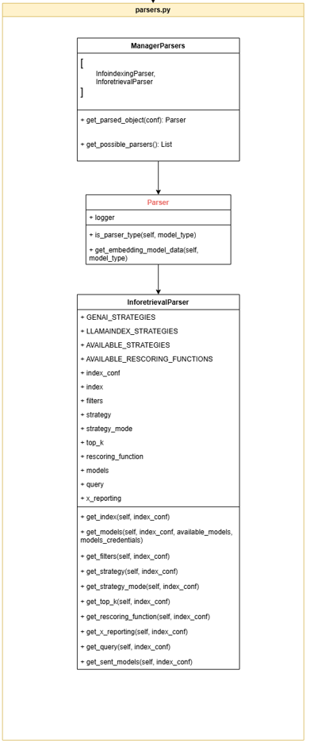
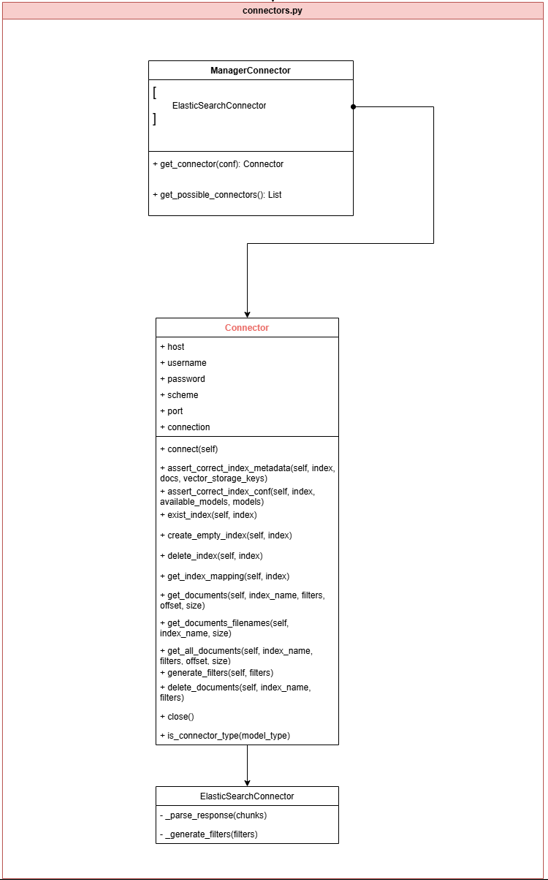
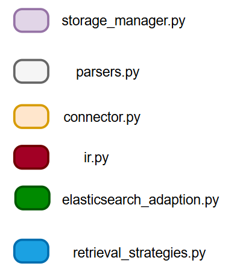
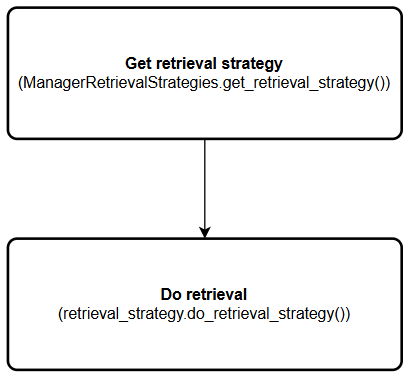
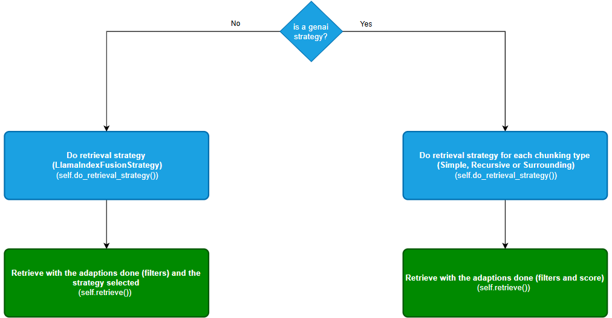
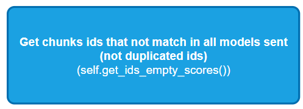
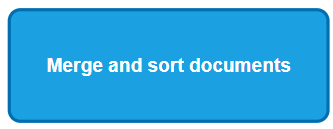

# Retrieval

## Index

- [Retrieval](#retrieval)
  - [Index](#index)
  - [Overview](#overview)
    - [Key features](#key-features)
  - [Getting Started](#getting-started)
    - [Installation](#installation)
      - [System requirements](#system-requirements)
      - [Installation steps](#installation-steps)
    - [Quick Start Guide](#quick-start-guide)
  - [Concepts and Definitions](#concepts-and-definitions)
    - [Components](#components)
    - [Core Concepts](#core-concepts)
    - [Architecture](#architecture)
  - [Calling Retrieval](#calling-retrieval)
    - [Examples](#examples)
      - [Simple retrieval call: `url/process`](#simple-retrieval-call-urlprocess)
      - [Documents retrieval: `url/retrieve_documents`](#documents-retrieval-urlretrieve_documents)
      - [Delete documents: `url/delete-documents`](#delete-documents-urldelete-documents)
      - [Delete index: `url/delete_index`](#delete-index-urldelete_index)
      - [Filenames retrieval: `url/get_documents_filenames`](#filenames-retrieval-urlget_documents_filenames)
      - [List indices: `url/get_models`](#list-indices-urlget_models)
      - [Parameters](#parameters)
      - [Examples](#examples-1)
      - [List indices: `url/list_indices`](#list-indices-urllist_indices)
  - [API Reference](#api-reference)
    - [Endpoints](#endpoints)
    - [Request and Response Formats for /process](#request-and-response-formats-for-process)
    - [Parameters explanation](#parameters-explanation)
    - [Error Handling](#error-handling)
  - [Configuration](#configuration)
    - [Cloud setup](#cloud-setup)
      - [Secrets](#secrets)
      - [Configuration files](#configuration-files)
    - [Environment Variables](#environment-variables)
  - [Code Overview](#code-overview)
    - [Files and Classes](#files-and-classes)
    - [Flow](#flow)
  - [Troubleshooting](#troubleshooting)
    - [Common Issues](#common-issues)
    - [FAQ](#faq)
  - [Version History](#version-history)

## Overview

The RETRIEVAL module is designed to facilitate the extraction of documents or information from a pre-indexed vector database. It works in conjunction with the INFOINDEXING module, which handles the indexing of documents. The RETRIEVAL module provides several key functionalities, including retrieving documents, deleting them, applying rescoring functions, and filtering results based on specific criteria.

### Key features

- Synchronous Document Retrieval: Collect documents or information from documents previously indexed in a vector database.
- Configurable Parameters: Customize retrieval operations with various parameters like index_conf, rescoring_function, top_k, and filters.
- Model Utilization: Specify models for retrieval, including BM25, sentence-transformers, and text-embedding models.
- Rescoring Functions: Improve search results with different rescoring functions such as mean, loglength, norm, etc.

## Getting Started

### Installation

#### System requirements

- Python 3.11
- Cloud storage
- ElasticSearch

#### Installation steps

- Create a new Python 3.11 environment
- Install the required libraries with the "requirements.txt" file.

    ```sh
    pip install -r "**path to the requirement.txt file**"
    ```

-ElasticSearch deployment.

- Set the environment variables:

    ```json
    "AWS_ACCESS_KEY": "access_key",
    "AWS_SECRET_KEY": "secret_access_key",
    "AZ_CONN_STR_STORAGE": "Endpoint=sb://exampleurl.servicebus.windows.net/;SharedAccessKeyName=RootManageSharedAccessKey;SharedAccessKey=sharedacceskeyexample123=",
    "PROVIDER": "azure/aws",
    "SECRETS_PATH": "path to secrets folder",
    "STORAGE_BACKEND": "tenant-backend",
    "VECTOR_STORAGE": "alias of the vector storage that will be used in the service"
    ```

To get more information go to [Environment variables](#environment-variables)

### Quick Start Guide

Calling Retrievals needs at least an index to refer to and the question from the user

```json
{
    "index_conf": {
        "index": "myindex",
        "rescoring_function": "loglength",
        "query": "What is the function of retrieval?",
        "top_k": 2,
        "filters": {
            "filename": ["manual.docx"]
        },
        "models": [
        ]
    }
}
```

and headers if you are running on your local machine:

```json
"x-tenant": "",
"x-department": "",
"x-reporting": ""
```

If you are calling the pod use:

```json
"x-api-key": "apikey123example"
```

If the response looks like this, you are good to go.

```json
{
    "status": "finished",
    "result": {
        "status_code": 200,
        "docs": [
            {
                "id_": "8e9c1c767d47594486649f6e35151edb",
                "meta": {
                    "uri": "https://d2astorage.blob.core.windows.net/uhis-cdac-develop-.../manual.docx",
                    "sections_headers": "",
                    "tables": "",
                    "filename": "manual.docx",
                    "document_id": "39656327-0e14-4a6c-8e08-92319f0b7fca",
                    "snippet_number": 0,
                    "snippet_id": "2246d8c8-d339-4ce2-9a02-4bac15c10ebc",
                    "text-embedding-ada-002--score": 0.909199,
                    "bm25--score": 0.6160323472464577
                },
                "relationships": {
                    "previous_node": {
                        "node_id": "7678185d-b25a-4891-834a-ae1fe28c1060",
                        "node_type": "1",
                        "metadata": {
                            "uri": "https://d2astorage.blob.core.windows.net/uhis-cdac-develop-.../manual.docx",
                            "sections_headers": "",
                            "tables": "",
                            "filename": "manual.docx",
                            "_header_mapping": "",
                            "_csv_path": "",
                            "document_id": "39656327-0e14-4a6c-8e08-92319f0b7fca"
                        },
                        "hash": "ae632f741daa3809203d79916e0ff97acc8507f150c0fd2c5af3bd9c8c457675",
                        "class_name": "RelatedNodeInfo"
                    },
                    "next_node": {
                        "node_id": "da7bba09-94ba-4ee6-8722-3ef8b45a1a24",
                        "node_type": "1",
                        "metadata": {},
                        "hash": "5cfca3e7102e82f3bbed2c7ba41251072947ddfa05d52d748567fd538801e140",
                        "class_name": "RelatedNodeInfo"
                    }
                },
                "content": "Call the generative AI service that, using templates, configures the prompt to call the LLM to perform the task by the user with the generated context.\nRetrieval: A service that uses the user's query to retrieve information from the vector database where the units of information obtained from the documents were stored\nLLM System: Service that makes the call and configuration to the LLM.\nTo begin using the compose con module, the initial step involves creating a configuration template. Within this template, it is necessary to configure the desired workflow for responding to a submitted task. For example, this may include performing a query to the information retrieval system in order to retrieve relevant information from the vector database.\nThe configuration allows for several functionalities, including:\nFilter query: Utilizing filters to manage the conversation state and prevent language models from being queried about sensitive topics.\nReformulate query: Modifying user queries to enhance the retrieval system's performance by leveraging past interactions within the conversation.\nPersistence: Saving the conversation into a database to keep track of the messages.\nRetrieval information from vectorial database:  Searching for relevant text segments in the user index of the vector database based on the user's query.\nThe typical scenario involves submitting a direct query to the retrieval system, which provides a list of ranked results. From this list, one or more closely related segment are selected.",
                "score": 0.8274222302911647
            },
            {...}
        ],
        "status": "finished"
    },
    "status_code": 200
}
```

## Concepts and Definitions

### Components


This service uses the user's query to retrieve information from the vector database where the units of information obtained from the documents were stored (ElasticSearch).

- Cloud storage (AWS / AZURE): Used in particular cases which the user wants to use an ElasticSearch different from the associated to the tenant

### Core Concepts

- **ElasticSearch**: Open-source search and analytics engine built on Apache Lucene. It's designed to handle large volumes of data in real-time and is widely used for its powerful search capabilities.
- **Embedding vectors**: Low-dimensional, dense vector representation of high-dimensional data, such as words, images, or other items.
- **Embedding model**: Model that converts high-dimensional data (such as words, images, or items) into low-dimensional vectors. These vectors, called embeddings, capture the semantic relationships between the data points.
- **Index**: Data structure used to improve the speed and efficiency of data retrieval operations that organizes and optimizes the storage of the embeddings.

### Architecture

## Calling Retrieval

### Examples
This examples will be done by calling in localhost or deployed, so 'url' will be the base url.

#### Simple retrieval call: `url/process`

The following is the body request for a retrieval:

```json
{
    "index_conf": {
        "index": "myindex",
        "rescoring_function": "loglength",
        "query": "What is the function of retrieval?",
        "top_k": 2,
        "filters": {
            "filename": ["manual.docx"]
        },
        "models": [
        ]
    }
}
```

Response:

```json
{
    "status": "finished",
    "result": {
        "status_code": 200,
        "docs": [
            {
                "id_": "8e9c1c767d47594486649f6e35151edb",
                "meta": {
                    "uri": "https://d2astorage.blob.core.windows.net/uhis-cdac-develop-.../manual.docx",
                    "sections_headers": "",
                    "tables": "",
                    "filename": "manual.docx",
                    "document_id": "39656327-0e14-4a6c-8e08-92319f0b7fca",
                    "snippet_number": 0,
                    "snippet_id": "2246d8c8-d339-4ce2-9a02-4bac15c10ebc",
                    "text-embedding-ada-002--score": 0.909199,
                    "bm25--score": 0.6160323472464577
                },
                "relationships": {
                    "previous_node": {
                        "node_id": "7678185d-b25a-4891-834a-ae1fe28c1060",
                        "node_type": "1",
                        "metadata": {
                            "uri": "https://d2astorage.blob.core.windows.net/uhis-cdac-develop-.../manual.docx",
                            "sections_headers": "",
                            "tables": "",
                            "filename": "manual.docx",
                            "_header_mapping": "",
                            "_csv_path": "",
                            "document_id": "39656327-0e14-4a6c-8e08-92319f0b7fca"
                        },
                        "hash": "ae632f741daa3809203d79916e0ff97acc8507f150c0fd2c5af3bd9c8c457675",
                        "class_name": "RelatedNodeInfo"
                    },
                    "next_node": {
                        "node_id": "da7bba09-94ba-4ee6-8722-3ef8b45a1a24",
                        "node_type": "1",
                        "metadata": {},
                        "hash": "5cfca3e7102e82f3bbed2c7ba41251072947ddfa05d52d748567fd538801e140",
                        "class_name": "RelatedNodeInfo"
                    }
                },
                "content": "Call the generative AI service that, using templates, configures the prompt to call the LLM to perform the task by the user with the generated context.\nRetrieval: A service that uses the user's query to retrieve information from the vector database where the units of information obtained from the documents were stored\nLLM System: Service that makes the call and configuration to the LLM.\nTo begin using the compose con module, the initial step involves creating a configuration template. Within this template, it is necessary to configure the desired workflow for responding to a submitted task. For example, this may include performing a query to the information retrieval system in order to retrieve relevant information from the vector database.\nThe configuration allows for several functionalities, including:\nFilter query: Utilizing filters to manage the conversation state and prevent language models from being queried about sensitive topics.\nReformulate query: Modifying user queries to enhance the retrieval system's performance by leveraging past interactions within the conversation.\nPersistence: Saving the conversation into a database to keep track of the messages.\nRetrieval information from vectorial database:  Searching for relevant text segments in the user index of the vector database based on the user's query.\nThe typical scenario involves submitting a direct query to the retrieval system, which provides a list of ranked results. From this list, one or more closely related segment are selected.",
                "score": 0.8274222302911647
            },
            {...}
        ],
        "status": "finished"
    },
    "status_code": 200
}
```

#### Documents retrieval: `url/retrieve_documents`

To retrieve a document from an index the request is:

```json
{
    "index": "myindex",
    "filters":{
        "filename": "manual.docx"
    }
}
```

Response:

```json
{
    "result": {
        "docs": [
            {
                "content": "| |  | Generative AI – Manual | \nGenerative AI – Manual | \ Generative AI – Manual | \Generative AI – Manual |  | \n|\nSummary of the documentation\The application is an accelerator platform for solving use cases that utilize generative AI. As an accelerator, it provides a set of tools and functionalities (through API) to configure and develop upon. The goal is to have common functionalities and components for generative AI use cases. \nThere are two main pipelines: index manager and the compose manager. The index manager is responsible for taking documents that a user inputs and saving them into the database, including all the intermediate steps to extract information from them. The compose manager is responsible for taking a user query and conducting the generative AI tasks of the use case to return a response.\nIn this document, there are examples of the different templates that can be done for different uses cases.",
                "id_": "a7e30416fd9463da6fe1acc071a9ad5e",
                "meta": {
                    "document_id": "e72ac490-27c4-49db-8114-4fa26e6833d2",
                    "filename": "manual.docx",
                    "sections_headers": "",
                    "snippet_id": "253ca09e-ba23-4c33-b52c-3a9fc5637170",
                    "snippet_number": 0,
                    "tables": "",
                    "uri": "https://d2astorage.blob.core.windows.net/uhis-cdac-develop-.../manual.docx"
                },
                "score": 1.0
            },
            {...},
            {...}
        ],
        "status": "finished",
        "status_code": 200
    },
    "status": "finished"
}
```

#### Delete documents: `url/delete-documents`

To delete a document from an index the request is:

```json
{
  "index": "myindex",
  "delete":{
      "filename": "filename"
  }
}
```

Response:

```json
{
  "status": "finished", 
  "result": "Documents that matched the filters were deleted for 'index name'",
  "status_code": 200
}
```

#### Delete index: `url/delete_index`

To delete an index with all documents associated use the endpoint /delete_index and the body:

```json
{
  "index": "myindex"
}
```

Response:

```json
{
  "status": "finished", 
  "result": "Index 'myindex' deleted for 'x' models",
  "status_code": 200
}
```

#### Filenames retrieval: `url/get_documents_filenames`
To retrieve the name of the documents indexed and their chunks from an index, the request is:
```json
{
    "index": "myindex"
}
```
Response:

```json
{
    "result": {
        "docs": [
            {
                "chunks": 7,
                "filename": "filename1.pptx"
            },
            {
                "chunks": 6,
                "filename": "filename2.txt"
            },
            {
                "chunks": 6,
                "filename": "filename3.pdf"
            },
            {
                "chunks": 5,
                "filename": "filename4.docx"
            }
            ...
        ],
        "status": "finished",
        "status_code": 200
    },
    "status": "finished"
}
```

It returns a list of available models filtered by model platform, pool, model_type or zone. A simple call to get all the available models on the 'azure' platform would be like this:
https://techhubapigw.app.techhubnttdata.com/retrieve/get_models?platform=azure

The response would be a list of all the available models on the platform:
```json
{
    "status": "ok",
    "result": {
        "models": [
            "ada-002-techhub-westeurope",
            "ada-002-techhub-australia",
            "ada-002-techhub-canada",
            "ada-002-techhub-eastus",
            "ada-002-techhub-eastus2",
            "ada-002-france",
            "ada-002-japan",
            "ada-002-northcentralus",
        ],
        "pools": [
            "ada-002-pool-techhub-world",
            "ada-002-pool-europe",
            "ada-002-pool-australia",
            "ada-002-pool-world",
            "ada-002-pool-techhub-europe",
            "ada-002-pool-japan",
            "ada-002-pool-techhub-america",
            "ada-002-pool-america"
        ]
    },
    "status_code": 200
}
```
#### List indices: `url/get_models`
#### Parameters

The endpoint expects a get request with the following optional fields (one of them mandatory to do the call propertly) passed by parameters in the url :

- embedding_model (optional): A string representing the embedding model to filter.
- pool (optional): A string or list of strings representing the model pools to filter.
- platform (optional): A string representing the platform to filter.
- zone (optional): A string representing the zone to filter.

#### Examples

Filter by model pool:
- Request:
https://techhubapigw.app.techhubnttdata.com/retrieve/get_models?pool=ada-002-pool-world
- Response:
```json
{
    "status": "ok",
    "models": [
        "ada-002-dolffia-canada",
        "ada-002-dolffia-eastus2",
        "ada-002-westus",
        "ada-002-genai-eastus",
        "ada-002-genai-france",
        "ada-002-northcentralus",
        "ada-002-genai-westeurope",
        "ada-002-france",
    ],
    "status_code": 200
}
```

Filter by embedding model:
- Request:
https://techhubapigw.app.techhubnttdata.com/retrieve/get_models?embedding_model=text-embedding-3-small

- Response:
```json
{
    "status": "ok",
    "result": {
        "models": [
            "ada-003-small-eastus"
        ],
        "pools": [
            "ada-003-small-pool-world"
        ]
    },
    "status_code": 200
}
```

Filter by zone:
- Request:
https://techhubapigw.app.techhubnttdata.com/retrieve/get_models?zone=techhub

- Response:
```json
{
    "status": "ok",
    "result": {
        "models": [
            "ada-002-techhub-westeurope",
            "ada-002-genai-eastus",
            "ada-002-genai-japaneast"
        ],
        "pools": [
            "ada-002-pool-techhub-world",
            "ada-002-pool-europe",
            "ada-002-pool-techhub-asia",
            "ada-002-pool-world",
            "ada-002-pool-techhub-america"
        ]
    },
    "status_code": 200
}
```

#### List indices: `url/list_indices`
Handles the request to list all indices in the Elasticsearch database, returning a list of indices with their names and the models associated with each one. A call to obtain the indices with the associated models would look like this: 
https://techhubapigw.app.dev.techhubnttdata.com/retrieve/list_indices

The response would be a list of index names along with the models associated with each one:
```json
{
    "indices": [
        {
            "models": [
                "text-embedding-ada-002"
            ],
            "name": "index_1"
        },
        {
            "models": [
                "text-embedding-ada-002",
                "text-embedding-large",
                "cohere.embed-multilingual-v3"
            ],
            "name": "index_2"
        },
        {
            "models": [
                "text-embedding-ada-002"
            ],
            "name": "index_3"
        },
        {
            "models": [
                "text-embedding-large"
            ],
            "name": "index_4"
        }
    ],
    "status": "ok",
    "status_code": 200
}
```

## API Reference

### Endpoints

- /process (POST): This is the main endpoint.
- /delete-documents (POST): Deletes document from index.
    Body:

    ```json
    {
        "index": "myindex",
        "delete":{
            "filename": "manual.docx"
        }
    }
    ```
- /delete_index (POST): Deletes an index.
    Body:

    ```json
    {
        "index": "myindex"
    }
    ```
- /healthcheck (GET): Used to check if the component is available. Returns:

    ```json
    {
        "status": "Service available"
    }
    ```

- /retrieve_documents (POST): Retrieves document from index.
    Body:

    ```json
    {
        "index": "myindex",
        "filters":{
            "filename": "manual.docx"
        }
    }
    ```

- /get_documents_filenames (POST): Retrieves documents filenames from index.
    Body:

    ```json
    {
        "index": "myindex"
    }
    ```
    
- /get_models (GET): Gets the models filtered by some parameter (zone, pool, platform or embedding_model). 
  Request: https://techhubapigw.app.techhubnttdata.com/retrieve/get_models?zone=techhub

- /list_indices (GET): Gets lists all indexes in the Elasticsearch database, their names and the models associated with each one. 
  Request: https://techhubapigw.app.dev.techhubnttdata.com/retrieve/list_indices
Returns:
    ```json
    {
    "indices": [
        {
            "models": [
                "text-embedding-ada-002"
            ],
            "name": "index_1"
        },
        {
            "models": [
                "text-embedding-ada-002",
                "text-embedding-large",
                "cohere.embed-multilingual-v3"
            ],
            "name": "index_2"
        }
    ],
    "status": "ok",
    "status_code": 200
    }
    ```
### Request and Response Formats for /process

### Parameters explanation

- **index_conf** (required): configuration of the index:
  - **index** (required): Name of index
  - **query** (required): This is the question we want the retrieval to get information of
  - **rescoring_function** (optional):  It can be [mean, posnorm, pos, length, loglength, norm, nll], it changes the way to ponderate semantic search vs bm25 to improve results. (mean by default)
  - **strategy** (optional): To select the behaviour of the chunk extraction (llamaindex_fusion or genai_retrieval)
  - **strategy_mode** (optional): When the strategy is llamaindex_fusion, the merge format used (can be reciprocal_rerank, relative_score, dist_based_score or simple)
  - **top_k** (optional): Number of passages to be returned (10 as default)
  - **filters** (optional): For each key it will only return keys that are contained in the list. For example in the example json, the system will return only passages in Doc1.pdf

    ```json
    "filters":{
        "filename": "filename.txt"
    }
    ```

  - **models**: If indicated, only those models will be used for retrieval (alias of the model). Otherwise, all models used in indexation will be used. 

    ```json
    [
        "dpr-encoder",
        "ada-002-pool-europe",
        "bm25"
    ]
    ```

### Error Handling

Some common error messages you may encounter:

| Error message                                                                | Possible reason                                                                                     |
|:-----------------------------------------------------------------------------|:----------------------------------------------------------------------------------------------------|
| Credentials file not found {models\_keys\_path}.                             | Incorrect path to credentials file.                                                                 |
| Vector storages file not found {vector\_storages\_path}.                     | Incorrect path to vector storages file.                                                                 |
| Max retries reached, OpenAI non reachable.                                   | Too many requests, the platform is overloaded.                                                      |
| Error connecting with {vector database}               | Error connecting to the vector database, it could be unreacheable                                                            |
| There must be one filter                                                     | Filters dictionary cannot be empty.                                                                 |
| Index not found                                                              | Incorrect index.                                                                                    |
| 'delete' key must be a dictionary with the metadata used to delete           | To use the delete endpoint it is mandatory to send the metadata of the file you want to delete.     |
| 'index' key must be a string with the index name                             | Index key structure must always be a string containing the name of an index.                        |
| Error deleting documents: {result}                                           | Incorrect index or filters.                                                                         |
| Documents not found for filters: {filters}                                   | Incorrect documents filters passed or does not match.                                                                       |
| Missing parameter: index                                                     | The index parameter is empty or doesn´t exists                                                      |
|Connector {connector_name} not found in vector_storages | When a connector name passed (file/environment variable) and is not in the file.
|Model '{model_name}' does not exist for the index '{index}' | Model passed that has not been used during indexation process |
BM25 retriever not found (there is no index that matches the passed value) | BM25 not found (used when index every model), then the name for the index doesn't appear.
|Pools can't be downloaded because {models_file_path} not found in {workspace} | The embeddings models file not found in the specified route for the workspace
| Pools were not loaded, maybe the models_config.json is wrong | Models file is incorrect
| Model {alias} not found in available embedding models | Passed an embedding model that does not exists
| Error the value '{value}' for the key '{key}' must be a string or a list containing strings. | Filters passed in wrong format


## Configuration

### Cloud setup

To configure the component on your own cloud use [this guide](#deploy-guide-link).

The files/secrets architecture is:


#### Secrets
    
All necessary credentials for genai-inforetrieval are stored in secrets for security reasons. These secrets are JSON files that must be located under a common path defined by the [environment variable](#environment-variables) 'SECRETS_PATH'; the default path is "secrets/". Within this secrets folder, each secret must be placed in a specific subfolder (these folder names are predefined). This component requires 4 different secrets:

- **`azure.json`**: This file stores the credentials to connect to the required Azure blobs and queues (only needed if using Azure infrastructure). The custom path for this secret is "azure/", making the full path "secrets/azure/azure.json". The structure of this secret is as follows:
  ```json
  {
    "conn_str_storage": "your connection string for storage blobs",
    "conn_str_queue": "your connection string for ServiceBus queues",
  }
  ```
- **`aws.json`**: This file contains the credentials to connect to the required AWS buckets and queues (needed if using AWS infraestructure or Bedrock embedding models). The custom folder name for this file is "aws/". This secret has the following structure:
  ```json
  {
    "access_key": "your AWS access key",
    "secret_key": "your AWS secret key",
    "region_name": "AWS region of your infrastructure"
  }
  ```
- **`models.json`**: file where urls and api-keys from the models are stored. This fields are separated, because api-keys are shared by the models for each region and the url's are always the same for a same type of models. The secret looks like:
    ```json
    {
        "URLs": {
          "AZURE_EMBEDDINGS_URL": "https://$ZONE.openai.azure.com/",
        },
        "api-keys": {
            "azure": {
                "*zone*": "*api-key*",
            },
            "openai": {
                "openai": "*sk-...*"
            },
            "bedrock": 
                {. . .}
        }
    }
    ```
    The explanation for every field:
    - The URLs field has all urls of the available models.
    - The api-keys field is to provide the api-keys of the models. in OpenAI the same api_key is shared for all of the models, in azure depends on its region and finally in bedrock it's not needed (calls are made with AK and SAK)


- **`vector_storage_config.json`**: file where data like credentials, url... from the different vector_storages supported are stored (currently, only ElasticSearch is supported). The custom partial path for this file is "vector-storage/". The format of the secret is as follows:
    ```json
    {
        "vector_storage_supported": [{
                "vector_storage_name": "elastic-develop",
                "vector_storage_type": "elastic",
                "vector_storage_host": "*host*",
                "vector_storage_schema": "https",
                "vector_storage_port": 9200,
                "vector_storage_username": "elastic",
                "vector_storage_password": "*password*"
            },
            . . .
        ]
    }
    ```

    The different parameters (only for elastic as is the available one) are:
    - vector_storage_name: Alias of the vector storage to be identified. (must match with the environment variable VECTOR_STORAGE)
    - vector_storage_type: Type of the vector storage selected (currently, only "elastic" is allowed).
    - vector_storage_host: Host of the vector storage
    - vector_storage_schema: Schema of the vector storage
    - vector_storage_port: Port where the vector storage is located.
    - vector_storage_username: Username to access to the vector storage
    - vector_storage_password: Password to access to the vector storage
#### Configuration files

Inforetrieval requires two configuration files and one optional file:
- **`models_config.json`**: Stored in "src/ir/conf", contains the available embedding models for the tenant with the following structure:
    ```json
    {
        "embeddings": {
            "azure": [
                {
                    "embedding_model_name": "ada-002-genai-japaneast",
                    "embedding_model": "text-embedding-ada-002",
                    "azure_api_version": "2022-12-01",
                    "azure_deployment_name": "genai-ada-japaneast",
                    "zone": "japaneast",
                    "model_pool": [
                        "ada-002-pool-world",
                        "ada-002-pool-techhub-asia",
                        "ada-002-pool-techhub-world"
                    ]
                }
            ],
            "bedrock": [
                {
                    "embedding_model_name": "cohere-english-eastus",
                    "embedding_model": "cohere.embed-english-v3",
                    "zone": "us-east-1",
                    "model_pool": [
                        "cohere-english-v3-pool-world"
                    ]
                }
            ],
            "huggingface": [
                {
                    "embedding_model_name": "dpr-encoder",
                    "embedding_model": "sentence-transformers/facebook-dpr-ctx_encoder-single-nq-base",
                    "retriever_model": "sentence-transformers/facebook-dpr-question_encoder-single-nq-base"
                }
            ]
        }
    }
    ```

    In this config file, each model (separated by platforms) need different parameters:
    - azure:
        - embedding_model_name: name of the model, decided by the user and used to distinguish between models.
        - embedding_model: type of embedding model that uses the model
        - zone: place where the model has been deployed (used to get the api-keys)
        - azure_api_version: version of the api (embedding model) that is being used
        - azure_deployment_name: deployment name of the embedding model in azure
        - model_pool: pools the model belongs to
    - bedrock:
        - embedding_model_name: same as before
        - embedding_model: same as before
        - zone: place where the model has been deployed
        - model_pool: pools the model belongs to
    - huggingface. This type of model is not deployed anywhere, so there is no region or pool to specify:
        - embedding_model_name: same as before
        - embedding_model: same as before
        - retriever_model: model used when retrieving information (in hugging-face models normally are different)
- **`default_embedding_models.json`**: This config file is needed to specify which model is going to be used when in the retrieval call, no models are passed and the retrieval is going to be done with all the embedding models used in indexation. The file is stored in "src/ir/conf" and it has to be based on the previous file. The bm25 field is mandatory as it's used always in the indexation process:
    ```json
    {
        "bm25":"bm25",
        "*embedding_model*": "*embedding_model_name/pool*"
    }
    ```
    An example coulde be:

    ```json
    {
        "bm25":"bm25",
        "text-embedding-ada-002": "ada-002-pool-europe",
        "cohere.embed-english-v3": "cohere-english-v3-america"
    }
    ```

- There is an extra file that is optional just if a concrete index is stored in a different vector_storage (reacheable by the application) with its credentials in the vector_storage_config secret explained above. The file is stored in "src/ir/index" and its name will be the same as the used in the indexation/retrieval (index_name.json) process. It looks like:
    ```json
    {
        "vector_storage": "*vector_storage_alias*"
    } 
    ```


An example of where the data is extracted from the call is:


For the index parameter, the associated json file (same name but ended in .json) will be searched to know if this index was indexed in a different vector_storage, then the retrieval will work with this one instead of the default by the component.

### Environment Variables

- AWS_ACCESS_KEY: AWS Public access key to the project. (if not in secrets)
- AWS_SECRET_KEY: AWS Secret access key to the project.(if not in secrets)
- AZ_CONN_STR_STORAGE: Azure connection string. (if not in secrets)
- PROVIDER: Cloud service to use to load the configuration files (aws or azure).
- STORAGE_BACKEND: Tenant backend name. Example: "dev-backend".
- SECRETS_PATH: Path to the secrets folder in the pod
- VECTOR_STORAGE: Alias of the elastic that will be used in the deployment to retrieve documents from

## Code Overview

### Files and Classes


**main.py (`InfoRetrievalDeployment`)**
This class manages the main flow of the component by parsing the input, calling the different objects that run the module and finally returning the response to the user.


**parsers.py (`ManagerParser`,`InforetrievalParser`)**
This class parses the input json request received from the api request, getting all the necessary parameters. The parameters parsed can be found in [Parameters explanation](#parameters-explanation).



**loaders.py (`ManagerLoader`, `DocumentLoader`, `IRStorageLoader`)**
This class is responsible of loading from cloud storage all files associated with the inforetrieval process; this includes [configuration files](#configuration-files) and the file associated to an index if the index has been stored in a different vector storage than the default one.


**connectors.py ( `ManagerConnector`, `Connector`, `ElasticSearchConnector`)**
This class manages the connection with the vector database, the main thing in this component is to do queries to the vector database.




### Flow

Genai-inforetrieval component is the module in charge of extracting the information from the vector database. It uses the query sent to retrieve the documents previously indexed by genai-infoindexing. As they are like “siblings” (one stores and the other gets), they use the same common classes previously explained (parsers, loaders, connectors and storages) in order to have all of this paired. Thus, the flow of genai-inforetrieval is:


In the following diagram flows, each color will represent the following files:



1. Load the configuration files and secrets (pools, models, and vector_storage details) to know which ones are available (when the service is initialized).

    

2. Parse the input from the call to get all the parameters.

    

3. Get the connector for the index referred in the call. If there is file for the index with the structure explained above this will be the vector storage (reacheable), if not the program will get the one from the "VECTOR_STORAGE" environment variable.

   

4. This process manages the embedding models that will be used in the retrieval. If there are models on the call, will be matched with the ones available (to know if it is possible to do the retrieval), if not, the retrieval will be done with all models availables (all used during indexing process)

   

5. Once all the embedding models are matched, the retrieval will be done with the specified strategy (llamaindex_fusion or genai_retrieaval). In the llamaindex_fusion strategy the llamaindex library does all the process (scoring retrieve...) and the following flow is for the genai_retrieval:

   

    5.1. In this step, all chunks that doesn't have scores for all models (have not been retrieved with every model), will be chosen by their id to do a retrieval with the remaining models. 

    

    5.2. The retrieval adding in the filters field the "snippet_id" of the chunks to retrieve in order to get the full scores is done.

    

    5.3. When the passages are obtained, the chunks with the same content will be merged to get unique chunks with all models scores, then the rescoring function (if passed, if not, the mean of all scores is estimated by default) will be done. 

    

        The available rescoring functions are:
        
    | Rescoring Function | Explanation       |
    |-------|-------------|
    | mean     | It will compute the mean of all models|
    | posnorm     | It wil compute the position based on the position of every snippet. The first one will have a 1 score and the last one a 0. The global score of the model will be the mean of each snippet's score.|
    | pos     | It wil compute the position based on the position of every snippet. The first one will have a 1 score and the last one the minimum of the scores. The global score of the model will be the mean of each snippet's score.|
    | length     | It will compute a combined score depending on the query length. <br><br> final_score = [transformers_models_score * query_len + bm25_score ] / [query_len + 1]|
    | loglength     | It will compute a combined score depending on the query length's logarithm in base 2 <br><br>[transformers_models_score * log2(query_len) + bm25_score ] / [log2(query_len) + 1]|
    | norm     | It will normalize each model's scores between 0 and 1. Then computes the mean.|
    | nll (norm-loglength)     | It will normalize each model's scores between 0 and 1. Then computes the loglegth function.|


6. Report the tokens used to the api by calling apigw that stores the result in the database (number of tokens by api-key).

    

7. Returns the result to the user and end the process for the call

    

To conclude, here is an example about how the managing of the scores completion is done with "bm25" and "text-embedding-ada-002" models and a top_k=3. In this case, a same chunk has been extracted with both models and the retrieval is re-done with the rest of them, the two remaining ones from "bm25" and the two remaining ones from "text-embedding-ada-002".


## Troubleshooting

### Common Issues

### FAQ

## Version History

- v1: Release version
