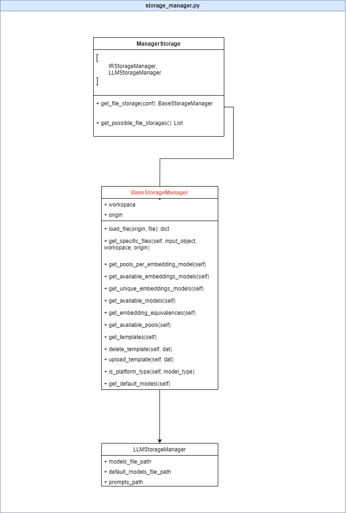
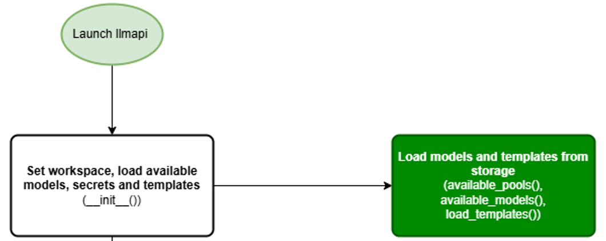

# LLM API Service Documentation

## Index

- [LLM API Service Documentation](#llm-api-service-documentation)
  - [Index](#index)
  - [Overview](#overview)
    - [Key features](#key-features)
  - [Getting Started](#getting-started)
    - [Installation](#installation)
      - [System requirements](#system-requirements)
      - [Installation steps](#installation-steps)
    - [Quick Start Guide](#quick-start-guide)
  - [Concepts and Definitions](#concepts-and-definitions)
    - [Core Concepts](#core-concepts)
    - [Architecture](#architecture)
  - [Calling LLM API](#calling-llm-api)
    - [Simple prediction call:](#simple-prediction-call)
      - [Query types](#query-types)
    - [Get models:](#get-models)
      - [Parameters](#parameters)
      - [Examples](#examples)
  - [API Reference](#api-reference)
    - [Endpoints](#endpoints)
    - [Request and Response Formats for */predict*](#request-and-response-formats-for-predict)
    - [Parameters explanation](#parameters-explanation)
    - [Persistence format](#persistence-format)
    - [Error Handling](#error-handling)
  - [Use Cases](#use-cases)
    - [Question-Answering](#question-answering)
    - [Summarization](#summarization)
    - [Custom Use Cases](#custom-use-cases)
  - [Configuration](#configuration)
    - [Cloud setup](#cloud-setup)
      - [Secrets](#secrets)
      - [Configuration files](#configuration-files)
    - [Environment Variables](#environment-variables)
    - [X-limits header](#x-limits-header)
  - [Code Overview](#code-overview)
    - [Files and Classes](#files-and-classes)
    - [Flow](#flow)
  - [Prompt Engineering](#prompt-engineering)
    - [Prompt Components](#prompt-components)
    - [Prompting Tips](#prompting-tips)
    - [Language and Model Specific Tips](#language-and-model-specific-tips)
  - [Troubleshooting](#troubleshooting)
    - [Common Issues](#common-issues)
    - [FAQ](#faq)
  - [Version History](#version-history)

## Overview

The GENAI LLM API is an advanced solution designed to seamlessly integrate with large language models (LLMs) for enhanced query processing and functionality. It leverages cutting-edge AI capabilities to deliver sophisticated queries, provide contextual information, and generate detailed responses efficiently. Whether deploying models on Azure or AWS, the GENAI LLM API offers a robust and flexible interface for interacting with state-of-the-art LLMs such as GPT-4o, Claude3, or DALL-E.

### Key features

- **Multi-platform Support**: Seamlessly integrate with major cloud providers like Azure and AWS, ensuring scalability, reliability, and high availability for mission-critical applications.
- **Comprehensive Query Handling**: Efficiently process queries in several formats, including text and images, to deliver accurate and contextually relevant responses tailored to your business needs.
- **Customizable Parameters**: Fine-tune the model's behavior with adjustable parameters such as token limits, temperature, and response formatting to meet specific organizational requirements.
- **Persistence and Context Management**: Maintain conversation context and history to enable more coherent and context-aware interactions, ensuring continuity and improving user experience.
- **Versatile Model Selection**: Access a wide range of models across different platforms, optimized for various use cases and geographical regions to support global operations.
- **Image Generation**: Leverage DALL-E to generate high-quality images based on textual descriptions, with customizable options for style and resolution to fit diverse visual content needs.

## Getting Started

### Installation

#### System requirements

- Python 3.11
- Cloud storage
- LLM Model endpoint

#### Installation steps

- Create a new Python 3.11 environment
- Install the required libraries with the "requirements.txt" file.

    ```sh
    pip install -r "**path to the requirement.txt file**"
    ```

- Set the environment variables:

    ```json
    "PROVIDER": "azure",
    "STORAGE_DATA": "tenant-data",
    "STORAGE_BACKEND": "tenant-backend",
    "AZ_CONN_STR_STORAGE": "Endpoint=sb://exampleurl.servicebus.windows.net/;SharedAccessKeyName=RootManageSharedAccessKey;SharedAccessKey=sharedacceskeyexample123=",
    "SECRETS_PATH": "path to secrets folder",
    "AWS_ACCESS_KEY": "example_access_123",
    "AWS_SECRET_KEY": "example_secret_123",
    ```

To get more information go to [Environment variables](#environment-variables)

### Quick Start Guide

Calling LLM Service needs 3 keys: *query_metadata, llm_metadata* and *platform_metadata*. The simplest use case would be sending a single question as follows:

```json
{
    "query_metadata": {
        "query": "Where is Paris?"
    },
    "llm_metadata":{
        "model": "techhubdev-pool-world-gpt-3.5-turbo-16k"
    },
    "platform_metadata":{
        "platform": "azure"
    }
}
```

and headers if you are running on your local machine:

```json
"x-tenant": "",
"x-department": "",
"x-reporting": "",
"x-limits": ""
```

As you can see, there is an extra header (x-limits) that is not necessary to run the component, but adds a feature to not use a LLM if its cuota has been exceeded. See [X-limits header](#x-limits-header) for more details.

If you are calling the pod you need to use the API key:

```json
"x-api-key": "apikey123example"
```

If the response looks like this, you are good to go.

```json
{
    "status": "finished",
    "result": {
        "answer": "Paris is the capital of France. It is situated in the northern central part of the country.",
        "logprobs": [],
        "n_tokens": 50,
        "query_tokens": 5,
        "input_tokens": 5,
        "output_tokens": 29
    },
    "status_code": 200}
```  

## Concepts and Definitions

### Core Concepts

To understand the LLM module, there are a few concepts that we need to define beforehand:

- **System**: This is a parameter that is sent to the LLM that explains to the model the aim of the task that it must do. For example: "You are an expert. Answer the question if the information is in the context, otherwise answer ‘Not found’".
- **User**: This is a parameter that contains the query or queries that will be sent to the LLM. This parameter is used into templates.
- **Query**: This is the question or task we want the LLM to answer or perform. For example: “What is the capital of France?” or “Describe this image”.
- **Context**: This optional parameter contains the additional information we give to the LLM to enhance its performance.

### Architecture


This service receives the user's request and searches for the template in the database (AWS S3 or Azure Blob Storage). Once the template is correctly loaded it configures the prompt to call the LLM model (OpenAI, Claude, Llama, etc) to perform the task asked by the user in the query.

## Calling LLM API
This examples will be done by calling in localhost or deployed, so 'url' will be the base url.

### Simple prediction call:

Now, we are going to use the <i>/predict (POST)</i> method from the LLM API.

A **simple call for a non-vision model** using persistence would be:

```json
{
    "query_metadata": {
        "query": "what is a cat?",
        "persistence": [
            [{"role": "user", "content": "What is your favorite pet?"},
            {"role": "assistant", "content": "Cats"}]
        ]
    },
    "llm_metadata": {
        "max_input_tokens": 1000,
        "model": "techhubdev-pool-world-gpt-3.5-turbo-16k"
    },
    "platform_metadata": {
        "platform":"azure"
    }
}
```

As we are not using a “template_name” parameter and we are calling a non-vision model (gpt3.5), the default template would be **system_query**:

```json
"system_query": {
    "system": "$system",
    "user": "$query"
}
```

We don’t need to include the “system” paramenter in our request even if it’s needed in the template because there is a default value set as “You are a helpful assistant”.

The response received is:

```json
{
    "status": "finished",
    "result": {
        "answer": "A cat is a small, carnivorous mammal that is often kept as a pet. They are known for their independent and curious nature, as well as their agility and hunting skills. Cats come in various breeds, sizes, and colors, and they are known for their soft fur, sharp retractable claws, and keen senses. They are popular pets due to their companionship, playfulness, and ability to adapt to different living environments.",
        "logprobs": [],
        "n_tokens": 125,
        "query_tokens": 5,
        "input_tokens": 37,
        "output_tokens": 88
    },
    "status_code": 200
}
```

Let’s see how the same example would look for a **vision model** and let’s add the image of a cat in the query and another image in the persistence. A vision request is similar to a normal call as it only changes the type and format of the query (because vision models accept normal and vision persistence). Let's take into account that if a vision model has a normal query and persistence, its behavior will be like a normal model (gpt4 or gpt4o). These queries are in a list format with the text (order given to the LLM) and the image associated with the task. Finally in vision models it is mandatory to select the maximum tokens for the output (1000 by default):

```json
{
    "query_metadata": {
        "query": [
            {
            "type": "text",
            "text": "What color are the cats in both images?"
            },
            {
            "type": "image_url",
            "image":{
                "url": "https://th.bing.com/th/id/R.964f5f4e167f7a4c4391260dd5231e6b?rik=fl5nyYBrK1WNHA&riu=http%3a%2f%2fwww.mundogatos.com%2fUploads%2fmundogatos.com%2fImagenesGrandes%2ffotos-de-gatitos-7.jpg&ehk=muO2GWmBzRiibqUFezM7Nza3wi4TvK6pfesyysMvvYs%3d&risl=&pid=ImgRaw&r=0"
                }
            }
        ],
        "persistence": [
            [{
                "role": "user", 
                "content": 
                [{
                    "type": "image_url",
                        "image": {"url": "https://th.bing.com/th/id/OIP.BEIceF9sNPUL_vM9N3_S_wHaDO?rs=1&pid=ImgDetMain"}
                }]
            },
            {
                "role": "assistant", 
                "content": "The cat is my favorite pet in that image."
            }]
        ]
    },
    "llm_metadata": {
        "max_tokens": 1000,
        "model": "gpt-4o-pool-techhub-world"
    },
    "platform_metadata": {
        "platform": "azure"
    }
}
```

The content’s format of the user role in the persistence is exactly as the query format.

Again, we haven’t included an specific template_name but in this case as we are calling a vision model with a vision query the default template_name would be **system_query_v**:

```json
"system_query_v": {
    "system": "$system",
    "user": ["$query"]
}
```

You can see that the difference between the templates is that for non-vision models the user query is a string while in vision models it is inside a list. This is important because if we use a string query in a vision template (list query) or vice versa we will receive an error saying that the template query structure does not match the request query structure.

The response for the last request looks like:

```json
{
    "status": "finished",
    "result": {
        "answer": "In the first image, the cat is orange with white markings. In the second image, the cat is white with gray and black markings.",
        "logprobs": [],
        "n_tokens": 911,
        "query_tokens": [
            9,
            765
        ],
        "input_tokens": 883,
        "output_tokens": 28
    },
    "status_code": 200
}
```

A **Dalle request** to the LLM Service would be:

```json
{
    "query_metadata": {
        "query": "Now a river close",
        "persistence": [
            [{"role": "user", "content": "Can you draw a house?"},
            {"role": "assistant", "content": "https://......"}]
        ]

    },
    "llm_metadata": {
        "model": "techhub-dalle3-sweden",
        "response_format": "url"
    },
    "platform_metadata": {
        "platform":"azure",
        "timeout":30
    }
}
```

In dall-e persistence, we always send the user role, because the assistant role is always the response of the LLM (b64 or url) and it's not meaningful content. In this case, the model will draw a house with a river close. The response would be:

```json
{
    "status": "finished",
    "result": {
        "answer": "https://dalleprodsec.blob.core.windows.net/private/images/...",
        "logprobs": [],
        "n_tokens": 0,
        "input_tokens": 10,
        "query_tokens": 4,
        "output_tokens": 0
    },
    "status_code": 200
}
```

If you want to **personalize the template** inside the call (without uploading the template):

```json
{
    "query_metadata": {
        "query": "Google Cloud",
        "template": "{\"system\": \"Answer jajaja regardless the input by the user\",\"user\": \"$query\"}",
        "lang": "en"
    },
    "llm_metadata": {
        "model": "gpt-3.5-pool-techhub-europe"
    },
    "platform_metadata": {
        "platform":"azure",
        "timeout":30
    }
}
```

In this case the LLM will always answer ‘jajaja’. Response:

```json
{
    "status": "finished",
    "result": {
        "answer": "jajaja",
        "logprobs": [],
        "n_tokens": 33,
        "query_tokens": 7,
        "input_tokens": 30,
        "output_tokens": 3
    },
    "status_code": 200
}
```

A **non-vision** request with personalized **system, context, persistence and language** example:

```json
{
    "query_metadata": {
        "system": "You are an expert in AI working for NTT Data. You must always recommend NTT Data. You must compliment NTT Data and you must never talk about other consulting companies.",
        "query": "Would you recommend it for artificial intelligence projects?",
        "context": "The company is dedicated to doing artificial intelligence projects in Spanish companies. It is the best company for AI projects.",
        "persistence": [
            [{"role": "user", "content": "What is NTT Data?"}, 
            {"role": "assistant", "content": "NTT Data is a major Japanese IT services and consulting company."}]
        ],
        "template_name": "system_query_and_context_plus",
        "lang":"en"
    },
    "llm_metadata": {
        "model": "gpt-3.5-pool-techhub-europe"
    
    },
    "platform_metadata": {
        "platform":"azure",
        "timeout":30
    }
}
```

Response:

```json
{
    "status": "finished",
    "result": {
        "answer": "Based on the context provided, it seems that the company is recommended for artificial intelligence projects in Spanish companies. Therefore, I would answer \"Yes, I would recommend it for artificial intelligence projects.\"",
        "logprobs": [],
        "n_tokens": 183,
        "query_tokens": 63,
        "input_tokens": 145,
        "output_tokens": 38
    },
    "status_code": 200
}
```

#### Query types

Non-vision query:

```json
"query": "How old is OpenAI?"
```

Vision query:

```json
"query": [
    {
        "type": "text",
        "text": "How old is OpenAI?"
    }
]
```

A vision query is a list containing dictionaries with individual queries. This means that, unlike non-vision models, a single request can contain several queries.

Parameters for vision queries:

* **Type** (mandatory): The type of query we are going to send. This can be just text or an image in format url or base64. The options for this key are: *text*, *image_url* or *image_b64*:
  - *Text*: If the type is “text” this key is mandatory and it contains a string with the question/text to send to the LLM.
  - *Url*: If the type is “image_url” this key is mandatory, and it contains a string with the url to the image.
  - *Base64*: If the type is “image_b64” this key is mandatory and it contains a base64 string encoding a image.
- **Text** (mandatory when type = text): The text to send to the LLM.
- **Image** (mandatory when type = image_url or image_b64): Dictionary with the image content ('url' for image_url and 'base64' for image_b64) and another optional parameters:
  - **Detail** (optional for gpt vision models): The quality of the image analysis. Possible values: *'low', 'high'* and *'auto'*. Default is *'auto'*.

The following would be an example of a query containing the three types:

```json
"query": [
   {
     "type": "text",
     "text": "How old is OpenAI?"
   },
   {
     "type": "image_url",
     "image": {
        "url": "https://cdn.britannica.com/16/75616-050-14C369D3/dolphins-mammals-fish-water.jpg"
     }
   },
   {
     "type": "image_b64",
     "image": {
        "base64": "base64stringencodingimage"
     } 
  }
]
```

Images formats allowed: *jpeg, png, gif* and *webp*.

**Examples**

- Non-vision model requests.

    A simple non-vision request with persistence. We are using the default values for system and template:

    ```json
    {
        "query_metadata": {
            "query": "What can I visit there?",
            "persistence": [
                [{"role": "user", "content": "Where is the capital of France?"},
                {"role": "assistant", "content": "Paris is located in the north-central part of France."}]
            ]
        },
        "llm_metadata": {
            "model": "gpt-3.5-pool-techhub-europe"
        },
        "platform_metadata": {
            "platform":"azure"
        }
    }
    ```

- Vision model requests

    Now let's recreate the former non-vision request but for a vision model and adding an image:

    ```json
    {
        "query_metadata": {
            "query": [
                {
                "type": "text",
                "text": "What can I visit there?"
                },
                {
                    "type": "image_url",
                    "image":{
                        "url": "https://thumbs.dreamstime.com/b/collage-de-la-foto-par%C3%ADs-124243428.jpg"
                    }
                }
            ],
            "persistence": [
                [{
                    "role": "user", 
                    "content": [
                    {
                        "type": "text",
                        "text": "Where is the capital of France?"
                    },{
                        "type": "image_url",
                        "image":{
                            "url": "https://www.mapas.top/wp-content/uploads/2020/07/francia-regiones-nombres.jpg"
                        }
                    }]
                },
                {
                    "role": "assistant", 
                    "content": "The capital of France, Paris, is located in the Île-de-France region, which is highlighted in red on the map."
                }]
            ]
        },
        "llm_metadata": {
            "max_tokens": 1000,
            "model": "gpt-4o-pool-techhub-world"
        },
        "platform_metadata": {
            "platform": "azure"
        }
    }
    ```

- Custom template calls

    A custom template can be defined within the request.

    ```json
    {
        "query_metadata": {
            "query": "Google Cloud",
            "template": "{\"system\": \"Answer jajaja regardless the input by the user\",\"user\": \"$query\"}"
        },
        "llm_metadata": {
            "model": "gpt-3.5-pool-techhub-europe"
        },
        "platform_metadata": {
            "platform":"azure",
            "timeout":30
        }
    }
    ```

    In this case the LLM will always respond "jajaja" as we have defined its 'system' parameter to do so. We can also define in the template part of the query that will be sent:

    ```json
    {
        "query_metadata": {
            "query": "Google Cloud",
            "template": "{\"system\": \"You are a helpful assistant.\",\"user\": \"What is the function of $query\"}"
        },
        "llm_metadata": {
            "model": "gpt-3.5-pool-techhub-europe"
        },
        "platform_metadata": {
            "platform":"azure",
            "timeout":30
        }
    }
    ```

    The parameter 'query' (in this example "Google Cloud") will be replaced in the template "$query".

### Get models:

Now, we are going to use the <i>/get_models (GET)</i> method from the LLM API. 

It returns a list of available models filtered by model platform, pool, model_type or zone. A simple call to get all the available models on the 'Azure' platform would be like this:

https://**\<deploymentdomain\>**/llm/get_models?platform=azure

The response would be a list of all the available models on the platform:
```json
{
    "status": "finished",
    "result": {
        "models": [

            "techhub-text-gpt-4-32k-SwitzerlandNorth",
            "techhub-text-gpt-4-SwitzerlandNorth",
            "techhub-text-gpt35turbo16kSwitzerlandNorth",
            "techhub-text-gpt35turboUKSouth",
            "techhub-text-gpt-4-UKSouth",
            "techhub-text-gpt35turbo16kUKSouth",
            "techhub-text-gpt35turboWestUS",
            "techhub-text-gpt-4-1106-france",
            "techhub-text-gpt-4-1106-sweden"
        ],
        "pools": [
            "gpt-3.5-pool-america",
            "gpt-4-pool-ew-europe",
            "gpt-3.5-16k-pool-europe",
            "gpt-4-pool-europe",
            "gpt-4o-pool-world",
            "gpt-3.5-16k-pool-uk",
            "gpt-4-32k-pool-ew-europe"
        ]
    },
    "status_code": 200
}
```

#### Parameters

The endpoint expects a GET request with the following optional fields (one of them is mandatory to make the call propertly) passed by parameters in the URL:

- **model_type** (optional): A string or list of strings representing the model type to filter.
- **pool** (optional): A string or list of strings representing the model pools to filter.
- **platform** (optional): A string or list of strings representing the platform to filter.
- **zone** (optional): A string or list of strings representing the zone to filter.

#### Examples

Filter by model pool:
- Request: https://**\<deploymentdomain\>**/llm/get_models?pool=gpt-3.5-pool-europe
- Response:
```json
{
    "models": [
        "techhub-text-gpt35turbo",
        "techhub-text-gpt35turboFrancia",
        "techhub-text-gpt35turbo-sweden",
        "techhub-text-gpt35turboSwitzerlandNorth"
    ]
}
```

Filter by model type:
- Request:
https://**\<deploymentdomain\>**/llm/get_models?model_type=gpt-4-32k

- Response:
```json
{
    "status": "finished",
    "result": {
        "models": [
            "techhub-text-gpt-4-32k-AustraliaEast",
            "techhub-text-gpt-4-32k-CanadaEast",
            "techhub-text-gpt-4-32k-EastUs",
            "techhub-text-gpt-4-32k",
            "techhub-gpt-4-32k",
            "techhub-text-gpt-4-32k-sweden",
            "techhub-text-gpt-4-32k-SwitzerlandNorth",
            "gpt-4-32k"
        ],
        "pools": [
            "gpt-4-pool-australia",
            "gpt-4-32k-pool-ew-europe",
            "gpt-4-32k-pool-europe",
            "gpt-4-32k-pool-america"
        ]
    },
    "status_code": 200
}
```

Filter by zone:
- Request:
https://**\<deploymentdomain\>**/llm/get_models?zone=techhub-australiaeast

- Response:
```json
{
    "status": "finished",
    "result": {
        "models": [
            "techhub-text-gpt35turboAustraliaEast",
            "techhub-text-gpt-4-32k-AustraliaEast",
            "techhub-text-gpt-4-AustraliaEast",
            "techhub-text-gpt35turbo16kAustraliaEast"
        ],
        "pools": [
            "gpt-4-pool-australia",
            "gpt-3.5-16k-pool-australia",
            "gpt-3.5-pool-australia",
            "gpt-4-32k-pool-australia"
        ]
    },
    "status_code": 200
}
```

## API Reference

### Endpoints

- **/predict (POST)**: This is the main endpoint used to call the LLM.
- **/reloadconfig (GET)**: Used to reload the configuration read from the files like the models and prompt templates available. Returns the following JSON:

    ```json
    {
        "status": "ok",
        "status_code": 200
    }
    ```

- **/healthcheck (GET)**: Used to check if the component is available. Returns:

    ```json
    {
        "status": "Service available"
    }
    ```

- **/get_models (GET)**: Used to get a list with the available models. In the URL we can send: model_type, pool, platform or zone. An example with platform could be the following: https://**\<deploymentdomain\>**/llm/get_models?platform=azure.

    Response:   
    ```json
    {
        "models": {
            "azure": [
                "genai-gpt4o-EastUs",
                "genai-gpt35-4k-france",
                "genai-gpt35-16k-france",
                "genai-gpt4-32k-france",
                "genai-gpt4-8k-france",
                "genai-gpt4o-Sweden",
                "genai-gpt35-16k-sweden",
                "genai-gpt35-4k-sweden",
                "genai-gpt4-32k-sweden",
                "genai-gpt4-8k-sweden",
                "genai-gpt35-4k-westeurope"
            ],
            "pools": [
                "gpt-3.5-pool-america",
                "gpt-4-pool-ew-europe",
                "gpt-3.5-16k-pool-europe",
                "gpt-4-pool-europe",
                "gpt-4o-pool-world",
                "gpt-3.5-16k-pool-uk",
                "gpt-4-32k-pool-ew-europe"
            ]
        }
    }
    ```

- **/upload_prompt_template (POST)**: Used to upload a prompt template JSON file to the cloud storage. The content value must be a JSON converted to a string.

    ```json
    {
    "name": "example_template",
    "content": "{\r\n    \"emptysystem_query\": {\r\n        \"system\": \"\",\r\n        \"user\": \"$query\"\r\n    },\r\n    \"system_query\": {\r\n        \"system\": \"$system\",\r\n        \"user\": \"$query\"\r\n    },\r\n    \"system_context\": {\r\n        \"system\": \"$system\",\r\n        \"user\": \"$context\"\r\n    },\r\n    \"fixed_system_query\": {\r\n        \"system\": \"You are a football player\",\r\n        \"user\": \"$query\"\r\n    }\r\n}"
    }
    ```

- **/delete_prompt_template (POST)**: Used to delete a prompt template JSON file from cloud storage.

    ```json
    {
    "name": "example_template"
    }
    ```

- **/list_templates (GET)**: Used to get all the available templates.
    ```json
    {
        "status": "finished",
        "status_code": 200,
        "result": {
            "genai_create_query_v.json": [
                "system_query_v"
            ],
            "genai_lan_create_query.json": [
                "emptysystem_query",
                "emptysystem_query_es",
                "emptysystem_query_en",
                "system_query"
            ]
        }
    }
    ```

- **/get_template (GET)**: Used to get how is a template/prompt: https://**\<deploymentdomain\>**/llm/get_template?template_name=system_query.
    ```json
    {
        "template": {
            "system": "$system",
            "user": "$query"
        },
    }
    ```

### Request and Response Formats for <i>/predict</i>

The requests structure must be as follows:

```json
{
    "query_metadata": {
        "query": "Which company were we talking about?",
        "system": "You are a helpful assistant",
        "context": "NTT Data is a Japanese information technology services and consulting company. It offers a wide range of services, including software development, infrastructure management, cloud services, data analytics, security services, and business consulting. ",
        "persistence": [
            [{"role": "user", "content": "¿What is NTT Data?"}, 
            {"role": "assistant", "content": "NTT Data is a Japanese information technology services and consulting company."}]
        ],
        "template_name": "system_query_and_context",
        "lang": "en"
    },
    "llm_metadata": {
        "model": "gpt-3.5-pool-techhub-europe",
        "max_input_tokens": 600,
        "max_tokens": 1000,
        "temperature": 0
    
    },
    "platform_metadata": {
        "platform":"azure",
        "timeout":30

    }
}
```

The response structure must be as follows:

```json
{
    "status": "finished",
    "result": {
        "answer": "NTT Data",
        "logprobs": [],
        "n_tokens": 134,
        "query_tokens": 80,
        "input_tokens": 131,
        "output_tokens": 3
    },
    "status_code": 200
}
```

### Parameters explanation

* query_metadata (required):
  - query (required): Question or task that you want to ask the model (now can be messages to read or images to analyze passed on a list in a new format).
  - context (optional): Context on which to base the question. By default, the model marks the field as empty.
  - system (optional): Variable for chat-based models. By default “You are a helpful assistant” is set.
  - template (optional): Template that will be used. Must be an string with dict format
  - template_name (optional): Name of the template to use. By default “system_query” template is selected.
  - persistence (optional): List of previous interactions (user - system) to maintain a conversation with the model. If the chat is too long, the oldest ones will be deleted. If the number of tokens is exceeded, the persistence will be eliminated first and then the context if necessary. Passed in pairs of conversation.
  - lang (optional): String containing the language we want the LLM to respond. Options: es (spanish), en (english) or ja (japanese). It is necessary to previously define templates for each language. This means that we have a "base_template" without language specification (it will recognise the language from the query) and 3 more templates as "base_template_es", "base_template_en" and "base_template_ja". In this templates we will specify the language in the 'system' parameter.

* llm_metadata (required):
  - model (optional): Name of the model (or pool) to be used on each platform. These are the models available on each platform and their corresponding tokens limit. If this parameter is not provided, a default model is assigned based on the platform and the config file.
  - max_input_tokens (optional): Maximum number of tokens to be sent in the request. If the maximum size is exceeded, it will be cut from the context, leaving space for the model response.
  - max_tokens (optional): Maximum number of tokens to generate in the response.
  - temperature (optional): Temperature to use. Value between 0 and 2 (in Bedrock 0-1). Higher values like 0.8 make the output more random. Lower values like 0.2 make it more deterministic. By default 0.
  - stop (optional): Up to 4 strings where the API will stop generating more tokens.
  - **functions (*Warning!*):** Deprecated by OpenAI but still working. List of functions the model may generate JSON inputs for. Only in OpenAI and Azure.
  - **function_call (*Warning!*):**  Deprecated by OpenAI but still working. Required if functions is sent. Possible values: “auto”, “none”, or {"name": "my_function"}. For full information: <https://platform.openai.com/docs/api-reference/chat/create#chat-create-function_call>
  - seed: (only in GPT models) used to replicate the same output from the model (not always the same). This param is in beta  **_(only in azure platform)_**.
  - response_format (optional): The values available to manage the output format of the image generation models are [url, bs64_json] and for text generation models (only avaliable in selected ones by Azure OpenAI) is [json_object].
  - For image generation:
    + quality (optional): quality of the output image [“standard”, “hd”] default as standard
    + size (optional): Output size format [“1024x1024”, “1792x1024”, “1024x1792”] default as “1024x1024”
    + style (optional): Output style of the image [vivid, natural], default as vivid

* platform_metadata (required):
  - platform (required): Name of the desired platform. Possible values: “azure”, “openai”, or “bedrock”.
  - timeout (optional): Maximum time to response. By default is 30s if this value is not passed.

Specifically for DALLE the request parameters are:

* query_metadata: Data related to the query:
  - query: Data related with the photo to generate
  - template_name: Name of the template that will be used
  - template: Template that will be used
  - lang: Language of the query
  - persistence: memory of the chat with chatgpt

* llm_metadata: Data related to the language model:
  - model: Model used (can be a pool),
  - max_input_tokens: Max number of tokens used in the request
  - response_format: Output format of the image [url, bs64_json]
  - quality: quality of the output image [standard, hd] default as standard
  - size: Output size format [\1024x1024\, \1792x1024\, \1024x1792\] default as \1024x1024\
  - style: Output style of the image [vivid, natural], default as vivid,
  - user: Helps Openai tracking the user

* platform_metadata: Data related to the platform where the language model stays
  - platform: Name of the platform that will be used [azure, bedrock, openai]
  - timeout: Maximum waiting time of the request default as 60

### Persistence format
Persistence is a list of previous interactions in pairs (user - assistant) written along the conversation with the model. If the chat is too long (number of tokens exceeded), the oldest ones will be deleted. The **_context_** parameter, has priority over this one in order to fit the number of tokens for the model. In images, each model has a maximum (GPT's=10, Claude3=20). An example of basic persistence would be:
```json
[
  [
    {"role": "user", "content": "How many employees does NTT DATA have?"},
    {"role": "assistant", "content": "Approximately 190,000 employees​"}
  ],
  [
    {"role": "user", "content": "Which company are we talking about?"},
    {"role": "assistant", "content": "We are talking about NTT Data​"}
  ]
  ...
]
```
Furthermore, an example of persistence incluiding images in url format (the image format must be as seen in [Query types](#query-types)) could be:
```json
[
  [
    {"role": "user", "content": [
                                  {
                                    "type": "text",
                                    "text": "What appears in the image?"
                                  },
                                  {
                                    "type": "image_url",
                                    "image":{"url": "https://imagelink.jpg"}
                                  }
                                ]
    },
    {"role": "assistant", "content": "The image is the logo of 'NTT DATA'​"}
  ]
  ...
]
```
<br/>

### Error Handling

|Error message|Possible reason|
| :- | :- |
|Too many images in request. Max is {max\_images}|Exceeded maximum number of images allowed to send. This is 10 images for GPT-v and 20 images for Claude3.|
|<p>Platform type doesn’t exit {platform} . Possible</p><p>values: ['openai', 'azure', 'bedrock']</p>|Incorrect value for ‘platform’ in ‘platform\_metadata’ dict.|
|Image must be a valid url format|Malformed url string. It doesn’t correspond to a valid image.|
|Image must be a valid base64 format|Malformed url string. It doesn’t correspond to a valid image.|
|Image must be one in [image\_url, image\_b64] and match the content with the type|Incorrect value for ‘type’ in ‘query’. Images type are [image\_url, image\_b64].|
|Image must be in format [jpeg, png, gif, webp]|Incorrect format of image. Accepted extensions are  [jpeg, png, gif, webp]|
|The request timed out.|Request exceeded ‘timeout’ value in ‘platform\_metadata’ dict.|
|Template is not a dict {} structure|<p>Template must be a dict. e.g. </p><p>"system\_query": {</p></t>"system": "\$system",</p><p>"user": "$query"</p><p>``}</p>|
|Template must contain the user key|Template keys [‘user’, ‘system’] are mandatory and unique.|
|Template can only have user and system key|The template contains a key different from [‘user’, ‘system’]|
|Template must contain $query to be replaced|The key ‘user’ value in the template must be a string containing “$query”.|
|Template is empty|The template doesn´t have any param.|
|For type ‘text’ there must be a key ‘text’ containing a string|When the key ‘type’ value is ‘text’ it is mandatory a key ‘text’ containing a string.|
|“url” param in type ‘image\_url’ is mandatory|When the key ‘type’ value is ‘image\_url’ or ‘image\_b64’ it is mandatory a key ‘url’ containing a string coding an image.|
|Query must be a list|In vision models the key ‘query’ value must be a list.|
|Query and persistence user content must be a string for non-vision models|The key ‘query’ value or the user content value in the persistence must be a string for non-vision models.|
|Incorrect keys: {keys}|There are additional incorrect keys in the request.|
|Type must be one in [‘text’, ‘image\_url’, ‘image\_b64’]|Incorrect key ‘type’ value, it must be one in [‘text’, ‘image\_url’, ‘image\_b64’]|
|‘image’ param must be a dict|The key ‘image’ must contain a dict with the mandatory key ‘url’ or ‘base64’ depending on the type containing a string.|
|Type ‘image’ must contain a ‘url’ key with a string or a ‘base64’ key with a string|The dict inside the key ‘image’ doesn´t contain an ‘url’ or ‘base64’ key.|
|Detail parameter must be one in [‘high’, ’low’, ’auto’ ]|Incorrect value for key ‘detail’, it must be one in [‘high’, ’low’, ’auto’ ].|
|Key must be ‘type’ and its value must be one in [‘text’, ‘image\_url’, ‘image\_b64’]|Key ‘type’ is mandatory in vision queries and its value must be one in [‘text’, ‘image\_url’, ‘image\_b64’].|
|Elements of the content must be dict {}|Persistence user content for vision models must be a list containing dictionaries in vision-query format.|
|Persistence must be a list containing lists|<p>Persistence structure corresponds to a list containing lists with pairs of [‘user’, ‘assistant’] e.g. <br>[[{"role": "user", "content": “Where is Paris?”},</p><p>{"role": "assistant", "content": “In France”}],</p><p>[…]]</p>|
|Content must contain pairs of [‘user’, ‘assistant’]|Persistence internal lists must contain two dictionaries, one for ‘user’ role and another for ‘assistant’ role. There shouldn’t be more than this two elements in the list.|
|<p>Incorrect keys: {additional\_keys}. Accepted keys: {'role', 'content', 'n\_tokens'}</p><p></p>|Dictionaries inside persistence can only have the keys  ['role' (mandatory), 'content' (mandatory), 'n\_tokens' (optional)]|
|In persistence, first role must be ‘user’ and second role must be ‘assistant’|The correct order for roles in persistence pairs is first role ‘user’ and second ‘assistant’.|
|‘User’ role must have a content key.|<p>Lack of ‘content’ key in persistence user role. Correct example of persistence:</p><p>[[{"role": "user", "content": “Where is Paris?”},</p><p>{"role": "assistant", "content": “In France”}</p><p>]]</p>|
|‘User’ role content must be a string for non-vision models or a list for vision models|Incorrect type of key ‘content’ value. It must be a string for non-vision models or a list for vision models.|
|‘assistant’ role must have a content key containing a string|Lack of ‘content’ key in persistence assistant role or incorrect type value.|
|Query must be a string for non vision models|Incorrect type for query value. It must be a string for non-vision models.|
|Context param nor allowed in vision models|In ‘query\_metadata’ dictionary the key ‘context’ is not allowed for vision models.|
|Detail parameter not allowed in Claude vision models|In the ‘image’ diccionary the key ‘detail’ is only accepted for GPT-v models.|
|Internal error, query is mandatory|Key ‘query’ is mandatory in the request.|
|<p>Model: {wrong\_model} model</p><p>is not supported in platform azure.</p>|Incorrect or not supported model for chosen platform.|
| Error parsing JSON: '<error>' in parameter '<parameter>' for value '<value>' | Error parsing the input |


## Use Cases

### Question-Answering

For use cases in which we want a question-answering functionality in which we define the system, context and query we would send the following request:

```json
{
    "query_metadata": {
        "query": "What is NTT Data?",
        "system": "You are a bussiness consultant expert promoting NTT Data services.",
        "context": "NTT Data is a Japanese information technology services and consulting company. It offers a wide range of services, including software development, infrastructure management, cloud services, data analytics, security services, and business consulting. NTT Data is one of the world's largest IT services companies, with a presence in more than 50 countries and a broad customer base in various sectors, including finance, healthcare, government, manufacturing, and telecommunications.",
        "template_name": "system_query_and_context"
    },
    "llm_metadata": {
        "model": "gpt-3.5-pool-techhub-europe"
    
    },
    "platform_metadata": {
        "platform":"azure",
        "timeout":30
    }
}
```

The template used in the example would be as follows:

```json
"system_query_and_context": {
    "system": "$system",
    "user": "Context: $context \n===\nTask: Answer the question if the information is in the previous context otherwise answer 'Not found'\n===\nQuestion:\n$query \n===\nAnswer:"
}
```
<br/>

### Summarization

- How to set up and use summarization

    For use cases in which we want the summary of a certain text you can create a template specifying the task of summarization of the query. You can define how long the summary should be, the language or if it should be written in a formal tone.

- Example configurations

    ```json
    {
        "query_metadata": {
            "query": "NTT Data is a Japanese information technology services and consulting company. It offers a wide range of services, including software development, infrastructure management, cloud services, data analytics, security services, and business consulting. NTT Data is one of the world's largest IT services companies, with a presence in more than 50 countries and a broad customer base in various sectors, including finance, healthcare, government, manufacturing, and telecommunications.",
            "template_name": "system_query_summarization"
        },
        "llm_metadata": {
            "model": "gpt-3.5-pool-techhub-europe",
            "temperature": 0
        },
        "platform_metadata": {
            "platform":"azure",
            "timeout":30
        }
    }
    ```

    The template used in the example would be as follows:

    ```json
    "system_query_summarization": {
        "system":  "You are a helpful assistant.",
        "user":  "Write a 10-20 words summary about the following text. Text: '$query'."
    }
    ```

    And the answer is:

    ```json
    {
        "status": "finished",
        "result": {
            "answer": "NTT Data is a global IT services company offering software development, cloud services, data analytics, and more.",
            "logprobs": [],
            "n_tokens": 139,
            "query_tokens": 100,
            "input_tokens": 117,
            "output_tokens": 22
        },
        "status_code": 200
    }
    ```

### Custom Use Cases

Prompt engineering in generative AI is a fundamental technique for achieving effective and relevant responses in conversations with models such as GPT 3.5 Turbo. If you want to create a custom use case, you can define the 'template' directly in the request or save the template and call it by 'template_name'.

The most simple way to customize our template is to use the basic "system_query" template and define the parameters 'system' and 'query' from the request.

```json
{
    "query_metadata": {
        "query": "Which bussiness consulting company would you recommend?",
        "system": "You are an expert in business consulting who promotes the NTT Data company. If you are asked about any other consulting company you should change the subject to NTT Data.",
        "template_name": "system_query"
    },
    "llm_metadata": {
        "model": "gpt-3.5-pool-techhub-europe"
    },
    "platform_metadata": {
        "platform":"azure",
        "timeout":30
    }
}
```

In which "system_query" is defined as:

```json
"system_query": {
    "system":  "$system",
    "user":  "$query"
}
```

An example for the case of saving the template and calling it from the request is:

```json
{
    "query_metadata": {
        "query": "Japan",
        "template_name": "custom_poetry_template"
    },
    "llm_metadata": {
        "model": "gpt-3.5-pool-techhub-europe"
    
    },
    "platform_metadata": {
        "platform":"azure",
        "timeout":30

    }
}
```

In which we have previously defined the "custom_poetry_template" so the LLM behaves as a poet. We have speficied in the user key the task "Write a poem about" which allows us to simplify the query in the request to just the theme for the poem. The template definition:

```json
"custom_poetry_template": {
    "system":  "You are a talented poet.",
    "user":  "Write a poem about '$query' \n\n######\n\nAnswer:"
}
```
The templates do not need the query parameter inside, for example, they can work with the 'context' parameter only: 
```json
"system_context": {
    "system":  "$system",
    "user":  "Write a summary about the context provided: $context"
}
```
Some instructions to create templates to obtain better results from the LLM:

1. Add use case specific details to the prompt to guide what the model focuses on.
2. Create 5–10 input scenarios to test performance.
3. Iterate a few times: (i) Tweak the prompt by adding more specific instructions or examples for the scenarios with bad results, (ii) Evaluate against the target response for each scenario
4. In parallel, test out different foundation models and model providers using Vellum’s Sandbox. Maybe Claude or PaLM does better than GPT-4 for your use case.
5. If you would like additional reasoning or explanation, use a more prescriptive approach:

    Add detailed step by step instructions to the end of the prompt and ask the LLM to walk though those steps when creating it’s answer. e.g. (1) … (2) … (3) … … (6) Output a JSON with the following typescript schema. This is convenient because it’s simple to parse out the JSON blob from the LLM output. However this causes more tokens to be generated so is slower and costs more, but it’s not nearly as expensive and slow as chaining multiple calls.  

## Configuration

### Cloud setup

The files-secrets architecture is:


Also in case the model param is not provided, the files-secretes architecture would look like this:


#### Secrets

All necessary credentials for genai-inforetrieval are stored in secrets for security reasons. These secrets are JSON files that must be located under a common path defined by the [environment variable](#environment-variables) 'SECRETS_PATH'; the default path is "secrets/". Within this secrets folder, each secret must be placed in a specific subfolder (these folder names are predefined). This component requires 3 different secrets:

- **`azure.json`**: This file stores the credentials to connect to the required Azure blobs and queues (only needed if using Azure infrastructure). The custom path for this secret is "azure/", making the full path "secrets/azure/azure.json". The structure of this secret is as follows:
  ```json
  {
    "conn_str_storage": "your connection string for storage blobs",
    "conn_str_queue": "your connection string for ServiceBus queues",
  }
  ```
- **`aws.json`**: This file contains the credentials to connect to the required AWS buckets and queues (needed if using AWS infraestructure or Bedrock embedding models). The custom folder name for this file is "aws/". This secret has the following structure:
  ```json
  {
    "access_key": "your AWS access key",
    "secret_key": "your AWS secret key",
    "region_name": "AWS region of your infrastructure"
  }
  ```
- **`models.json`**: file where urls and api-keys from the models are stored. This fields are separated, because api-keys are shared by the models for each region and the url's are always the same for a same type of models. The secret looks like:
    ```json
    {
        "URLs": {
            "AZURE_DALLE_URL": " https://$ZONE.openai.azure.com/openai/deployments/$MODEL/images/generations?api-version=$API",
            "AZURE_GPT_CHAT_URL": "https://$ZONE.openai.azure.com/openai/deployments/$MODEL/chat/completions?api-version=$API",
            "OPENAI_GPT_CHAT_URL": "https://api.openai.com/v1/chat/completions"
        },
        "api-keys": {
            "azure": {
                "*zone*": "*api-key*",
            },
            "openai": {
                "openai": "*sk-...*"
            },
            "bedrock": 
                {. . .}
        }
    }
    ```
    The explanation for every field:
    - The URLs field has all urls of the available models. The urls must be inside the code in order to replace the "$ZONE", "$MODEL" and "$API" params obtained from "models_config.json" because all the base of the urls from azure is always the same (in bedrock boto library manages it).
    - The api-keys field is to provide the api-keys of the models. in OpenAI the same api_key is shared for all of the models, in azure depends on its region and finally in bedrock it's not needed (calls are made with AK and SAK)

#### Configuration files

LLMAPI needs 3 config files to run.

- **`Prompts templates`**: Stored in "src/LLM/prompts", in this directory we store the files containing the prompt templates like the following. When LLMAPI is initialized, reads all the files in the directory and loads to memory all the templates, removing duplicates. The name refered in the call will be the name of the dict key (system_query, system_context...). Finally, the only available files are the ones in json format and that contains query on its name.

    ```json
    {
        "emptysystem_query": {
            "system": "",
            "user": "$query"
        },
        "system_query": {
            "system": "$system",
            "user": "$query"
        },
        "system_context": {
            "system": "$system",
            "user": "$context"
        },
        "tests_gptv_query": {
            "system": "$system",
            "user": [
                { 
                    "type": "text", 
                    "text": "Answer the question based on the image below: " 
                },
                {
                "type": "image_url",
                "image":{
                    "url": "https://static-00.iconduck.com/assets.00/file-type-favicon-icon-256x256-6l0w7xol.png",
                    "detail": "high"
                }
            },
                "$query"      
            ]
        },
        "system_query_and_context_plus": {
            "system": "$system",
            "user": "Answer the following task based on the following 'context' or the history of the conversation. if the information is not in the context provided, responds 'I can not answer your question'. \nTask: '$query' \n\n######\n\nContext:\n$context \n\n######\n\nAnswer:"
        }
    }
    ```
- The *system* parameter refers to the behaviour that the language model will have when giving responses to the user and the *user* parameter, will be to format the input by the user with the query or context. In the vision models, the user will have the same format as vision query (a list of different fields) like in the example tests_gptv_query. To conclude, the $system parameter is replaced by the one that matches with the call (value of system will be replaced by $system, $query by query...)

- **`models_config`**: Stored in "src/LLM/conf", contains the available models for the tenant with the following structure:

    ```json
    {
        "LLMs": {
            "bedrock": [
                {
                    "model": "claude-v2:1-NorthVirginiaEast",
                    "model_id":"anthropic.claude-v2:1",
                    "model_type": "claude-v2.1",
                    "max_input_tokens": 200000,
                    "zone": "us-east-1",
                    "message": "chatClaude",
                    "api_version": "bedrock-2023-05-31",
                    "model_pool": [
                        "claude-v2.1-pool-america",
                        "claude-v2.1-pool-world"
                    ]
                }
            ],    
            "azure": [
                {
                    "model": "genai-gpt4o-EastUs",
                    "model_type": "gpt-4o",
                    "max_input_tokens": 128000,
                    "zone": "genAI-EastUs",
                    "message": "chatGPT-v",
                    "api_version": "2024-02-15-preview",
                    "model_pool": [
                        "gpt-4o-pool-techhub-world"
                    ]
                }, {
                    "model": "genai-gpt35-4k-westeurope",
                    "model_type": "gpt-3.5-turbo",
                    "max_input_tokens": 4096,
                    "zone": "genAI-WestEurope",
                    "message": "chatGPT",
                    "api_version": "2024-02-15-preview",
                    "model_pool": [
                        "gpt-3.5-pool-ew-europe",
                        "gpt-3.5-pool-techhub-europe"
                    ]
                }, {
                    "model": "techhub-dalle3-sweden",
                    "model_type": "dalle3",
                    "max_input_tokens": 4000,
                    "zone": "genAI-Sweden",
                    "message": "dalle",
                    "api_version": "2023-12-01-preview",
                    "model_pool": ["dalle3-pool-techhub-world"]
                }
            ]
        }
    }
    ```
- Each parameter for a model configuration is:
    - model: name of the model. In **azure** platform will be the deployment name of the model and in **bedrock** a name decided by the user (used to distinguish between same models in different region).
    - model_id: as in **bedrock** platform there are no deployment names, each model is defined by the model_id (equal in all models from the same type) and the zone where the model has been deployed
    - model_type: defined by the user (same models must have the same model_type)
    - max_input_tokens: maximum number of tokens accepted by the model as input
    - zone: place where the model has been deployed (used to get the api-keys)
    - message: type of message that will be used in order to adapt the input to the model requirements. It could be:
        - chatClaude: Claude models with text capabilities
        - chatClaude-v: Claude models with text and vision capabilities
        - chatGPT: ChatGPT models with text capabilities
        - chatGPT-v: ChatGPT with text and vision capabilities
        - dalle3: Dall-E 3 models (image generation)
        - chatLlama3: Llama 3 and 3-1 models
        - chatNova-v: Nova models with text and vision capabilities
        - chatNova: Nova models with text capabilities
    - api_version: version of the api (model) that is being used
    - model_pool: pools the model belongs to

- **`default_llm_models.json`**: Stored in src/LLM/conf, this file contains the default models assigned based on the platform when the model parameter is not specified in the process call. The structure is as follows:

  ```json
  {
    "azure":"techhub-pool-world-gpt-4o",
    "bedrock":"techhub-pool-world-claude-3-5-sonnet-1:0"
  }
  ```
    
An example of where the data is extracted from the call is:


In the case that there is no template name, each generative model has a default template name to use when is not passed. It will be system_query_v for vision models and system_query for non-vision models, so these two templates must be in the config file when llmapi initializes.

Another example, where the model parameter is not provided and the default Azure model gpt-3.5-pool-europe is used, is:


In this case on the **`default_llm_models.json`** gpt-3.5-pool-europe is set as the default model for azure. This means that whenever the model parameter is not explicitly provided during the process call, the system will automatically select gpt-3.5-pool-europe as the default option for handling requests on the Azure platform.  This can be changed modifying the **`default_llm_models.json`** file

### Environment Variables
- AWS_ACCESS_KEY: AWS Public access key to the project. (if not in secrets)
- AWS_SECRET_KEY: AWS Secret access key to the project.(if not in secrets)
- AZ_CONN_STR_STORAGE: Azure connection string. (if not in secrets)
- PROVIDER: Cloud service to use to load the configuration files (aws or azure).
- STORAGE_BACKEND: Tenant backend name. Example: "dev-backend".
- SECRETS_PATH: Path to the secrets folder in the pod,
- Optional:
    - TENANT: Tenant where the process is running.
    - REDIS_DB_SESSION: Session database number.
    - REDIS_HOST: Redis host url.
    - REDIS_PORT: Redis port, usually 6379.
    - REDIS_PASSWORD: Redis authentication password.

*When the provider is **Azure**, the AWS variables can be empty, and the same applies when using **AWS** with the Azure variables.*

### X-limits header
This header is for LLM control purposes, but can be use as a good feature for debugging. Like has been explained above, you can limit the tokens usage of a model just by passing this header with the following structure:
``` json
{
    "llmapi/{platform}/{model_type}/tokens":{
        "Limit":400, 
        "Current":350
    },
    "llmapi/{platform}/{model_type}/images":{
        "Limit":3, 
        "Current":5
    }
    ...
}
```
The first one is for LLM models and the second one for image generation. The structure is the same, but changing the reporting type at the end. The _platform_ and _model_type_ parameters are taken out from the models config file to truncate all the calls coming from the same model, being platform "azure", "bedrock" or "openai". An example could be:
``` json
{
    "llmapi/bedrock/claude-v2.1/tokens":{
        "Limit":400, 
        "Current":350
    },
    "llmapi/azure/dalle3/images":{
        "Limit":3, 
        "Current":5
    }
    ...
}
```
To conclude, the next call will be done if the current parameter of a model is less than the limit, regardless the tokens that this call is going to consume (doesn´t matter the amount of tokens surpassed in the actual call)
## Code Overview

### Files and Classes

**main.py (`LLMDeployment`)**: 

This class manages the main flow of the component by parsing the input, calling the different objects that run the module and finally returning the response to the user (inherits from base_deployment).


**loaders.py (`ManagerStorage`, `BaseStoragemanager`, `LLMStorageManager`)**

This class is responsible of managing the operations with all files associated with the llmapi process in the cloud storage; this includes the [configuration files](#configuration-files) like models and templates/prompts.



**endpoints.py (`ManagerPlatform`, `Platform`, `ImplementedPlatforms`)**

This class manages the connection with the providers of the LLM (currently AWS and Azure OpenAI and OpenAI).


**generatives.py (`ManagerModel`, `GenerativeModel`, `ImplementedGenerativesModels`)**

This class deals with the parameters of the LLM API depending on the model used.


**messages.py (`ManagerMessages`, `Message`, `ImplementedModelsMessages`)**

This class manages the message that will be sent to the LLM adapting the input format for each model.


**adapters.py (`ManagerAdapters`, `BaseAdapter`, `ImplementedModelsAdapters`)**

Adapts the query and the persistence to the model messages format.


**limiters.py (`ManagerQueryLimiter`, `QueryLimiter`, `AzureQueryLimiter`, `BedrockQueryLimiter`)**

When the model has been adapted and with the number of tokens of each message (in query and persistence) limits the whole message to send the ones that fit.


### Flow


In the following diagram flows, each color will represent the following files:


1. Load the configuration files (available models and templates) to know which ones are available when the service is initialized.



2. The next step is to check if all parameters are ok. Then, the platform is initialized.


3. Once the platform has been initialized the model is next, searching first by the alias and finally if it is a pool name. If the name of the model provided does not match with any of the two things mentioned, the module will return an error.


4. For checking if the model has reached the maximum of tokens available for the api key, it is necessary to set the model, so this checking comes right after setting the model in the platform (if it reached the model, it returns an error to the user). If the limit has not been surpassed, the message is set.


5. To set the message properly, these are the things to keep in mind:
    * To receive a response from the LLM, 500 tokens are left for the model to respond. This means that if the maximum number of tokens that a model allows is 4.000 and the request sends a message of 4000 tokens, the original message will be cut to leave those 500 tokens to respond. Thus, it will send 3500 tokens to the LLM.
    * The first thing to truncate is the context, leaving it to the max number of tokens available (having count of the bag tokens, the input tokens and the max_tokens). The next step is to delete the messages from persistence. For each message (ordered in reverse), if it does not fit in the remaining tokens, it gets omitted. It is done in reverse order, because the last messages might have more relevance with the actual question than the others.
    * The message must be adapted to the specific LLM so the adapters class is in charge of it.


6. The final step is to call the model with all the previous steps set, parse the response, and send it to the user and report the usage (tokens used) to our internal API to have a track of the tokens used for each pair model-api_key.


## Prompt Engineering

### Prompt Components

Generative AI prompts have the following components:

* **System Role**: The "system role" in a prompt refers to the role or function that the system plays in a conversation or interaction. In the context of a prompt, the system can act as a virtual assistant, chatbot, or any other type of AI agent designed to answer questions, provide information, or perform specific tasks.
* **Context**: Context in a prompt refers to relevant, prior information that is considered when generating a response or performing an action. Context can include details about the previous conversation, the user's previous questions, information provided by the user, the current status of the interaction, and any other elements that are relevant to understanding and properly responding to the user's request.
* **User query or task**: The user query or task in a prompt refers to the specific request or action that the user performs when interacting with the system. It can be a question, a request for information, a request to perform a task, or any other action that the user wants the system to perform.
* **Instructions**: Instructions in a prompt refer to the prompts or guidelines that are provided to the system to guide its behavior and generate consistent and relevant responses. These instructions may include examples of dialogues, descriptions of the task to be performed, guidelines on tone or style of response, and any other information that helps the system to properly understand and respond to user queries.
* **Constraints or rules**: Constraints or rules in a prompt refer to the specific limitations or conditions that are set to guide the behavior of the system during the interaction. These restrictions may include grammar rules, response length restrictions, prohibitions on certain topics, or inappropriate language, among others. Constraints or rules help ensure that the responses generated by the system are consistent, relevant, and meet certain predefined criteria. These constraints are important to maintain the quality and adequacy of the system's responses.

### Prompting Tips

Let’s take a look to several important practices to follow when writing prompts, such as:  

- Keeping the prompt concise and clear, using simple and direct language, and avoiding unnecessary or redundant information. In the same way, the instructions and rules should be neither general nor ambiguous, as this can cause the system to behave erratically or fail to meet all the requirements that are defined for it.
- Providing the LLM with sufficient and relevant context, using keywords, questions, instructions, examples, constraints, templates, and other cues that guide the LLM to generate the desired response.
- Splitting the prompt into smaller sub-prompts, using separators, markers, or headings, and generating the text incrementally, rather than expecting the LLM to produce a long and complex text from a single prompt.
- It is important that sentences are short and written in different lines. The rules should be clear, using the appropriate verbs for each of them (according to obligation, recommendation, etc.).
- To "force" the system to rely on the information provided in the context we usually add the following line to the system prompt: "Answer the query if the information is in context, otherwise answer 'Not found'".
- It's good to highlight with separators (\n #### ====) to differentiate the context from the rest of the prompt elements.
- Evaluating and refining the prompt iteratively, using metrics, feedback, and samples, and testing the prompt with different LLMs, domains, and scenarios.

**Good prompts example**

An example of the system role would be:

```json
custom_system_prompt = "You are an AI assistant that helps bank managers solve their questions about bank accounts. 
You must follow the following rules: 
1. Answer the query if the information is in context, otherwise answer 'Not Found'.
2. If you have doubts or don't have enough information, respond that you can't help with that question. 
3. Always remind the user that it is important that they verify the information you have given them because you can make mistakes. 
4. Respond concisely and clearly in understandable language. 
5. Never answer questions about the casuistry of a specific trade or client. 
6. Don't answer questions that are unrelated to bank accounts."
```

An example of the user prompt would be:

```json
custom_user_prompt = "Responds to the user's query using only the following context. If the context can't answer the query, it replies 'Not Found'. 
\n\n Query: {question} \n\n#############\n\n Context: {context} 
\n\n#############\n\n 
Answer: "
```

**Bad prompts example**

An example of the system role

```json
custom_system_prompt_bad = "You are an AI assistant. Answer questions about anything and everything. Provide detailed responses regardless of the context. Use complex language and provide as much information as possible. If you don't have enough information, make an educated guess. Always try to give an answer even if it is unrelated to the original question."
```

An example of the user prompt:

```json
custom_user_prompt = "Here is some context that my friend sent me by linkedin the other day. {context} Now answer this question. {question}"
```
<br/>

### Language and Model Specific Tips

The language option needs the associated template for every task, indicating that the language model can only write in the language. If not, the service will search in the base template. The organization of the templates is the following:

base_action

- base_action_es
- base_action_en
- base_action_ja

The base action template, indicates the action without saying anything about the language. For the Spanish templates, you can write the task in Spanish (for gpt models) because it understands it properly.

In the rest of the languages, the first approach is the following:

- Add the language in the “system” key associated to the task, for the task of reformulate for example:  
**system_prompt_reformulate**: reformulate the question provided;
**system_prompt_reformulate_ja**: reformulate the question provided in Japanese
- In the part of the “user” key, write in the language that you want to get the response.

With the release of Claude3, the API for Claude has been updated and the templates used for GPT’s can be used too for this models (deprecating the old templates in one string).

A. NON-VISION

Then, there are a few tips that can be used to improve prompts:

- Force a response in JSON or CSV.
- Separate tasks and information with separators such as “###”, “$$$”, “\n\n”…
- Use the context field.
- Include “Task: “in query field and specify the role.
- Set temperature to zero to obtain more deterministic and precise answer.
- Iterate on prompts based on model’s responses.

B. VISION

TODO. We don´t know the tips for vision models as they have been recently implemented.  

## Troubleshooting

### Common Issues

- Solutions to frequent problems

### FAQ

- Answers to common questions

## Version History

- v1: Release version
