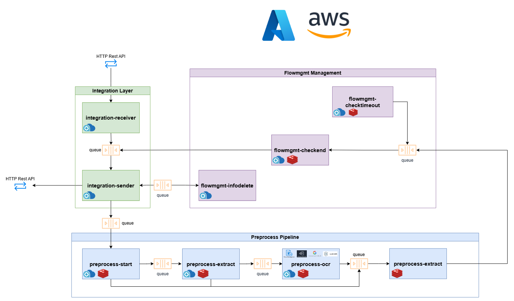

# Preprocess Services Documentation

## Index

- [Preprocess Services Documentation](#preprocess-services-documentation)
  - [Index](#index)
  - [Overview](#overview)
    - [Key Features](#key-features)
  - [Getting started](#getting-started)
  - [Concepts and definitions](#concepts-and-definitions)
  - [Preprocess component distribution](#preprocess-component-distribution)
  - [Request Body](#request-body)
    - [Input JSON parameters](#input-json-parameters)
  - [Preprocessing Features](#preprocessing-features)
      - [1. Preprocessing with Indexing](#1-preprocessing-with-indexing)
      - [2. Standalone Preprocessing](#2-standalone-preprocessing)
      - [3. Reusing Preprocessed Documents](#3-reusing-preprocessed-documents)
      - [4. Downloading Preprocessed Data](#4-downloading-preprocessed-data)
  - [Preprocess components explanation](#preprocess-components-explanation)
    - [Preprocess start](#preprocess-start)
      - [Environment variables](#environment-variables)
      - [Error Handling](#error-handling)
    - [Preprocess extract](#preprocess-extract)
      - [Environment variables](#environment-variables-1)
      - [Error Handling](#error-handling-1)
    - [Preprocess OCR](#preprocess-ocr)
      - [Environment variables](#environment-variables-2)
      - [Error Handling](#error-handling-2)
    - [Preprocess end](#preprocess-end)
      - [Environment variables](#environment-variables-3)
      - [Error Handling](#error-handling-3)
  - [Configuration](#configuration)
    - [Blobs - Buckets storage distribution](#blobs---buckets-storage-distribution)
    - [Secrets](#secrets)
    - [Environment variables](#environment-variables-4)
  - [Troubleshooting](#troubleshooting)
    - [Common Issues](#common-issues)
    - [FAQ](#faq)
  - [Version History](#version-history)

## Overview

The preprocess component is designed to extract text and geospatial information from multiple document formats, including PDFs, PowerPoint presentations and Excel spreadsheets, among others. It streamlines the text extraction process, making content from different sources easy to handle and analyze. This component provides a reliable solution for obtaining structured text data, facilitating seamless integration into diverse data processing workflows and supporting a wide range of applications, from data analysis to information retrieval.

### Key Features

* Multi-platform Support: Seamlessly integrates with major cloud providers like Azure and AWS, ensuring scalability, reliability, and high availability for mission-critical applications.
* Customizable Parameters: Provides fine-tuned control over the text extraction process by adjusting parameters such as OCR engine, language, and desired document pages, ensuring an optimal configuration for specific use cases.
* Flexible OCR Integration: Utilizes several OCR engines, including Amazon Textract and Azure AI Document Intelligence, to accommodate different document types and conditions.
* Language Support: Extracts text from documents in multiple languages, such as English, Spanish or Japanese, enabling global usability and application.
* Document Format Compatibility: Supports  for a wide array of document formats including PDF, DOCX, PPTX, XLSX, TXT, PNG, JPEG, and more.

## Getting started
To use the preprocess component, you need to have the integration component, designed to receive the API call, adapt the input message and inject it into the corresponding queue, among other functions. In addition to that, a queue messaging service  and a cloud storage service will be needed, either Azure or AWS ones.

The first step you need to take to use the preprocess component on your local machine is to set the [environment variables](#environment-variables).

After that, you need to create an environment with Python 3.11 and install the required packages listed in the "requirements.txt" file:

```sh
pip install -r [path]/requirements.txt
```  
Once everything above is configured, you need to run the <i>main.py</i> file from the integration-receiver sub-component, and call the `/process` API endpoint with body and headers similar to the following example:

```python
import requests
import json

url = "http://localhost:8888/process"

payload = {
  "index": "index_name",
  "operation": "indexing",
  "documents_metadata": {
    "doc1.pdf": {"content_binary": "doc encoded as base64"}
  },
  "response_url": "http://"
}

headers = {
  "x-api-key": ""
}

response = requests.request("POST", url, headers=headers, data=payload)
```  

## Concepts and definitions
* **Preprocess:** Set of techniques applied to extract only text in a proper way to index it.
* **OCR:** Optical Character Recognition (OCR) is the process by which an image with text is converted into a machine-readable text format.

## Preprocess component distribution
The preprocessing flow is a complex process that requires communication between different individuals. Files must be uploaded to various folders in the cloud storage ('STORAGE_BACKEND') and queues. The task assigned to each individual within the preprocessing flow is:

* **preprocess-start**: Receives the input from the <b>'integration-sender'</b> component and formats it correctly by adding some additional information to the message. Finally creates the key in redis for the whole process. If the process goes smoothly, writes the message in the next process (queue).
* **preprocess-extract**: Manages the documents operations like text extraction or pages count. Depending on the input and the document features, it has different flows:
  - If the text extraction goes right, directly goes to <b>'preprocess-end'</b> component.
  - If there is a problem during text extraction, converts the document pages into separated images to pass them through the OCR (selected by the user).
  - If <b>'force_ocr'</b> is passed, OCR always be performed:
    + If <b>'llm-ocr'</b> is selected with the <b>'query'</b> parameter passed in the input, the text extraction will not be performed.
    + If <b>'query'</b> parameter is not passed, text extraction will be performed just to get the language of the text (to adapt the query accordingly). The extracted OCR text will be discarded, as it is not useful.
* **preprocess-ocr** (optional): Deals with the text extraction from the images generated by the <b>'preprocess-extract'</b> component by sending it to the supported OCR's:  
  - FormRecognizer.
  - Amazon Textract.
  - TesseractOCR .
  - Multimodal OCR: LLM vision based OCR using the 'genai-LLMAPI' component.
* **preprocess-end**: This component is the previous step before indexing. Its function is to check in Redis whether the process was successful before writing the message to the 'genai-infoindexing' component.

Finally, the supported document formats for this process are: pdf, jpeg, jpg, png, txt, docx, xls, xlsx, pptx

## Request Body

### Input JSON parameters
As <i>preprocess_start</i>, it manages the organization of the JSON that goes over all preprocess components and indexing. Below is the explanation of each parameter in the correctly transformed output generated by `preprocess-start`:

<!---      
      - <b>csv:</b> <i>True</i> or <i>False</i>, Indicate if the text is in the CSV file.
      - <b>layout_conf:</b> Configuration to do layout.

          + <b>do_lines_text:</b> <i>True</i> or <i>False</i>, try to extract lines without OCR.
          + <b>do_lines_ocr:</b> <i>True</i> or <i>False</i>, try to extract lines with OCR.
          + <b>lines_conf:</b> Configuration of lines.
              - <b>do_lines_results:</b> <i>True</i> or <i>False</i>, update images with lines and prediction.
              - <b>model:</b> Name of model to predict lines.
          + <b>do_titles:</b> Extract and generate files with only titles.
          + <b>do_tables:</b> Extract and generate files with only tables.
          + <b>tables_conf:</b>
              - <b>sep:</b> Indicate which separator use to generate csv with tables lines.
        - -->

* generic
  * <b>project_conf:</b> Configuration of project.
      - <b>laparams:</b> Parameter to extract more information in PDFMiner text extraction in preprocess.
      - <b>process_id:</b> Id of process.
      - <b>timeout_id:</b> Id used to control process timeout.
      - <b>process_type:</b> Type of process.
      - <b>department:</b> Department assigned to apikey.
      - <b>report_url:</b> Url to report metrics to apigw.
      - <b>tenant:</b> Tenant where the process is running.
      - <b>project_type:</b> Text/Image type of document.
      - <b>url_sender:</b> Name or URl to respond.
      - <b>timeout_sender:</b> Process time for timeout to occur.
  * <b>dataset_conf:</b> Configuration of dataset.
      - <b>dataset_path:</b> Path of the dataset folder in storage.
      - <b>dataset_csv_path:</b> Path of the dataset csv in storage.
      - <b>path_col:</b> Column of dataset that indicates URL.
      - <b>label_col:</b> Column of dataset that indicates CategoryId.
      - <b>dataset_id:</b> Id of the dataset.
  * <b>preprocess_conf:</b> Configuration of preprocess.
      - <b>num_pag_ini:</b> Number of page of document to initialize extraction.
      - <b>page_limit:</b> Total numbers of pages to extract. 
      - <b>corrupt_th_words:</b> Threshold to set if a text is valid depending on the corrupt words. (0 allows all, 1 the most restrictive one)
      - <b>corrupt_th_chars:</b> Threshold to set if a text is valid depending on the corrupt chars. (0 allows all, 1 the most restrictive one)
      - <b>ocr_conf:</b> Configuration of the OCR.
        + <b>ocr:</b> <i>aws-ocr</i>, <i>tesseract-ocr</i>, <i>azure-ocr</i> or <i>llm-ocr</i>>Types of OCR supported.
        + <b>extract_tables:</b> <i>True</i> or <i>False</i> to generate file with tables extract of OCR in preprocess.
        + <b>force_ocr:</b> <i>True</i> or <i>False</i> to force the process to go through ocr engine in preprocess.
        + <b>batch_length:</b> Size max of pages to batch.
        + <b>files_size:</b> Size max of byte size to batch.
        + <b>calls_per_minute:</b> Number max of call to send OCR.
        + <b>llm_ocr_conf (<i>'llm-ocr' ocr type parameters</i>)</b> (optional): 
          - <b>model</b> (optional): Name of the model (or pool) to be used on each platform. If this parameter is not provided 'gpt-4o-pool-world' will be the default model.
          - <b>platform</b> (optional): Name of the desired platform. Possible values: 'azure', 'openai', or 'bedrock'. 'azure' by default.
          - <b>query</b> (optional): Question or task that you want to ask the model. 
          - <b>system</b> (optional): Variable for chat-based models
          - <b>max_tokens</b>(optional): Maximum number of tokens to generate in the response. (1000 by default)
          - <b>num_retries</b> (optional): Maximum number of retries to do when a call fails for model purposes (if pool, the model is changed between other from the pool). 10 by default
          - <b>force_continue</b> (optional): If an error is raised by the LLM component in a particular page, force the document to index the rest of the pages received. If not, the 'llm-ocr' process is stopped and an error is raised.
  * <b>indexation_conf</b>: Configuration of index process.
    - <b>vector_storage_conf</b>: Configuration of the vector storage.
      - <b>index</b>: Name of index. If it is the first time it is used an index with this name is created in the corresponding database; otherwise, it is used to expand the existing index with more documents. No capital letters or symbols are allowed except underscore ([a-z0-9_]).
      - <b>vector_storage</b>: Key to get the configuration of the database from config file.
      - <b>metadata_primary_keys</b>: This parameter is to specify whether the metadata provided in the list will be used in the vector storage id generation or not. In brief to allow different metadata for same chunks.
    - <b>chunking_method</b>: Configuration of the chunking method.
      - <b>window_overlap</b>: When dividing the document into snippets, the number of tokens that overlap between 2 subsequent chunks. Default value is 10, and it is measured with NLTK tokenizer.
      - <b>window_length</b>: Length of chunks. Default value is 300.
      - <b>method</b>: Type of chunking technique that will be used simple is the default one.
      - <b>sub_window_length</b>: Integer value to specify the window length for the sub-chunks. (<b><i>Recursive method only</i></b>).
      - <b>sub_window_overlap</b>: Integer value to specify the window overlap for the sub-chunks. (<b><i>Recursive method only</i></b>).
      - <b>windows:</b> Number of the windows that will be taken in this method. (<b><i>Recursive method only</i></b>).
    - <b>models</b>: Indexing model configuration.
      - <b>alias</b>: Model or pool of models to index (equivalent to <i>"embedding_model_name"</i> in <i>models_config.json</i> config file).
      - <b>embedding_model</b>: Type of embedding that will calculate the vector of embeddings (equivalent to <i>"embedding_model"</i> in <i>models_config.json</i> config file).
      - <b>platform</b>: Provider used to store and get the information (major keys in <i>models_config.json</i> config file).
    - <b>metadata</b>: This parameter allows users to add custom metadata
    - <b>index_metadata</b>: This parameter can have various values to specify how metadata will be included in the embeddings:  
      - If set to `true`, only the filename metadata and the metadata provided by the user will be included.  
      - If provided as a list of specific fields (e.g., `["filename", "uri"]`), only the specified metadata fields will be included.  
      - If omitted or set to `false`, no metadata will be included. 
  * <b>persist_preprocess</b>: Controls the retention of preprocessed files (default: `false`)
    - When `true`: Preprocessed files and intermediate results are kept in cloud storage
    - When `false`: Temporary files are deleted after processing
 
- <b>specific:</b>
  - <b>path_txt:</b> Path in the cloud storage where the txt will be uploaded
  - <b>path_text:</b> Path in the cloud storage where the text separated by pages will be uploaded
  - <b>path_img:</b> Path in the cloud storage where the images will be uploaded
  - <b>path_cells:</b> Path in the cloud storage where the cells will be uploaded
  - <b>path_tables:</b> Path in the cloud storage where the tables will be uploaded
  - <b>dataset</b>
    - <b>dataset_key</b>: This key is generated by integration. The format is:
      ```json
      {
        "dataset_key": "ir_index_'datetime'_'timemilis'_'randomchars':ir_index_'date'_'time'_'timemilis'_'randomchars'"
      }
      ```  

      An example could be:
      ```json
      {
        "dataset_key": "ir_index_20240628_091121_716609_s79eqe:ir_index_20240628_091121_716609_s79eqe"
      }
      ```  
      In the case that infoindexing is not used with integration, can be whatever written by the user.
  - <b>document:</b> 
    - <b>filename:</b> Document filename with its path in the <i>"STORAGE_DATA"</i> storage.
    - <b>metadata:</b> Custom metadata added by the user.
    - <b>n_pags:</b> Number of pages of the document.
    - <b>language:</b> Language of the document (<i>default</i> can not extract it).
  - <b>paths</b>
    - <b>text</b>: This is the place where the document explained in [Writing message in queue (developer functionality)](#Writing-message-in-queue-(Developer-functionality))  has to be located in the blob/bucket storage deployed associated to the <i>"STORAGE_BACKEND"</i> variable. If the <i>"TESTING"</i> variable is set to <b>True</b>, the file will be searched in the <i>"STORAGE_DATA"</i> storage (<b>Warning!</b> in this case the tokens will not be reported). If the service is used in conjunction with integration will be generated automatically with the following format:
      ```json
      {
        "text": "<department>/ir_index_20240711_081350_742985_d847mh/txt/<department>/request_20240711_081349_563044_5c2bac/<filename>.txt"
      }
      ```  
      An example could be:
      ```json
      {
        "text": "username/dataset_key/txt/username/request_id/documentation.txt"
      }
      ```  
      Otherwise, it has to be the route where the user uploads this file.
    - <b>cells:</b> Path where the cells are located, following the same style as text:
        ```json
        {
          "cells": "<department>/ir_index_20240711_081350_742985_d847mh/cells/<department>/request_20240711_081349_563044_5c2bac/<filename>"
        }
        ```  
        An example could be:
        ```json
        {
          "cells": "username/dataset_key/cells/username/request_id/documentation"
        }
         ```  
    - <b>images:</b> List of each page of the document extracted as image for OCR purposes. Each element of the list is a dict containing:
      - <b>filename:</b> Path of the image, following the same format as text:
        ```json
        {
          "filename": "<department>/ir_index_20240711_081350_742985_d847mh/imgs/<department>/request_20240711_081349_563044_5c2bac/<filename>/pags/<filename>_pag_<n>.jpeg"
        }
        ```  
        An example could be:
        ```json
        {
          "filename": "username/dataset_key/txt/username/request_id/documentation/pags/documentation_pag_0.jpeg"
        }
        ```  
      - <b>number:</b> Number of the page that refers the image
- <b>integration:</b> Message written by 'integration-sender' in the 'preprocess-start' queue.
- <b>tracking:</b> Logs with timestamp when the message was completed or entered into the process.
  - <b>request_id:</b> Id of the request.
  - <b>pipeline:</b> List of the different processes. Each process have:
    - <b>ts:</b> Timestamp
    - <b>step:</b>Name of the process
    - <b>type:</b>Type of the timestamp (<i>'INPUT'</i> or <i>'OUTPUT'</i>)

Then an example with the following key data could be:
* <b>department</b>: documentation_test
* <b>index_id</b>: ir_index_20250123_133146_371261_t6s48u
* <b>tenant</b>: test
* <b>request_id</b>: request_20250123_133139_485292_1hjs11
* <b>input filename</b>: documentation.pdf

```json
{
    "generic": {
        "project_conf": {
            "laparams": "none",
            "process_id": "ir_index_20250123_133146_371261_t6s48u",
            "timeout_id": "timeout_id_test:ir_index_20250123_133146_371261_t6s48u",
            "process_type": "ir_index",
            "department": "documentation_test",
            "report_url": "http://techhubapigw.techhubadminconfiguration/apigw/license/report/52fb565179ff4e7cb98bd6776d2fc62a",
            "tenant": "test",
            "project_type": "text",
            "url_sender": "test--q-integration-sender",
            "timeout_sender": 60
        },
        "dataset_conf": {
            "dataset_path": "documentation_test/request_20250123_133139_485292_1hjs11",
            "dataset_csv_path": "documentation_test/request_20250123_133139_485292_1hjs11/datasets/-2854053896596469679.csv",
            "path_col": "Url",
            "label_col": "CategoryId",
            "dataset_id": "ir_index_20250123_133146_371261_t6s48u"
        },
        "preprocess_conf": {
            "num_pag_ini": 0,
            "page_limit": 1000,
            "ocr_conf": {
                "force_ocr": false,
                "extract_tables": false,
                "batch_length": 32,
                "files_size": 30000000,
                "calls_per_minute": 400,
                "ocr": "azure-ocr"
            },
        },
        "indexation_conf": {
            "vector_storage_conf": {
                "index": "agents_test_2",
                "vector_storage": "elastic-test"
            },
            "chunking_method": {
                "method": "simple",
                "window_overlap": 100,
                "window_length": 1000
            },
            "models": [
                {
                    "alias": "techhub-pool-world-ada-3-small",
                    "embedding_model": "text-embedding-3-small",
                    "platform": "azure"
                }
            ],
            "metadata": {
                "year": 2025,
                "category": "health"
            }
        }
    },
    "specific": {
        "path_txt": "documentation_test/ir_index_20250123_133146_371261_t6s48u/txt",
        "path_text": "documentation_test/ir_index_20250123_133146_371261_t6s48u/text",
        "path_img": "documentation_test/ir_index_20250123_133146_371261_t6s48u/imgs",
        "path_cells": "documentation_test/ir_index_20250123_133146_371261_t6s48u/cells",
        "path_tables": "documentation_test/ir_index_20250123_133146_371261_t6s48u/tables",
        "dataset": {
            "dataset_key": "ir_index_20250123_133146_371261_t6s48u:ir_index_20250123_133146_371261_t6s48u"
        },
        "document": {
            "filename": "documentation_test/request_20250123_133139_485292_1hjs11/documentation.pdf",
            "label": 0,
            "metadata": {
                "year": 2025,
                "category": "health"
            },
            "n_pags": 13,
            "language": "en"
        },
        "paths": {
            "images": [
              {
                "filename": "albertoperezblasco/ir_index_20250123_075355_174425_9yd5ki/imgs/albertoperezblasco/request_20250123_075340_335302_yc4gfc/paginablanca/pags/paginablanca_pag_0.jpeg", 
                "number": 0
              }
              . . .
              {
                "filename": "albertoperezblasco/ir_index_20250123_075355_174425_9yd5ki/imgs/albertoperezblasco/request_20250123_075340_335302_yc4gfc/paginablanca/pags/paginablanca_pag_0.jpeg", 
                "number": 13
              }
            ],
            "text": "documentation_test/ir_index_20250123_133146_371261_t6s48u/txt/documentation_test/request_20250123_133139_485292_1hjs11/documentation.txt",
            "cells": "documentation_test/ir_index_20250123_133146_371261_t6s48u/cells/txt/documentation_test/request_20250123_133139_485292_1hjs11/documentation"
        }
    },
    "integration": {}, //integration sender output
    "tracking": {
        "request_id": "documentation_test/request_20250123_133139_485292_1hjs11",
        "pipeline": [
            {
                "ts": 1737639106.371,
                "step": "INTEGRATION_SENDER",
                "type": "INPUT"
            },
            . . .
            {
                "ts": 1737639304.222,
                "step": "GENAI_INFOINDEXING",
                "type": "INPUT"
            }
        ]
    }
}
```  

## Preprocessing Features

The preprocess component supports multiple processing modes and flexible document handling through various configuration options.

**Base URL Structure**

All preprocessing endpoints require the `/integrationasync/` prefix before the operation path:
- **Base pattern**: `/integrationasync/process` or `/integrationasync/process-async`
- **Examples**: 
  - `POST /integrationasync/process`
  - `GET /integrationasync/process-async`

#### 1. Preprocessing with Indexing

  - **POST** `/process` or `/process-async`: Submit documents for asynchronous processing. The request body contains the full preprocessing configuration and document data in JSON format. This is the most common method for document processing, as it allows for complex configurations and large document payloads.
  
    **Examples Request**

      - **POST** {{url}}//integrationasync/process

      - **POST** {{url}}//integrationasync/process-async

    This is the standard mode that combines preprocessing and indexing in a single operation:

    ```json
    {
      "operation": "indexing",
      "response_url": "test--q-integration-callback",
      "process_id": "test_process_id",
      "persist_preprocess": true,
      "indexation_conf": {
        "vector_storage_conf": {
          "index": "test_index"
        },
        "chunking_method": {
          "window_overlap": 40,
          "window_length": 500
        },
        "models": ["techhub-pool-world-ada-002"]
      },
      "preprocess_conf": {
        "ocr_conf": {
          "ocr": "llm-ocr",
          "force_ocr": true,
          "llm_ocr_conf": {
            "model": "techhub-pool-world-gpt-4o",
            "platform": "azure",
            "query": "Do the text and entities extraction of this image",
            "system": "Act as if you were an OCR program",
            "max_tokens": 2500,
            "force_continue": true
          }
        }
      },
      "documents_metadata": {
        "name_document.pdf": {
          "content_binary": "base64_encoded_document_content"
        }
      }
    }
    ```  

#### 2. Standalone Preprocessing

  - **POST** `/process` or `/process-async`. Perform preprocessing without immediate indexing:
  
    **Examples Request**

      - **POST** {{url}}//integrationasync/process

      - **POST** {{url}}//integrationasync/process-async

    > **IMPORTANT:** The `persist_preprocess` parameter **must** be set to `true` when using standalone preprocessing mode. This is required to ensure the preprocessed files are retained in cloud storage for future use.

    ```json
    {
      "operation": "preprocess",
      "response_url": "test--q-integration-callback",
      "process_id": "test_process_id",
      "persist_preprocess": true,
      "preprocess_conf": {
        "ocr_conf": {
          "ocr": "llm-ocr",
          "force_ocr": true,
          "llm_ocr_conf": {
            "model": "techhub-pool-world-gpt-4o",
            "platform": "azure",
            "query": "Do the text and entities extraction of this image",
            "system": "Act as if you where an OCR program",
            "max_tokens": 2500,
            "force_continue": true
          }
        }
      },
      "documents_metadata": {
        "name_document.pdf": {
          "content_binary": "base64_encoded_document_content"
        }
      }
    }
    ```

#### 3. Reusing Preprocessed Documents

  - **POST** `/process` or `/process-async`. You can reuse a previously preprocessed document by specifying its `process_id`:
  
    **Examples Request**

      - **POST** {{url}}//integrationasync/process

      - **POST** {{url}}//integrationasync/process-async

    ```json
    {
      "operation": "indexing",
      "response_url": "test--q-integration-callback",
      "process_id": "test_process_id",
      "persist_preprocess": true,
      "preprocess_reuse": true,
      "indexation_conf": {
        "vector_storage_conf": {
          "index": "test_index"
        },
        "chunking_method": {
          "window_overlap": 40,
          "window_length": 500
        },
        "models": ["techhub-pool-world-ada-002"]
      },
      "documents_metadata": {
        "name_document.pdf": {}
      }
    }
    ```  

    > **IMPORTANT:** When reusing preprocessed documents, the filenames in `documents_metadata` **must match exactly** the filenames used in the original preprocessing request.

    > **IMPORTANT:** The `preprocess_reuse` parameter **must** be set to `true` when reusing preprocessed documents.

    - **Parameter definition: Process ID Parameter**  
      The `process_id` parameter allows you to specify a custom identifier for your preprocessing operation:
      - **Optional**: If not provided, a random process ID will be automatically generated.
      - **Custom naming**: When provided, the preprocessing operation will use your specified ID.
      - **Recommended for reuse**: If you plan to reuse the preprocessed documents later, it's recommended to provide a meaningful `process_id` for easy identification.
      - **Retrieving auto-generated IDs**: If you don't specify a `process_id` and one is generated automatically, you can retrieve it through the callback response sent to your `response_url`. This allows you to obtain the generated `process_id` for future reuse operations.
  
    - **Parameter definition: Persist Preprocessing Parameter**  
      The `persist_preprocess` parameter controls the retention of preprocessed files:
      - `true`: Preprocessed files and intermediate results are kept in cloud storage.
      - `false`: Temporary files are deleted after processing.
  
      > **Note:** For standalone preprocessing mode (`"operation": "preprocess"`), this parameter must always be set to `true`.
    
    - **Parameter definition: Preprocess Reuse Parameter**  
      The `preprocess_reuse` parameter indicates that you want to reuse previously preprocessed documents:
      - `true`: Use existing preprocessed data identified by the `process_id`.
      - Only required when reusing preprocessed documents.
  
    **<u>Key Configurations</u>**

    * OCR Configuration Options:
      - `ocr`: Specify the OCR engine (e.g., <i>llm-ocr, azure-ocr</i>, <i>aws-ocr</i> or <i>tesserac-ocr</i>).
      - `force_ocr`: Force OCR processing regardless of initial text extraction.
      - `llm_ocr_conf`: Detailed configuration for LLM-based OCR.
  
        > **IMPORTANT:** aws-ocr does not work with the ap-northeast-1 subscription.

    * LLM OCR Configuration (only for llm-ocr engine):
      - `model`: Specify the LLM model for OCR.
      - `platform`: Cloud platform hosting the model.
      - `query`: Optional specific query for OCR processing.
      - `system`: Optional system prompt for the LLM.
      - `max_tokens`: Maximum tokens for processing.
      - `force_continue`: Continue processing even if errors occur on specific pages.

#### 4. Downloading Preprocessed Data
  - In addition to the processing modes, the API allows direct download of previously processed document data, providing access to extracted text and structural information.  

    **Using the Synchronous Endpoint**

    The synchronous processing endpoint (`/process-sync`) can be used to download preprocessed data by sending a GET request:

    **Request Format**  
      **GET** {{url}}/integrationasync/process-sync?operation=download&process_id=PROCESS_ID&cells=INCLUDE_CELLS
    

    **Parameters**
    - `operation` (required): Must be set to `download` for data download.
    - `process_id` (required): The process ID of the preprocessed document.
    - `cells` (optional): Include structural data when set to `true` (default: `false`).

    **Example Request**

      **GET** {{url}}/integrationasync/process-sync?operation=download&process_id=preprocess_20250412_143822_951264_d76f3h&cells=true

    **Example Response**
    ```json
    {
      "status": "ok",
      "text": {
        "full_document": {
          "financial_report.txt": "Annual Financial Report 2024\\n\\nExecutive Summary\\n\\nThis report presents the financial performance for fiscal year 2024..."
        },
        "pages": {
          "0": "Annual Financial Report 2024\\n\\nExecutive Summary\\n\\n",
          "1": "Revenue Analysis\\n\\nQuarterly breakdown shows consistent growth...",
          "2": "Expense Report\\n\\nOperating expenses remained within projections..."
        }
      },
      "cells": {
        "words": [
          {"r0": 145.32, "c0": 72.18, "r1": 167.45, "c1": 213.76, "text": "Annual"},
          {"r0": 167.45, "c0": 72.18, "r1": 189.58, "c1": 263.42, "text": "Financial"}
        ],
        "paragraphs": [
          {"r0": 145.32, "c0": 72.18, "r1": 234.87, "c1": 498.23, "text": "Annual Financial Report 2024"}
        ],
        "lines": [
          {"r0": 145.32, "c0": 72.18, "r1": 167.45, "c1": 498.23, "text": "Annual Financial Report 2024"}
        ]
      }
    }
    ```  

    **Response Structure**

    - `status`: Operation result status.
    - `text`: Document text content.
      - `full_document`: Complete text for each document.
      - `pages`: Text content by page number.
    - `cells` (when requested): Document structure information.
      - `words`: Positioning and content of individual words with coordinates (r0, c0, r1, c1 representing the bounding box).
      - `paragraphs`: Paragraph structure and content with spatial information, identifying logical text blocks.
      - `lines`: Line-by-line content with positioning, representing physical lines of text as they appear in the document.

    Note that only documents processed with `persist_preprocess=true` will be available for retrieval. Documents processed with `persist_preprocess=false` will have their preprocessed data removed after completion.  

## Preprocess components explanation
The flow of a preprocessing pipeline, starting from the user request in `integration-receiver` would be the following:




### Preprocess start


This component starts parsing the input sent by `integration-sender` and parsing it. After parsing, the JSON that will be used from this point until the end is created. In this moment, a file located on the 'STORAGE_BACKEND' in `src/layout.json` is mixed with the formatted output JSON, so the format of this file, must be the same explained in [Input JSON parameters](#input-json-parameters). The <i>layout.json</i> file is loaded when the component starts, so the content of the file will be the same for all the files passing through this flow. If a change is required, you must change the file and re-deploy the component to ensure that the change has been applied.

Once that information is added and the JSON is finally generated, the component checks if the document and dataset exist in storage to create the key in Redis and start the process. If everything goes well, the flow will continue, and the message will be propagated to the `preprocess-extract` component; otherwise, it will be sent to the `preprocess-end` component.

#### Environment variables
* **PROVIDER**: Cloud service to use to load the configuration files (<i>aws</i> or <i>azure</i>).
* **QUEUE_DELETE_ON_READ**: True if delete messages when read wanted (recommended to <i>True</i>).
* **QUEUE_MODE**: Identifier that represents that the component works with queues (<i>True</i> or <i>False</i>).
* **Q_PREPROCESS_END**: Name of the queue of the end-preprocess subcomponent.
* **Q_PREPROCESS_EXTRACT**: Name of the queue of the preprocess-extract subcomponent.
* **Q_PREPROCESS_START**: Name of the queue of the start-preprocess subcomponent.
* **REDIS_DB_STATUS**: Identifier of redis database to save process status (int).
* **REDIS_DB_TIMEOUT**: Identifier of redis database to track process timeout (int).
* **STORAGE_BACKEND**: Name of bucket/blob to store configuration files and all the process related files.
* **STORAGE_DATA**: Name of bucket/blob to store datasets.
* Optional:
  - **SECRETS_PATH**: Path to the secrets folder.
  - **TENANT**: Tenant where the process is running.

#### Error Handling
Some common error messages you may encounter are:  

| Error message                                                                | Possible reason                                                                                     |
|:-----------------------------------------------------------------------------|:----------------------------------------------------------------------------------------------------|
| Error creating status redis                             | Error while creating redis key for the document flow.                                                                 |
| Error parsing parameters of configuration                    | There is a parameter sent wrong in the input JSON body.                                                                 |
| Error getting dataset status key                                  | The dataset_status_key can't be generated or obtained                                                     |
| Error checking files storage              | Error checking if the mandatory files are available                                                            |

<i>*For more detailed errors, see the logs of the component. These are only the errors visible in the Redis key / user response.</i>

### Preprocess extract


In the `preprocess-extract` component, the text extracting from the document is managed. There are several cases in which this component will need the `preprocess-ocr` component:
* When **llm-ocr** ocr selected and the query has been passed (we already know the language of the text) and the `force_ocr` parameter has been set to <i>true</i> (the OCR text extraction has preference). 
* When the text is corrupted (or an error has ocurred during text extraction).

Appart from that cases, a normal flow for the preprocess extract component is the following:
1. The JSON input is parsed and the file downloaded.
2. Once the file has been downloaded (which is mandatory for extracting the case), it will be extracted if necessary. If extraction occurs, the file will be uploaded to storage, and the `preprocess-extract` component will send the next message to `preprocess-end`. Otherwise, if the `force_ocr` parameter is set to <i>True</i> or the text could not be extracted, the process will go to `preprocess-ocr`, and the text file will not be uploaded to storage.
3. In the cases that the flow must continue for the `preprocess-ocr`, `preprocess-extract` will generate the images (one page is one image file) and upload them to the file storage, inserting the path in the input JSON and sending it to the `preprocess-ocr`.

When using PDFMiner for language detection in LLM OCR, the component now limits the number of pages processed for language detection using the optional 'LLM_OCR_PAGE_LIMIT' environment variable (by default, 5), improving efficiency for large documents.

#### Environment variables
* **PROVIDER**: Cloud service to use to load the configuration files (<i>aws</i> or <i>azure</i>).
* **QUEUE_DELETE_ON_READ**: True if delete messages when read wanted (recommended to <i>True</i>).
* **QUEUE_MODE**: Identifier that represents that the component works with queues (<i>True</i> or <i>False</i>).
* **Q_PREPROCESS_END**: Name of the queue of the end-preprocess subcomponent.
* **Q_PREPROCESS_EXTRACT**: Name of the queue of the preprocess-extract subcomponent.
* **Q_PREPROCESS_OCR**: Name of the queue of the ocr-preprocess subcomponent.
* **REDIS_DB_STATUS**: Identifier of redis database to save process status (int).
* **REDIS_DB_TIMEOUT**: Identifier of redis database to track process timeout (int).
* **STORAGE_BACKEND**: Name of bucket/blob to store configuration files and all the process related files.
* **STORAGE_DATA**: Name of bucket/blob to store datasets.
* **LLM_OCR_PAGE_LIMIT**: Configurable limit for the number of pages extracted for language detection when using LLM OCR.
* Optional:
  - **SECRETS_PATH**: Path to the secrets folder.
  - **TENANT**: Tenant where the process is running.

#### Error Handling
Some common error messages you may encounter are:
| Error message                                                                | Possible reason                                                                                     |
|:-----------------------------------------------------------------------------|:----------------------------------------------------------------------------------------------------|
| Error parsing parameters of configuration                             | There is a parameter sent wrong in the input JSON body.                                                                 |
| Error getting documents parameters                    | There is a parameter sent wrong in the input JSON body in the document part                                                                  |
| Error getting lines and cells                                 | There is a parameter sent wrong in the input JSON body in the lines and cells part                                                        |
| Error downloading files              | Error while downloading the file from the storage      
| Error getting number of pages             | Error getting the number of pages from the downloaded document
| Not are images and text to process             | Text and images not obtained from the text (maybe is a corrupted text)

<i>*For more detailed errors, see the logs of the component. These are only the errors visible in the Redis key / user response.</i>

### Preprocess OCR


In this component, we allow different OCR types:
* **FormRecognizer**: Microsof Azure text extraction service. (<b>'azure-ocr'</b>)
* **Amazon Textract**: AWS text extraction service. (<b>'aws-ocr'</b>)
* **TesseractOCR**: Free Software text extraction service funded by Google. (<b>'tesseract-ocr'</b>)
* **Multimodal OCR**: LLM vision based OCR using the <i>genai-LLMAPI</i> component. Depending on the environment variables seen in the next section and the <i>genai-LLMAPI</i> component mode deployed, can work as API or as queue, having both different behaviour. The configuration of this LLM call goes in the `llm_ocr_conf` parameter explained in [Input JSON parameters](#input-json-parameters) (<b>'llm-ocr'</b>)


These different OCRs share the same flow, except the 'LLMAPI' working as queue that has a little variation:
1. Download the images and resize them if necessary, depending on the files_size parameter or if `llm-ocr` selected (in this case the 'LLMAPI' component will resize them depending on the LLM selected). When resizing is done to an image in the `preprocess-ocr` component, it will be uploaded to the storage also.
2. Then, batch the pages and send them to the specified OCR. If 'LLMAPI' working as queue selected, the batches will not be done as works by queues and rate limit with the service is more difficult to generate (we recommend using a pool of models to avoid it in the LLM calling).
3. If the OCR extraction is successful, the pages will be merged and uploaded to the storage (both merged and individually).
4. This component, will always end in the `preprocess-end` component, even if there is an error during the flow.

Recent performance improvements include implementation of asynchronous methods for images download and upload operations, significantly improving processing speed, especially for batches with multiple pages.

#### Environment variables
* **PROVIDER**: Cloud service to use to load the configuration files (<i>aws</i> or <i>azure</i>).
* **QUEUE_DELETE_ON_READ**: True if delete messages when read wanted (recommended to <i>True</i>).
* **QUEUE_MODE**: Identifier that represents that the component works with queues (<i>True</i> or <i>False</i>).
* **Q_PREPROCESS_END**: Name of the queue of the end-preprocess subcomponent.
* **Q_PREPROCESS_OCR**: Name of the queue of the ocr-preprocess subcomponent.
* **REDIS_DB_STATUS**: Identifier of redis database to save process status (int).
* **REDIS_DB_TIMEOUT**: Identifier of redis database to track process timeout (int).
* **STORAGE_BACKEND**: Name of bucket/blob to store configuration files and all the process related files.
* **STORAGE_DATA**: Name of bucket/blob to store datasets.
* Optional:
  - **SECRETS_PATH**: Path to the secrets folder.
  - **TENANT**: Tenant where the process is running.
* For the **'llm-ocr'** case, there are more recommended environment variables. If the two queues environment variables are set and the **'STORAGE_BACKEND'** too, it will call the 'LLMQUEUE' component, otherwise if **'URL_LLM'** has been set, it will call the 'LLMAPI' component (if both, 'LLMQUEUE' has preference):
  - **QUEUE_TIMEOUT_OPERATION**: To add a timeout when reading from queue, this allows to stop reading if some message is lost and document not completed to continue with the process if wanted.
  - **Q_GENAI_LLMQUEUE_INPUT**: 'LLMQUEUE' input queue.
  - **Q_GENAI_LLMQUEUE_OUTPUT**: 'LLMQUEUE' output queue.
  - **URL_LLM**: URL to call 'LLMAPI'.

#### Error Handling

Some common error messages you may encounter are:
| Error message                                                                | Possible reason                                                                                     |
|:-----------------------------------------------------------------------------|:----------------------------------------------------------------------------------------------------|
| Error parsing parameters of configuration                             | There is a parameter sent wrong in the input JSON body.                                                                 |
| Error getting documents parameters                    | There is a parameter sent wrong in the input JSON body in the document part                                                                  |
| Error getting lines and cells                                 | There is a parameter sent wrong in the input JSON body in the lines and cells part                                                        |
| Error uploading files              | Error while uploading the file from the storage      
| Error merging files             | Error while merging the pages text extracted by the OCR into one full text
| Error getting credentials for OCR             | Credentials of the OCR has been set wrong |
| Error getting paths of files | There is a parameter sent wrong in the input JSON body in the paths part |
| Error resizing image | Error while resizing an image |
| Error getting files size | Error while creating a list of all files (images) size |
| Error extracting text with OCR | OCR service error while extracting the text |
| Error while writing in LLM OCR queue | There has been an error in during the 'llm-ocr' process working as queue |


<i>*For more detailed errors, see the logs of the component. These are only the errors visible in the Redis key / user response.</i>

### Preprocess end


This component's function is simple, but crucial as is the manager of all ending preprocessing flows. Even if the documents do not need it. The function is to check the process status code on Redis and depending on that, writing in the `genai-infoindexing` flow to continue with the indexation process or ending the preprocess by writing in the `flowmgmt-checkend` component.

#### Environment variables
* **PROVIDER**: Cloud service to use to load the configuration files (<i>aws</i> or <i>azure</i>).
* **QUEUE_DELETE_ON_READ**: True if delete messages when read wanted (recommended to <i>True</i>).
* **QUEUE_MODE**: Identifier that represents that the component works with queues (<i>True</i> or <i>False</i>).
* **Q_FLOWMGMT_CHECKEND**: Name of the queue of the flowmgmt_checkend component.
* **Q_GENAI_INFOINDEXING**: Name of the queue of the genai-infoindexing component.
* **Q_PREPROCESS_END**: Name of the queue of the end-preprocess subcomponent.
* **REDIS_DB_STATUS**: Identifier of redis database to save process status (int).
* **REDIS_DB_TIMEOUT**: Identifier of redis database to track process timeout (int).
* Optional:
  - **SECRETS_PATH**: Path to the secrets folder.
  - **TENANT**: Tenant where the process is running.

#### Error Handling

Some common error messages you might encounter include:
| Error message                                                                | Possible reason                                                                                     |
|:-----------------------------------------------------------------------------|:----------------------------------------------------------------------------------------------------|
| Error parsing parameters of configuration                             | There is a parameter sent wrong in the input JSON body.                                                                 |
| Error getting dataset status key                                  | The dataset_status_key can't be generated or obtained                                                     |
| Error getting redis configuration | The Redis configuration has not been propertly set |
| Error getting code of redis status | Error getting the status code for the dataset status key (document passed to end preprocess pipeline) |


<i>*For more detailed errors, see the logs of the component. These are only the errors visible in the Redis key / user response.</i>

## Configuration
### Blobs - Buckets storage distribution
This service, needs different buckets:
- **Integration**: 
  - <i>STORAGE_BACKEND</i>: To store the raw document data processed by all the previous components.
  - <i>STORAGE_DATA</i>: To store the document data that is going to be used by the previous services.

### Secrets
All necessary credentials for the <i>pre-processing flow</i> are stored in secrets for security reasons. These secrets are JSON files that must be located under a common path defined by the environment variable **SECRETS_PATH**; the default path is "secrets/". Within this secrets folder, each secret must be placed in a specific subfolder (these folder names are predefined). This component requires 5 different secrets:

- `azure.json`: This file stores the credentials to connect to the required Azure blobs and queues (only needed if using Azure infrastructure). The custom path for this secret is "azure/", making the full path <i>secrets/azure/azure.json</i>. The structure of this secret is as follows:
  ```json
  {
    "conn_str_storage": "your connection string for storage blobs",
    "conn_str_queue": "your connection string for ServiceBus queues",
  }
  ```  
- `redis.json`: This file stores Redis credentials for process status control purposes. The predefined path for this file is: "redis/". The format of this secret is as follows:
  ```json
  {
    "host": "your redis host",
    "password": "redis password",
    "port": "redis port"
  }
  ```  

### Environment variables
The environment variables, has been detailed in each component section.


## Troubleshooting

### Common Issues

### FAQ

## Version History

- v1: Release version