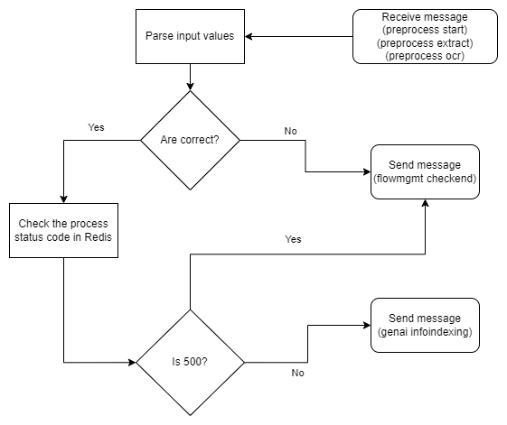

# Preprocess Services Documentation

## Index

- [Preprocess Services Documentation](#preprocess-services-documentation)
  - [Index](#index)
  - [Overview](#overview)
    - [Key Features](#key-features)
  - [Getting started](#getting-started)
  - [Concepts and definitions](#concepts-and-definitions)
  - [Preprocess component distribution](#preprocess-component-distribution)
  - [Configuration](#configuration)
    - [Input json parameters](#input-json-parameters)
  - [Preprocess components explanation](#preprocess-components-explanation)
    - [Preprocess start](#preprocess-start)
      - [Environment variables](#environment-variables)
      - [Environment variables](#environment-variables-1)
    - [Preprocess OCR](#preprocess-ocr)
      - [Environment variables](#environment-variables-2)
    - [Preprocess end](#preprocess-end)
      - [Environment variables](#environment-variables-3)
  - [Deployment](#deployment)
  - [Documentation](#documentation)

## Overview

The preprocess component is designed to extract text and geospatial information from multiple document formats, including PDFs, PowerPoint presentations and Excel spreadsheets, among others. It streamlines the text extraction process, making content from different sources easy to handle and analyze. This component provides a reliable solution for obtaining structured text data, facilitating seamless integration into diverse data processing workflows and supporting a wide range of applications, from data analysis to information retrieval.

### Key Features

* Multi-platform Support: Seamlessly integrates with major cloud providers like Azure and AWS, ensuring scalability, reliability, and high availability for mission-critical applications.
* Customizable Parameters: Provides fine-tuned control over the text extraction process by adjusting parameters such as OCR engine, language, and desired document pages, ensuring an optimal configuration for specific use cases.
* Flexible OCR Integration: Utilizes several OCR engines, including Amazon Textract and Azure AI Document Intelligence, to accommodate different document types and conditions.
* Language Support: Extracts text from documents in multiple languages, such as English, Spanish or Japanese, enabling global usability and application.
* Document Format Compatibility: Supports  for a wide array of document formats including PDF, DOCX, PPTX, XLSX, TXT, PNG, JPEG, and more.

## Getting started
To use the preprocess component, you need to have the integration component, designed to receive the API call, adapt the input message and inject it into the corresponding queue, among other functions. In addition to that, a queue messaging service  and a cloud storage service will be needed, either Azure or AWS ones.

The first step you need to take to use the preprocess component on your local machine is to set the [environment variables](#environment-variables).

After that, you need to create an environment with Python 3.11 and install the required packages listed in the "requirements.txt" file:

```sh
pip install -r "**path to the requirements.txt file**"
```
Once everything above is configured, you need to run the main.py file from the integration-receiver sub-component, and call the /process API endpoint with body and headers similar to the following example:

```python
import requests
import json

url = "http://localhost:8888/process"

payload = {
  "index": "index_name",
  "operation": "indexing",
  "documents_metadata": {
    "doc1.pdf": {"content_binary": "doc encoded as base64"}
  },
  "response_url": "http://"
}

headers = {
  "x-api-key": ""
}

response = requests.request("POST", url, headers=headers, data=payload)
```

## Concepts and definitions
* <b>Preprocess:</b> Set of techniques applied to a text to extract the data in a proper way to index it.
* <b>OCR:</b> Optical Character Recognition (OCR) is the process by which an image of text is converted into a machine-readable text format

## Preprocess component distribution
The preprocess flow, is a complex flow that needs the communication between different individuals by uploading the files in different folders of the cloud storage ('STORAGE_BACKEND') and queues. The task for each individual in the whole preprocess flow is:

* <b>preprocess-start</b>: Receives the input from the <b>'integration-sender'</b> component and formats it to the right format by adding some aditional information to the message. Finally creates the key in redis for the whole process. If the process goes smoothly, writes the message in the next process (queue)
* <b>preprocess-extract</b>: Manages the documents operations like text extraction or pages count. Depending on the input and the document features, it has different flows:
  - If the text extraction goes right, directly goes to <b>'preprocess-end'</b> component
  - If there is a problem during text extraction, converts the document pages into separated images to pass them through the OCR (selected by the user)
  - If <b>'force_ocr'</b>  passed it will do the ocr always
    + If <b>'llm-ocr'</b>  selected with the <b>'query'</b> parameter passed in the input, the text extraction will not be done
    + If <b>'query'</b> parameter not passed, text extraction will be done just to get the language of the text (to adapt the query to it). (the text of the ocr will be lost as is not useful)
* <b>preprocess-ocr</b> (optional): Deals with the text extraction from the images generated by the <b>'preprocess-extract'</b> component by sending it to the supported ocr's:  
  - FormRecognizer
  - Amazon Textract
  - TesseractOCR 
  - LLMOCR: LLM vision based OCR using the 'genai-LLMAPI' component
* <b>preprocess-end</b>: This component, is the previous step before indexing. Its function is to check in redis if the process went right to write the message in the 'genai-infoindexing' component.

Finally, the supported document formats for this process are: pdf, jpeg, jpg, png, txt, docx, xls, xlsx, pptx

## Configuration

### Input json parameters
As preprocess_start, manages the organization of the json that goes over all preprocess components and indexing, here is the explanation of each parameter (in the correct output transformed by <b>'preprocess-start'</b>):

<!---      
      - <b>csv:</b> <i>True</i> or <i>False</i>, Indicate if the text is in the CSV file.
- <b>layout_conf:</b> Configuration to do layout.

          + <b>do_lines_text:</b> <i>True</i> or <i>False</i>, try to extract lines without OCR.
          + <b>do_lines_ocr:</b> <i>True</i> or <i>False</i>, try to extract lines with OCR.
          + <b>lines_conf:</b> Configuration of lines.
              - <b>do_lines_results:</b> <i>True</i> or <i>False</i>, update images with lines and prediction.
              - <b>model:</b> Name of model to predict lines.
          + <b>do_titles:</b> Extract and generate files with only titles.
          + <b>do_tables:</b> Extract and generate files with only tables.
          + <b>tables_conf:</b>
              - <b>sep:</b> Indicate which separator use to generate csv with tables lines.
        - -->

* generic
  * <b>project_conf:</b> Configuration of project.
      - <b>laparams:</b> Parameter to extract more information in PDFMiner text extraction in preprocess.
      - <b>process_id:</b> Id of process.
      - <b>timeout_id:</b> Id used to control process timeout.
      - <b>process_type:</b> Type of process.
      - <b>department:</b> Department assigned to apikey.
      - <b>report_url:</b> Url to report metrics to apigw.
      - <b>tenant:</b> Tenant where the process is running.
      - <b>project_type:</b> Text/Image type of document.
      - <b>url_sender:</b> Name or URl to respond.
      - <b>timeout_sender:</b> Process time for timeout to occur.
  * <b>dataset_conf:</b> Configuration of dataset.
      - <b>dataset_path:</b> Path of the dataset folder in storage.
      - <b>dataset_csv_path:</b> Path of the dataset csv in storage.
      - <b>path_col:</b> Column of dataset that indicates URL.
      - <b>label_col:</b> Column of dataset that indicates CategoryId.
      - <b>dataset_id:</b> Id of the dataset.
  * <b>preprocess_conf:</b> Configuration of preprocess.
      - <b>num_pag_ini:</b> Number of page of document to initialize extraction.
      - <b>page_limit:</b> Total numbers of pages to extract. 
      - <b>ocr_conf:</b> Configuration of the OCR.
        + <b>ocr:</b> <i>aws-ocr</i> or <i>google-ocr</i>, Types of OCR supported.
        + <b>extract_tables:</b> <i>True</i> or <i>False</i> to generate file with tables extract of OCR in preprocess.
        + <b>force_ocr:</b> <i>True</i> or <i>False</i> to force the process to go through ocr engine in preprocess.
        + <b>batch_length:</b> Size max of pages to batch.
        + <b>files_size:</b> Size max of byte size to batch.
        + <b>calls_per_minute:</b> Number max of call to send OCR.
        + <b>llm_ocr_conf (<i>'llm-ocr' ocr type parameters</i>)</b> (optional): 
          - <b>model</b> (optional): Name of the model (or pool) to be used on each platform. If this parameter is not provided 'gpt-4o-pool-world' will be the default model.
          - <b>platform</b> (optional): Name of the desired platform. Possible values: 'azure', 'openai', or 'bedrock'. 'azure' by default.
          - <b>query</b> (optional): Question or task that you want to ask the model. 
          - <b>system</b> (optional): Variable for chat-based models
          - <b>max_tokens</b>(optional): Maximum number of tokens to generate in the response. (1000 by default)
          - <b>num_retries</b> (optional): Maximum number of retries to do when a call fails for model purposes (if pool, the model is changed between other from the pool). 10 by default
          - <b>force_continue</b> (optional): If an error is raised by the LLM component in a particular page, force the document to index the rest of the pages received. If not, the 'llm-ocr' process is stopped and an error is raised.
  * <b>indexation_conf</b>: Configuration of index process.
    - <b>vector_storage_conf</b>: Configuration of the vector storage.
      - <b>index</b>: Name of index. If it is the first time it is used an index with this name is created in the corresponding database; otherwise, it is used to expand the existing index with more documents. No capital letters or symbols are allowed except underscore ([a-z0-9_]).
      - <b>vector_storage</b>: Key to get the configuration of the database from config file.
      - <b>modify_index_docs <i>(optional)</i></b>: Dictionary used to update the information of an already indexed document or to delete documents that are not longer not needed. The dictionary format is as follows:
        ```python
        {
          "update": {"filename": True},
          "delete": {"filename": ["doc1.txt"]}
        }
        ``` 
        Where in the update key, the user specifies the metadata used as a filter to find the document.
    - <b>chunking_method</b>: Configuration of the chunking method.
      - <b>window_overlap</b>: When dividing the document into snippets, the number of tokens that overlap between 2 subsequent chunks. Default value is 10, and it is measured with NLTK tokenizer.
      - <b>window_length</b>: Length of chunks. Default value is 300.
      - <b>method</b>: Type of chunking technique that will be used simple is the default one.
      - <b>sub_window_length</b>: Integer value to specify the window length for the sub-chunks. (<b><i>Recursive method only</i></b>).
      - <b>sub_window_overlap</b>: Integer value to specify the window overlap for the sub-chunks. (<b><i>Recursive method only</i></b>).
      - <b>windows:</b> Number of the windows that will be taken in this method. (<b><i>Recursive method only</i></b>).
    - <b>models</b>: Indexing model configuration.
      - <b>alias</b>: Model or pool of models to index (equivalent to <i>"embedding_model_name"</i> in <i>models_config.json</i> config file).
      - <b>embedding_model</b>: Type of embedding that will calculate the vector of embeddings (equivalent to <i>"embedding_model"</i> in <i>models_config.json</i> config file).
      - <b>platform</b>: Provider used to store and get the information (major keys in <i>models_config.json</i> config file).
    - <b>metadata</b>: This parameter allows users to add custom metadata
    - <b>index_metadata</b>: This parameter can have various values to specify how metadata will be included in the embeddings:  
      - If set to `true`, only the filename metadata and the metadata provided by the user will be included.  
      - If provided as a list of specific fields (e.g., `["filename", "uri"]`), only the specified metadata fields will be included.  
      - If omitted or set to `false`, no metadata will be included. 
- <b>specific</b>
  - <b>path_txt:</b> Path in the cloud storage where the txt will be uploaded
  - <b>path_text:</b> Path in the cloud storage where the text separated by pages will be uploaded
  - <b>path_img:</b> Path in the cloud storage where the images will be uploaded
  - <b>path_cells:</b> Path in the cloud storage where the cells will be uploaded
  - <b>path_tables:</b> Path in the cloud storage where the tables will be uploaded
  - <b>dataset</b>
    - <b>dataset_key</b>: This key is generated by integration being:
      ```json
      {
        "dataset_key": "ir_index_'datetime'_'timemilis'_'randomchars':ir_index_'date'_'time'_'timemilis'_'randomchars'"
      }
      ```
      An example could be:
      ```json
      {
        "dataset_key": "ir_index_20240628_091121_716609_s79eqe:ir_index_20240628_091121_716609_s79eqe"
      }
      ```
      In the case that infoindexing is not used with integration, can be whatever written by the user.
  - <b>document:</b> 
    - <b>filename:</b> Document filename with its path in the <i>"STORAGE_DATA"</i> storage.
    - <b>metadata:</b> Custom metadata added by the user
    - <b>n_pags:</b> Number of pages of the document
    - <b>language:</b> Language of the document ('default' can not extract it)
  - <b>paths</b>
    - <b>text</b>: This is the place where the document explained in [Writing message in queue (developer functionality)](#Writing-message-in-queue-(Developer-functionality))  has to be located in the blob/bucket storage deployed associated to the <i>"STORAGE_BACKEND"</i> variable. If the <i>"TESTING"</i> variable is set to <b>True</b>, the file will be searched in the <i>"STORAGE_DATA"</i> storage (<b>Warning!</b> in this case the tokens will not be reported). If the service is used in conjunction with integration will be generated automatically with the following format:
      ```json
      {
        "text": "<department>/ir_index_20240711_081350_742985_d847mh/txt/<department>/request_20240711_081349_563044_5c2bac/<filename>.txt"
      }
      ```
      An example could be:
      ```json
      {
        "text": "username/dataset_key/txt/username/request_id/documentation.txt"
      }
      ```
      Otherwise, it has to be the route where the user uploads this file.
    - <b>cells:</b> Path where the cells are located, following the same style as text:
        ```json
        {
          "cells": "<department>/ir_index_20240711_081350_742985_d847mh/cells/<department>/request_20240711_081349_563044_5c2bac/<filename>"
        }
        ```
        An example could be:
        ```json
        {
          "cells": "username/dataset_key/cells/username/request_id/documentation"
        }     
    - <b>images:</b> List of each page of the document extracted as image for OCR purposes. Each element of the list is a dict containing:
      - <b>filename:</b> Path of the image, following the same format as text:
        ```json
        {
          "filename": "<department>/ir_index_20240711_081350_742985_d847mh/imgs/<department>/request_20240711_081349_563044_5c2bac/<filename>/pags/<filename>_pag_<n>.jpeg"
        }
        ```
        An example could be:
        ```json
        {
          "filename": "username/dataset_key/txt/username/request_id/documentation/pags/documentation_pag_0.jpeg"
        }
        ```
      - <b>number:</b> Number of the page that refers the image
- <b>integration:</b> Message written by 'integration-sender' in the 'preprocess-start' queue.
- <b>tracking:</b> Logs with timestamp when the message was completed or entered into the process.
  - <b>request_id:</b> Id of the request.
  - <b>pipeline:</b> List of the different processes. Each process have:
    - <b>ts:</b> Timestamp
    - <b>step:</b>Name of the process
    - <b>type:</b>Type of the timestamp (<i>'INPUT'</i> or <i>'OUTPUT'</i>)

Then an example with the following key data could be:
* <b>department</b>: documentation_test
* <b>index_id</b>: ir_index_20250123_133146_371261_t6s48u
* <b>tenant</b>: test
* <b>request_id</b>: request_20250123_133139_485292_1hjs11
* <b>input filename</b>: documentation.pdf

```json
{
    "generic": {
        "project_conf": {
            "laparams": "none",
            "process_id": "ir_index_20250123_133146_371261_t6s48u",
            "timeout_id": "timeout_id_test:ir_index_20250123_133146_371261_t6s48u",
            "process_type": "ir_index",
            "department": "documentation_test",
            "report_url": "http://techhubapigw.techhubadminconfiguration/apigw/license/report/52fb565179ff4e7cb98bd6776d2fc62a",
            "tenant": "test",
            "project_type": "text",
            "url_sender": "test--q-integration-sender",
            "timeout_sender": 60
        },
        "dataset_conf": {
            "dataset_path": "documentation_test/request_20250123_133139_485292_1hjs11",
            "dataset_csv_path": "documentation_test/request_20250123_133139_485292_1hjs11/datasets/-2854053896596469679.csv",
            "path_col": "Url",
            "label_col": "CategoryId",
            "dataset_id": "ir_index_20250123_133146_371261_t6s48u"
        },
        "preprocess_conf": {
            "num_pag_ini": 0,
            "page_limit": 1000,
            "ocr_conf": {
                "force_ocr": false,
                "extract_tables": false,
                "batch_length": 32,
                "files_size": 30000000,
                "calls_per_minute": 400,
                "ocr": "azure-ocr"
            },
        },
        "indexation_conf": {
            "vector_storage_conf": {
                "index": "agents_test_2",
                "vector_storage": "elastic-test",
                "modify_index_docs": {}
            },
            "chunking_method": {
                "method": "simple",
                "window_overlap": 100,
                "window_length": 1000
            },
            "models": [
                {
                    "alias": "techhub-pool-world-ada-3-small",
                    "embedding_model": "text-embedding-3-small",
                    "platform": "azure"
                }
            ],
            "metadata": {
                "year": 2025,
                "category": "health"
            }
        }
    },
    "specific": {
        "path_txt": "documentation_test/ir_index_20250123_133146_371261_t6s48u/txt",
        "path_text": "documentation_test/ir_index_20250123_133146_371261_t6s48u/text",
        "path_img": "documentation_test/ir_index_20250123_133146_371261_t6s48u/imgs",
        "path_cells": "documentation_test/ir_index_20250123_133146_371261_t6s48u/cells",
        "path_tables": "documentation_test/ir_index_20250123_133146_371261_t6s48u/tables",
        "dataset": {
            "dataset_key": "ir_index_20250123_133146_371261_t6s48u:ir_index_20250123_133146_371261_t6s48u"
        },
        "document": {
            "filename": "documentation_test/request_20250123_133139_485292_1hjs11/documentation.pdf",
            "label": 0,
            "metadata": {
                "year": 2025,
                "category": "health"
            },
            "n_pags": 13,
            "language": "en"
        },
        "paths": {
            "images": [
              {
                "filename": "albertoperezblasco/ir_index_20250123_075355_174425_9yd5ki/imgs/albertoperezblasco/request_20250123_075340_335302_yc4gfc/paginablanca/pags/paginablanca_pag_0.jpeg", 
                "number": 0
              }
              . . .
              {
                "filename": "albertoperezblasco/ir_index_20250123_075355_174425_9yd5ki/imgs/albertoperezblasco/request_20250123_075340_335302_yc4gfc/paginablanca/pags/paginablanca_pag_0.jpeg", 
                "number": 13
              }
            ],
            "text": "documentation_test/ir_index_20250123_133146_371261_t6s48u/txt/documentation_test/request_20250123_133139_485292_1hjs11/documentation.txt",
            "cells": "documentation_test/ir_index_20250123_133146_371261_t6s48u/cells/txt/documentation_test/request_20250123_133139_485292_1hjs11/documentation"
        }
    },
    "integration": {}, //integration sender output
    "tracking": {
        "request_id": "documentation_test/request_20250123_133139_485292_1hjs11",
        "pipeline": [
            {
                "ts": 1737639106.371,
                "step": "INTEGRATION_SENDER",
                "type": "INPUT"
            },
            . . .
            {
                "ts": 1737639304.222,
                "step": "GENAI_INFOINDEXING",
                "type": "INPUT"
            }
        ]
    }
}
```

## Preprocess components explanation

### Preprocess start


#### Environment variables
* <b>PROVIDER</b>: Cloud service to use to load the configuration files (aws or azure).
* <b>QUEUE_DELETE_ON_READ</b>: True if delete messages when read wanted (recommended to True)
* <b>QUEUE_MODE</b>: Identifier that represents that the component works with queues ('True' or 'False')
* <b>Q_PREPROCESS_END</b>: Name of the queue of the end-preprocess subcomponent
* <b>Q_PREPROCESS_EXTRACT</b>: Name of the queue of the preprocess-extract subcomponent
* <b>Q_PREPROCESS_START</b>: Name of the queue of the start-preprocess subcomponent
* <b>REDIS_DB_STATUS</b>: Identifier of redis database to save process status (int)
* <b>REDIS_DB_TIMEOUT</b>: Identifier of redis database to track process timeout (int)
* <b>STORAGE_BACKEND</b>: Name of bucket/blob to store configuration files and all the process related files.
* <b>STORAGE_DATA</b>: Name of bucket/blob to store datasets.
* Optional:
  - <b>SECRETS_PATH</b>: Path to the secrets folder.
  - <b>TENANT:</b> Tenant where the process is running.


#### Environment variables
* <b>PROVIDER</b>: Cloud service to use to load the configuration files (aws or azure).
* <b>QUEUE_DELETE_ON_READ</b>: True if delete messages when read wanted (recommended to True)
* <b>QUEUE_MODE</b>: Identifier that represents that the component works with queues ('True' or 'False')
* <b>Q_PREPROCESS_END</b>: Name of the queue of the end-preprocess subcomponent
* <b>Q_PREPROCESS_EXTRACT</b>: Name of the queue of the preprocess-extract subcomponent
* <b>Q_PREPROCESS_OCR</b>: Name of the queue of the ocr-preprocess subcomponent
* <b>REDIS_DB_STATUS</b>: Identifier of redis database to save process status (int)
* <b>STORAGE_BACKEND</b>: Name of bucket/blob to store configuration files and all the process related files.
* <b>STORAGE_DATA</b>: Name of bucket/blob to store datasets.
* Optional:
  - <b>SECRETS_PATH</b>: Path to the secrets folder.
  - <b>TENANT:</b> Tenant where the process is running.


### Preprocess OCR


#### Environment variables


* <b>PROVIDER</b>: Cloud service to use to load the configuration files (aws or azure).
* <b>QUEUE_DELETE_ON_READ</b>: True if delete messages when read wanted (recommended to True)
* <b>QUEUE_MODE</b>: Identifier that represents that the component works with queues ('True' or 'False')
* <b>Q_PREPROCESS_END</b>: Name of the queue of the end-preprocess subcomponent
* <b>Q_PREPROCESS_OCR</b>: Name of the queue of the ocr-preprocess subcomponent
* <b>REDIS_DB_STATUS</b>: Identifier of redis database to save process status (int)
* <b>REDIS_DB_TIMEOUT</b>: Identifier of redis database to track process timeout (int)
* <b>STORAGE_BACKEND</b>: Name of bucket/blob to store configuration files and all the process related files.
* <b>STORAGE_DATA</b>: Name of bucket/blob to store datasets.
* Optional:
  - <b>SECRETS_PATH</b>: Path to the secrets folder.
  - <b>TENANT:</b> Tenant where the process is running.
* For the <b>'llm-ocr'</b> case, there are more recommended envirnoment variables. If the two queues environment variables are set and the <i>'STORAGE_BACKEND'</i> too, it will call the 'LLMQUEUE' component, otherwise if <i>'URL_LLM'</i> has been set, it will call the 'LLMAPI' component (if both, 'LLMQUEUE' has preference):
  - <b>QUEUE_TIMEOUT_OPERATION: </b> To add a timeout when reading from queue, this allows to stop reading if some message is lost and document not completed to continue with the process if wanted
  - <b>Q_GENAI_LLMQUEUE_INPUT:</b> 'LLMQUEUE' input queue
  - <b>Q_GENAI_LLMQUEUE_OUTPUT:</b> 'LLMQUEUE' output queue
  - <b>URL_LLM:</b> URL to call 'LLMAPI'

### Preprocess end


#### Environment variables

* <b>PROVIDER</b>: Cloud service to use to load the configuration files (aws or azure).
* <b>QUEUE_DELETE_ON_READ</b>: True if delete messages when read wanted (recommended to True)
* <b>QUEUE_MODE</b>: Identifier that represents that the component works with queues ('True' or 'False')
* <b>Q_FLOWMGMT_CHECKEND</b>: Name of the queue of the flowmgmt_checkend component
* <b>Q_GENAI_INFOINDEXING</b>: Name of the queue of the genai-infoindexing component
* <b>Q_PREPROCESS_END</b>: Name of the queue of the end-preprocess subcomponent
* <b>REDIS_DB_STATUS</b>: Identifier of redis database to save process status (int)
* <b>REDIS_DB_TIMEOUT</b>: Identifier of redis database to track process timeout (int)
* Optional:
  - <b>SECRETS_PATH</b>: Path to the secrets folder.
  - <b>TENANT:</b> Tenant where the process is running.


## Deployment

To deploy the component on your own cloud use [this guide](deploy-guide-link).

## Documentation

For further information follow the [link](documentation.md).
